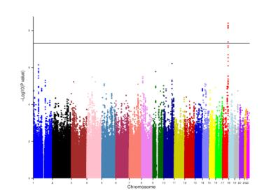
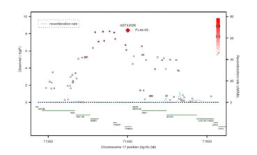

# NIH Public Access

**Author Manuscript**

*Ann Neurol*. Author manuscript; available in PMC 2012 June 1.

Published in final edited form as: Ann Neurol. 2011 June ; 69(6): 928–939. doi:10.1002/ana.22403.

# **Genome-wide association studies of cerebral white matter lesion burden: the CHARGE Consortium**

**Myriam Fornage**1,2,\* , **Stephanie Debette**3,\* , **Joshua C. Bis**4,5,\* , **Helena Schmidt**6,\* , **M. Arfan Ikram**7,8,9,\* , **Carole Dufouil**10,\* , **Sigurdur Sigurdsson**11,\* , **Thomas Lumley**12, **Anita L. DeStefano**3,13, **Franz Fazekas**14, **Henri A. Vrooman**7,15,16, **Dean K. Shibata**17, **Pauline Maillard**18, **Alex Zijdenbos**19,20, **Albert V. Smith**11, **Haukur Gudnason**11, **Renske de Boer**7,8,15,16, **Mary Cushman**21, **Bernard Mazoyer**18, **Gerardo Heiss**22, **Meike W. Vernooij**7,8, **Christian Enzinger**14, **Nicole L. Glazer**4,5, **Alexa Beiser**3,13, **David S. Knopman**23, **Margherita Cavalieri**14,24, **Wiro J. Niessen**15,16, **Tamara B. Harris**25, **Katja Petrovic**14, **Oscar L. Lopez**26, **Rhoda Au**3, **Jean-Charles Lambert**27, **Albert Hofman**7,9, **Rebecca F. Gottesman**28, **Melissa Garcia**25, **Susan R. Heckbert**29,30, **Larry D. Atwood**3, **Diane J. Catellier**31, **Andre G. Uitterlinden**7,9,32, **Qiong Yang**13, **Nicholas L. Smith**29,33, **Thor Aspelund**11,34, **Jose R. Romero**3, **Kenneth Rice**12, **Kent D. Taylor**35, **Michael A. Nalls**36, **Jerome I. Rotter**35, **Richey Sharret**28, **Cornelia M. van Duijn**7,9, **Philippe Amouyel**27, **Philip A. Wolf**3, **Vilmundur Gudnason**11,34, **Aad van der Lugt**8, **Eric Boerwinkle**1,2, **Bruce M. Psaty**4,5,29,30,37, **Sudha Seshadri**3, **Christophe Tzourio**10,\* , **Monique M.B. Breteler**7,9,\* , **Thomas H. Mosley**38,\* , **Reinhold Schmidt**14,\* , **W.T. Longstreth**4,5,29,39,\* , **Charles DeCarli**40,\*, and **Lenore J. Launer**24,\*

1 Brown Foundation Institute of Molecular Medicine, University of Texas Health Science Center at Houston, TX 2 Human Genetics Center, Division of Epidemiology School of Public Health, University of Texas Health Science Center at Houston, TX 3 Department of Neurology, Boston University School of Medicine, Boston, MA 4 Cardiovascular Health Research Unit, University of Washington, Seattle, WA 5 Department of Medicine, University of Washington, Seattle, WA 6 Institute of Molecular Biology and Biochemistry, Medical University Graz, Austria 7 Department of Epidemiology, Erasmus MC University Medical Center, Rotterdam, The Netherlands 8 Department of Radiology, Erasmus MC University Medical Center, Rotterdam, The Netherlands 9 Netherlands Consortium for Healthy Aging, The Netherlands 10 INSERM Unit 708 Hôpital La Salpêtrière and Université Pierre et Marie Curie-Paris, Paris, France 11 Icelandic Heart Association, Kopavogur, Iceland 12 Department of Biostatistics, University of Washington, Seattle, WA 13 Department of Biostatistics, Boston University School of Public Health, Boston, MA 14 Department of Neurology, Medical University Graz, Austria 15 Department of Medical Informatics, Erasmus MC University Medical Center, Rotterdam, The Netherlands 16 Biomedical Imaging Group Rotterdam, Erasmus MC University Medical Center, Rotterdam, The Netherlands 17 Department of Radiology, University of Washington, Seattle, WA 18 Université de Caen Basse-Normandie and Groupe d'Imagerie Neurofonctionnelle, Centre National de la Recherche Scientifique-Centre d'Energie Atomique, Caen, France 19 Biospective Inc., Montreal, Canada 20 Neurological Institute, McGill University, Montreal, Canada 21 Department of Medicine and Pathology, University of Vermontm Burlington, VT 22 Department of Epidemiology, University of North Carolina, Chapel Hill, NC 23 Department of Neurology, Mayo Clinic, Rochester, MN 24 Department of Clinical and Experimental Medicine, Section of Internal Medicine, Gerontology and Geriatrics, University of Ferrara, Italy 25 Laboratory of Epidemiology, Demography and Biometry, Intramural Research Program, National Institute of Aging, NIH, Bethesda, MD 26 Departments of

Correspondence should be addressed to M.F. (myriam.fornage@uth.tmc.edu) or L.J.L. (LaunerL@nia.nih.gov). \*These authors contributed equally to this work.

Neurology and Psychiatry, University of Pittsburgh School of Medicine, Pittsburgh, PA 27 Institut Pasteur de Lille, INSERM Unit 744, Lille, France 28 Department of Neurology, Johns Hopkins University School of Medicine, Baltimore, MD 29 Department of Epidemiology, University of Washington, Seattle, WA 30 Group Health Research Institute, Group Health Cooperative, Seattle, WA 31 Department of Biostatistics, University of North Carolina, Chapel Hill, NC 32 Departments of Internal Medicine and Clinical Chemistry, Erasmus MC University Medical Center, Rotterdam, The Netherlands 33 Seattle Epidemiologic Research and Information Center of the Department of Veterans Affairs Office of Research and Development, Seattle, WA 34 University of Iceland, Reykjavik, Iceland 35 Medical Genetics Institute, Cedars-Sinai Medical Center, Los Angeles, CA 36 Laboratory of Neurogenetics, Intramural Research Program, National Institute of Aging, NIH, Bethesda, MD 37 Department of Health Services, University of Washington, Seattle, WA 38 Department of Medicine (Geriatrics), University of Mississippi Medical Center, Jackson, MS 39 Department of Neurology, University of Washington, Seattle, WA 40 Department of Neurology and Center for Neuroscience, University of California at Davis, CA

# **Abstract**

**Objective—**White matter hyperintensities (WMH) detectable by magnetic resonance imaging (MRI)are part of the spectrum of vascular injury associated with aging of the brain and are thought to reflect ischemic damage to the small deep cerebral vessels. WMH are associated with an increased risk of cognitive and motor dysfunction, dementia, depression, and stroke. Despite a significant heritability, few genetic loci influencing WMH burden have been identified.

**Methods—**We performed a meta-analysis of genome-wide association studies (GWAS) for WMH burden in 9,361 stroke-free individuals of European descent from 7 community-based cohorts. Significant findings were tested for replication in 3,024 individuals from 2 additional cohorts.

**Results—**We identified 6 novel risk-associated single nucleotide polymorphisms (SNPs)in one locus on chromosome 17q25 encompassing 6 known genes including *WBP2, TRIM65, TRIM47, MRPL38, FBF1,* and *ACOX1*. The most significant association was for rs3744028 (Pdiscovery= 4.0×10−9 ; Preplication =1.3×10−7 ; Pcombined =4.0×10−15). Other SNPs in this region also reaching genome-wide significance are rs9894383 (P=5.3×10−9 ), rs11869977 (P=5.7×10−9 ), rs936393 (P=6.8×10−9 ), rs3744017 (P=7.3×10−9 ), and rs1055129 (P=4.1×10−8 ). Variant alleles at these loci conferred a small increase in WMH burden (4–8% of the overall mean WMH burden in the sample).

**Interpretation—**This large GWAS of WMH burden in community-based cohorts of individuals of European descent identifies a novel locus on chromosome 17. Further characterization of this locus may provide novel insights into the pathogenesis of cerebral WMH.

# **INTRODUCTION**

The burden of vascular injury to the aging brain is far greater than that of clinically-manifest neurological conditions, such as stroke and dementia, and the harmful effects of brain vascular disease begin well before clinical symptoms become apparent.1 Abnormalities of the white matter of the brain are readily identified on magnetic resonance imaging (MRI) as areas of signal hyperintensity on T2-weighted and fluid-attenuated inversion-recovery sequences. White matter hyperintensities(WMH), also known as leukoaraiosis, are remarkably common in healthy individuals beginning in middle age, with prevalence ranging from 40–70% in the fifth decade of age.2 They contribute a substantial public health burden since they are associated with an increased risk of cognitive deficits, motor function impairment, dementia, depression, and stroke. The pathophysiology of WMH is poorly

understood but may reflect ischemic damage to the small deep vessels of the brain resulting from arteriolosclerosis and leading to myelin degeneration or rarefaction, proliferative astrogliosis, fibrinoid changes and fibrosis of the vessel wall.3 In addition to age, elevated blood pressure is a major risk factor for WMH. Genetic factors appear also to play a significant role, with a heritability ranging from 55% to 80%.4–6 Yet, studies conducted to date offer few specific clues about these genetic factors.7–9 Genome-wide association studies (GWAS) provide a powerful tool for identifying genes related to complex traits.10 We have conducted a meta-analysis of GWAS data for WMH burden in 9,361 individuals of European descent (mean age 69.5 years; 42.6% men) and belonging to 7 community-based cohort studies: the Aging Gene-Environment Susceptibility-Reykjavik Study (AGES-Reykjavik); the Atherosclerosis Risk in Communities (ARIC) Study; the Austrian Stroke Prevention Study (ASPS); the Cardiovascular Health Study (CHS); the Framingham Heart Study (FHS); and two cohorts from the Rotterdam Study (RS). The participating studies were prospective population-based cohort studies with available cerebral MRI and genomewide genotyping data and collaborating in the Cohorts for Heart and Aging Research in Genomic Epidemiology (CHARGE) Consortium.11

# **SUBJECTS AND METHODS**

#### **Consortium organization and study sample**

The CHARGE consortium is an investigator-initiated collaboration to facilitate GWAS meta-analyses among multiple large and well-phenotyped cohort studies.11 All participating studies worked cooperatively to address issues related to phenotype harmonization, covariate selection and to develop analytic plans for within-study GWAS analyses and metaanalysis of results. Each study received institutional review board approval of its consent procedures, cohort's examination and surveillance, DNA collection and use, and data access and distribution. All participants in this study gave written informed consent for study participation, MRI scanning, and use of DNA.

Details of cohort recruitment, risk factor assessment, phenotyping and genotyping are described in the Supplementary Material. Briefly, in all cohorts, participants were excluded if they lacked information on MRI, genotypes, or both, or if they suffered a stroke or transient ischemic attack prior to MRI. In addition, CHS did not genotype participants with clinical cardiovascular disease at baseline. The ASPS and Rotterdam Study did not perform MRI scans in participants with dementia, and FHS analyses excluded participants who had dementia at the time of MRI scanning. Table 1 shows the number and characteristics of participants from each cohort.

## **MRI scans**

In each study, MRI scans were performed and interpreted in a standardized fashion, without reference to demographic or clinical information. The field strength of the scanners used ranged from 0.5T to 1.5 Tesla. T1-and T2-weighted scans in the axial plane were obtained for all participants. These were complemented by either scans obtained with fluid attenuation inversion recovery or proton density sequences to allow better separation of white matter hyperintensities and cerebrospinal fluid. In AGES-Reykjavik, ASPS, FHS, and RS, WMH volume was estimated on a quantitative scale using custom-written computer programs based on an automatic segmentation algorithm or a semi-automatic segmentation analysis involving operator-guided removal of non-brain elements. In ARIC and CHS, WMH volume was estimated on a semi-quantitative 10-point scale by visual comparison with eight templates that successively increased from barely detectable white matter lesions to extensive, confluent abnormalities. Study participant's brain images were compared with

the reference standards after aligning them to approximately the same apparent size. Hence, visual grades are inherently normalized for brain size.

Comparability between the volumetric and visual scales was carefully evaluated. The distribution of WMH scores and the standardized slopes of associations between WMH scores and age were examined in each cohort and shown to be similar across the cohorts. Direct comparison of volumetric segmentation to visual scoring was performed using WMH measurements obtained by both methods in 1134 ARIC participants and showed a very good overall agreement (R2>0.80)(Supplementary Material).12 In addition, volumetric analysis of the visual scoring standard image sets was conducted and showed excellent agreement on the log scale (R2=0.98) (Shibata, personal communication).

#### **Genotyping**

The participating studies used different genotyping platforms. Thus, genotype data in each study was used to impute to the 2.5 million non-monomorphic, autosomal SNPs described in the HapMap's CEU panel. Extensive quality control (QC) analyses were performed in each cohort(Supplementary Material). Briefly, participant-specific quality controls filters were applied based on missing call rate, cryptic relatedness, and number of Mendelian errors per individual. SNP-specific quality controls included filters for call rate, minor allele frequency, Hardy-Weinberg equilibrium, differential missingness by outcome or genotype, and imputation quality.

#### **Statistical analyses and meta-analysis**

Within each study, a linear regression model was used to evaluate the association of the natural log-transformed volume of WMH(log(WMH+1)) with the number minor allele (0 to 2) at each SNP. Analyses were adjusted only for age, sex, and total intra-cranial volume (except in ASPS, ARIC and CHS). ARIC and CHS also adjusted for study site, and FHS adjusted for familial structure. The most significant association analyses were further adjusted for systolic blood pressure or for hypertension. All studies screened for latent population substructure, which was negligible(Supplementary Material).

A fixed-effects meta-analysis of results from the seven discovery cohorts was conducted using a z-score based method, as justified in the Supplementary Material. This approach is appropriate given that WMH was measured on different scales (mlor unit-less grade) in the various cohorts. The genomic control parameter was calculated and used to remove any residual population stratification within cohort and in the combined meta-analysis.13 We used a genome-wide significance threshold of 5×10−8 . This threshold was first proposed based on the testing of 1 million SNPs and uses the simple Bonferroni correction for multiple tests.14 It is widely used in GWAS studies and is similar to genome-wide significance thresholds estimated by more complex methodologies.15

#### **Replication and extension**

Replication was sought for SNPs reaching genome-wide significance. The first replication sample comprised 1607 white participants (mean age 76.4±5.6) from the AGES-Reykjavik study who had not undergone genome-wide genotyping and, thus, were not part of the discovery sample. The second comprised 1417 white elderly non-institutionalized participants in the 3C-Dijon study (mean age 72.3±4.1). Association analyses in the replication cohorts used the same statistical models as those in the discovery cohorts. Results of the association of the genome-wide significant SNPs with WMH burden in the two replication cohorts were combined by meta-analysis using an inverse-variance weighted method. Significance and extent of heterogeneity were evaluated using the Cochran Q and I2 statistics.16

We also sought to explore the association of SNPs in chromosome 17q25 region with WMH burden in 807 African-Americans from the ARIC study (mean age 61.5±4.5)with MRI and genotype data. Details on these groups are provided in the Supplementary Material.

# **RESULTS**

There was no evidence of genomic control factor inflation within each cohort analyses and in the meta-analysis (λ=1.02) (Supplementary Material). Figure 1 shows the genome-wide plot of P-values for the individual SNPs against their genomic position. Six SNPs reached the genome-wide significance threshold of P<5×10−8 , and an additional 56SNPs showed associations with P<1×10−5 . They belonged to 15 loci (r2<0.5 between loci) (Table 2). At a threshold of P<1×10−4 , a total of 416 SNPs were associated with WMH burden (Supplementary Table 1).

The most significant association was identified for rs3744028 at position 71400267 (Genome Build 36) on chromosome 17q25. In all studies, the C allele (frequency = 0.18) was significantly associated with a greater WMH burden (P=4.0×10−9 ). This SNP belonged to a larger cluster of associated SNPs spanning a 108 kb region (Figure 2). The other SNPs in this region also reaching genome-wide significance are rs9894383 (P=5.3×10−9 ), rs11869977 (P=5.7×10−9 ), rs936393 (P=6.8×10−9 ), rs3744017 (P=7.3×10−9 ), and rs1055129 (P=4.1×10−8 ). The first four were in strong linkage disequilibrium (LD) with rs3744028 and with each other (r2>0.8). The fifth (rs1055129) was in moderate LD with rs3744028 (r2=0.5). rs3744028 is located in intron 2 of the tripartite motif-containing 65 gene (*TRIM65*); rs1055129 and rs3744017 are located in introns 1 and 5, respectively, of the *TRIM47* gene; rs936393 is located in intron 2 of the WW domain binding protein 2 gene (*WBP2*); and rs9894383 and rs11869977 are located in the region between the *TRIM47* and *WBP2* genes. After adjustment for systolic blood pressure, the significance of the association was P=1.5×10−9 for rs3744028 and P=1.2×10−8 for rs1055129. Similarly, after adjustment for hypertension, the significance of the association was P=1.0×10−9 for rs3744028 and P=1.1×10−8 for rs1055129.

The next most significantly associated locus(although not reaching genome-wide significance)was identified on chromosome 10q24 in a region that partially overlaps with a region recently identified to influence systolic blood pressure in two genome-wide association studies of whites.17, 18 Four SNPs showed highly suggestive associations, with the most significant SNP, rs7894407 (P=6.1×10−7 ), located in intron 12 of the programmed cell death 11 gene (*PDCD11*).

In addition to the two above loci, three additional SNPs with P<1×10−5 were located within known coding genes, including the polyamine-modulated factor 1 gene (PMF1), the collagen type XXV alpha 1 gene (COL25A1), and the methylenetetrahydrofolate dehydrogenase 1 gene (MTHFD1)(Table 2).

Association of rs3744028 and rs1055129 with WMH burden was replicated in an independent sample of 1607 AGES-Reykjavik participants. The C allele of rs3744028 and the G allele of rs1055129 were significantly associated with a greater WMH burden (P=1.3×10−5 and 4.7×10−4 , respectively). Adjustment for systolic blood pressure or hypertension did not substantially change these results (rs3744028, P=2.2×10−5 and 1.3×10−5 , respectively; rs1055129, P=7.1×10−4 and 6.0×10−4 , respectively).

Association of these 2 SNPs was also investigated in 1417 elderly white participants from the 3C-Dijon study. The C allele of rs3744028 was significantly associated with a greater WMH burden (P=0.002). However, no association of rs1055129 with WMH burden was observed (P=0.11). Adjustment for systolic blood pressure or hypertension did not

substantially change these results (rs3744028, P=0.001 and 0.001, respectively; rs1055129, P=0.11 and 0.09, respectively).

A summary meta-analysis of the 2 SNP association results in the replication cohorts and in all cohorts combined are shown in Table 3. In the replication cohorts, significance of the association of rs3744028 and rs1055129 with WMH burden was 2.0×10−7 and 5.9×10−4 , respectively. The associated risk alleles increased WMH burden by a quantity of 0.12 and 0.07, respectively, on the transformed log-scale, with WMH expressed in ml. This is equivalent to an increase of 8.3% and 4.8%, respectively, of the overall mean WMH burden(expressed in the same scale) in this sample. In the combined sample of 12,385 individuals of European descent, the significance of the association of rs3744028 and rs1055129 reached P=4.0×10−15 and 2.6×10−11, respectively. The direction of effects was generally consistent across the studies and there was no evidence of between-study heterogeneity within the replication cohorts (Table 3).

We also investigated the association of SNPs in the chromosome 17q25 region with WMH burden in 807 African-Americans from the ARIC cohort. Allele frequencies were 0.23, 0.13, for rs3744028 and rs1055129, respectively. None of the top SNPs identified in whites was associated with WMH burden in this sample of African-Americans (P=0.66, rs3744028; P=0.91, rs1055129). However, assuming the same effects sizes as those observed in the white replication cohorts, power to detect an association was 57% for rs3744028 and 13% for rs1055129 in this small sample of African Americans. Because the pattern of LD in these regions differs between populations of European and African descent (Supplementary Figure 3), we examined the association of 7 additional genotyped SNPs located within a 50kb distance of the top SNPs on chromosome 17, respectively. None of the 7 SNPs on chromosome 17q25 was associated with WMH burden(Supplementary Table 2). The lowest P-value was obtained for rs6501841 within the Fas-binding factor 1 (*FBF1*) gene (P=0.11).

A search for putative functional SNPs among our highly suggestive association results identified 4 non-synonymous coding variants and 2 SNPs located in splice sites (Supplementary Material). Five of the six putative functional SNPs were located on chromosome 17q25. rs2290771 (P=4×10−7 ) in a splice site of the WBP2 gene and rs3760128 (P=8×10−7 ) encoding a leucine to proline substitution in TRIM65 were in moderate to high LD with one another and with rs1055129 (r2=0.7). We also screened SNPs tagging the chromosome 17q25 locus against a set of previously reported expressionassociated SNPs (eSNPs). Six SNPs, in moderate to strong LD with rs3744028 or rs1055129, were significantly associated with variation in exon-level expression of *FBF1* in cortical brain tissue.19 Seven SNPs, including rs3744028, were associated with variation in mRNA expression levels of *TRIM47* in lymphoblastoid cell lines.20, 21

We also examined whether the 2 SNPs on chromosome 17q25 were associated with incident ischemic stroke, incident dementia, and Alzheimer's disease (AD) using pre-computed results from genome-wide association meta-analyses of these endpoints in the CHARGE cohorts.22, 23 Neither rs3744028 nor rs1055129 was associated with risk of incident ischemic stroke, dementia, or AD (Supplementary Table 3).

A systematic review of published candidate gene association studies identified a limited number of polymorphisms most frequently investigated for their association with WMH.8 Data were available for 15 of the 20 candidate SNP spreviously reported associated with WMH. Two SNPs reached the nominal level of significance of P<0.05 (rs5498 (K469E) in the intercellular adhesion molecule 1 gene (P=0.006) and rs699 (M235T) in the angiotensinogen gene (P=0.01)) but these associations were not significant after correction for multiple tests (Supplementary Material and Supplementary Table 4).

# **DISCUSSION**

In this meta-analysis of genome-wide association data from 9,361 individuals of European descent, we identified novel genetic associations with WMH burden. Six SNPs mapping to a locus on chromosome 17q25 reached genome-wide significance, of which five were in strong LD. We replicated associations of two of these SNPs – rs3744028 and rs1055129 – in an additional 3,024 individuals of European descent. In a meta-analysis combining data from all 12,385 individuals, both showed strong associations with variation in WMH burden (rs3744028, P=4.0×10−15; rs1055129, P=2.6×10−11). These SNPs belong to a large cluster of associated SNPs spanning a ~100 kb region, which contains several genes: Two tripartite motif-containing genes, *TRIM65* and *TRIM47*; the WW domain binding protein 2 gene (*WBP2*); the mitochondrial ribosomal protein L38 gene (*MRPL38*); the Fas-binding factor 1 gene (*FBF1*); the acyl-coenzyme A oxidase 1 gene (*ACOX1*), and the C-Elegans homolog *UNC13D* gene. TRIM65 and TRIM47 are members of a superfamily of ring-finger B-box coiled-coil (RBCC) proteins involved in a broad range of biological processes including innate immunity 24, apoptosis, cell cycle regulation, vesicular trafficking, and neuroprotection.25 *TRIM47* was first identified as over-expressed in astrocytomas.26 *WBP2* encodes a protein that was shown to interact with the WW domain of the *Yes* kinaseassociated protein (YAP) and may play an important role in transcription regulation.27 FBF1 was identified in a yeast two-hybrid assay to interact with the Fas cell surface receptor, a member of the TNF-receptor superfamily and a key regulator of apoptosis. Histopathological studies have shown evidence of apoptosis in white matter lesions.28 Moreover, apoptosis-related transcripts have been shown to be differentially expressed between white matter lesions and normal white matter of brains collected postmortem from donors.29 ACOX1 is the first enzyme of the fatty acid beta-oxidation pathway. Similar to other defects in peroxisomal beta-oxidation, ACOX1 deficiency is a rare disorder characterized by severe white matter abnormalities. Mutations in the *UNC13D* gene have been implicated in familial hemophagocytic lymphohistiocytosis, a rare disorder characterized by an uncontrolled proliferation and infiltration of activated lymphocytes and macrophages and an overproduction of inflammatory cytokines. Abnormalities of the brain white matter have been documented in this disorder.30 The two SNPs identified in this genome-wide association study have been associated with variation in *FBF1* expression in the brain and *TRIM47* in lymphoblastoid cell lines.21, 31 In addition, they were in moderate to high LD with several putative functional polymorphisms in *TRIM65* and *WBP2*, raising the possibility that multiple genes may be at play in the relationship between sequence variation at the 17q25 locus and WMH burden.

This prospective meta-analysis of GWAS data for WMH volume included a large sample size of individuals of European descent with high-quality genotypic and MRI data. In this study, white matter disease burden was defined as a continuous variable rather than a dichotomized one (presence/absence). Indeed, white matter disease burden is continuouslydistributed and graded in the population and analysis of the continuous trait generally yields greater power to detect genetic effects.

Despite these clear strengths, some limitations of the study must be acknowledged. WMH measures were obtained on different scales in the studies. Although there is very good agreement between the visual and volumetric scales known differences in sensitivity, specificity, and precision between the semi-quantitative and quantitative methods have likely reduced our power to detect genetic effects. Effect sizes of the two SNPs on chromosome 17q25 estimated from a meta-analysis of the replication results showed that each of the identified risk alleles was associated with a small increase in WMH burden (4– 8% of the overall mean WMH burden in this sample). Our analyses considered burden of WMH over the whole brain and did not address possible regional differences in the

distribution of WMH. In particular, periventricular and subcortical WMH are thought to have different pathophysiology, risk factors, and functional consequences.32 However, the significant genetic correlation between these two forms of white matter disease suggests that they are influenced at least in part by common genetic factors.33 While this GWAS analysis conducted in whites of European descent has the advantage of minimizing potential population stratification issues, our findings may not necessarily be generalized to other ethnic groups. Indeed, we did not find any evidence of an association of SNPs at 17q25 with WMH burden in African-Americans. The lack of extension to African-Americans should be interpreted cautiously as our small sample lacked power to detect associations of similar effect size as those observed in whites. In addition, reduced genomic coverage of the chromosome 17q25 locus in African-American may also explain the lack of significant findings in this population. Finally, we can also not exclude the possibility that genetic factors influencing WMH burden may not fully overlap between African-Americans and Whites. Linkage studies performed in various ethnic groups have also failed to identify common chromosomal regions influencing WMH.9, 33 Additional GWAS for WMH burden in African-Americans or other ethnic groups are needed.

Fine-mapping of the WMH locus on chromosome 17q25 was not attempted in this study. Hence, information on the specific genes and functional variant(s) underlying the reported associations is lacking. Neither of the two WMH SNPs was associated with risk of incident ischemic stroke, dementia, or late-onset AD in previously conducted GWAS analyses of these outcomes in the CHARGE cohorts.22, 23 This is perhaps not surprising in light of the small effect size of these SNPs on WMH burden and the complex relationships between white matter injury and its clinical expression. Indeed, it is generally believed that endophenotypes may be closer, in the biological hierarchy, to the genetic underpinnings than clinical disease outcomes, and thus, the impact of genetic variation on these endophenotypes is expected to be greater. The effects of the identified SNPs on WMH burden are small and likely even smaller on the clinical endpoints. Hence, our power to detect such effects was limited and studies adequately addressing the association of the WMH SNPs with these outcomes will require very large cohorts or clinical samples. The trend toward a protective effect of the 2 SNPs on incident ischemic stroke should be interpreted with caution: First, the association analyses were underpowered and likely resulted in imprecise effect estimates. Second, the samples used in the meta-analyses of WMH and clinical endpoints GWAS data were not identical and difference in LD between samples could lead to inconsistent patterns of associations when non-causal variants are tested.34 Finally, association of the WMH SNPs with clinical endpoints may be influenced by unrecognized (and unaccounted) factors such as other genetic loci or environmental variables, and such interactions may complicate interpretation of the association results.

In summary, this large GWAS of WMH burden in community-based cohorts of individuals of European descent has identified a novel locus on chromosome 17q25 and provides a first step towards characterization of the biological mechanisms that influence the pathophysiology associated with WMH burden, an important risk factor of stroke, cognitive impairment and dementia.

# **Supplementary Material**

Refer to Web version on PubMed Central for supplementary material.

# **Acknowledgments**

**Aging Gene-Environment Susceptibility-Reykjavik Study:** The research has been funded by NIA contract N01- AG-12100 with contributions from NEI, NIDCD and NHLBI, the NIA Intramural Research Program, Hjartavernd (the Icelandic Heart Association), and the Althingi (the Icelandic Parliament).

**The Atherosclerosis Risk in Communities Study:** The research is carried out as a collaborative study supported by National Heart, Lung, and Blood Institute contracts N01-HC-55015, N01-HC-55016, N01-HC-55018, N01- HC-55019, N01-HC-55020, N01-HC-55021, N01-HC-55022, and grants R01-HL087641 and R01-HL093029; National Human Genome Research Institute contract U01-HG004402; and National Institutes of Health contract HHSN268200625226C. The authors thank the staff and participants of the ARIC study for their important contributions. Infrastructure was partly supported by Grant Number UL1RR025005, a component of the National Institutes of Health and NIH Roadmap for Medical Research.

**The Austrian Stroke Prevention Study:** The research reported in this article was funded by the Austrian Science Fond (FWF) grant number P20545-P05 and P13180. The Medical University of Graz supports the databank of the ASPS. The authors thank the staff and the participants of the ASPS for their valuable contributions. We thank Birgit Reinhart for her long-term administrative commitment and Ing Johann Semmler for the technical assistance at creating the DNA-bank.

**Cardiovascular Health Study:** The research reported in this article was supported by contract numbers N01- HC-85079 through N01-HC-85086, N01-HC-35129, N01-HC-15103, N01-HC-55222, N01-HC-75150, N01- HC-45133, grant numbers U01 HL080295 and R01-HL087652 from the National Heart, Lung, and Blood Institute, with additional contribution from the National Institute of Neurological Disorders and Stroke. A full list of principal CHS investigators and institutions can be found at [http://www.chs-nhlbi.org/pi.htm.](http://www.chs-nhlbi.org/pi.htm) DNA handling and genotyping was supported in part by National Center for Research Resources grant M01RR00425 to the Cedars-Sinai General Clinical Research Center Genotyping core and National Institute of Diabetes and Digestive and Kidney Diseases grant DK063491 to the Southern California Diabetes Endocrinology Research Center.

**Framingham Heart Study:** From the Framingham Heart Study of the National Heart Lung and Blood Institute of the National Institutes of Health and Boston University School of Medicine. This work was supported by the National Heart, Lung and Blood Institute's Framingham Heart Study (Contract No. N01-HC-25195) and its contract with Affymetrix, Inc for genotyping services (Contract No. N02-HL-6-4278). A portion of this research utilized the Linux Cluster for Genetic Analysis (LinGA-II) funded by the Robert Dawson Evans Endowment of the Department of Medicine at Boston University School of Medicine and Boston Medical Center. Analyses reflect intellectual input and resource development from the Framingham Heart Study investigators participating in the SNP Health Association Resource (SHARe) project. This study was also supported by grants from the National Institute of Neurological Disorders and Stroke (NS17950) and the National Institute of Aging (AG08122, AG16495, AG033193, AG031287).

**Rotterdam Study:** The GWA database of the Rotterdam Study was funded through the Netherlands Organization of Scientific Research NWO(nr. 175.010.2005.011). This study was further supported by the Netherlands Genomics Initiative (NGI)/Netherlands Organisation for Scientific Research (NWO) project nr. 050-060-810. The Rotterdam Study is supported by the Erasmus Medical Center and Erasmus University, Rotterdam; the Netherlands organization for scientific research (NWO), the Netherlands Organization for the Health Research and Development (ZonMw), the Research Institute for Diseases in the Elderly (RIDE), the Ministry of Education, Culture and Science, the Ministry for Health, Welfare and Sports, the European Commission (DG XII), and the Municipality of Rotterdam. The Rotterdam Scan Study was supported by the Netherlands Organization of Scientific Research (NWO) project nrs. 918-46-615; 904-61-096; 904-61-133; 948-00-010. Additional funding was obtained from the Netherlands Heart Foundation/Nederlandse Hartstichting (2009B102).

# **References**

- 1. Longstreth WT Jr. Brain vascular disease overt and covert. Stroke. 2005; 36:2062–2063. [PubMed: 16192459]
- 2. Launer LJ. Epidemiology of white matter lesions. Top Magn Reson Imaging. 2004; 15:365–367. [PubMed: 16041288]
- 3. Pantoni L, Garcia JH. Pathogenesis of leukoaraiosis: a review. Stroke. 1997; 28:652–659. [PubMed: 9056627]
- 4. Atwood LD, Wolf PA, Heard-Costa NL, et al. Genetic variation in white matter hyperintensity volume in the Framingham Study. Stroke. 2004; 35:1609–1613. [PubMed: 15143299]
- 5. Carmelli D, DeCarli C, Swan GE, et al. Evidence for genetic variance in white matter hyperintensity volume in normal elderly male twins. Stroke. 1998; 29:1177–1181. [PubMed: 9626291]
- 6. Turner ST, Jack CR, Fornage M, Mosley TH, Boerwinkle E, de Andrade M. Heritability of leukoaraiosis in hypertensive sibships. Hypertension. 2004; 43:483–487. [PubMed: 14718359]
- 7. Destefano AL, Atwood LD, Massaro JM, et al. Genome-Wide Scan for White Matter Hyperintensity. The Framingham Heart Study. Stroke. 2006; 37:77–81. [PubMed: 16322484]

- 8. Paternoster L, Chen W, Sudlow CL. Genetic determinants of white matter hyperintensities on brain scans: a systematic assessment of 19 candidate gene polymorphisms in 46 studies in 19,000 subjects. Stroke. 2009; 40:2020–2026. [PubMed: 19407234]
- 9. Turner ST, Fornage M, Jack CR Jr, et al. Genomic Susceptibility Loci for Brain Atrophy in Hypertensive Sibships From the GENOA Study. Hypertension. 2005; 45:793–798. [PubMed: 15699467]
- 10. Manolio TA, Brooks LD, Collins FS. A HapMap harvest of insights into the genetics of common disease. J Clin Invest. 2008; 118:1590–1605. [PubMed: 18451988]
- 11. Psaty BM, O'Donnell CJ, Gudnason V, et al. Cohorts for Heart and Aging Research in Genomic Epidemiology (CHARGE) Consortium: Design of prospective meta-analyses of genome-wide association studies from five cohorts. Circulation:Cardiovascular Genetics. 2009; 2:73–80. [PubMed: 20031568]
- 12. Gottesman RF, Coresh J, Catellier DJ, et al. Blood pressure and white-matter disease progression in a biethnic cohort: Atherosclerosis Risk in Communities (ARIC) study. Stroke. 2010; 41:3–8. [PubMed: 19926835]
- 13. Senn S. Trying to be precise about vagueness. Stat Med. 2007; 26:1417–1430. [PubMed: 16906552]
- 14. Risch N, Merikangas K. The future of genetic studies of complex human diseases. Science. 1996; 273:1516–1517. [PubMed: 8801636]
- 15. Dudbridge F, Gusnanto A. Estimation of significance thresholds for genomewide association scans. Genet Epidemiol. 2008; 32:227–234. [PubMed: 18300295]
- 16. Higgins JP, Thompson SG. Quantifying heterogeneity in a meta-analysis. Stat Med. 2002; 21:1539–1558. [PubMed: 12111919]
- 17. Levy D, Ehret GB, Rice K, et al. Genome-wide association study of blood pressure and hypertension. Nat Genet. 2009; 41:677–687. [PubMed: 19430479]
- 18. Newton-Cheh C, Johnson T, Gateva V, et al. Genome-wide association study identifies eight loci associated with blood pressure. Nat Genet. 2009
- 19. Heinzen EL, Ge D, Cronin KD, et al. Tissue-specific genetic control of splicing: implications for the study of complex traits. PLoS Biol. 2008; 6:e1. [PubMed: 19222302]
- 20. Dixon AL, Liang L, Moffatt MF, et al. A genome-wide association study of global gene expression. Nat Genet. 2007; 39:1202–1207. [PubMed: 17873877]
- 21. Stranger BE, Nica AC, Forrest MS, et al. Population genomics of human gene expression. Nat Genet. 2007; 39:1217–1224. [PubMed: 17873874]
- 22. Ikram MA, Seshadri S, Bis JC, et al. Genomewide association studies of stroke. N Engl J Med. 2009; 360:1718–1728. [PubMed: 19369658]
- 23. Seshadri S, Fitzpatrick AL, Ikram MA, et al. Genome-wide analysis of genetic loci associated with Alzheimer disease. JAMA. 2010; 303:1832–1840. [PubMed: 20460622]
- 24. Ozato K, Shin DM, Chang TH, Morse HC 3rd. TRIM family proteins and their emerging roles in innate immunity. Nat Rev Immunol. 2008; 8:849–860. [PubMed: 18836477]
- 25. Meroni G, Diez-Roux G. TRIM/RBCC, a novel class of 'single protein RING finger' E3 ubiquitin ligases. Bioessays. 2005; 27:1147–1157. [PubMed: 16237670]
- 26. Vandeputte DA, Meije CB, van Dartel M, et al. GOA, a novel gene encoding a ring finger B-box coiled-coil protein, is overexpressed in astrocytoma. Biochem Biophys Res Commun. 2001; 286:574–579. [PubMed: 11511098]
- 27. Yagi R, Chen LF, Shigesada K, Murakami Y, Ito Y. A WW domain-containing yes-associated protein (YAP) is a novel transcriptional co-activator. EMBO J. 1999; 18:2551–2562. [PubMed: 10228168]
- 28. Brown WR, Moody DM, Challa VR, Thore CR, Anstrom JA. Apoptosis in leukoaraiosis lesions. J Neurol Sci. 2002; 203–204:169–171.
- 29. Simpson JE, Hosny O, Wharton SB, et al. Microarray RNA expression analysis of cerebral white matter lesions reveals changes in multiple functional pathways. Stroke. 2009; 40:369–375. [PubMed: 19109541]

- 30. Fitzgerald NE, MacClain KL. Imaging characteristics of hemophagocytic lymphohistiocytosis. Pediatr Radiol. 2003; 33:392–401. [PubMed: 12768255]
- 31. Dixon AL, Liang L, Moffatt MF, et al. A genome-wide association study of global gene expression. Nat Genet. 2007; 39:1202–1207. [PubMed: 17873877]
- 32. Fazekas F, Kleinert R, Offenbacher H, et al. Pathologic correlates of incidental MRI white matter signal hyperintensities. Neurology. 1993; 43:1683–1689. [PubMed: 8414012]
- 33. Kochunov P, Glahn D, Winkler A, et al. Analysis of genetic variability and whole genome linkage of whole-brain, subcortical, and ependymal hyperintense white matter volume. Stroke. 2009; 40:3685–3690. [PubMed: 19834011]
- 34. Lin PI, Vance JM, Pericak-Vance MA, Martin ER. No gene is an island: the flip-flop phenomenon. Am J Hum Genet. 2007; 80:531–538. [PubMed: 17273975]

#### **Figure 1.**

Genome-wide association results of WMH burden. Meta-analysis P-values are plotted against their genomic position. The horizontal line indicates the threshold for genome-wide significance.

#### **Figure 2.**

Regional association plot centered around rs3744028. Meta-analysis P-values for SNPs located within a 200 kb region on chromosome 17q25 are plotted against their genomic position.

| N |
|---|
| I |
| H |
| - |
| P |
| A |
| A |
| u |
| t |
| h |
| o |
| r |
| M |
| a |
| n |
| u |
| s |
| c |
| r |
| i |
| p |
| t |

**Table 1**

Characteristics of study participants in discovery and replication cohorts

NIH-PA Author Manuscript

NIH-PA Author Manuscript

| Characteristics                                                                                                                                                                             | AGES-Reykjavik | ARIC†          | ASPS           | CHS†           | FHS            | Rotterdam Study I | Rotterdam Study II | 3C-Dijon       | AGES II        |
|---------------------------------------------------------------------------------------------------------------------------------------------------------------------------------------------|----------------|----------------|----------------|----------------|----------------|-------------------|--------------------|----------------|----------------|
| Number with MRI and genotype data                                                                                                                                                        | 2762           | 820            | 765            | 2184           | 2319           | 421               | 591                | 1449           | 1773           |
| Excluded for TIA or stroke                                                                                                                                                                  | 295            | 22             | 0*             | 0*             | 87             | 41                | 24                 | 32             | 166            |
| Number in analyses                                                                                                                                                                          | 2467           | 798            | 765            | 2184           | 2200           | 380               | 567                | 1417           | 1607           |
| Mean ± SD age at MRI                                                                                                                                                                        | 76.1 ± 5.4     | 63.1 ± 4.4     | 65.1 ± 8.0     | 71.8 ± 4.9     | 63.9 ± 11.3    | 72.7 ± 7.7        | 67.2 ± 5.3         | 72.3 ± 4.1     | 76.4 ± 5.6     |
| Number of men (%)                                                                                                                                                                           | 1007 (40.8%)   | 333 (41.7%)    | 331 (43.3%)    | 851 (38.97%)   | 1010 (45.9%)   | 176 (46.4%)       | 283 (49.9%)        | 554 (39.1%)    | 672 (41.8%)    |
| Mean ± SD log(WMH+1)                                                                                                                                                                        | 1.19 ± 0.85    | 0.83 ± 0.38    | 0.89 ± 0.88    | 0.70 ± 0.22    | 0.69 ± 0.61    | 1.98 ± 1.21       | 1.22 ± 0.87        | 1.46 ± 0.67    | 1.20 ± 0.84    |
| Mean WMH burden ± SD                                                                                                                                                                        | 3.84 ± 4.47    | 1.47 ± 0.98    | 3.12 ± 6.75    | 2.19 ± 1.40    | 1.65 ± 3.51    | 13.09 ± 14.58     | 5.21 ± 7.36        | 5.50 ± 4.88    | 3.79 ± 4.25    |
| Median (IQR) WMH burden                                                                                                                                                                     | 2.0 (0.6; 5.8) | 1.0 (1.0; 2.0) | 0.9 (0.2; 3.1) | 2.0 (1.0; 3.0) | 0.6 (0.3; 1.4) | 7.8 (0.7; 15.0)   | 3.1 (1.3; 5.0)     | 4.0 (2.8; 6.4) | 2.0 (0.6; 5.7) |
| Cardiovascular risk factor at MRI                                                                                                                                                           |                |                |                |                |                |                   |                    |                |                |
| Mean ± SD Systolic BP                                                                                                                                                                       | 142 ± 20       | 119 ± 17       | 143 ± 23       | 134 ± 21       | 127 ± 19       | 145.7 ± 20        | 143.5 ± 18         | 148.6 ± 23.1   | 142.9 ± 20.6   |
| Hypertension (%)                                                                                                                                                                            | 1968 (79.8%)   | 215 (27.1%)    | 503 (65.8%)    | 1082 (49.5%)   | 940 (43.6%)    | 111 (29%)         | 391 (69%)          | 1080 (76.2%)   | 543 (80.8%)    |
| Diabetes Mellitus (%)                                                                                                                                                                       | 255 (10.4%)    | 80 (10.1%)     | 68 (8.9%)      | 221 (10.1%)    | 261 (12.2%)    | 15 (3.9%)         | 51 (9.0%)          | 115 (8.1%)     | 184 (11.6%)    |
| Current smoker (%)                                                                                                                                                                          | 308 (12.4%)    | 145 (18.2%)    | 92 (12.0%)     | 226 (10.3%)    | 252 (11.7%)    | 71 (18.7%)        | 167 (29.5%)        | 79 (5.6%)      | 181 (11.3%)    |
| Prevalent CVD at MRI, %                                                                                                                                                                     | 328 (13.3%)    | 53 (6.8%)      | 68 (8.9%)      | 116 (5.3%)     | 242 (11.1%)    | 29 (7.6%)         | 38 (6.7%)          | 58 (4.1%)      | 229 (14.4%)    |
| Definition of baseline characteristics was uniform across all studies: Hypertension was defined as systolic blood pressure (BP) ≥140 mm Hg, diastolic blood pressure ≥90 mm Hg, or being on |                |                |                |                |                |                   |                    |                |                |

Definition of baseline characteristics was uniform across all studies: Hypertension was defined as systolic blood pressure (BP) ≥140 mm Hg, diastolic blood pressure ≥90 mm Hg, or being on antihypertensive treatment; Diabetes mellitus was defined as a casual or 2 hour postprandial blood glucose ≥200mg/dL, a fasting blood glucose ≥126mg/dL, or use of insulin or oral hypoglycemic agents; CVD (cardiovascular disease) was defined as presence of congestive heart failure, coronary heart disease or intermittent claudication.

*†*ARIC and CHS expressed WMH as a grade (0–9 scale); all other studies expressed WMH as a volume (expressed in mL);

*\**By design: In ASPS and CHS, participants with prevalent TIA or stroke were not included.

SD: Standard deviation; IQR: Inter-quartile range

NIH-PA Author Manuscript

NIH-PA Author Manuscript

This is a blank image with no text present.

**Table 2**

Genome-wide association results for SNPs associated with WMH burden at P<1×10 −5

| Chr | Position (build 36.3) | Risk allele | Allele freq. | SNP function                | Nearest gene/transcript | Distance from gene (kb) | Direction of association in each cohort | P                    | Number of additional SNPs associated at |             |
|-----|-----------------------|-------------|--------------|-----------------------------|-------------------------|----------------------------|-----------------------------------------------|----------------------|--------------------------------------------|-------------|
|     |                       |             |              |                             |                         |                            | * cohort                                   |                      | $P<10^{-5}$                                | $P<10^{-4}$ |
| 17  | 71400267              | C           | 0.18         | Intronic                    | TRIM65                  | 0                          | +++++++                                       | $4.0 \times 10^{-9}$ | 8                                          | 8           |
| 17  | 71384543              | G           | 0.30         | Intronic                    | TRIM47                  | 0                          | +++++++−                                      | $4.1 \times 10^{-8}$ | 13                                         | 18          |
| 10  | 105166169             | T           | 0.63         | Intronic                    | PDCD11                  | 0                          | ++++++−−                                      | $6.1 \times 10^{-7}$ | 4                                          | 13          |
| 1   | 68128202              | G           | 0.69         | Within transcribed sequence | RP11-518D3.1            | 0                          | +++++++                                       | $7.2 \times 10^{-7}$ | 10                                         | 29          |
| 9   | 36021610              | A           | 0.21         | Intergenic                  | RECK                    | -5.3                       | +++++++                                       | $1.7 \times 10^{-6}$ | 0                                          | 17          |
| 8   | 15786858              | G           | 0.85         | Intergenic                  | RPL32P19                | -58.1                      | +−+++++                                       | $3.2 \times 10^{-6}$ | 8                                          | 9           |
| 4   | 66437855              | C           | 0.64         | Intergenic                  | AC097110.1              | -82.1                      | +++++++                                       | $3.3 \times 10^{-6}$ | 0                                          | 22          |
| 1   | 154468797             | A           | 0.62         | Missense                    | PMF1                    | 0                          | ++++++−−                                      | $5.0 \times 10^{-6}$ | 2                                          | 12          |
| 3   | 29009407              | G           | 0.73         | Intronic                    | AC098970.2              | 0                          | +++++++                                       | $6.0 \times 10^{-6}$ | 0                                          | 0           |
| 4   | 110168035             | A           | 0.94         | Intronic                    | COL25A1                 | 0                          | ++++++−                                       | $6.0 \times 10^{-6}$ | 0                                          | 0           |
| 14  | 51829096              | G           | 0.23         | Intergenic                  | PTGDR                   | 15.9                       | +++++++                                       | $7.7 \times 10^{-6}$ | 0                                          | 4           |
| 5   | 31422754              | C           | 0.84         | Intergenic                  | RNASEN                  | 13.6                       | +++++++                                       | $7.8 \times 10^{-6}$ | 2                                          | 2           |
| 7   | 114190152             | C           | 0.20         | Intergenic                  | FOXP2                   | 71.8                       | +++++++                                       | $7.9 \times 10^{-6}$ | 0                                          | 31          |
| 14  | 63982864              | G           | 0.93         | Intronic                    | MTHFD1                  | 0                          | +++++++                                       | $8.6 \times 10^{-6}$ | 0                                          | 10          |
| 9   | 137360523             | G           | 0.41         | Intergenic                  | C9orf62                 | -14.4                      | +++++++                                       | $9.7 \times 10^{-6}$ | 0                                          | 5           |

# **Table 3**

Summary of meta-analyses results for the two top SNPs in discovery and replication cohorts.

Meta-analyses in the discovery cohorts and in the combined discovery and replication cohorts were conducted using the z-score method; Meta-analyses in the replication cohorts were conducted using both the z-score method and the inverse-variance weighted method.

| SNP ID                                                                                                                                                                                                             | Risk allele | Meta-analysis in discovery cohorts |               | Meta-analysis in replication cohorts |               | Overall meta-analysis    |
|--------------------------------------------------------------------------------------------------------------------------------------------------------------------------------------------------------------------|-------------|------------------------------------|---------------|--------------------------------------|---------------|--------------------------|
| rs3744028                                                                                                                                                                                                          | C           | Allele freq.                       | 0.18          | Allele freq.                         | 0.19          | Allele freq.             |
| rs1055129                                                                                                                                                                                                          | G           | Direction of association           | +++++−+       | Direction of association             | +++           | Direction of association |
|                                                                                                                                                                                                                    |             | P†                                 | $4.0×10^{-9}$ | P‡                                   | $1.3×10^{-7}$ | P†                       |
|                                                                                                                                                                                                                    |             |                                    | $4.1×10^{-8}$ |                                      | $2.0×10^{-7}$ | $4.0×10^{-15}$           |
|                                                                                                                                                                                                                    |             |                                    |               |                                      | $2.7×10^{-4}$ | $2.6×10^{-11}$           |
|                                                                                                                                                                                                                    |             | Beta (SE)                          | 0.12 (0.02)   | Beta (SE)                            | 0.07 (0.02)   |                          |
|                                                                                                                                                                                                                    |             | I2 (95% CI)                        | 0% (0%–33%)   | I2 (95% CI)                          | 33% (0%–56%)  |                          |
|                                                                                                                                                                                                                    |             | Phet ¶                             | 0.45          | Phet ¶                               | 0.22          |                          |
|  * in cohort alphabetical order; † from z-score-based meta-analysis; ‡ from inverse-variance weighted meta-analysis; ¶ P value for Cochran's Q-statistic for heterogeneity; CI: confidence interval |             |                                    |               |                                      |               |                          |