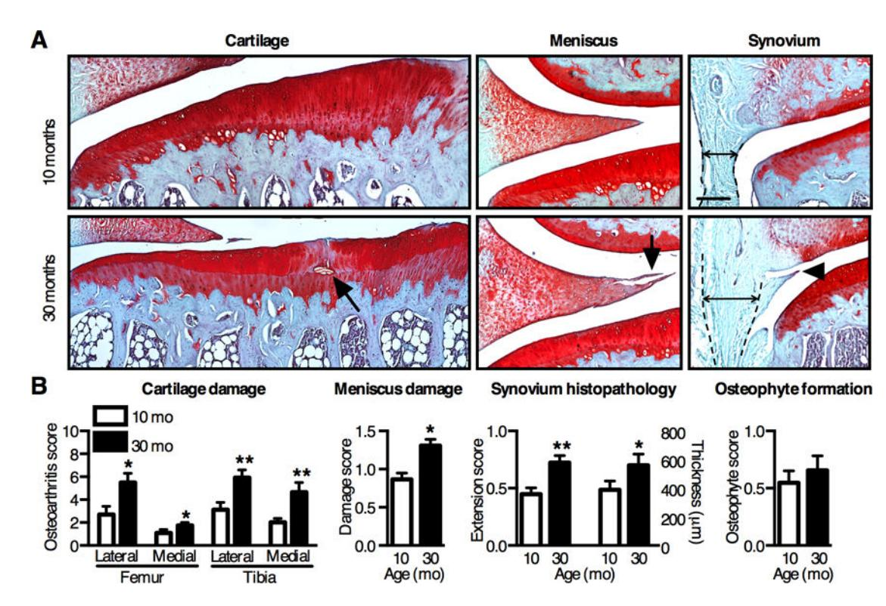
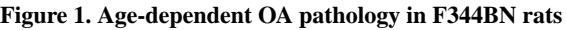
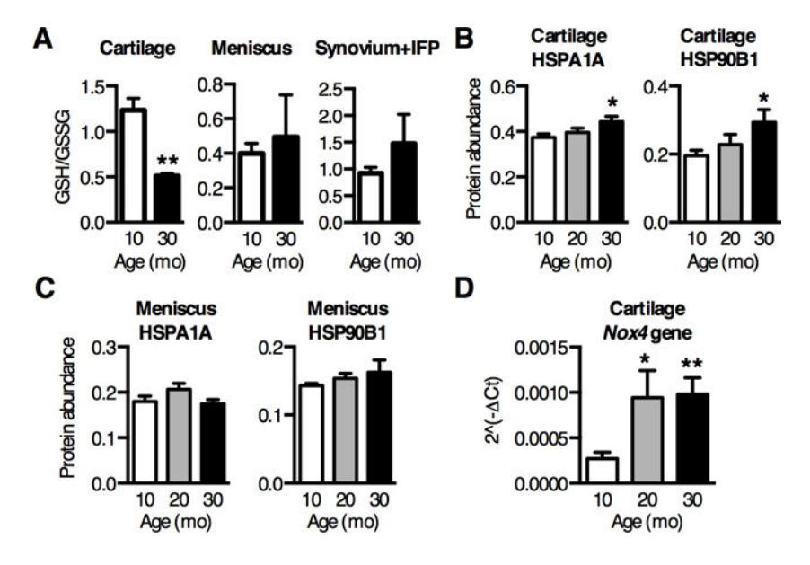
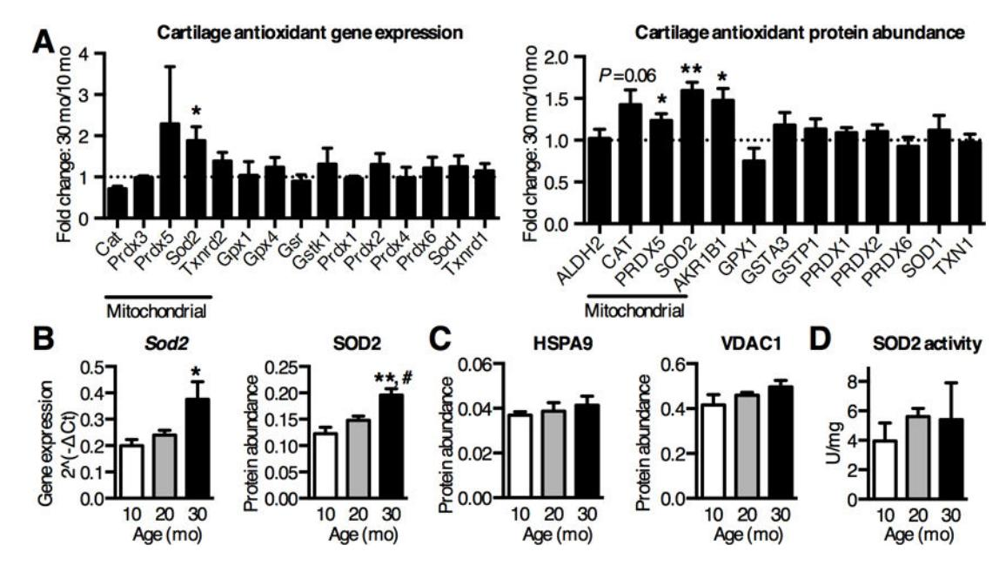
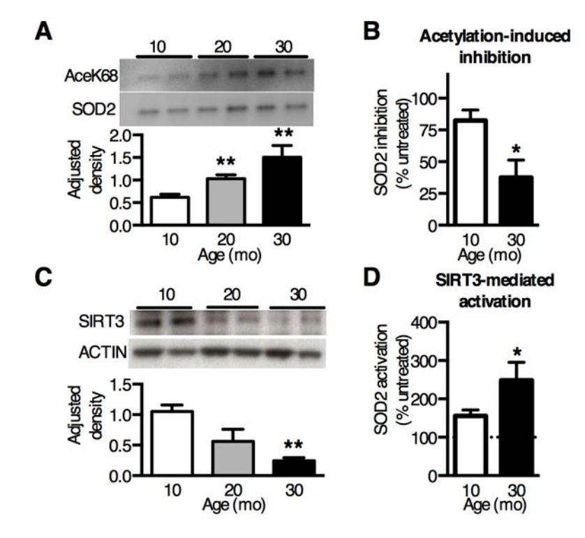
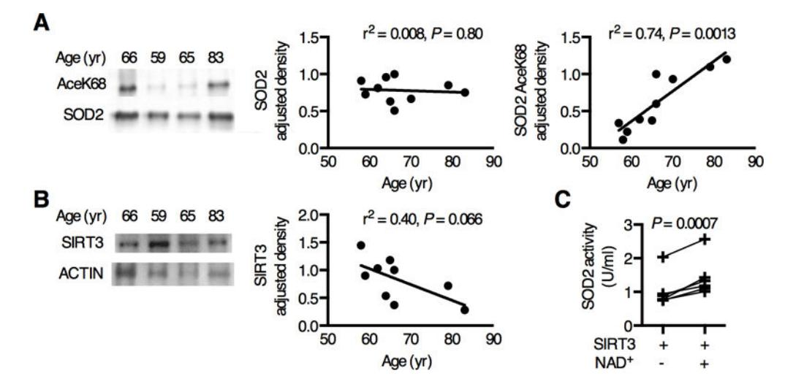
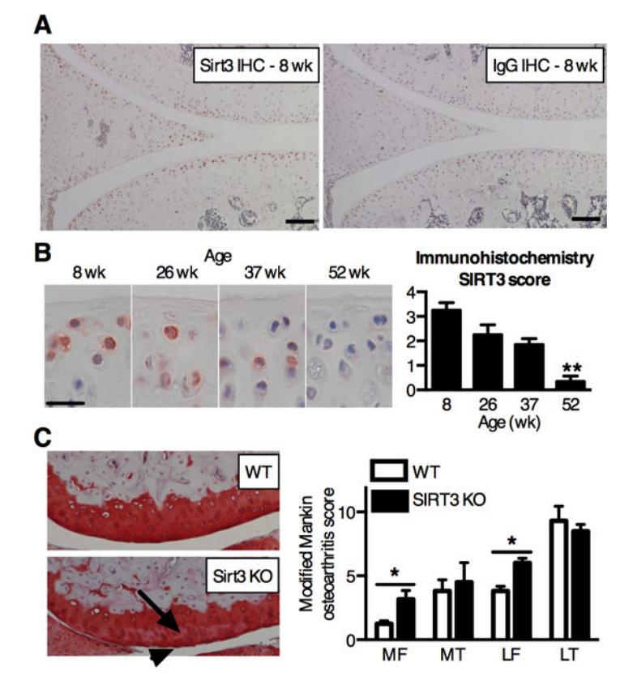

# **HHS Public Access**

Arthritis Rheumatol. Author manuscript; available in PMC 2017 August 01.

Published in final edited form as:

Author manuscript

Arthritis Rheumatol. 2016 August ; 68(8): 1887–1898. doi:10.1002/art.39618.

## **Aging Promotes SIRT3-dependent Cartilage SOD2 Acetylation and Osteoarthritis**

**Yao Fu, PhD**1,2, **Michael Kinter, PhD**1,3, **Joanna Hudson, BS**1, **Kenneth M. Humphries, PhD**1,2,3, **Rachel S. Lane, MS**1,2, **Jeremy R. White, MD**4, **Michael Hakim, MD**1,4, **Yong Pan, PhD**5, **Eric Verdin, MD**5, and **Timothy M. Griffin, PhD**1,2,3,\*

1Aging and Metabolism Research Program, Oklahoma Medical Research Foundation, Oklahoma City, OK, USA, 73104

2Department of Biochemistry and Molecular Biology, University of Oklahoma Health Sciences Center, Oklahoma City, OK, USA, 73104

3Department of Geriatric Medicine, Reynolds Oklahoma Center on Aging, University of Oklahoma Health Sciences Center, Oklahoma City, OK, USA, 73104

4Department of Orthopaedic Surgery and Rehabilitation, College of Medicine, University of Oklahoma Health Sciences Center, Oklahoma City, OK, USA, 73104

5Gladstone Institutes, UCSF, California, USA, 94158

## **Abstract**

**Objective—**To quantify functional age-related changes in the cartilage antioxidant network to discover novel mediators of cartilage oxidative stress and osteoarthritis (OA) pathophysiology.

**Methods—**We evaluated knee OA histopathology in 10, 20, and 30-month old male F344BN rats and analyzed cartilage oxidation by the ratio of reduced:oxidized glutathione. Antioxidant gene expression and protein abundance were analyzed by qRT-PCR and selected reaction-monitoring mass spectrometry, respectively. Superoxide dismutase 2 (SOD2) activity and acetylation were analyzed by colorimetric enzyme assays and Western blotting, respectively. We examined human OA cartilage to evaluate the clinical relevance of SOD2 acetylation, and we tested age-related changes in the mitochondrial deacetylase, sirtuin 3 (SIRT3), in rats and mice.

**Results—**Cartilage oxidation and OA severity increased with age and were associated with an increase in SOD2 expression and protein abundance. However, SOD2 specific activity decreased with age due to elevated post-translational lysine acetylation. Consistent with these findings, SIRT3 decreased substantially with age, and treatment with SIRT3 increased SOD2 activity in an

\*Corresponding Author: Timothy M. Griffin, Ph.D., Associate Member, Aging and Metabolism Research Program, Oklahoma Medical Research Foundation, MS 21, 825 NE 13th St, Oklahoma City, OK 73104 USA, Phone: (405) 271-7579; Fax: (405) 271-1437; Tim-Griffin@omrf.org.

**Author contributions**

All authors were involved in drafting the article or revising it critically for important intellectual content, and all authors approved the final version to be published. Dr. Griffin had full access to all of the data in the study and takes responsibility for the integrity of the data and the accuracy of the data analysis.

**Study conception and design.** Fu, Griffin.

**Acquisition of data.** Fu, Kinter, Hudson, Humphries, Lane, White, Hakim, Pan, Verdin. **Analysis and interpretation of data.** Fu, Kinter, Humphries, Hudson, Griffin.

age-dependent manner. SOD2 was also acetylated in human OA cartilage, and activity was increased with SIRT3 treatment. Moreover, in C57BL6 mice, cartilage SIRT3 expression decreased with age and whole-body deletion of SIRT3 accelerated the development of knee OA.

**Conclusion—**Our results show that SIRT3 mediates age-related changes in cartilage redox regulation and protects against early-stage OA. These findings suggest that mitochondrial acetylation promotes OA and that restoration of SIRT3 in aging cartilage may improve cartilage resistance to oxidative stress by rescuing acetylation-dependent inhibition of SOD2 activity.

#### **Keywords**

Aging; Cartilage; Oxidative Stress; Mitochondria; Sirtuins

## **Introduction**

Aging is the primary risk factor for osteoarthritis (OA), the most common type of joint disease and a leading cause of disability. A central feature of OA pathology is the degeneration of articular cartilage, which is caused by an imbalance in chondrocyte anabolic and catabolic activities. Aging promotes this imbalance through cell intrinsic and extrinsic changes that decrease growth factor signaling (1,2), increase inflammatory and proteolytic signaling (3,4), and promote chondrocyte senescence and apoptosis (5,6). Most hypotheses on the causes of these age-related changes involve an increase in pro-oxidant signaling or oxidative stress (7–9). However, the age-dependent basis of oxidative stress in cartilage is not well understood.

An increasing number of studies indicate a role for altered mitochondrial function in OA pathogenesis (10–12). Genetic differences based on mitochondrial DNA haplogroup significantly alter the risk of developing knee and hip OA and modify the expression of cartilage proteolytic enzymes in OA patients (13,14). In addition, mitochondrial reactive oxygen species (ROS) production is increased in OA cartilage due to impaired electron transport chain activity and mitochondrial DNA deletions, suggesting that mitochondrial dysfunction promotes cartilage oxidative stress (11). Moreover, OA cartilage is more susceptible to ROS damage due to a reduction in the expression of the mitochondrial antioxidant enzyme SOD2 (15–19). These findings suggest a central role for mitochondrial redox imbalance in OA pathogenesis. Mitochondrial function declines with age in a variety of tissues; however, the effect of aging on mechanisms regulating chondrocyte redox balance remain to be determined.

Our goal was to identify novel risk factors for the initiation of OA by examining agedependent changes in chondrocyte redox homeostasis and OA progression. To do so, we evaluated OA pathology and biomarkers of oxidative stress in F344xBN F1 hybrid (F344BN) rats. We selected the F344BN hybrid rat for this study because unlike other inbred rat strains that have high incidences of specific age-related pathologies, such as kidney disease or cancer, the F344BN rat develops generalized age-related pathologies and adult-onset weight gain similar to aging human populations in developed countries (20). Here we provide the first report of age-associated OA pathology and cartilage oxidative stress markers in F344BN rats. Using this animal model, we conducted comprehensive

quantitative gene expression and protein abundance screens of age-associated changes in cartilage cellular mediators of oxidative homeostasis. These findings revealed upregulated SOD2 as the most differentially expressed antioxidant enzyme in aging cartilage. SOD2 specific-activity, however, declined in an age-dependent manner due to elevated posttranslational acetylation. Given the central role of the mitochondrial deacetylase SIRT3 in regulating mitochondrial protein acetylation levels, we conducted the first evaluation of a potential role for SIRT3 in regulating age-dependent changes in cartilage SOD2 function and OA risk.

### **Materials and Methods**

#### **Animals**

Male F344BN F1 hybrid rats were purchased from the NIA Aging Rodent Colony at 7, 17, and 26 mo of age. Rats were housed in OMRF's vivarium for a period of 3–4 mo with ad libitum access to NIH31 chow diet (Harlan). Male C57BL/6J mice were purchased from The Jackson Laboratory (Bar Harbor, ME, USA) and housed in OMRF's vivarium for a period of 4–32 wks. Mice were placed on a standardized control diet (D12450B, Research Diets) beginning at 6 wks of age and continued on this diet throughout the study. The left and right knee joints were obtained from 10–14 mo old SIRT3 KO and WT littermate mice (C57BL/6 background; 10-mo: n=2 WT and n=2 KO; 14-mo: n=2 WT and n=1 KO). Additional 6-,12-, and 18-mo old male C57BL/6J mice were obtained from the NIA Aging Rodent Colony (n=6 per age). All procedures were performed in accordance with a protocol approved by the OMRF Institutional Animal Care and Use Committee.

#### **Human OA Cartilage Patient Information**

Waste cartilage tissue was obtained by informed consent from doctor-diagnosed OA patients undergoing joint replacement surgery at the Bone and Joint Hospital at St. Anthony in Oklahoma City, OK, in accordance with protocols approved by the Human Subjects IRB of the OMRF (11–38) and the University of Oklahoma Health Sciences Center (16156). Following surgery, waste tissue was transported in sterile saline to OMRF where cartilage explants were harvested, immediately frozen in liquid nitrogen, and stored at −80°C until analysis. Samples were collected and analyzed from 10 patients for protein expression (n=8 female), and SIRT3-dependent SOD2 activity was tested in a subset of 6 patients (n=5 female). The average patient age was 67.2 ± 8.1 yrs (S.D.), and the average BMI was 30.1 ± 6.9 (S.D.). Samples were harvested from patients that had not undergone a significant change in body weight (>10%) in the previous 6 mo.

#### **Histology and Immunohistochemistry**

Immediately following death, rodent knee joints were harvested for histological evaluation as previously described (21). Two experienced blinded graders evaluated OA pathology in F344BN rats using a semi-quantitative histomorphometric scoring system (Table S1). Knee OA scores were evaluated in SIRT3 KO and WT littermate mice as previously described (21). SIRT3 and SOD2 immunostaining was performed with a rabbit anti-SIRT3 monoclonal antibody (1:100) or anti-SOD2 polyclonal antibody (1:100), respectively. Two blinded

#### **RNA and Protein Extraction**

Knee femoral and tibial cartilage was carefully dissected under a stereomicroscope using a fresh scalpel blade and immediately placed in TRIzol® Reagent (Ambion) on ice. Cartilage mRNA and protein were isolated following the manufacturer's protocol, and mRNA was purified using a RNeasy Micro Kit (Qiagen). Protein samples were dissolved in 1% SDS for Western blotting or Mass Spectrometry analyses.

#### **Glutathione Content**

Tissues for the glutathione assay were placed directly in 20mM MOPS, 3mM EDTA buffer on ice. Tissues were removed from buffer, snap frozen in liquid nitrogen, and stored at −80°C. Samples were then cyropulverized using a MutiSample BioPulverizer (Biospec, 59012ms) followed by sonication in phosphate buffer. Homogenate was cleared by centrifugation at 10,000g for 10 min. Oxidized and reduced glutathione was measured spectrophotometrically (Sunrise™, Tecan) using an enzymatic recycling method following manufacturer instructions (Cayman Chemicals). Glutathione concentration was normalized to total protein content of each sample (BCA Protein Assay; Thermo Scientific).

#### **Quantitative Mass Spectrometry Analysis**

Selected Reaction Monitoring (SRM) Mass Spectrometry was used to quantify protein abundance as previously described (22). 8pmol of BSA was added to each 20μg protein sample as an internal standard. Samples were analyzed using a TSQ Vantage triple quadrupole mass spectrometer (Thermo Scientific), operated in the selected reaction monitoring mode with a splitless nanoflow HPLC system (Eksigent). Data were processed using Pinpoint to find and integrate the correct peptide chromatographic peaks. To quantify protein abundance, the relative quantity of each protein was first normalized to the BSA internal standard and then to the geometric mean of three stable cellular reference proteins: α-actin (ACTA), ribosomal protein S27a (RPS27A) and peptidyl-prolyl isomerase A (PPIA).

#### **Quantitative RT-PCR**

200ng mRNA was synthesized into cDNA using RT2 First Strand Kit (Qiagen, SABiosciences) according to the manufacturer's protocol. Antioxidant gene expression was measured using the RT2 Profiler Rat Oxidative Stress and Antioxidant Defense Array and analyzed using RT2 Profiler PCR Array Data Analysis software (v3.4) (SABiosciences). To quantify Sirt3 gene expression, 70ng cartilage mRNA was synthesized into cDNA using QuantiTect reverse transcription kit (Qiagen). RT-PCR was performed using QuantiTect primers and RT2 SYBR green (Qiagen) on a CFX96 thermocycler (Bio-Rad). Rat sirt3 gene expression was normalized to the geometric mean of 3 stable reference genes: ldha, hprt1, and rplp1. Gene expression changes were evaluated by the ΔΔCt method.

#### **Western Blot Analysis**

TRIzol®-isolated protein samples were incubated for 10 min at 95°C in 70mM SDS and 100mM DTT, subjected to electrophoresis using NuPAGE 4–12% Bis-Tris gels (Life Technology), and transferred to PVDF (Bio-Rad). Antibodies were diluted in PBS with 0.05% Tween and 5% nonfat dry milk or 2% Bovine Serum Albumin (Sigma-Aldrich). Peroxidase-conjugated secondary antibodies were visualized using SuperSignal West Pico Chemiluminescent Substrate (Thermo Scientific) according to manufacturer's protocol. Densitometry analysis was performed by ImageJ software.

#### **Superoxide Dismutase Activity**

We measured cartilage superoxide dismutase (SOD) activity spectrophotometrically using a Superoxide Dismutase Activity Assay (Cayman Chemical) following the manufacturer's protocol. SOD2 activity was measured in the presence of KCN to distinguish from the cyanide-sensitive isoforms (i.e., SOD1 and SOD3). We determined the optimal KCN concentration by testing the inhibition of SOD activity with 3–30mM KCN, and we selected the lowest concentration (20mM) that provided maximal inhibition. Enzymatic activity was normalized to total protein content.

#### **In vitro acetylation and SIRT3-dependent deacetylation**

Cartilage total homogenate was prepared in phosphate buffer as described for glutathione measurements. Cartilage homogenate was acetylated in vitro using 25μM acetic anhydride (Sigma-Aldrich, 539996) in acetonitrile (Sigma-Aldrich, 271004) for 2 min at room temperature (23). Cartilage homogenate was deacetylated in vitro using 1μg recombinant human SIRT3 (Enzo Life Science International, BML-SE270-0500) in the presence or absence of 1mM NAD+ and then incubated at room temperature for 5 minutes following previously described methods (24). After SIRT3 treatment, samples were desalted through Zeba™ Spin Desalting Column (Thermo Scientific, 89882) to remove dithiothreitol (DTT). Desalted samples were stored on ice prior to conducting SOD2 activity assays. Although NAD+ catalyzes the activity of other sirtuin isoforms that are present at endogenous levels in the cartilage homogenate, only SIRT3 interacts specifically with SOD2 (25).

#### **Statistical Analyses**

Differences in semi-quantitative histopathology and immunostaining scores were determined using Mann-Whitney and Kruskal-Wallis tests (Prism 6.0f). Gene expression differences were determined using the program RT2 Profiler PCR Array Data Analysis (version 3.4). Other data were analyzed by Student's t test or one-way ANOVA followed by Holm-Sidak's multiple comparisons test (Prism 6.0f). Data are expressed as mean ± SEM unless otherwise stated; n indicates the number of animals per group. A value of P < 0.05 was considered significant. Additional methods details are provided in the supplemental materials.

## **Results**

#### **Aging induces moderate OA pathology and cartilage oxidative stress in F344BN rats**

OA is a whole-joint disease, involving pathological changes in cartilage, meniscus, bone, and synovium. We evaluated knee OA pathology in these tissues in adult (10-mo) and aged (30-mo) F344BN rats using blinded histomorphometric grading. Aged animals developed multiple OA pathologies, including cartilage proteoglycan loss and lesions extending to the tidemark, meniscus damage, and synovial thickening and hyperplasia (Fig. 1A). Cartilage OA severity increased 2-fold at all sites of the joint with age, and meniscus damage increased 1.5-fold with age (Fig. 1B). Aging also increased synovial growth into the joint space and synovial thickness (Fig. 1B) but did not increase tibial osteophyte formation. These findings indicate that aged F344BN rats develop early to moderate stage OA.

We next evaluated age-related changes in joint tissue redox homeostasis by measuring the reduced and oxidized glutathione concentrations (GSH and GSSG, respectively) in 10- and 30-mo old F344BN rats. GSH is a major cellular ROS scavenger and co-factor for glutathione peroxidase activity. Thus, a decrease in the GSH/GSSG ratio indicates increased cellular oxidation and impaired antioxidant capacity. Cartilage GSH decreased with age (Fig. S1), such that the GSH/GSSG ratio decreased 59% from 10-mo to 30-mo of age (Fig. 2A). The GSH/GSSG ratio, however, did not decrease with age in either the meniscus or in synovium samples that also contained the infrapatellar fat pad (Fig. 2A). Thus, agedependent glutathione oxidation is specific to cartilage within the knee joint of F344BN rats. We further evaluated the effect of aging on joint tissue oxidative stress by quantifying the abundance of oxidative stress responsive heat shock proteins HSPA1A and HSP90B1 in cartilage and meniscus using SRM Mass Spectrometry. Aging increased the abundance HSPA1A and HSP90B1 in cartilage but not meniscus, consistent with the glutathione oxidation results (Fig. 2 B–C). To evaluate potential sources of age-related changes in ROS, we quantified the expression of genes involved in ROS production in cartilage from 10, 20, and 30-mo old animals using a qPCR array targeting genes involved in oxidative stress. Only NADPH oxidase 4 (Nox4) significantly increased with age (3.6-fold) (Fig. 2D, the entire list of 84 genes comparing expression changes in different aged animals can be found in Table S2). Unlike other Nox/Duox enzymes, Nox4 is constitutively active, suggesting that enzyme expression and oxygen levels primarily regulate ROS generation. Nox4, which is localized to the mitochondrial membrane (26), is a major source of interleukin-1β induced ROS production in chondrocytes (27). Taken together, our findings from aging F344BN rats emphasize a role for cartilage oxidative stress in OA pathophysiology and suggest that mitochondrial-associated ROS production contributes to this age-dependent stress. Due to the short half-life and significant technical limitations of in vivo ROS detection (28), especially in cells embedded in extracellular matrix with a low oxygen tension such as articular cartilage, we examined age-dependent changes in the cellular antioxidant network as a mediator of cartilage oxidative stress and OA.

## **Cartilage SOD2 expression increases with age and counteracts an aging-dependent decline in specific-activity due to elevated post-translational acetylation**

Oxidative stress results from an imbalance between pro-oxidant production and antioxidant function. Therefore, we used quantitative gene and protein expression methods to conduct a comprehensive analysis of the cytosolic and mitochondrial antioxidant network to evaluate the effect of aging on specific antioxidant pathways (Fig. 3A). Counter to expectations based on studies of end-stage OA cartilage (15–17), antioxidant gene expression and protein abundance did not decrease with age. Instead, expression patterns of most antioxidants were either unchanged or increased with moderate OA progression. The cytosolic antioxidant enzyme aldose reductase (AKR1B1) increased with age (Fig. 3A), suggesting increased NADPH-dependent reduction of toxic aldehydes. In addition, the mitochondrial antioxidant protein peroxiredoxin 5 (PRDX5) increased with age, and catalase, which is expressed in both mitochondria and peroxisomes, trended up with age (Fig. 3A). Notably, we observed the greatest increase in SOD2 expression (Figure 3A–B). The enrichment in mitochondrial antioxidants with age could be due to increased mitochondrial content. However, two reference mitochondrial proteins, voltage-dependent anion channel protein 1 (VDAC1) and heat shock 70kDa protein 9 (HSPA9), did not change with age (Fig. 3C), suggesting that the increase in mitochondrial antioxidants, and SOD2 in particular, was not due to an increase in overall mitochondrial mass. Furthermore, using immunohistochemistry, the increase in SOD2 content with age more closely associated with areas of cartilage damage than intact cartilage areas (Fig. S2). Western blot analysis showed a 2-fold increase in cartilage SOD2 content with age and no change in SOD1 or SOD3 (Fig. S3). These findings reinforce the mitochondrial specificity of the age-related oxidative stress response in cartilage.

Surprisingly, SOD2 activity did not increase with age despite increased protein abundance (Fig. 3D), indicating that the specific-activity of SOD2 decreased with age. Several recent studies have shown that reversible post-translational acetylation impairs SOD2 activity and is increased with age in several age-related disease pathologies (29). We tested if cartilage SOD2 acetylation increases with age using a SOD2-acetylated-lysine68-specific antibody (AceK68), a previously identified site of reversible post-translational lysine acetylation that regulates enzyme activity (25). AceK68 content, normalized to SOD2 abundance, increased 2.4-fold with age (Fig. 4A). To test the functional significance of this observation, we reasoned that cartilage from 10-mo old animals would be more sensitive to ex vivo acetylation-induced inhibition of SOD2 activity compared to 30-mo old animals with higher basal levels of SOD2 acetylation. Our results were consistent with this prediction; in vitro acetic anhydride treatment impaired SOD2 activity less with age (10-mo: −82.5%; 30-mo: −37.6%; P=0.025; Fig. 4B). Thus, overall SOD2 activity is maintained across a substantial age range by offsetting the decrease in specific-activity with an age-dependent increase in expression. These findings show that aging impairs SOD2 specific-activity by elevating post-translational acetylation and suggest that dysregulation of mitochondrial protein deacetylation impairs cartilage redox regulation with aging.

#### **Age-dependent loss of SIRT3 expression impairs cartilage SOD2 activity and induces OA**

SOD2 acetylation at lysine-68 is reversibly regulated by the mitochondrial deacetylase sirtuin 3 (SIRT3), a central regulator of global mitochondrial protein acetylation (30). We

measured SIRT3 gene and protein expression and found a significant age-dependent reduction in SIRT3 protein abundance (77% reduction; Fig. 4C) but not mRNA expression (P=0.28). The age-dependent decrease in SIRT3 protein is consistent with the increase in SOD2 acetylation. SIRT3 is the only sirtuin that deacetylases and activates SOD2 (25); therefore to test the functional relevance of SIRT3-mediated regulation of SOD2 activity in aging cartilage, we incubated cartilage homogenates from 10- and 30-mo animals with recombinant human SIRT3 protein with or without the cofactor NAD+. Treating with activated SIRT3 increased SOD2 activity to a greater extent in aged samples (Fig. 4D), further indicating that aging impairs cartilage SOD2 function due to a reduction of SIRT3 with age. We also measured the acetylation status of isocitrate dehydrogenase 2 (IDH2) lysine 413, which is another SIRT3-dependent acetylation sites (31). Consistent with findings for SOD2, IDH2 acetylation also increased with age in rat cartilage (Fig. S4), suggesting that the age-dependent decline of SIRT3 increases the post-translational acetylation of multiple mitochondrial proteins.

Next, we tested for SOD2 acetylation in human OA cartilage. Cartilage was harvested from both fibrillated and non-fibrillated regions of the joint to obtain an average sampling of agerelated changes. We detected SOD2 AceK68 in all samples (n=10) and found that SOD2 acetylation, normalized to SOD2 content, increased with age (r 2 = 0.74; P=0.001; Fig. 5A). Consistent with this finding, SIRT3 content showed a near significant trend to decrease with age (r 2=0.40; P=0.066; Fig. 5B). This inverse relationship between SOD2 acetylation and SIRT3 content is comparable to our findings in aging F344BN rats. To determine the extent to which acetylation impairs the activity of SOD2 in OA cartilage, we measured the change in SOD2 activity by incubating the OA cartilage homogenate with purified human SIRT3 in the presence or absence of its cofactor, NAD+. Incubation with SIRT3 and NAD+ resulted in a significant 44 ± 22% (SD) increase in SOD2 activity (P=0.0007; Fig. 5C). These findings suggest that activation of SIRT3 in aging OA cartilage could increase the enzymatic capacity of SOD2 and improve the resistance of chondrocytes to mitochondrial oxidative stress.

Finally, to evaluate the generality of our findings, we measured the age-dependent expression of SIRT3 in the knee cartilage of C57BL/6J mice. In 8-wk old mice, SIRT3 was detected in chondrocytes throughout the femoral and tibial articular cartilage and in surface zone meniscal cells (Fig. 6A). During skeletal maturation from 8 to 26-wks of age, the percent of SIRT3-positive chondrocytes dropped from 23% to 10% (P=0.0016) in the middle/deep zone but did not change in the surface zone cells (18% to 15%; P=0.73), indicating zonal specificity to age-dependent changes. When compared across a broader age range, up to 52 wks, cartilage SIRT3 protein content decreased dramatically (Fig. 6B). In a separate analysis of 6–18 month old mice, we did not observe a significant change in cartilage SOD2 expression. SOD2 acetyation was not detectable due to insufficient protein. Thus, whereas chondrocyte SIRT3 protein levels were significantly reduced with age in mice as in F344BN rats, SOD2 expression did not increase with age.

To determine if the absence of SIRT3 is sufficient to induce OA, we evaluated cartilage OA pathology in the left and right knees from a cohort of 10–14-mo old SIRT3 KO mice and their WT littermates (C57BL/6 background). SIRT3 KO mice develop normally (30), but they are more susceptible to metabolic pathologies when challenged with energetic stresses,

such as caloric restriction and high-fat diet feeding (32). In our examination of idiopathic OA pathology, we observed a significant increase in OA in the medial and lateral femoral condyles of SIRT3 KO mice (Fig. 6C). The increase in modified Mankin OA score in the femoral condyles was due to a moderate increase in the loss of Safranin-O staining (P=0.029), and an increase in cartilage damage involving surface zone fibrillation in the lateral femoral condyle (P=0.029). Thus, in the absence of induced joint stresses, the loss of SIRT3 promoted early-stage site-specific increases in OA progression.

## **Discussion**

Cartilage oxidative stress impairs extracellular matrix synthesis and stimulates cartilage degradation, implicating it as a central factor in the imbalance of anabolic and catabolic activities that drive the development of OA (8,33). Therefore, identifying the underlying mechanisms that cause cartilage oxidative stress during aging is of great interest for developing new potential therapeutic targets. Mitochondria are a primary site of ROS production in chondrocytes, especially following biomechanical trauma and inflammation (34,35). Previous studies implicate a role for the downregulation of the mitochondrial antioxidant, SOD2, in OA pathology (15–19). In this study, we found that aging impairs the specific activity of cartilage SOD2 through increased post-translational acetylation. Our findings further indicate that an age-dependent decrease in the mitochondrial deacetylase, SIRT3, is a critical factor driving this age-dependent inhibition of SOD2 specific activity.

The mechanisms by which declines in SOD2 protein or specific activity increase the risk of OA remain controversial. For example, although silencing SOD2 increases chondrocyte lipid peroxidation and mitochondrial DNA damage, it also reduces interleukin-1 stimulated expression of cartilage matrix proteolytic enzymes, such as matrix metalloproteinase (MMP) 1 and 13 (18). SOD2 regulates MMP activation indirectly by modulating hydrogen peroxidesensitive pathways (36). Thus, SOD2 silencing may promote short-term anti-catabolic effects by reducing the rate of hydrogen peroxide production (37), but when it is sustained, the balance shifts to promoting cellular oxidative damage and degeneration. In the current study, the decline in the specific activity of cartilage SOD2 in aging F344BN rats was offset by an increase in SOD2 protein abundance, thereby maintaining overall cartilage SOD2 activity from 10 to 30 mo of age. This raises the question about how increased SOD2 acetylation promotes OA risk when total SOD2 activity was not altered in the cartilage of aging rats? SOD2 expression is regulated by stress-responsive transcription factors, including NF-κB and HIF-2α (38,39). In cartilage, SOD2 is rapidly upregulated in response to inflammatory mediators, such as interleukin-1β (40). Interleukin-1β also increases chondrocyte mitochondrial ROS production (35). Thus, the transcriptional coupling of SOD2 expression with mitochondrial ROS production suggests that factors that limit the dynamic range of SOD2 enzymatic activity, such as post-translation acetylation, may impair acute cellular stress-response mechanisms.

The effect of SIRT3 on cartilage SOD2 activity is likely context-specific given the heterogeneous relationship observed between age-related changes in cartilage SIRT3 and SOD2 protein levels in rats, mice, and human OA patients. An analysis of SIRT3-dependent changes on the stress-stimulated dynamic range of cartilage SOD2 activity would help

elucidate how SOD2 hyperacetylation contributes to the development of cartilage oxidative stress. Further work is needed to understand how SOD2 expression, stability, and function are regulated at different stages of OA and under changing conditions of mitochondrial acetylation.

SIRT3 regulates the acetylation status of more than 136 mitochondrial proteins (41), suggesting that multiple mitochondrial proteins may be impaired with aging and contribute to the increased risk of OA. We found that IDH2 acetylation also increases with age in rat cartilage. This is an additional mechanism by which SIRT3 can regulate cellular redox status. IDH2 is a TCA cycle enzyme that synthesizes NADPH, a critical cofactor for reducing GSSG to GSH (31). Thus, hyperacetylation of IDH2 would be expected to induce glutathione oxidation, consistent with our finding for aging rat cartilage as well as for previous observations of aging human cartilage (42). SIRT3 also regulates the acetylation of multiple mitochondrial proteins involved in fatty acid oxidation, oxidative phosphorylation, and mitochondrial-mediated cell death (32). Given the increasing evidence for mitochondrial dysfunction in OA pathogenesis (11), it is likely that the significant decline in SIRT3 protein in aging cartilage will also impair the ability of chondrocytes to maintain energetic and oxidative homeostasis during periods of metabolic stress.

The activity of SIRT3, like other sirtuins, is dependent on conserved NAD+ binding and catalytic domains. This reliance on NAD+ links the activity of sirtuins to periods of energetic stress. In chondrocytes, SIRT1, which is located primarily in the nucleus and regulates gene transcription, has previously been shown to enhance chondrocyte survival and matrix homeostasis (43). During aging and the development of OA in mice, however, SIRT1 expression is significantly decreased, suggesting a role for insufficient SIRT1 activity in OA pathogenesis (44). The chondroprotective actions of SIRT1 act through multiple pathways, including attenuation of NF-κB signaling and upstream activation of AMP-activated protein kinase (AMPK) (45). The expression of several additional chondroprotective anti-catabolic factors activated by energetic stress, including AMPK, peroxisome proliferator–activated receptor coactivator 1α (PGC-1α), and FoxO family transcription factor FoxO3A, are also decreased in the cartilage of aging mice (46,47). Thus, SIRT3 joins a family of key mediators of cellular metabolic and oxidative homeostasis that are reduced with aging. Recently, Lombard and Zwaans proposed both direct and indirect mechanisms by which SIRT3 may promote activation of an AMPK-PGC-1α-FoxO3A signaling network (48). Given the importance of these cellular regulators of metabolic and oxidative homeostasis in promoting chondrocyte homeostasis (45), further work is needed to evaluate how SIRT3 coordinates the activation of these anti-catabolic stress-responsive signaling pathways, which may even include a more direct role for SIRT3 in regulating gene expression (49,50).

In summary, our work extends the chondroprotective role of sirtuins to include SIRT3. Previous studies identified a chondroprotective role for sirtuin 1 in OA (43). Here we show that aging promotes OA and compromises mitochondrial redox regulation in cartilage due to a reduction in SIRT3 expression and impaired SOD2 specific-activity. This work advances our understanding of how aging increases the risk of OA and suggests that approaches designed to regulate the acetylation of mitochondrial proteins may have therapeutic value to prevent or treat OA.

## **Supplementary Material**

Refer to Web version on PubMed Central for supplementary material.

## **Acknowledgments**

We thank Melinda West, Caroline Kinter, Michael Boeving, and Drs. Elise Donovan and Helen Kelley for technical assistance and Drs. Luke Szweda, Christopher West, William Sonntag, Ming-Hui Zhou, Ann Louise Olson, Hiro Matsumoto, and Holly Van Remmen for advice and intellectual input.

Funding: Supported by the NIH (grants P30-AR-053483, P20-RR-018758, P20-GM-103441, and R01-AG-049058 to Dr. Griffin and P20-GM-104934 to Dr. Humphries) and the Arthritis Foundation (Dr. Griffin).

## **References**

- 1. Blaney Davidson EN, Scharstuhl A, Vitters EL, van der Kraan PM, van den Berg WB. Reduced transforming growth factor-beta signaling in cartilage of old mice: role in impaired repair capacity. Arthritis Res Ther. 2005; 7:R1338–47. [PubMed: 16277687]
- 2. Loeser RF, Carlson CS, Carlo MD, Cole A. Detection of nitrotyrosine in aging and osteoarthritic cartilage: Correlation of oxidative damage with the presence of interleukin-1β and with chondrocyte resistance to insulin-like growth factor 1. Arthritis Rheum. 2002; 46:2349–2357. [PubMed: 12355482]
- 3. Forsyth CB, Cole A, Murphy G, Bienias JL, Im H-J, Loeser RF. Increased matrix metalloproteinase-13 production with aging by human articular chondrocytes in response to catabolic stimuli. J Gerontol A Biol Sci Med Sci. 2005; 60:1118–1124. [PubMed: 16183949]
- 4. Loeser RF, Olex AL, McNulty MA, Carlson CS, Callahan MF, Ferguson CM, et al. Microarray analysis reveals age-related differences in gene expression during the development of osteoarthritis in mice. Arthritis Rheum. 2012; 64:705–717. [PubMed: 21972019]
- 5. Martin JA, Buckwalter JA. Aging, articular cartilage chondrocyte senescence and osteoarthritis. Biogerontology. 2002; 3:257–264. [PubMed: 12237562]
- 6. McNulty MA, Loeser RF, Davey C, Callahan MF, Ferguson CM, Carlson CS. Histopathology of naturally occurring and surgically induced osteoarthritis in mice. Osteoarthritis Cartilage. 2012; 20:949–956. [PubMed: 22595226]
- 7. Aigner T, Rose J, Martin J, Buckwalter J. Aging Theories of Primary Osteoarthritis: From Epidemiology to Molecular Biology. Rejuvenation Research. 2004; 7:134–145. [PubMed: 15312300]
- 8. Henrotin Y, Blanco F, Aigner T, Kurz B. The significance of oxidative stress in articular cartilage ageing and degradation. Curr Rheumatol Rev. 2007; 3:261–274.
- 9. Shane Anderson A, Loeser RF. Why is osteoarthritis an age-related disease? Best Practice & Research Clinical Rheumatology. 2010; 24:15–26. [PubMed: 20129196]
- 10. Johnson K, Jung A, Murphy A, Andreyev A, Dykens J, Terkeltaub R. Mitochondrial oxidative phosphorylation is a downstream regulator of nitric oxide effects on chondrocyte matrix synthesis and mineralization. Arthritis Rheum. 2000; 43:1560–1570. [PubMed: 10902761]
- 11. Blanco FJ, Rego I, Ruiz-Romero C. The role of mitochondria in osteoarthritis. Nat Rev Rheumatol. 2011; 7:161–169. [PubMed: 21200395]
- 12. Vaamonde-García C, Riveiro-Naveira RR, Valcárcel-Ares MN, Hermida-Carballo L, Blanco FJ, López-Armada MJ. Mitochondrial dysfunction increases inflammatory responsiveness to cytokines in normal human chondrocytes. Arthritis Rheum. 2012; 64:2927–2936. [PubMed: 22549761]
- 13. Rego-Pérez I, Fernández-Moreno M, Fernández-López C, Arenas J, Blanco FJ. Mitochondrial DNA haplogroups: Role in the prevalence and severity of knee osteoarthritis. Arthritis Rheum. 2008; 58:2387–2396. [PubMed: 18668590]
- 14. Rego-Perez I, Fernandez-Moreno M, Deberg M, Pertega S, Fenandez-Lopez C, Oreiro N, et al. Mitochondrial DNA haplogroups modulate the serum levels of biomarkers in patients with osteoarthritis. Annals of the Rheumatic Diseases. 2010; 69:910–917. [PubMed: 19934106]

- 15. Aigner T, Fundel K, Saas J, Gebhard PM, Haag J, Weiss T, et al. Large-scale gene expression profiling reveals major pathogenetic pathways of cartilage degeneration in osteoarthritis. Arthritis Rheum. 2006; 54:3533–3544. [PubMed: 17075858]
- 16. Ruiz-Romero C, Calamia V, Mateos J, Carreira V, Martinez-Gomariz M, Fernandez M, et al. Mitochondrial Dysregulation of Osteoarthritic Human Articular Chondrocytes Analyzed by Proteomics: A Decrease in Mitochondrial Superoxide Dismutase Points to a Redox Imbalance. Mol Cell Proteomics. 2009; 8:172–189. [PubMed: 18784066]
- 17. Scott JL, Gabrielides C, Davidson RK, Swingler TE, Clark IM, Wallis GA, et al. Superoxide dismutase downregulation in osteoarthritis progression and end-stage disease. Ann Rheum Dis. 2010; 69:1502–1510. [PubMed: 20511611]
- 18. Gavriilidis C, Miwa S, Zglinicki von T, Taylor RW, Young DA. Mitochondrial dysfunction in osteoarthritis is associated with down-regulation of superoxide dismutase 2. Arthritis Rheum. 2013; 65:378–387. [PubMed: 23138846]
- 19. Koike M, Nojiri H, Ozawa Y, Watanabe K, Muramatsu Y, Kaneko H, et al. Mechanical overloading causes mitochondrial superoxide and SOD2 imbalance in chondrocytes resulting in cartilage degeneration. Sci Rep. 2015; 5:11722. [PubMed: 26108578]
- 20. Lipman RD, Chrisp CE, Hazzard DG, Bronson RT. Pathologic Characterization of Brown Norway, Brown Norway × Fischer 344, and Fischer 344 × Brown Norway Rats With Relation to Age. J Gerontol A Biol Sci Med Sci. 1996; 51A:B54–B59.
- 21. Cai A, Hutchison E, Hudson J, Kawashima Y, Komori N, Singh A, et al. Metabolic enrichment of omega-3 polyunsaturated fatty acids does not reduce the onset of idiopathic knee osteoarthritis in mice. Osteoarthritis Cartilage. 2014; 22:1301–1309. [PubMed: 25008209]
- 22. Rindler PM, Plafker SM, Szweda LI, Kinter M. High Dietary Fat Selectively Increases Catalase Expression within Cardiac Mitochondria. J Biol Chem. 2013; 288:1979–1990. [PubMed: 23204527]
- 23. Vadvalkar SS, Baily CN, Matsuzaki S, West M, Tesiram YA, Humphries KM. Metabolic inflexibility and protein lysine acetylation in heart mitochondria of a chronic model of Type 1 diabetes. Biochem J. 2013; 449:253–261. [PubMed: 23030792]
- 24. Hirschey, MD., Shimazu, T., Huang, JY., Verdin, E. Chapter 8 Acetylation of Mitochondrial Proteins. In: Allison, WS., Murphey, AN., editors. Mitochondrial Function, Part B: Mitochondrial Protein Kinases, Protein Phosphatases and Mitochondrial Diseases. Vol. 457. Academic Press; 2009. p. 137-147.Methods in Enzymology
- 25. Chen Y, Zhang J, Lin Y, Lei Q, Guan K-L, Zhao S, et al. Tumour suppressor SIRT3 deacetylates and activates manganese superoxide dismutase to scavenge ROS. EMBO Rep. 2011; 12:534–541. [PubMed: 21566644]
- 26. Block K, Gorin Y, Abboud HE. Subcellular localization of Nox4 and regulation in diabetes. Proc Natl Acad Sci U S A. 2009; 106:14385–14390. [PubMed: 19706525]
- 27. Rousset F, Nguyen MVC, Grange L, Morel F, Lardy B. Heme oxygenase-1 regulates matrix metalloproteinase MMP-1 secretion and chondrocyte cell death via Nox4 NADPH oxidase activity in chondrocytes. PLoS ONE. 2013; 8:e66478. [PubMed: 23840483]
- 28. Robinson KM, Janes MS, Beckman JS. The selective detection of mitochondrial superoxide by live cell imaging. Nat Protoc. 2008; 3:941–947. [PubMed: 18536642]
- 29. Tao R, Vassilopoulos A, Parisiadou L, Yan Y, Gius D. Regulation of MnSOD Enzymatic Activity by Sirt3 Connects the Mitochondrial Acetylome Signaling Networks to Aging and Carcinogenesis. Antioxid Redox Signal. 2013; 20:1646–1654. [PubMed: 23886445]
- 30. Lombard DB, Alt FW, Cheng H-L, Bunkenborg J, Streeper RS, Mostoslavsky R, et al. Mammalian Sir2 Homolog SIRT3 Regulates Global Mitochondrial Lysine Acetylation. Mol Cell Biol. 2007; 27:8807–8814. [PubMed: 17923681]
- 31. Yu W, Dittenhafer-Reed KE, Denu JM. SIRT3 Protein Deacetylates Isocitrate Dehydrogenase 2 (IDH2) and Regulates Mitochondrial Redox Status. J Biol Chem. 2012; 287:14078–14086. [PubMed: 22416140]
- 32. Newman JC, He W, Verdin E. Mitochondrial Protein Acylation and Intermediary Metabolism: Regulation by Sirtuins and Implications for Metabolic Disease. J Biol Chem. 2012; 287:42436– 42443. [PubMed: 23086951]

- 33. Khan IM, Gilbert SJ, Caterson B, Sandell LJ, Archer CW. Oxidative stress induces expression of osteoarthritis markers procollagen IIA and 3B3(−) in adult bovine articular cartilage. Osteoarthritis Cartilage. 2008; 16:698–707. [PubMed: 18255322]
- 34. Brouillette MJ, Ramakrishnan PS, Wagner VM, Sauter EE, Journot BJ, McKinley TO, et al. Straindependent oxidant release in articular cartilage originates from mitochondria. Biomech Model Mechanobiol. 2014; 13:565–572. [PubMed: 23896937]
- 35. Cao Y, Zhang X, Shang W, Xu J, Wang X, Hu X, et al. Proinflammatory Cytokines Stimulate Mitochondrial Superoxide Flashes in Articular Chondrocytes In Vitro and In Situ. PLoS ONE. 2013; 8:e66444. [PubMed: 23840469]
- 36. Ranganathan AC, Nelson KK, Rodriguez AM, Kim KH, Tower GB, Rutter JL, et al. Manganese superoxide dismutase signals matrix metalloproteinase expression via H2O2-dependent ERK1/2 activation. J Biol Chem. 2001; 276:14264–14270. [PubMed: 11297530]
- 37. Dasgupta J, Subbaram S, Connor KM, Rodriguez AM, Tirosh O, Beckman JS, et al. Manganese Superoxide Dismutase Protects from TNF-α–Induced Apoptosis by Increasing the Steady-State Production of H 2O 2. Antioxid Redox Signal. 2006; 8:1295–1305. [PubMed: 16910777]
- 38. Miao L, Clair DKS. Regulation of superoxide dismutase genes: Implications in disease. Free Radical Biology and Medicine. 2009; 47:344–356. [PubMed: 19477268]
- 39. Scortegagna M, Ding K, Oktay Y, Gaur A, Thurmond F, Yan L-J, et al. Multiple organ pathology, metabolic abnormalities and impaired homeostasis of reactive oxygen species in Epas1−/− mice. Nat Genet. 2003; 35:331–340. [PubMed: 14608355]
- 40. Mathy-Hartert M, Hogge L, Sanchez C, Deby-Dupont G, Crielaard JM, Henrotin Y. Interleukin-1β and interleukin-6 disturb the antioxidant enzyme system in bovine chondrocytes: a possible explanation for oxidative stress generation. Osteoarthritis Cartilage. 2008; 16:756–763. [PubMed: 18291685]
- 41. Rardin MJ, Newman JC, Held JM, Cusack MP, Sorensen DJ, Li B, et al. Label-free quantitative proteomics of the lysine acetylome in mitochondria identifies substrates of SIRT3 in metabolic pathways. PNAS. 2013; 110:6601–6606. [PubMed: 23576753]
- 42. Del Carlo M, Loeser RF. Increased oxidative stress with aging reduces chondrocyte survival: Correlation with intracellular glutathione levels. Arthritis Rheum. 2003; 48:3419–3430. [PubMed: 14673993]
- 43. Gabay O, Sanchez C. Epigenetics, sirtuins and osteoarthritis. Joint Bone Spine. 2012; 79:570–573. [PubMed: 22738809]
- 44. Fujita N, Matsushita T, Ishida K, Kubo S, Matsumoto T, Takayama K, et al. Potential involvement of SIRT1 in the pathogenesis of osteoarthritis through the modulation of chondrocyte gene expressions. J Orthop Res. 2011; 29:511–515. [PubMed: 21337390]
- 45. Liu-Bryan R, Terkeltaub R. Emerging regulators of the inflammatory process in osteoarthritis. Nat Rev Rheumatol. 2014; 11:35–44. [PubMed: 25266449]
- 46. Petursson F, Husa M, June R, Lotz M, Terkeltaub R, Liu-Bryan R. Linked decreases in liver kinase B1 and AMP-activated protein kinase activity modulate matrix catabolic responses to biomechanical injury in chondrocytes. Arthritis Res Ther. 2013; 15:R77. [PubMed: 23883619]
- 47. Zhao X, Petursson F, Viollet B, Lotz M, Terkeltaub R, Liu-Bryan R. Peroxisome Proliferator-Activated Receptor γ Coactivator 1α and FoxO3A Mediate Chondroprotection by AMP-Activated Protein Kinase. Arthritis Rheumatol. 2014; 66:3073–3082. [PubMed: 25047750]
- 48. Lombard DB, Zwaans BMM. SIRT3: as simple as it seems? Gerontology. 2014; 60:56–64. [PubMed: 24192814]
- 49. Iwahara T, Bonasio R, Narendra V, Reinberg D. SIRT3 functions in the nucleus in the control of stress-related gene expression. Mol Cell Biol. 2012; 32:5022–5034. [PubMed: 23045395]
- 50. Bao X, Wang Y, Li X, Li X-M, Liu Z, Yang T, et al. Identification of "erasers" for lysine crotonylated histone marks using a chemical proteomics approach. Elife. 2014; 3

**(A)** Representative histological images of coronal sections of the knee in aging F344BN rats. Aging increased cartilage and meniscus structural damage (arrows) and reduced Safranin-O staining, indicating proteoglycan loss. Aging also increased synovial thickness (double arrow between dotted lines) and growth (arrow head) into the joint space. Scale bars: 200μm. **(B)** Semi-quantitative histological grading for OA pathology by tissue type. OA pathology scores increased with age in all tissues except for osteophyte development (n=8). Values are mean ± SEM. \*P < 0.05, \*\*P < 0.01 versus 10-mo samples.

**Figure 2. Aging increases oxidative stress specifically in cartilage joint tissues**

**(A)** Ratio of reduced to oxidized glutathione (GSH/GSSG) decreased nearly 60% in cartilage isolated from 10 and 30-mo old rat knees, indicating an increase in cartilage glutathione oxidation with age (n=3). Glutathione oxidation did not increase with age in either meniscus or synovium and infrapatellar fat pad (IFP) tissues (n=3). **(B**–**C)** Cartilage and meniscus stress response proteins were measured by selected reaction monitoring mass spectrometry and normalized to cellular reference proteins. Heat shock protein 70kDa 1A (HSPA1A), an oxidative stress marker, was upregulated 20% with age in cartilage (B) but not in meniscus (C). HSP 90kDa B1 (HSP90B1), an ER stress marker, was also upregulated over 50% with age in cartilage (B) but not meniscus (C) (n=6). **(D)** Nox4 gene expression was measured by qPCR array and showed the greatest upregulation with age out of 84 oxidative stress related genes (Table S2). Nox4 is a source of superoxide associated with the mitochondria, suggesting an age-dependent increase in superoxide production (n=4). Values are mean ± SEM. \*P < 0.05, \*\*P < 0.01 versus 10-mo samples.

**(A)** Fold-change in antioxidant mRNA and protein levels from knee cartilage of 30-mo old F344BN rats, normalized to 10-mo old samples, measured by qRT-PCR array or SRM-MS. Sod2 gene expression (n=4) and protein abundance (n=6) were significantly upregulated with age. **(B)** Quantification of cartilage SOD2 gene and protein showed an age-dependent step-wise increase (n=4 & 6, respectively). **(C)** Increased SOD2 protein content was not associated with an age-dependent increase in mitochondrial reference protein levels (heat shock protein HSPA9 and mitochondrial membrane channel VDAC1), suggesting that overall mitochondrial abundance did not increase with age (n=6). **(D)** SOD2 activity normalized to total cartilage protein, as determined by inhibition of xanthine oxidasemediated oxidation of Tetrazolium salt in the presence of KCN to inhibit SOD1 and SOD3. Despite increased protein abundance, SOD2 activity was not altered with age (n=6). Bar values are mean ± SEM. \*P < 0.05, \*\*P < 0.01 versus 10-mo samples, # P < 0.05 versus 20 mo samples.

#### **Figure 4. Loss of SIRT3 protein with aging impairs cartilage SOD2 activity**

**(A)** Representative Western blot images and densitometry analysis of SOD2 acetylated Lysine68 (AceK68) normalized to pair-matched SOD2 protein in cartilage. AceK68 expression showed a dose-response increase with age (n=4). **(B)** Inhibition of cartilage SOD2 activity following in vitro acetylation with 25μM acetic anhydride. Inhibition decreased with increasing age, consistent with elevated basal SOD2 acetylation with age (n=3). **(C)** Representative Western blot image and densitometry analysis of SIRT3 expression in knee cartilage of F344BN rats, normalized to β-ACTIN. SIRT3 decreased 77% with aging (P = 0.006, one-way ANOVA) (n=4). **(D)** SIRT3-mediated deacetylation increased SOD2 activity more in aged cartilage. Cartilage SOD2 activity was measured after 5 minutes in the presence of 1μg recombinant human SIRT3 protein with or without 1mM NAD+ at room temperature. Data presented as percentage of NAD+ dependent change in SOD2 activity (n=3). Bar values are mean ± SEM. \*P < 0.05 versus 10-mo. \*\*P < 0.01 versus 10-mo.

**Figure 5. SOD2 acetylation is inversely correlated with SIRT3 protein content in an agedependent manner in human OA cartilage**

Acetylated SOD2 protein was detected in human OA cartilage by Western blot and compared to SIRT3 protein content as a function of age. (**A**) Representative SOD2 AceK68 and SOD2 Western blot images. SOD2 relative density was normalized to sample-matched β-ACTIN (r 2=0.008, P = 0.80, n=10). SOD2 AceK68 normalized to SOD2 increased with age (r 2=0.74, P = 0.0013, n=10). (**B**) Representative SIRT3 and β-ACTIN Western blot images. SIRT3 normalized to β-ACTIN showed a decreasing trend with age (r 2=0.40, P = 0.066, n=9). (**C**) SIRT3-mediated deacetylation increased SOD2 activity in human OA cartilage (P = 0.0007, n=6).

**Figure 6. SIRT3 is reduced in the cartilage of aging mice and protects against the onset of knee OA in mice**

**(A)** SIRT3 and IgG control immunostaining in the knee joint of 8 wk old male C57BL/6J mice. SIRT3 staining is enriched in articular chondrocytes and surface-zone meniscal cells. Scale bar: 100μm. (**B**) Representative SIRT3 immunostaining and semi-quantitative scoring of tibial articular cartilage from mice ranging in age from 8 to 52 wks. Immunostaining scoring based on number and intensity of positively stained chondrocytes within the medial and lateral femoral condyles and tibial plateau (maximum = 4; see Table S1 for scoring details). Scoring shows a significant loss of SIRT3 with age (P = 0.0037, Kruskal-Wallis test) (n = 5). \*\*P < 0.01 versus 8 wk. (**C**) Representative histological images of the lateral femoral condyles from 14-mo old WT and SIRT3 KO mice show characteristic differences, including a reduction in Safranin-O staining intensity (arrow) and surface fibrillation (arrowhead). Modified Mankin OA scores indicate a significant increase in femoral OA in SIRT3 KO mice. Values represent the per-animal averages of scores from left and right knees and two blinded graders (n=4, WT; n=3, KO). \*P < 0.05 site-matched, Mann-Whitney test.