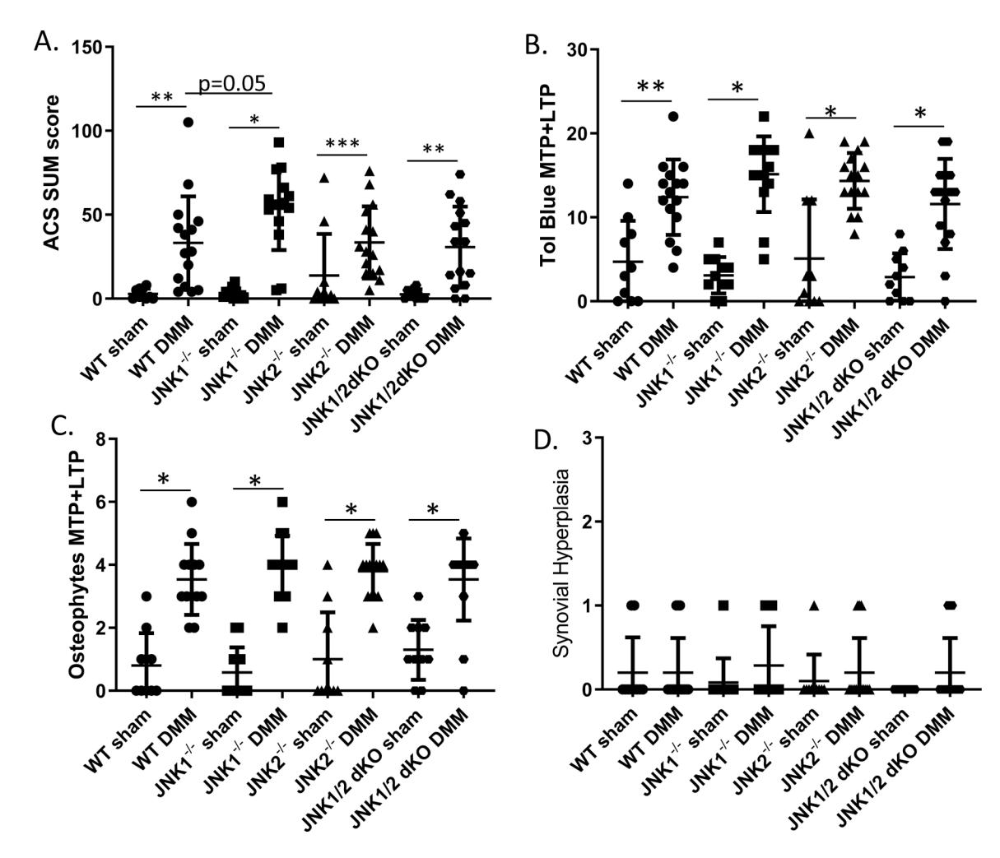
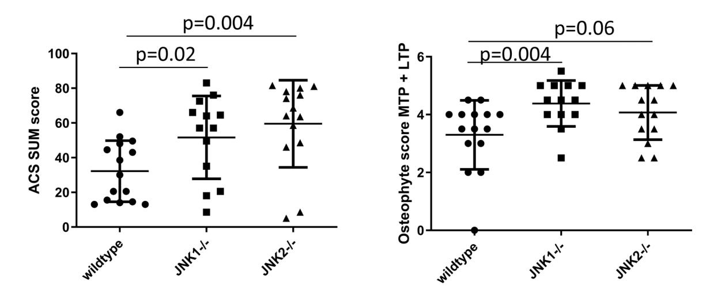
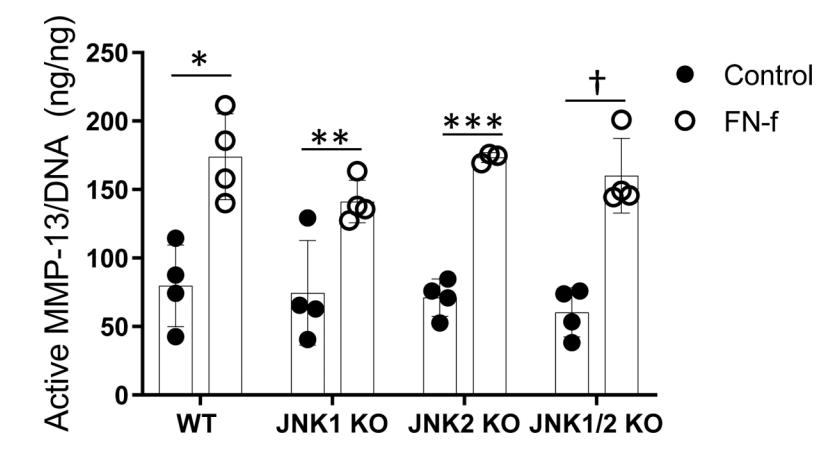
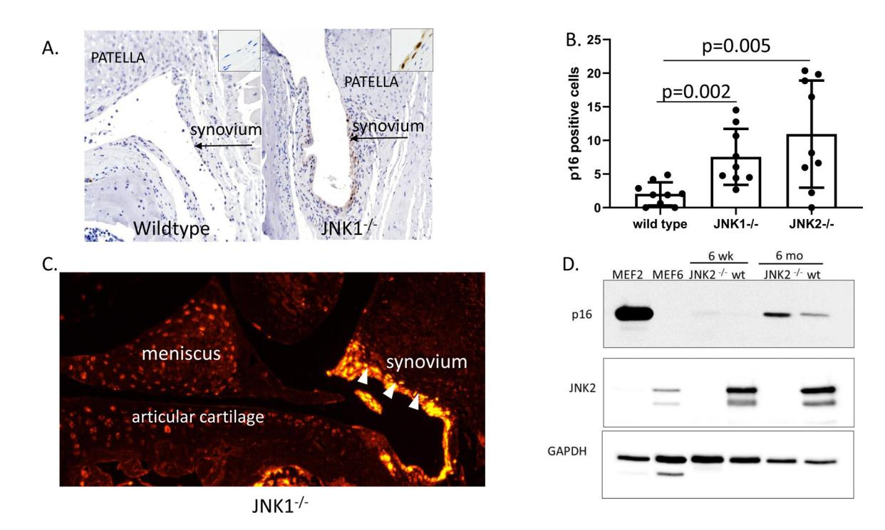

# **HHS Public Access**

Author manuscript Arthritis Rheumatol. Author manuscript; available in PMC 2021 October 01.

Published in final edited form as:

Arthritis Rheumatol. 2020 October ; 72(10): 1679–1688. doi:10.1002/art.41312.

## **Deletion of c-Jun N-terminal Kinase Enhances Senescence in Joint Tissues and Increases the Severity of Age-Related Osteoarthritis in Mice**

**Richard F. Loeser, MD**1,\* , **Kathryn L. Kelley, BS**1, **Alexandra Armstrong, DVM**2, **John A. Collins, PhD**1, **Brian O. Diekman, PhD**3, **Cathy S. Carlson, DVM, PhD**2

1Division of Rheumatology, Allergy and Immunology and the Thurston Arthritis Research Center, University of North Carolina School of Medicine, Chapel Hill, North Carolina;

2Department of Veterinary Clinical Sciences, University of Minnesota College of Veterinary Medicine, St. Paul, Minnesota;

3Joint Department of Biomedical Engineering University of North Carolina School of Medicine, Chapel Hill, North Carolina, and North Carolina State University, Raleigh, North Carolina and the Thurston Arthritis Research Center, University of North Carolina School of Medicine, Chapel Hill, North Carolina.

## **Abstract**

**Objective.—**Determine the role of c-Jun N-terminal kinase (JNK) signaling in the development of osteoarthritis (OA) induced by joint injury and aging in mice.

**Methods.—**Destabilization of the medial meniscus (DMM) or sham surgery was performed on 12 week-old mice and OA evaluated 8 weeks after surgery. Groups included wild type-controls, JNK1 −/−, JNK2 −/−, and JNK1 fl/fl JNK2 −/− aggecan-Cre ERT2 double knockouts. The aging study used wild-type controls, JNK1 −/−, and JNK2 −/− mice evaluated at 18 months of age. Knee joints were evaluated by scoring articular cartilage structure (ACS), toluidine blue staining, osteophytes, synovial hyperplasia, histomorphometry and immunostaining for the senescence marker p16Ink4a . Production of MMP-13 in cartilage explants in response to fibronectin fragments was measured by ELISA.

**Results.—**There were no differences after DMM surgery between wild-type and the JNK knockout groups in ACS, toluidine blue or osteophyte scores and no differences in MMP-13

\*Address correspondence to: Richard F. Loeser, MD, Division of Rheumatology, Allergy and Immunology, and the Thurston Arthritis Research Center, University of North Carolina School of Medicine, Campus Box 7280, Chapel Hill, North Carolina, 27599-7280, USA, richard\_loeser@med.unc.edu.

AUTHOR CONTRIBUTIONS

All authors were involved with drafting the article or revising it critically for important intellectual content and all authors approved the final version to be published. Dr. Loeser had full access to all of the data and takes responsibility for the integrity of the data and the accuracy of the data analysis.

Conflict of interest

Dr. Loeser has received consulting fees from Unity Biotechnology (less than \$2000).

**Study conception and design.** Loeser, Kelley, Carlson

**Acquisition of data.** Loeser, Kelley, Armstrong, Collins, Harper, Carlson

**Analysis and interpretation of data.** Loeser, Armstrong, Diekman, Carlson

production in explants. All three knockout groups had increased subchondral bone thickness and area of cartilage necrosis compared to wild-type mice. Aged JNK knockouts had significantly worse ACS scores compared to the aged wild-type controls (control 32±18, mean±sd; JNK1 −/− 52±24; JNK2 −/− 60±25). JNK1 −/− mice also had higher osteophytes scores. Deletion of JNK resulted in increased p16Ink4a in the synovium and cartilage in older mice.

**Conclusion.—**JNK1 and JNK2 are not required for the development of OA in the mouse DMM model. Deletion of JNK1 or JNK2 is associated with more severe age-related OA and increased cell senescence suggesting JNK may act as a negative regulator of senescence in the joint.

#### **Keywords**

articular cartilage; synovium; aging; cell signaling

## **INTRODUCTION**

The mitogen-activated protein (MAP) kinase families include p38, c-Jun N-terminal kinase (JNK), and extracellular-signal-regulated kinase (ERK). MAP kinases are activated in response to a wide-range of stimuli that include growth factors, cytokines, and other soluble mediators, as well as through interactions of cells with the extracellular matrix and in response to biomechanical and stress stimuli (1). Each of the MAP kinase families consist of multiple isoforms that can exhibit differential downstream effects that are often stimulus and cell-type specific. The JNK family of MAP kinases, also referred to as stress-activated kinases, includes JNK1 (Mapk8), JNK2 (Mapk9), and JNK3 (Mapk10). While JNK3 is primarily expressed in the brain, JNK1 and JNK2 are widely expressed, including in joint tissues (2–5). JNK signaling has been proposed to contribute to both rheumatoid arthritis and osteoarthritis through the activation of pro-inflammatory and matrix degradation pathways in joint tissue cells.

JNK regulates gene expression through phosphorylation and activation of AP-1-related transcription factors that include the Jun family and ATF2. JNK activity is increased in response to phosphorylation by upstream kinases that include mitogen-activated kinase kinase 4 and 7 (6). Proinflammatory cytokines including IL-1, TNF-α and oncostatin 1, as well as fragments of the matrix protein fibronectin, stimulate JNK1 and JNK2 phosphorylation in articular chondrocytes and in synovial fibroblasts leading to increased expression of matrix degrading enzymes (4, 7–9). JNK1 but not JNK2 knockout mice were protected in models of inflammatory arthritis (10, 11). Previous studies have shown increased JNK phosphorylation in human OA cartilage (4, 12) suggesting a potential role for JNK signaling in OA.

Our objective in the present study was to determine the role of JNK signaling in the development of OA in mouse pre-clinical models in order to better define the potential of targeting JNK for slowing disease progression in human OA. We used the destabilization of the medial meniscus (DMM) injury-induced model and also examined naturally occurring age-related OA. Since JNK1 and JNK2 double knock-out is embryonic lethal (2), we examined OA development in the DMM model using wild type controls, JNK1 −/−, JNK2 −/−, and JNK1 fl/fl JNK2 −/−aggrecan-Cre ERT2 mice treated with tamoxifen. The latter mice have a

global deletion of JNK2 with JNK1 deleted in cartilage and inner meniscus where the Acan gene that codes for aggrecan is most highly expressed (13). The use of an inducible Cre driver was critical, as our previous study with JNK1 fl/fl JNK2 −/−Col2-Cre mice demonstrated that the constitutive loss of JNK in tissues where type II collagen is expressed resulted in a severe scoliotic phenotype with impaired development of the annulus fibrosus and abnormal fusion of vertebrae (14). Since there is limited literature examining the potential effects of tamoxifen on development of OA in mice using the DMM model, we included additional groups to compare mice treated with vehicle vs tamoxifen without aggrecan-Cre ERT2 . In order to reduce the number of mice needed for the 18 month aging study, only the JNK1 −/−, JNK2 −/−, and wild type controls were evaluated.

## **METHODS**

#### **Mouse strains.**

All mice used in this study were on a C57BL/6J background. JNK1 −/− (stock# 004319) and JNK2 −/− mice (stock # 004321) were obtained from the Jackson Laboratory (Bar Harbor, ME, USA). Mice harboring floxed JNK1 alleles (JNK1 fl/fl ) were a generous gift from Dr. Roger J. Davis at the University of Massachusetts Medical School (15).

Acan tm1(IRES-cre/ERT2) ("aggrecan-CreERT2") mice were a generous gift from Dr. Benoit de Crombrugghe (University of Texas M.D. Anderson Cancer Center) (13). The JNK1 fl/fl mice were crossed with aggrecan-Cre ERT2 mice to obtain JNK1 fl/flaggrecan-Cre ERT2 mice. The JNK1 fl/fl mice were also crossed with JNK2 −/− mice to obtain JNKfl/+ /JNK2 +/− mice. These mice were then crossed with aggrecan-Cre ERT2 mice in order to obtain JNK1 fl/+aggrecan-Cre ERT2 /JNK2 −/− mice which were finally crossed with the JNK1 fl/fl / JNK2 −/− to obtain JNK1 fl/flaggrecan-Cre ERT2 /JNK2 −/− mice ("JNK1/2 dKO" mice). Mice were genotyped using PCR protocols for the specific strains found on the Jackson Laboratory website or as previously described by Das et al (15). In addition to age-matched wild-type mice, the littermates with the following genotypes were used as controls for the DMM study: JNK1 fl/flaggrecan-Cre ERT2 , JNK1 fl/fl /JNK2 −/−, and JNK1 fl/fl . A total of 221 mice were used in the DMM study. All genotypes used for the DMM studies and numbers of mice in each group are listed in Supplementary Table 1. Mice receiving tamoxifen (Sigma) were administered an intra-peritoneal injection (40mg/kg diluted to10mg/ml in corn oil) once per day for 5 days starting at 10 weeks of age. Controls received a similar amount of corn oil alone.

#### **Mouse OA models.**

For surgically-induced OA, DMM and sham surgeries were performed on one knee in separate groups of mice at the age of 12 weeks, as we have previously described (16, 17). Mice from the different genotypes were randomized to surgical groups (sham or DMM) at the time of surgery. Mice were sacrificed at 8 weeks after surgery, a time point commonly used in DMM studies at which mice have moderately severe OA (18). To study the development of naturally occurring age-related OA, wildtype, JNK1 −/− and JNK2 −/− mice were aged to an average of 18 months (range 17–19 months). Male mice were used for all experiments in order to reduce the total number of mice used for this study and due to previous reports suggesting they are more susceptible to DMM-induced OA than female

mice (19). The number of mice per experimental group was based on a power calculation using data from a previously published DMM and sham control experiment from our group that used 12-week old male C57BL/6J mice (16). We found that a sample size of 12 mice per group would provide greater than 80% power to detect at least a 50% difference between

groups in articular cartilage structure (ACS) scores (our primary histologic outcome measure). In order to account for the possibility of loss of mice due to death before study completion, we used an n of 15 for the DMM groups and for all aging groups. Because there is little to no histologic OA observed in sham surgery controls, we utilized 9–10 mice for each sham group. One mouse (JNK1 −/−) in the DMM study died before necropsy and was not analyzed; in the aging study two JNK1 −/− and one JNK2 −/− mice died prior to 17 months of age and were not analyzed.

Mouse colonies were maintained in a standard specific pathogen-free facility at University of North Carolina at Chapel Hill. Mice were housed with an average of 3–4 mice per cage and had access to water and food ad libitum. All animal experiments were approved by the University of North Carolina Animal Care and Use Committee and followed the recommendations from the National Institutes of Health Guide for the Care and Use of Laboratory Animals.

#### **Histological assessment of OA.**

Hindlimbs, collected at the University of North Carolina (UNC), were dissected at sacrifice, fixed and processed for histology as we have described (16, 17). The histological evaluation was performed at the University of Minnesota (UMN). To ensure blinding, an ID number for each mouse generated at UNC was the only information sent to UMN. When the tissue was received at UMN, the samples were each assigned a new histological number and a record was maintained to match the UNC mouse ID number with the UMN ID number. The sectioning and scoring were then performed completely blinded to group assignment with each sample identified only by the UMD ID number. Excel files with the histological data and ID numbers were then sent back to UNC and only then was the data unblinded for statistical analysis.

Joints were embedded in paraffin and 8–12 coronal sections of 4–5 μm thickness were collected throughout the depth of the joint for histological assessment. Six coronal sections collected at 80–120 um intervals were stained with hematoxylin & eosin and a single midcoronal section was stained with toluidine blue for histologic evaluation. Toluidine blue scoring is an ancillary semiquantitative method of scoring the articular cartilage based on loss of toluidine blue staining from the articular cartilage, similar to loss of Safranin O staining (20). This loss of staining corresponds to proteoglycan loss, which is thought to be an early indicator of OA preceding changes to the articular cartilage structure (fibrillations, fissures, loss of cartilage). ACS and toluidine blue scoring (0–12 scale), histomorphometry, and scoring of osteophytes (0–3) and synovial hyperplasia (0–3) were performed as previously described (17, 20). The lesions were most evident on the medial tibial plateau (MTP) followed by the lateral tibial plateau (LTP). Both were used for ACS, toluidine blue, osteophyte and synovial scoring. Histomorphometric measurements of thickness and area of articular cartilage, calcified cartilage, and subchondral bone, as well as the % chondrocyte

cell death (area composed of dead chondrocytes by total area of cartilage) were taken on a midcoronal section of the MTP. Six sections from each joint were used for ACS scoring and data is present as sum scores of the six sections from the MTP and LTP. The other scores were measured on the mid-coronal section of the MTP and LTP where the lesions were noted to be most severe. For the aging study, both the right and left knees were scored for each animal and the average of the two sides used for further analysis while for the DMM and sham operated mice only the surgical side was evaluated. All sections were initially scored by one individual who had been trained to use the grading methodologies. Any sections requiring a second opinion, as well as a random subset of all of the sections, were graded by Dr. Cathy Carlson. Differences in scoring between the two readers were minimal and, when present, a consensus was reached.

#### **Immunostaining.**

Immunohistochemical staining for p16Ink4A was performed on mid-coronal sections selected from wild-type, JNK1 −/−, and JNK2 −/− mice that were also used for histologic assessment of OA. This included 18-month-old mice from the aging study (n=9 for each of the 3 experimental groups) and 20 week-old mice that had DMM or sham surgery at 12 weeks of age (n=3 wild-type sham, 4 wild-type DMM; 4 JNK1 −/− sham, 4 JNK1 −/− DMM; 4 JNK2 −/− sham, 6 JNK2 −/− DMM; 4 JNK1/2 dKO sham, 4 JNK1/2 dKO DMM). De-paraffinized and rehydrated sections underwent antigen retrieval in citrate buffer followed by blocking with 3% H2O2 (Fisher Scientific) and Protein Block (Dako). Primary p16Ink4A antibody was from Abcam (Cambridge, MA; ab211542) diluted in antibody diluent (Dako) to a final concentration of 2.8 μg/ml and incubated on the sections for 30 minutes at room temperature followed by EnVision anti-rabbit secondary antibody (Dako) developed with the DAB chromagen (Dako). The sections were counterstained in Mayer's Hematoxylin (Sigma). Slides were randomized and coded to ensure blinding during analysis. Immunopositive synovial cells and total synovial cells (immunopositive and immunonegative) were counted at 200x magnification and recorded and summed for the medial femorotibial, the lateral femorotibial, and the patellofemoral compartments. Photomicrographs were captured with a Nikon DS-Ri2 camera with Nikon Eclipse Ci microscope, using the NIS Elements D software (5.20.00, 64-bit, Nikon).

For immunofluorescence, de-paraffinized and rehydrated sections underwent mild heatinduced epitope retrieval in citrate buffer, followed by blocking with 3% H2O2 (Fisher Scientific) and blocking of aldehydes with glycine followed by blocking with goat blocking buffer (1% BSA, 4% NGS, 0.05% Tween in TBS). The same primary p16Ink4A antibody from Abcam was used (Cambridge, MA; ab211542) at a concentration of 1.4 μg/ml in goat blocking buffer for 30 minutes, followed by incubation (30 minutes; room temperature) with a secondary goat anti-rabbit IgG HRP polymer antibody (RMR622 H, Biocare Medical, ready to use). Following incubation, slides were stained with 1:150 Opal 570 (TRITC Channel, Perkin Elmer) in 1x amplification diluent, followed by counterstaining with DAPI (Thermofisher). Immunofluorescence slides were viewed with a TRITC filter using a microscope with 300ms exposure and photomicrographs were obtained with a Nikon Eclipse E800 microscope, Nikon DS-Ri2 camera, and NIS Elements D software (5.02.00, 64-bit, Nikon).

#### **Cartilage explant isolation, protein extraction and immunoblotting.**

For stimulation with fibronectin fragments, femoral caps were removed with a forceps from the femoral head of male or female mice sacrificed at 3–5 weeks of age. Femoral caps were placed in 96 well plates (one cap per well) and cultured as explants for 48 hours in 100 μl/ well of DMEM/F12 media containing 10% FBS to allow for recovery and then switched to serum-free media overnight. Explants were then treated for 48 hours with 1μM recombinant endotoxin free fibronectin fragment that had been prepared as previously described (21)or PBS as control. Media was harvested and active MMP13 in the conditioned media was quantified using an Active MMP-13 Fluorescent Assay (R&D systems #F13M00) following the manufacturers' instructions. Active MMP13 released into the media was normalized to DNA content of the explants. For DNA analysis, the femoral caps were incubated in papain enzyme digestion buffer (20 ug/ml) for 24 hours at 65°C, boiled to inactivate the enzyme and then DNA was quantified using the Quant-iT PicoGreen dsDNA Assay Kit according to manufacturers' instructions (Thermofisher Scientific).

For measurement of p16Ink4a, femoral head cartilage was removed from 6 week and 6 month old mice. Soluble proteins were extracted in cell lysis buffer by homogenization using ceramic bead tubes and a Precellys homogenization device (Bertin Technologies, Rockville, MD, USA) as we have described in detail (14). After homogenization, samples were centrifuged to pellet insoluble material and then the protein was prepared for immunoblotting as previously described (22, 23). Lysates were also generated from mouse embryonic fibroblast cultures established from p16 Ink4a intact (MEF2) and p16 Ink4a / p19 Arf−/− germline knockout (MEF6) mice. These MEF samples had previously served as positive and negative controls for assessing p16Ink4a by immunoblot (24). The immunoblots were stained with a total protein stain (Thermo Fisher Scientific, #24580 Pierce reversible protein stain) to check for equal protein loading and probed with an antibody against JNK2 at a concentration of 0.278 μg/ml (Cell Signaling Technology, Danvers, MA; #9258) or for p16Ink4a at 0.56 μg/ml (Abcam, Cambridge, MA; ab211542) and visualized by chemiluminescence using an Azure Biosystems c600 imager.

#### **Statistical analysis.**

The data were analyzed and graphs generated using GraphPad Prism 8.12 (La Jolla, CA, USA). The data were checked for normal distribution using the D'Agostino and Pearson normality test. Normally distributed data was analyzed using ordinary one-way ANOVA with Sidak's multiple comparison test or student's t test as indicated in the figure legends. For data without a normal distribution, Mann-Whitney tests were used when comparing two groups and the Kruskal-Wallis test for comparing 3 or more groups with Dunn's multiple comparisons test to account for multiple comparisons.

## **RESULTS**

#### **OA severity after DMM surgery in JNK knockouts and controls.**

Compared to sham controls, mice in each experimental group that received DMM surgery developed histological evidence of OA that included increased ACS and toluidine blue scores as well as osteophytes. The results for the wild-type, JNK1 −/−, JNK2 −/−, and JNK1/2

dKO mice are shown in Figure 1 while data for the additional groups that controlled for potential effects of tamoxifen injection or the aggrecan-Cre ERT2 allele are shown in Supplementary Figure 1. As noted in previous studies examining joints in the DMM model at 8 weeks after surgery, little to no synovitis was observed in any group. There were no differences in ACS (Figure 1A), toluidine blue (Figure 1B), osteophyte (Figure 1C) or synovial scores (Figure 1D) when the JNK1 −/−, JNK2 −/−, and JNK1/2 dKO DMM groups were compared to the wild-type control DMM group. The exception was a borderline significant (p=0.05) increase in the ACS sum scores in the JNK1 −/− mice (53.5±24.6, mean ±SD vs control 33.1±27.8). There was no effect of tamoxifen injection or the presence of the aggrecan-Cre ERT2 allele on any of the measures (Supplementary Figure 1).

Detailed histomorphometric analysis was performed on the MTP, which is the site of the most severe lesions in the DMM model. For this analysis, we focused on differences between the wild-type control DMM mice and the JNK1 −/−, JNK2 −/−, and JNK1/2 dKO DMM mice (Table 1). Compared to wild-type, the JNK2 −/− (p=0.04) and JNK1/2 dKO (p=0.03) had significantly greater articular cartilage thickness but not area. JNK1 −/− (p<0.0001), JNK2 −/− (p=0.0008), and JNK1/2 dKO (p=0.004) had significantly greater subchondral bone thickness than wild-types while only the JNK1 −/− (p<0.0001) had significantly greater bone area. Calcified cartilage area was significantly reduced in the JNK1 −/− (p=0.0005) and the JNK2 −/− (p=0.0008) and calcified cartilage thickness was significantly reduced in the JNK1/2dKO mice (p=0.0001) compared to wild-types. The % chondrocyte cell death was significantly greater in all three knockout groups compared to the wild-type controls.

#### **Development of age-related OA in JNK knockouts and controls.**

The ACS scores at 18-months of age were higher in the JNK1 and JNK2 knockouts compared to the age-matched wild type mice (Figure 2A). The JNK2 −/− mice had over 2 fold higher ACS scores (p=0.004) while the difference noted in the mice with JNK1 deletion was just under 2-fold higher compared to wild type (p=0.02). Osteophyte scores (Figure 2B) were also higher in the JNK knockouts with significance reached for the JNK1 −/− mice (p=0.004) and a trend for the JNK2 −/− mice (p=0.06). Histomorphometric analysis (Table 2) was consistent with the cartilage damage measured by the ACS scores with the JNK2 −/− mice having significantly less articular cartilage area (p=0.01) and thickness (p=0.007) compared to the wild type mice. The JNK2 −/− mice also had increased subchondral bone thickness compared to wild type controls (p=0.03). Both JNK1 −/− mice (p=0.01) and JNK2 −/− mice (p=0.01) had significantly less calcified cartilage area than the wild type mice. JNK1 −/− had less calcified cartilage thickness (p=0.01) and also had lower % chondrocyte cell death (p=0.02).

## **Effects of JNK deletion on chondrocyte production of MMP-13 in response to fibronectin fragments.**

A previous study reported that cartilage from mice with JNK2 deleted had a significant reduction in aggrecan degradation in response to IL-1 stimulation, possibly due to decreased expression of Adamts4 but effects on MMP expression were not determined (25). Because MMP-13 plays a central role in collagen degradation in OA, we measured the production of

active MMP-13 in response to fibronectin fragments used as a catabolic stimulus to model OA in vitro. The cartilage explants from wild-type mice exhibited an approximately twofold increase in active MMP-13 in response to fibronectin fragments which was similar in the JNK1 −/−, JNK2 −/−, and JNK1/2 dKO mice (Figure 3).

#### **Increased senescence in cartilage and synovium after JNK deletion.**

In order to determine a potential mechanism for the increased age-related OA that was particularly severe in the JNK−/− mice, we examined cell senescence. A previous study using murine embryonic fibroblasts isolated from JNK knockouts had revealed evidence that JNK signaling may act as a negative regulator of senescence (15) and studies have suggested a role for senescence of joint tissue cells in the development of OA (26, 27). Increased expression of p16Ink4a is considered to be a very reliable marker of cell senescence, including in joint tissues (27, 28). Immunohistochemistry revealed p16Ink4a positive cells in the synovium from 18-month old JNK knockouts compared with little to no positive cells in the 18 month-old wild type mice (Figure 4A). Positive cells were significantly more abundant in both the in JNK1 −/− mice and the JNK2 −/− mice compared to wild-type controls (Figure 4B). A similar increase in p16Ink4a immunostaining was not seen in the younger mice used in the DMM study (Supplementary Figure 2). We could not detect p16Ink4a in chondrocytes or meniscal cells by immunohistochemistry or by immunofluorescence which should be more sensitive (Figure 4C). It is possible that the p16Ink4a antigen is more difficult to detect in cartilage than synovium or that it is present at levels too low for immunohistochemistry or immunofluorescence. Therefore, we immunoblotted lysates obtained from cartilage removed from wild type and JNK2 knockouts that were 6 weeks or 6 months of age and this revealed increased p16Ink4a in cartilage from JNK2 −/− mice at 6 months (Figure 4D). This suggests that either the antigen was masked in the cartilage, limiting detection by histologic techniques, or that immunoblotting cartilage lysates is more sensitive than immunocytochemistry for detecting senescence using p16Ink4a as a marker.

## **DISCUSSION**

When this study was initiated, our working hypothesis was that deletion of JNK1 and/or JNK2 would reduce the severity of OA in mice. Somewhat surprisingly, we found that, compared to controls, deletion of JNK1, JNK2 or combined JNK1/2 deletion did not protect mice from developing OA using the DMM model and that age-related OA was worse in the JNK1 and JNK2 knockouts. The increased severity of age-associated OA was associated with increased numbers of senescent cells, particularly in the synovial tissue, that could have contributed to the increased OA severity. There is a growing body of literature demonstrating that senescent cells contribute to the development of multiple age-related diseases (29). The targeted removal of senescent cells in mice reduces the severity of injury-induced OA and age-related OA, suggesting that cell senescence plays a key role in the development of OA (27). In large part, this appears to be due to senescent cells producing a variety of proinflammatory mediators and matrix degrading enzymes, which has been named the senescence-associated secretory phenotype or SASP (29, 30). Many of the SASP factors including IL-1, IL-6, HMGB1, MCP-1, and MMP-3, among others, are factors found in OA joints and have been implicated in promoting OA pathology (26).

Contrary to our results, a study published after ours was initiated (25), demonstrated reduced cartilage damage, measured using the OARSI score, in young JNK2 −/− mice at 4, 8 and 12 weeks after surgery using the same DMM model and same vendor for the JNK2 −/− mice as utilized in the present study. JNK1 and combined JNK1/2 deletion were not investigated. Similar to our results, osteophyte formation was not reduced in the JNK2 knockouts. In the present study, we also included histomorphometric analysis of articular cartilage, calcified cartilage and subchondral bone. We noted increased subchondral bone thickness as well as chondrocyte cell death, both characteristics of OA, in all three knockouts compared to the wild-type controls, indicating that certain features of OA were more severe in the knockouts. We also noted increased cartilage thickness by histomorphometry in the JNK deficient mice without an increase in cartilage area which could represent cartilage swelling as an early feature of OA, although this is not certain.

Other differences between the studies that could have resulted in a different OA outcome included the age of the mice at the time of DMM surgery (10 weeks-old in the previous study vs 12 weeks-old in the present study), the mouse facilities where the studies were conducted, and the numbers of mice utilized. In terms of age, 12 weeks is closer to the age of skeletal maturity for C57BL/6 mice which occurs between 3–6 months of age (31) but it is not clear if a 2 week difference in age would be sufficient to explain the different cartilage outcome. Given the finding that the microbiome contributes to DMM-induced OA (32) and findings that the microbiome of mice and the resulting phenotypes can be quite different when different facilities have been compared (33), it is possible that differences in the microbiome could explain the differing results. Another difference between the studies is that the prior study used cytokine stimulation of aggrecan degradation as an in vitro readout of the effects of JNK loss on cartilage degradation while we used FN-f stimulation of active MMP-13 production and did not see an effect. Finally, the present study used much larger experimental groups (n=15), compared to 4–6 mice per group in the prior study, in order to increase power and reduce the chances of a type 1 error.

JNK deficient mice have been studied in models of inflammatory arthritis with mixed results. JNK2 deficient mice were not protected in the collagen-induced arthritis (CIA) model (10, 11) and had worse disease than wild-type mice in the serum transfer model where JNK1 knockouts were protected (11). However, JNK1 deficient mice were not protected in the TNFα transgenic overexpression model of inflammatory arthritis (34). IL-1β deficient mice have given conflicting results in OA studies. Two independent labs using surgical models of OA (MCL transection plus partial medial meniscectomy or partial medial meniscectomy alone) reported IL-1β deletion resulted in worse disease (35, 36). In contrast, in a lab that used the DMM model, IL-1β deletion was noted to be protective (37). The latter study attempted to control for genetic background when comparing to the other OA studies although the different surgical models may explain the differences in OA outcomes. These studies reinforce the need to replicate results within a model and examine different models before solid conclusions about the role of a particular pathway in arthritis can be made.

Our finding of an increase in the senescence marker p16Ink4a in the JNK knockouts suggests that JNK signaling may prevent premature senescence in joint tissue cells. By

immunocytochemistry this was most apparent in the synovium of the 18 month-old mice, although increased p16Ink4a was noted by immunoblotting proteins from cartilage extracts from 6 month old mice. Previously, we showed that p16Ink4a transcription increased with age in mouse and human chondrocytes and was associated with expression of several SASP factors making it a good biomarker for cell senescence in joint tissues, although p16Ink4a itself was not required for the development of OA (28). A role for JNK in joint tissue senescence is consistent with findings in murine embryonic fibroblasts isolated from JNK knockouts that found JNK deficiency resulted in p53-dependent senescence (15) and studies in human tumor cells and embryonic fibroblasts showing chemical inhibition of JNK signaling promoted senescence (38). Likewise, increased senescence has been observed in fibroblasts after deletion of the JNK substrate and AP-1 family member JunD (39). To our knowledge, the present study is the first to suggest a potential role for JNK in preventing cell senescence in articular joints.

The observation of increased chondrocyte death in the JNK deficient mice in the DMM study suggests JNK might have additional roles in maintaining cartilage homeostasis. Depending on the cell type and experimental conditions, JNK signaling has been found to either promote cell survival or cell death (6). We previously published that, under conditions of oxidative stress in cultured human chondrocytes, JNK is inactivated while the p38 MAP kinase remains active (40). In further studies, we demonstrated that prolonged oxidative stress induced chondrocyte death and this was blocked when cells were treated with a p38 inhibitor (22). Under the same conditions, JNK inhibition resulted in increased cell death (unpublished observation) suggesting the balance in p38 and JNK signaling may be important in chondrocyte survival under certain conditions.

We utilized a number of different control groups in the DMM experiment in order to determine if there was any effect of tamoxifen or of the aggrecanCre ERT2 allele on OA severity in the DMM model but did not detect any differences in OA outcomes when compared to the other sham and DMM groups. We also compared mice with germ-line JNK1 deletion to those with aggrecanCre ERT2 -induced deletion using floxed JNK1 mice but did neither group was protected from DMM-induced OA.

There are several limitations to this study. OA in the DMM study was evaluated at a single 8 -week time point and so it is possible that differences between wildtype and JNK deficient mice related to early OA may have been present and then lost by 8 weeks. The use of any single marker of senescence is limited because the complex phenotype is best analyzed by a range of markers that detect cell cycle withdrawal, deregulated metabolism, macromolecular damage, and altered secretory phenotype (e.g. SASP) (41). One challenge is that with the exception of p16Ink4a, these features of senescence are not unique to senescent cells (42). Thus, the current work establishes the presence of senescent cells in joint tissues using a reliable biomarker of in vivo senescence and future studies will be performed to investigate the nuance of the particular senescent state induced by JNK loss.

In summary, we did not find evidence that deletion of JNK1, JNK2, or both JNK isoforms protected mice from developing OA in the DMM model but rather some OA findings, including subchondral bone thickness and chondrocyte cell death, were worse. Further,

deletion of either JNK isoform resulted in more severe age-related OA that was associated with an increase in cell senescence. These findings suggest that some level of JNK signaling may be required for joint tissue homeostasis and to prevent cell senescence calling into question inhibition of the JNK pathway as a therapeutic target for OA. It is still possible that timed JNK inhibition (rather than complete JNK loss) or inhibition in a specific OA phenotype might be useful. Combined with our previous study demonstrating severe scoliosis in mice with Col2Cre-driven deletion of JNK1 in JNK2 deficient mice (14), it appears that JNK signaling contributes to the normal development and function of musculoskeletal tissues in both the spine and articular joints.

## **Supplementary Material**

Refer to Web version on PubMed Central for supplementary material.

## **ACKNOWLEDGEMENTS**

We thank Lindsey Harper and Paul Overn for technical assistance with histology.

Supported by the National Institute of Arthritis, Musculoskeletal and Skin Diseases (AR049003) and the National Institute on Aging (AG044034).

## **REFERENCES**

- 1. Beier F, Loeser RF. Biology and pathology of Rho GTPase, PI-3 kinase-Akt, and MAP kinase signaling pathways in chondrocytes. J Cell Biochem. 2010;110 (3):573–80. [PubMed: 20512918]
- 2. Kuan CY, Yang DD, Samanta Roy DR, Davis RJ, Rakic P, Flavell RA. The Jnk1 and Jnk2 protein kinases are required for regional specific apoptosis during early brain development. Neuron. 1999;22 (4):667–76. [PubMed: 10230788]
- 3. Bode AM, Dong Z. The functional contrariety of JNK. Mol Carcinog. 2007;46 (8):591–8. [PubMed: 17538955]
- 4. Clancy R, Rediske J, Koehne C, Stoyanovsky D, Amin A, Attur M, et al. Activation of stressactivated protein kinase in osteoarthritic cartilage: evidence for nitric oxide dependence. Osteoarthritis Cartilage. 2001;9 (4):294–9. [PubMed: 11399092]
- 5. Loeser RF, Erickson EA, Long DL. Mitogen-activated protein kinases as therapeutic targets in osteoarthritis. Curr Opin Rheumatol. 2008;20 (5):581–6. [PubMed: 18698181]
- 6. Weston CR, Davis RJ. The JNK signal transduction pathway. Curr Opin Cell Bio. 2007;19 (2):142– 9. [PubMed: 17303404]
- 7. Greene MA, Loeser RF. Function of the chondrocyte PI-3 kinase-Akt signaling pathway is stimulus dependent. Osteoarthritis Cartilage. 2015;23:949–56. [PubMed: 25659655]
- 8. Ismail HM, Yamamoto K, Vincent TL, Nagase H, Troeberg L, Saklatvala J. Interleukin 1 acts via cjun N-terminal kinase-2 signalling pathway to induce aggrecan degradation by human chondrocytes. Arthritis Rheumatol. 2015;67:1826–36. [PubMed: 25776267]
- 9. Han Z, Boyle DL, Chang L, Bennett B, Karin M, Yang L, et al. c-Jun N-terminal kinase is required for metalloproteinase expression and joint destruction in inflammatory arthritis. J Clin Invest. 2001;108 (1):73–81. [PubMed: 11435459]
- 10. Han Z, Chang L, Yamanishi Y, Karin M, Firestein GS. Joint damage and inflammation in c-Jun Nterminal kinase 2 knockout mice with passive murine collagen-induced arthritis. Arthritis Rheum. 2002;46 (3):818–23. [PubMed: 11920420]
- 11. Denninger K, Rasmussen S, Larsen JM, Orskov C, Seier Poulsen S, Sorensen P, et al. JNK1, but not JNK2, is required in two mechanistically distinct models of inflammatory arthritis. Am J Pathol. 2011;179 (4):1884–93. [PubMed: 21839715]

- 12. Fan Z, Soder S, Oehler S, Fundel K, Aigner T. Activation of interleukin-1 signaling cascades in normal and osteoarthritic articular cartilage. Am J Pathol. 2007;171(3):938–46. [PubMed: 17640966]
- 13. Henry SP, Jang CW, Deng JM, Zhang Z, Behringer RR, de Crombrugghe B. Generation of aggrecan-CreERT2 knockin mice for inducible Cre activity in adult cartilage. Genesis. 2009;00:1– 10.
- 14. Ulici V, Kelley KL, Longobardi L, McNulty MA, Livingston EW, Bateman TA, et al. Impaired annulus fibrosus development and vertebral fusion cause severe scoliosis in mice with deficiency of c-Jun NH2-Terminal Kinases 1 and 2. Am J Pathol. 2019;189 (4):868–85. [PubMed: 30664861]
- 15. Das M, Jiang F, Sluss HK, Zhang C, Shokat KM, Flavell RA, et al. Suppression of p53-dependent senescence by the JNK signal transduction pathway. Proc Natl Acad Sci U S A. 2007;104(40):15759–64. [PubMed: 17893331]
- 16. Loeser RF, Olex A, McNulty MA, Carlson CS, Callahan M, Ferguson C, et al. Microarray analysis reveals age-related differences in gene expression during the development of osteoarthritis in mice. Arthritis Rheum. 2012;64 (3):705–17. [PubMed: 21972019]
- 17. Rowe MA, Harper LR, McNulty MA, Lau AG, Carlson CS, Leng L, et al. Deletion of macrophage migration inhibitory factor reduces severity of osteoarthritis in aged mice. Arthritis Rheumatol. 2017;69:352–61. [PubMed: 27564840]
- 18. Loeser RF, Olex AL, McNulty MA, Carlson CS, Callahan M, Ferguson C, et al. Disease progression and phasic changes in gene expression in a mouse model of osteoarthritis. PLoS One. 2013;8 (1):e54633. [PubMed: 23382930]
- 19. Ma HL, Blanchet TJ, Peluso D, Hopkins B, Morris EA, Glasson SS. Osteoarthritis severity is sex dependent in a surgical mouse model. Osteoarthritis Cartilage. 2007;15 (6):695–700. [PubMed: 17207643]
- 20. McNulty MA, Loeser RF, Davey C, Callahan MF, Ferguson CM, Carlson CS A comprehensive histological assessment of osteoarthritis lesions in mice. Cartilage. 2011;2:354–63. [PubMed: 26069594]
- 21. Wood ST, Long DL, Reisz JA, Yammani RR, Burke EA, Klomsiri C, et al. Cysteine-mediated redox regulation of cell signaling in chondrocytes stimulated with fibronectin fragments. Arthritis Rheumatol. 2016;68 (1):117–26. [PubMed: 26314228]
- 22. Collins JA, Wood ST, Nelson KJ, Rowe MA, Carlson CS, Chubinskaya S, et al. Oxidative stress promotes peroxiredoxin hyperoxidation and attenuates pro-survival signalling in aging chondrocytes. J Biol Chem. 2016;291:6641–54. [PubMed: 26797130]
- 23. Del Carlo M, Jr., Loeser RF. Nitric oxide--mediated chondrocyte cell death requires the generation of additional reactive oxygen species. Arthritis Rheum. 2002;46 (2):394–403. [PubMed: 11840442]
- 24. Sessions GA, Copp ME, Liu JY, Sinkler MA, D'Costa S, Diekman BO. Controlled induction and targeted elimination of p16(INK4a)-expressing chondrocytes in cartilage explant culture. FASEB J. 2019;33 (11):12364–73. [PubMed: 31408372]
- 25. Ismail HM, Miotla-Zarebska J, Troeberg L, Tang X, Stott B, Yamamoto K, et al. Brief Report: JNK-2 Controls Aggrecan Degradation in Murine Articular Cartilage and the Development of Experimental Osteoarthritis. Arthritis Rheumatol. 2016;68 (5):1165–71. [PubMed: 26663140]
- 26. Loeser RF, Collins JA, Diekman BO. Ageing and the pathogenesis of osteoarthritis. Nature Rev Rheumatol. 2016;12:412–20. [PubMed: 27192932]
- 27. Jeon OH, Kim C, Laberge RM, Demaria M, Rathod S, Vasserot AP, et al. Local clearance of senescent cells attenuates the development of post-traumatic osteoarthritis and creates a proregenerative environment. Nat Med. 2017;23 (6):775–81. [PubMed: 28436958]
- 28. Diekman BO, Sessions GA, Collins JA, Knecht AK, Strum SL, Mitin NK, et al. Expression of p16(INK)(4a) is a biomarker of chondrocyte aging but does not cause osteoarthritis. Aging Cell. 2018:e12771. [PubMed: 29744983]
- 29. Herranz N, Gil J. Mechanisms and functions of cellular senescence. The Journal of Clinical Investigation. 2018;128(4):1238–46. [PubMed: 29608137]
- 30. Jeon OH, David N, Campisi J, Elisseeff JH. Senescent cells and osteoarthritis: a painful connection. J Clin Invest. 2018;128 (4):1229–37. [PubMed: 29608139]

- 31. Somerville JM, Aspden RM, Armour KE, Armour KJ, Reid DM. Growth of C57BL/6 mice and the material and mechanical properties of cortical bone from the tibia. Calcif Tissue Int. 2004;74 (5):469–75. [PubMed: 14961209]
- 32. Ulici V, Kelley KL, Azcarate-Peril MA, Cleveland RJ, Sartor RB, Schwartz TA, et al. Osteoarthritis induced by destabilization of the medial meniscus is reduced in germ-free mice. Osteoarthritis Cartilage. 2018;26:1098–109. [PubMed: 29857156]
- 33. Franklin CL, Ericsson AC. Microbiota and reproducibility of rodent models. Lab Anim (NY). 2017;46(4):114–22. [PubMed: 28328896]
- 34. Koller M, Hayer S, Redlich K, Ricci R, David JP, Steiner G, et al. JNK1 is not essential for TNFmediated joint disease. Arthritis Res Ther. 2005;7(1):R166–73. [PubMed: 15642137]
- 35. Clements KM, Price JS, Chambers MG, Visco DM, Poole AR, Mason RM. Gene deletion of either interleukin-1beta, interleukin-1beta-converting enzyme, inducible nitric oxide synthase, or stromelysin 1 accelerates the development of knee osteoarthritis in mice after surgical transection of the medial collateral ligament and partial medial meniscectomy. Arthritis Rheum. 2003;48(12):3452–63. [PubMed: 14673996]
- 36. Nasi S, Ea HK, So A, Busso N. Revisiting the role of interleukin-1 pathway in osteoarthritis: Interleukin-1alpha and −1beta, and NLRP3 inflammasome are not involved in the pathological features of the murine menisectomy model of osteoarthritis. Front Pharmacol. 2017;8:282. [PubMed: 28659793]
- 37. Glasson SS. In vivo osteoarthritis target validation utilizing genetically-modified mice. Curr Drug Targets. 2007;8(2):367–76. [PubMed: 17305514]
- 38. Lee JJ, Lee JH, Ko YG, Hong SI, Lee JS. Prevention of premature senescence requires JNK regulation of Bcl-2 and reactive oxygen species. Oncogene. 2010;29 (4):561–75. [PubMed: 19855432]
- 39. Weitzman JB, Fiette L, Matsuo K, Yaniv M. JunD protects cells from p53-dependent senescence and apoptosis. Mol Cell. 2000;6 (5):1109–19. [PubMed: 11106750]
- 40. Nelson KJ, Bolduc JA, Wu H, Collins JA, Burke EA, Reisz JA, et al. H2O2 oxidation of cysteine residues in c-Jun N-terminal kinase 2 (JNK2) contributes to redox regulation in human articular chondrocytes. J Biol Chem. 2018;293 (42):16376–89. [PubMed: 30190325]
- 41. Gorgoulis V, Adams PD, Alimonti A, Bennett DC, Bischof O, Bishop C, et al. Cellular Senescence: Defining a Path Forward. Cell. 2019;179 (4):813–27. [PubMed: 31675495]
- 42. Sharpless NE, Sherr CJ. Forging a signature of in vivo senescence. Nature Rev Cancer. 2015;15 (7):397–408. [PubMed: 26105537]

Loeser et al. Page 14

## **Figure 1.**

Effects of JNK deletion on histologic measures of OA after destabilization of the medial meniscus (DMM). JNK1 −/−, JNK2 −/−, JNK1/2 dKO, and wild-type (WT) control mice underwent DMM or sham control surgery at 12 weeks of age. Eight weeks after surgery the mice were sacrificed and the operated joints evaluated histologically. **A**, Articular cartilage structure (ACS) scores performed on the medial (MTP) and lateral (LTP) tibial plateus from six sections per joint were summed. **B**, Toludine (Tol) blue staining was scored on the MTP and LTP using a mid-coronal section from each joint. **C**, Osteophytes were scored on the MTP and LTP from a mid-coronal section. **D**, Synovial hyperplasia was scored on the medial side of a mid-coronal section from each joint. Numbers of mice in each group are provided in Supplementary Table 1. Results shown are mean ± standard deviation.\*p<0.0001, \*\*p<0.001, \*\*\*p<0.01 by Mann-Whitney test comparing sham to DMM within each genotype and Kruskal Wallis test adjusted for multiple comparisons of WT DMM to each JNK knockout DMM group.

## **Figure 2.**

Effects of JNK deletion on histologic measures of OA in 18 month-old mice. JNK1 −/−, JNK2 −/− and wild-type (WT) mice were evaluated. **A**, Articular cartilage structure (ACS) scores performed on the medial (MTP) and lateral (LTP) tibial plateus from six sections per joint were summed. **B**, Osteophytes were scored on the MTP and LTP from a mid-coronal section. Results shown are mean ± standard deviation and analysis by Mann-Whitney test comparing WT controls to each genotype.

## **Figure 3.**

Fibronectin fragment (FN-f) stimulation of active MMP-13 in cultured explants from wildtype (WT) and JNK knockout mice. Explants harvested as femoral caps were stimulated in serum-free conditions with 1μM FN-f for 48 hours. Conditioned media was removed and assayed for active MMP-13 using an activity-based ELISA. Results shown are mean ± standard deviation. \*p=0.005, \*\*p=0.02, \*\*\*p<0.0001, †p<0.001 by paired t-test comparing control to FN-f stimulation for each genotype.

## **Figure 4.**

Effects of JNK deletion on p16Ink4a as a marker of cell senescence in joint tissues. **A**, Representative sections of immunohistochemical staining of patellofemoral sections from a wild-type and a JNK1 −/− mouse. 100x magnification. Insets 400x magnification. Brown immunostaining is seen in the synovial tissue of the JNK1 −/− but not the wild-type mouse. **B**, The number of cells positive for p16Ink4a in the synovium were counted for n=9 mice per genotype. Results shown are mean±standard deviation and analysis by unpaired t-tests comparing the wild-type control to each genotype. **C**, Representative result of immunofluorescent staining for p16Ink4a in a tibiofemoral section of a JNK1 −/− mouse. 100x magnification. Synovium, white arrowheads. **D**, Immunoblots of lysates obtained from JNK2 −/− and wild-type (wt) mouse cartilage probed with an antibody for p16Ink4a, JNK2 and GAPDH as a loading control. Cell lysates from mouse embryonic fibroblasts (MEFs) expressing p16 (MEF2) or not expressing p16 (MEF6) were used as positive and negative controls.

## **Table 1.**

Histomorphometric analysis of DMM mice with JNK deletion and wild-type (WT) controls.

| Parameter                                                         | WT Mean (SD)    | JNK1−/− Mean (SD) | JNK2−/− Mean (SD) | JNK1/2dKO MEAN (SD) | WT vs JNK1−/− p val | WT vs JNK2−/− P VAL | WT vs JNK1/2dKO P VAL |
|-------------------------------------------------------------------|--------------------|----------------------|----------------------|---------------------------|---------------------------|---------------------------|-----------------------------|
| Art Cart Area (μm2 )                                           | 29,470 (10,860) | 20,750 (12,740)   | 27,770 (8348)     | 26,200 (9010)             | 0.086                     | 0.95                      | 0.724                       |
| Art Cart Thickness (μm)                                        | 36.99 (10.54)   | 42.44 (23.41)        | 45.58 (8.00)         | 43.24 (12.90)             | 0.128                     | 0.04                      | 0.03                        |
| Subchondral Bone Area (μm 2 )                               | 85,070 (21,410) | 129,700 (30,170)  | 98,770 (33,740)   | 95,560 (41,420)           | <0.0001                   | 0.34                      | 0.616                       |
| Subchondral Bone Thickness (μm)                                | 84.85 (23.28)   | 176.7 (40.28)        | 132.6 (48.27)        | 132.4 (57.79)             | <0.0001                   | 0.0008                    | 0.004                       |
| Calcified cartilage area (μm2 )                             | 46,200 (7757)   | 35,420 (6598)     | 36,080 (4609)     | 43,530 (8601)             | 0.0005                    | 0.0008                    | 0.349                       |
| Calcified cartilage thickness (μm)                             | 46.67 (8.98)       | 47.85 (7.71)         | 49.18 (6.96)         | 61.91 (9.28)              | 0.434                     | 0.279                     | 0.0001                      |
| % Chondrocyte cell death (area cell death/art cart area) | 12.57 (6.299)   | 43.06 (28.0)         | 31.21 (12.66)        | 38.97 (25.38)             | <0.0001                   | <0.0001                   | 0.001                       |

Histomorphometry measurements of articular cartilage (Art Cart), subchondral bone and calcified cartilage parameters in the medial tibial compartment of mid-coronal stifle sections were analyzed using the Osteomeasure Histomorphometry Program (OsteoMetrics®). WT: n=15;

JNK1 −/−: n=12; JNK2 −/−: n=13; JNK1/2dKO n=15. Significance differences between each knockout compared to WT control was determined by Mann-Whitney test.

## Histomorphometric analysis of aged mice with JNK deletion and wild-type (WT) controls.

| Parameter                                                   | WT Mean (SD)     | JNK1−/− Mean (SD) | JNK2−/− Mean (SD) | WT vs JNK1−/− p-value | WT vs JNK2−/− p-value |
|-------------------------------------------------------------|------------------|-------------------|-------------------|--------------------------|--------------------------|
| Art Cart Area (μm2)                                         | 30,023 (8595)    | 21,011 (19,885)   | 11,295 (16,977)   | 0.43                     | 0.01                     |
| Art Cart Thickness (μm)                                     | 40.45 (7.194)    | 28.95 (23.99)     | 18.63 (20.54)     | 0.38                     | 0.007                    |
| Subchondral Bone Area (μm2)                                 | 149,284 (63,334) | 155,757 (61,156)  | 187,723 (68,348)  | 0.65                     | 0.12                     |
| Subchondral Bone Thickness (μm)                             | 138.4 (54.51)    | 159.9 (66.40)     | 194.8 (77.45)     | 0.36                     | 0.03                     |
| Calcified cartilage area (μm2)                              | 42,283 (7470)    | 28,683 (16,730)   | 23,541 (20,481)   | 0.01                     | 0.01                     |
| Calcified cartilage thickness (μm)                          | 42.11 (6.979)    | 30.69 (15.24)     | 26.65 (21.61)     | 0.01                     | 0.13                     |
| % Chondrocyte cell death (area cell death/art cart area) | 56.27 (28.41)    | 28.16 (30.15)     | 62.82 (37.04)     | 0.02                     | 0.63                     |

Histomorphometry measurements of articular cartilage (Art Cart), subchondral bone and calcified cartilage parameters in the medial tibial compartment of mid-coronal stifle sections were analyzed using the Osteomeasure Histomorphometry Program (OsteoMetrics®). WT: n=15; JNK1 −/−: n=13; JNK2 −/−: n=14. Significance differences between each knockout compared to WT control was determined by Mann Whitney test.