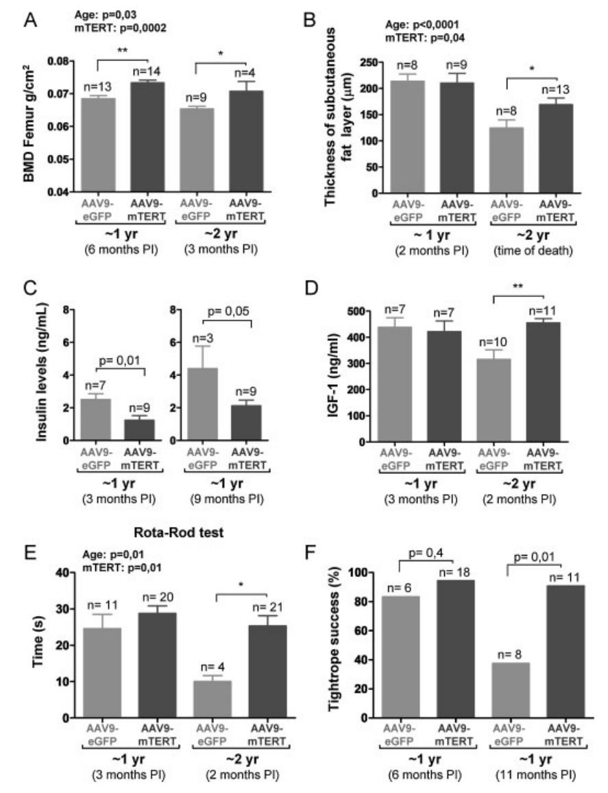

# Telomerase gene therapy in adult and old mice delays aging and increases longevity without increasing cancer

Bruno Bernardes de Jesus1 , Elsa Vera1 , Kerstin Schneeberger1 , Agueda M. Tejera1 , Eduard Ayuso2,3, Fatima Bosch2,3, Maria A. Blasco1\*

Keywords: AAV9; aging; gene therapy; health span; TERT

DOI 10.1002/emmm.201200245

Received February 22, 2012 Revised March 29, 2012 Accepted March 30, 2012

*G*See accompanying article http://dx.doi.org/10.1002/emmm.201200246 A major goal in aging research is to improve health during aging. In the case of mice, genetic manipulations that shorten or lengthen telomeres result, respectively, in decreased or increased longevity. Based on this, we have tested the effects of a telomerase gene therapy in adult (1 year of age) and old (2 years of age) mice. Treatment of 1- and 2-year old mice with an adeno associated virus (AAV) of wide tropism expressing mouse TERT had remarkable beneficial effects on health and fitness, including insulin sensitivity, osteoporosis, neuromuscular coordination and several molecular biomarkers of aging. Importantly, telomerase-treated mice did not develop more cancer than their control littermates, suggesting that the known tumorigenic activity of telomerase is severely decreased when expressed in adult or old organisms using AAV vectors. Finally, telomerase-treated mice, both at 1-year and at 2-year of age, had an increase in median lifespan of 24 and 13%, respectively. These beneficial effects were not observed with a catalytically inactive TERT, demonstrating that they require telomerase activity. Together, these results constitute a proof-of-principle of a role of TERT in delaying physiological aging and extending longevity in normal mice through a telomerase-based treatment, and demonstrate the feasibility of anti-aging gene therapy.

# INTRODUCTION

Studies with genetically modified mice, as well as by means of ectopic treatments, have proved that it is possible to ameliorate various age-related parameters (the so-called 'health-span'), which is often accompanied by an increase of life-span (Bluher et al, 2003; Conboy et al, 2005; Flurkey et al, 2001; Harrison et al, 2009; Holzenberger et al, 2003; Tomas-Loba et al, 2008). Recently, a significant delay of aging in adult animals was first achieved by a rapamycin-based pharmacological intervention, an agent that reduces the activity of mTOR kinase (Harrison et al, 2009).

Telomerase confers indefinite proliferative potential to in vitro cultured cells by virtue of its ability to elongate chromosome ends, thus preventing critical telomere erosion associated with cell division and the activation of a persistent DNA damage response (Bodnar et al, 1998). Telomerase also acts as a longevity gene in the context of the organism by preventing premature telomere attrition, as illustrated by both telomerase-deficient mice and by human diseases due to mutations in telomerase components, which suffer from premature adult stem cell dysfunction and decreased longevity due to accelerated rates of telomere shortening even at the first generation (Armanios et al, 2007; Blasco et al, 1997; Garcia-Cao et al, 2006; Herrera et al, 1999; Mitchell et al,

(1) Telomeres and Telomerase Group, Molecular Oncology Program, Spanish National Cancer Centre (CNIO), Madrid, Spain

(2) Department of Biochemistry and Molecular Biology, Center of Animal Biotechnology and Gene Therapy (CBATEG), School of Veterinary Medicine. Universitat Auto`noma de Barcelona, Bellaterra, Spain

(3) CIBER de Diabetes y Enfermedades Metabo´licas Asociadas (CIBERDEM), Barcelona, Spain

\*Corresponding author: Tel: þ34 91 732 8031; Fax: þ34 91 732 8028; E-mail: mblasco@cnio.es

1999; Tsakiri et al, 2007; Vulliamy et al, 2001; Yamaguchi et al, 2005).

Owing to its ability to confer with unlimited proliferative potential, over-expression of the telomerase reverse transcriptase (TERT) is a common feature of human cancers and can increase cancer incidence in the context of classical mouse TERT transgenesis (Artandi et al, 2002; Canela et al, 2004; Gonzalez-Suarez et al, 2001; McKay et al, 2008; Rafnar et al, 2009). Remarkably, over-expression of TERT in the context of mice engineered to be cancer resistant (Sp53/Sp16/SARF/TgTERT mice) is sufficient to decrease telomere damage with age, delay aging and increase median longevity by 40% (Tomas-Loba et al, 2008). Also, the re-activation of telomerase in a model of premature aging caused by accelerated telomere shortening owing to telomerase deficiency (TERT-deficient mice; Jaskelioff et al, 2011) was enough to revert some age-associated phenotypes, suggesting that accelerated aging produced by telomere shortening can be partially reversed. These findings prompted us to test whether a therapeutic intervention aimed to increase TERT late in life (1 or 2 year old mice) may significantly delay aging and extend longevity without increasing cancer susceptibility.

Telomerase activators have been reported (de Jesus et al, 2011; Fauce et al, 2008; Harley et al, 2011), however, their mechanism of action is still poorly understood. Instead, we turned into a TERT-based gene therapy strategy to extend longevity, to our knowledge unprecedented in the context of aging studies. Recombinant AAVs have emerged as one of the vectors of choice for many gene transfer applications because of their many desirable properties, including the fact that they are non-integrative and show a poor immunogenicity and an excellent safety profile (Buning et al, 2008). AAV vectors transduce both dividing and non-dividing cells, and can sustain long-term gene expression (up to several years) both in small and large animal models of disease in tissues with very low proliferation rates (Jiang et al, 2006; Mas et al, 2006; Niemeyer et al, 2009; Tafuro et al, 2009). Safety and efficacy of AAV gene transfer has been extensively studied in humans with encouraging results in the liver, muscle, CNS and retina (Kaplitt, 2009; Maguire et al, 2008; Manno et al, 2006; Stroes et al, 2008). Although AAV2 is the best characterized serotype for gene transfer studies both in humans and experimental models, newly isolated serotypes, such as AAV7, AAV8 and AAV9 have been successfully adopted in preclinical studies (Gao et al, 2002), and are expected to enter Phase I clinical trials in the near future. In particular, AAV9 has shown efficient transduction in a broad range of tissues, with high tropism for liver, heart and skeletal muscle (Inagaki et al, 2006). In addition, AAV9 vectors have the unique ability to cross the blood–brain-barrier and target the brain upon intravenous injection in adult mice and cats (Duque et al, 2009; Foust et al, 2009). Thus, we have selected AAV9 vectors to broadly express TERT in adult mice and to study its ability to extend longevity.

# RESULTS

#### AAV9 mediated expression of mTERT leads to a stable and efficient systemic transduction of mouse tissues

Here, we generated an adeno-associated virus (AAV) carrying the mouse TERT (mTERT) cDNA under the control of the CMV promoter and containing the capsid proteins of the AAV serotype 9, known to confer tropism for a wide variety of mouse tissues (AAV9-mTERT). As a negative control and reporter of AAV9 expression, we generated an analogous construct containing the enhanced green fluorescent protein (eGFP) instead of mTERT (AAV9-eGFP).

To assess viral tropism, 1-year old mice were sacrificed 1 month post-injection (PI) with either vector (Supporting Information Fig S1A). By direct eGFP fluorescence, AAV9-eGFP treated mice showed increased eGFP in the shaved back skin and internal organs compared to AAV9-mTERT treated mice (Supporting Information Fig S1B–D). Immunohistochemistry with anti-eGFP antibodies at 1 month PI, showed a viral transduction efficiency of 20–50% of eGFP-positive cells depending on the tissue (Supporting Information Fig S1E and F) (Foust et al, 2009; Inagaki et al, 2006; Zincarelli et al, 2008).

For longevity and aging studies, AAV9-mTERT or AAV9 eGFP vectors were injected via tail vein (2 1012 viral genomes (vg)/mouse) into two large cohorts of 420 and 720 days of age (referred hereafter as 1 and 2 year old groups), and efficient viral infection was confirmed by direct assessment of eGFP fluorescence in living animals at 2 weeks PI (Fig 1A). One month PI, TERT mRNA and protein levels were significantly increased in several tissues from AAV9-mTERT injected mice compared to AAV9-eGFP controls (Fig 1B and C; Supporting Information Fig S2), including liver, kidney, lung, heart, brain and muscle as assessed with a telomerase specific antibody (full representative Western blot gels and positive and negative controls for the specificity of the TERT antibody are included in Supporting Information Fig S2 and were previously reported by us (Martinez et al, 2010)). In accordance with long-term

#### Figure 1. AAV9-mediated mTERT expression.

- A. Direct GFP fluorescence in shaved back skin of mice treated with the indicated vectors.
- B. Dark grey bars: fold change in mean - SEM mTERT mRNA levels in AAV9-mTERT treated mice compared to AAV9-eGFP controls; light grey bars represent mean - SEM after setting to 1 the control mice. mTERT mRNA values are normalized to actin. At least 5 male mice per group were used. Student's t-test was used for statistical analysis.
- C. TERT Western blots of tissue whole extracts from the 1 year-old group. Top, representative Western blot. Bottom, quantification of mTERT protein from 3 to 6 male mice. Values are normalized to actin. Student's t-test was used for statistical analysis. Data are given as mean - SD. Molecular weight markers are shown. Controls for TERT antibody are shown in Supporting Information Fig S2.
- D. Telomerase activity (measured through TRAP assay) in several tissues from either AAV9-eGFP or AAV9-mTERT injected mice.

"

Figure 1.

expression of AAV9 vectors (Zincarelli et al, 2008), expression levels were maintained for at least 8 months PI in all the tissues analysed, except for the lungs (Supporting Information Fig S3A– C). Although the apparent fold increase in TERT mRNA levels was large (mRNA levels are fold expression compared to an extremely low baseline level of mTERT) in some tissues known to be preferential targets of AAV9, mTERT protein levels were increased by 5- to 15-fold depending on the target tissue (Fig 1C), and were maintained up to 8 months PI with AAV9 mTERT (Supporting Information Fig S3B and C), most likely as the consequence of post-transcriptional regulation, something previously observed by us (Gonzalez-Suarez et al, 2002). This level of mTERT protein over-expression achieved by using gene therapy vectors is in the same range of mTERT over-expression reached by classical mouse transgenesis, including the longlived Sp53/Sp16/SARF/TgTERT mouse model (Flores et al, 2006; Gonzalez-Suarez et al, 2001; Tomas-Loba et al, 2008). Finally, AAV9-mTERT treatment was able to increase telomerase activity as measured by TRAP assay 2-year old mice in vivo in a number of mouse tissues, such as lungs, liver, kidney and heart (Fig 1D; Supporting Information Fig S3D–F). In summary, AAV9 can be used to increase mTERT levels in a wide range of mouse tissues at the desired time in the lifespan of mice.

### mTERT ectopic expression late in life decreases the incidence of age-related osteoporosis and glucose intolerance

Bone loss is a well-characterized sign of the aging progress both in mice and humans (Ferguson et al, 2003), which results from bone resorption due to osteoblast insufficiency. A significant decrease in the bone mineral density of the femur (femur BMD; Supporting Information Fig S4A) was observed in the 2 year-old compared to the 1 year old controls (Fig 2A). Interestingly, 3–6 months after AAV9 treatment, the femur BMD was significantly higher in the AAV9-mTERT treated mice of both age groups than in the age-matched AAV9-eGFP controls

#### Figure 2. Delayed aging in AAV9-mTERT treated mice.

- A. Femur bone mineral density (BMD femur) at the indicated times post-treatment with the indicated vectors. Two-way ANOVA was used for statistical analysis demonstrating that both mTERT (p ¼ 0.0002) and age (p ¼ 0.03) contribute significantly to the differences observed. Data are given as mean - SEM ( p < 0.05; p < 0.01).
- B. Thickness of the subcutaneous fat layer at the indicated time or at the time of death (in tissues fixed immediately post-mortem – see Materials and Methods Section) in AAV9-mTERT and AAV9 eGFP treated mice. Two-way ANOVA was used for statistical analysis demonstrating a significant effect of mTERT treatment (p ¼ 0.04) and age (p < 0.0001). Data are given as mean - SEM ( p < 0.05).
- C. Insulin levels at the indicated times post-treatment with the vectors after mice were fasted for at least 8 h. Age-matched female mice were used. Data are given as mean - SEM. Student's t-test was used for statistical analysis.
- D. IGF-1 levels at the indicated times post-treatment with the vectors. Two-way ANOVA was used for statistical analysis demonstrating a significant interaction between mTERT and age (p < 0.05). Data are given as mean - SEM ( p < 0.01).
- E. Coordination and balance using a Rota-Rod wheel. Three trials were measured per mice. Twoway ANOVA was used for statistical analysis demonstrating that both mTERT ( p ¼ 0.01) and age (p ¼ 0.01) contribute significantly to the differences observed. Data are given as mean - SEM ( p < 0.05).
- F. Neuromuscular coordination using the tightrope test at the indicated times post-treatment with the indicated vectors. Fischer's exact test was used for statistical analysis.

(Fig 2A). This beneficial effect of mTERT is coincidental with increased mTERT mRNA levels in the bone of AAV9-mTERT treated mice compared to eGFP controls (Supporting Information Fig S4B).

A well-established biomarker of ageing is the loss of the subcutaneous adipose skin layer, which in turn can lead to opportunistic pathologies associated with old age such as infections (Shimokata et al, 1989; Tomas-Loba et al, 2008). Accordingly, the thickness of the subcutaneous fat layer in the 2 year-old control group was reduced compared to the 1 year-old controls (Fig 2B; Supporting Information Fig S4C). Remarkably, this decrease did not occur in the 2 year old AAV9-mTERT treated mice, which showed a better preservation of subcutaneous fat layer compared to agedmatched AAV9-eGFP treated controls (Fig 2B). Again, we detected increased mTERT mRNA levels in subcutaneous white adipose tissue (WAT) from AAV9-mTERT treated mice compared to the AAV9-eGFP controls (Supporting Information Fig S4B).

Glucose intolerance and insulin resistance are also wellestablished indicators of the aging progression (Bailey & Flatt, 1982; Guarente, 2006), and telomerase deficiency contributes to glucose intolerance in mice (Kuhlow et al, 2010). AAV9 mTERT treated mice of both aged groups showed significantly lower levels of fasting insulin compared with the AAV9-eGFP controls, which presented increased insulin levels with aging (Fig 2C), indicating an improved insulin sensitivity upon TERT treatment. AAV9-mTERT treated mice also showed a trend for an improved glucose uptake and a better homeostatic model assessment (HOMA (Heikkinen et al, 2007; Matthews et al, 1985)) compared to the AAV9-eGFP controls, although differences did not reach statistical significance (Supporting Information Fig S4D and E). We observed significantly higher IGF-1 levels in the 2 year old AAV9-mTERT treated mice compared to age-matched controls, which showed decreased IGF-1 levels compared to the 1 year old controls (Fig 2D). A decline in IGF-1 expression occurs with age progression (Hammerman, 1987), and high IGF-1 levels in the 2 year old AAV9-mTERT treated mice could suggest an improved healthspan. Finally, we did not find significant differences in body fat content or in body weight of the different mouse cohorts (Supporting Information Fig S4F and G).

#### mTERT ectopic expression late in life improves scores in neuromuscular and object-recognition tests

To assess the systemic effects of ectopic mTERT expression, we turned into a number of behavioural assays that test the capacity of mice to perform different tasks, which is progressively lost with the ageing progress. In particular, we evaluated (i) coordination and balance (Rota-Rod test), (ii) memory (Object Recognition Test), and (iii) neuromuscular coordination (Tightrope Test) (Bevins & Besheer, 2006; Ingram & Reynolds, 1986)). Coordination and balance were significantly improved in the 2 year-old group 2 months post AAV9-mTERT treatment compared to age-matched controls (Fig 2E). Neuromuscular coordination (Tightrope test) was also improved in the 1 year old AAV9-mTERT treated mice at 11 months post-treatment compared to AAV9-eGFP controls, which showed a decline in the ability to perform this test with age (Fig 2F). AAV9-mTERT treated mice from both age groups also showed a trend for improved memory scores (object recognition test) compared to the controls, although they did not reach significance (Supporting Information Fig S4H–J). Interestingly, AAV9 has been shown to target motor-neurons in adult mice (Duque et al, 2009). Furthermore, in agreement with motor skill tests having a cerebellar output component (Doyon, 1997; Hikosaka et al, 2002), we found increased cyclin D1-positive cells in the cerebellum of AAV9-mTERT treated mice compared to AAV9 eGFP cohorts (Supporting Information Fig S5). These results also support an improved health span as a result of AAV9 mTERT treatment.

#### A TERT-based gene therapy late in life significantly extends lifespan without increasing cancer

To address whether our TERT gene therapy approach was able to extend longevity, we performed Kaplan–Meier analysis of mice treated with either vectors in both age groups. We observed a significant extension of lifespan in AAV9 mTERT treated mice compared to the AAV9-eGFP or nontreated controls in both age groups (Fig 3A). TERT treatment led to an increase in survival of 24% in the 1 year-old group and of 13% in the 2 year old group (p < 0.05 for both groups) compared to AAV9-eGFP treated controls (Fig 3A) when excluding mice that died before treatment, and this was similar when all mice (mice that died before injection) were included (Supporting Information Fig S6A). We also found a significant increase in the median survival of the longest-lived mice (90th percentile; Fig 3B) in the AAV9 mTERT group compared to the AAV9-eGFP group or the non-injected controls, suggesting that TERT may affect maximum longevity. Indeed, the longest-lived AAV9-mTERT treated mice from the 1 and 2 year old groups surpassed by 13 and 20%, respectively, the maximum longevity of the corresponding longest-lived AAV9-eGFP treated controls (Fig 3B). The positive effects on longevity may come from both proliferating and non-proliferating tissues as AAV9 infects both tissue types. Moreover, it has been recently demonstrated that telomerase plays important roles in post-mitotic tissues (Sahin et al, 2011).

To address any undesirable effects of our TERT gene therapy strategy, we performed a detailed pathological analysis of all mice under treatment at their time of death. A drawback of mTERT over-expression in transgenic mouse studies has been an increased cancer incidence, except for cancer-resistant backgrounds (Artandi et al, 2002; Gonzalez-Suarez et al, 2001; Tomas-Loba et al, 2008). AAV9-mTERT treated mice of both age groups did not show increased cancer incidence compared to the AAV9-eGFP controls (Fig 3C). Indeed, the causes of death were similar in the AAV9-mTERT and AAV9 eGFP treated groups (Supporting Information Fig S6B and C). Similarly, re-expressing telomerase in a model of accelerated aging does not recapitulate the cancer-prone phenotypes observed when expressed from the germline (Jaskelioff et al, 2011).

Research Article

#### Figure 3. Increased median and maximum longevity of AAV9-mTERT treated mice.

- A. Kaplan–Meier survival curves of the indicated mouse cohorts (50% males and 50% females). Alive mice are plotted as a vertical line. The Log rank test was used for statistical analysis.
- B. Average and 90th percentile lifespan of 2 year-old mice treated with AAV9-mTERT or AAV9-eGFP vectors. One-way ANOVA was used for statistical analysis ( p < 0.05; p < 0.01). The floating bars represent the minimum-to-maximum age of death and the middle bar corresponds to the mean.
- C. Percentage of mice with the indicated tumours at their time of death.

### Telomerase expression late in life leads to overall telomere lengthening and decreased abundance of short telomeres in various tissues

Next, we set to address the mechanisms linking TERT expression to mouse lifespan. There is extensive evidence supporting that short telomeres owing to telomerase-deficiency lead to aging and that re-expression of telomerase reverses this particular type of aging (Flores et al, 2008; Jaskelioff et al, 2011; Samper et al, 2001), however, it is not known whether TERT expression can rescue short telomeres during physiological mouse aging. To this end, we measured telomere length and the percentage of short telomeres in differentiated tissues (brain – cerebral cortex, heart – myocytes, lung, kidney – medulla, liver – hepatocytes and muscle – fibers, Supporting Information Fig S7A) at 1 month post-treatment. We used quantitative telomere FISH (Q-FISH, see Materials and Methods Section) on tissue sections. Most tissues from AAV9-mTERT treated mice of both age groups presented longer telomeres than the AAV9 eGFP controls (Supporting Information Fig S7B and C). In addition, 1 month after AAV9-mTERT treatment, both age groups showed a significant decrease of the percentage of short telomeres compared to the AAV9-eGFP controls, which showed an increase in short telomeres when comparing the 1–2 year old groups (Fig 4A). The presence of longer telomeres in postmitotic tissues from AAV9-mTERT mice, such as the brain, may be partially explained by the fact that AAV9 targets both neurons and astrocytes in the adult brain including the thalamus, hypothalamus, hippocampus and, to a lesser extent, the cortex (Duque et al, 2009; Foust et al, 2009; Wang et al, 2010). Although the rates of stem cell replenishment are unlike to completely account for the telomere length differences observed, we cannot discard other roles of telomerase such as the rescue of telomere shortening through stress protection (Saretzki, 2009) or the recently association to mitochondrial protection in post mitotic tissues (Sahin et al, 2011). Together, these results indicate that increased mTERT expression in adult tissues through a gene therapy approach results in the presence of longer telomeres concomitant with a decreased percentage of cells with very short telomeres.

To follow the long-term effects of AAV9-mTERT treatment on telomere length, we measured telomere length in peripheral blood leukocytes from the same individuals at 3 and 8 months post-treatment using a high-throughput (HT) Q-FISH technique optimized for blood samples (see Supplementary Information). Average telomere length decreased with time in control mice of the 1 year old group, concomitant with an increase of short telomeres (Supporting Information Fig S7D and E). In contrast, 7 out of 11 AAV9-mTERT treated mice of the 1 year old group showed no decrease or even a net increase in average telomere length compared to the previous time point (Supporting Information Fig S7D and E) and that 6 out of 11 mice showed no increase or even a marked decrease in percentage of short telomeres with time (Supporting Information Fig S7D and E). The subgroup of AAV9-mTERT treated mice that maintained or decreased the percentage of short telomeres also showed an apparent trend to survive longer than those that increased percentage of short telomeres, in both age groups (Supporting Information Fig S7F), suggesting that rescue of short telomeres is associated with increased longevity. Together, these results indicate that forced TERT expression in adult mice by using a gene therapy approach results in rescue of short telomeres in several tissues and prevention of telomere shortening in peripheral blood leukocytes from the same mice. Longer telomeres in peripheral blood leukocytes may reflect the better health status of AAV9-mTERT treated mice compared to the AAV9-eGFP controls, in agreement with a link between health status and telomere maintenance in white blood cells (Lin et al, 2010; Ornish et al, 2008).

# AAV9-mTERT treatment late in life increases cyclinD1*R* cells in mouse tissues

Although mTERT expression significantly prevents accumulation of short telomeres, mTERT is also proposed to have telomere-independent roles (independent of its catalytic activity) as a cofactor on the promoter of Wnt targeted genes. To test this in our experimental model, we determined the expression of the TERT/Wnt target genes b-catenin, Axin-2, CD44 and cyclinD1. Treatment with AAV9-mTERT increased the active form of b-catenin in all tissues tested, except for the liver (Fig 4B and C). AAV9-mTERT treatment also increased cyclinD1 positive cells in various tissues compared to the control groups (Fig 4D; Supporting Information Fig S8A), including the skin basal layer and in neurogenic areas of the brain, such as the hippocampus (Supporting Information Fig S8B–F). Expression of other targets/effectors of the TERT/Wnt pathway, such as CD44 and axin2, however, were not consistent with TERT expression and depended on the tissue type (Supporting Information Fig S9A and B). Finally, we also included the expression of p16, a cell cycle inhibitor whose levels are increased associated with mouse aging (Krishnamurthy et al, 2006; Molofsky et al, 2006) and that is a bona fide marker of cellular senescence (Collado et al, 2007). We observed decreased levels p16 levels upon AAV9-mTERT treatment in most organs studied (Supporting Information Fig S9C and D) with the exception of the heart.

# AAV9-mTERT treatment late in life improves metabolic and mitochondrial fitness

Recently, accelerated aging produced by telomere shortening was shown to involve metabolic and mitochondrial deterioration (Sahin et al, 2011). Here, we set to address whether mTERT treatment late in life was able to improve metabolic and mitochondrial fitness in old mice. To this end, we measured the expression levels of key metabolic and mitochondrial markers in the heart and the liver of control and AAV9-mTERT treated mice. As shown in Supporting Information Fig S10A and B, 2 year-old wild-type mice treated with the control AAV9-eGFP vector showed a metabolic and mitochondrial decline compared to the 1 year old group, which was not so apparent in the AAV9 mTERT cohorts. These findings support the notion that normal aging comprises similar metabolic changes to those observed in aging produced by accelerated telomere shortening, as well as suggest that increased healthspan through telomerase overexpression could involve protection from metabolic decline.

#### Delayed aging and increased longevity associated with increased TERT expression late in life requires of a catalytically active mTERT

To discern the canonical and non-canonical roles of telomerase in mouse longevity, we treated mice with a catalytically inactive form of mTERT (AAV9-mTERT-DN) previously shown to be unable to elongate telomeres (Fig 5A and Supporting Information Fig S11 (Sachsinger et al, 2001)) and to have a dominant negative effect in vitro in a murine kidney tumour cell line (RenCa). As expected, AAV9-mTERT-DN treatment increased CyclinD1 expression in a number of tissues (Fig 5A and B), in accordance with previous findings (Park et al, 2009). Importantly, AAV9-mTERT-DN treatment did not show any of the beneficial effects of TERT treatment, including rescue of short telomeres, increased health span (bone density, insulin levels) and extended longevity (Fig 5B–I and Supporting Information Fig S11), suggesting that elongation of short telomeres by telomerase is the main and essential mechanism contributing to the anti-aging activity of TERT treatment. We cannot rule out however, that in the context of a fully functional telomerase enzyme, the Wnt pathway may play a synergistic role with a better maintenance of telomere length.

# DISCUSSION

Accumulation of short/damaged telomeres with increasing age is considered one of the main sources of aging-associated DNA damage capable of causing loss of the regenerative capacity of tissues and systemic organismal aging both in humans and mice with impaired telomerase activity (Armanios et al, 2007; Blasco

et al, 1997; Flores et al, 2005; Garcia-Cao et al, 2006; Herrera et al, 1999; Mitchell et al, 1999; Schoeftner et al, 2009; Tsakiri et al, 2007; Vulliamy et al, 2001; Yamaguchi et al, 2005). Telomerase activation is envisioned as a potential strategy to rejuvenate tissues and to treat diseases characterized by premature telomere shortening (de Jesus et al, 2011; Jaskelioff et al, 2011). Interestingly, even though mouse telomeres are much longer than human telomeres at younger ages in spite of their shorter life spans, recent evidence suggest that mouse telomeres suffer a dramatic shortening at old ages and that telomere length can be rate-limiting for mouse longevity (Flores et al, 2008; Garcia-Cao et al, 2006). This is further supported by the fact that telomerase activation can delay normal mouse aging in cancer resistant mice (Tomas-Loba et al, 2008). However, with the exception of mice genetically engineered to be cancer resistant, increased telomerase expression is associated with a higher susceptibility to develop cancer both in mice and humans (Artandi et al, 2002; Canela et al, 2004; Gonzalez-Suarez et al, 2001; McKay et al, 2008; Rafnar et al, 2009). Notably, in these studies increased TERT expression is forced since early embryo development through germ line modifications, which may favour the expansion of cancerous cells and the development of cancer later in life. Gene therapy approaches are currently envisioned as a way to deliver genes into adult tissues in order to correct genetic defects or diseases, however, to our knowledge have never been envisioned as a valid strategy to delay aging or extend longevity. Here, we show that increased TERT expression later in life (adult and old mice) by using a gene therapy strategy has rejuvenating effects without increasing cancer risk. In particular, TERT interventions based on adeno-associated vectors (AAV9-mTERT) at 1 or 2 years of age are able to re-activate telomerase activity in a wide range of tissues and have beneficial effects on different aspects of mouse health, including delayed osteoporosis, improved epithelial barrier fitness, improved metabolic function, and improved neuromuscular coordination. The fact that AAV9-TERT treatment of old mice efficiently reactivated telomerase in the lungs offers a therapeutic opportunity for some cases of human pulmonary fibrosis associated with presence of short telomeres owing to telomerase mutations (Armanios et al, 2007; Tsakiri et al, 2007). Importantly, AAV9-mTERT treated mice do not develop more cancer, illustrating the safety of this type of strategy. This is likely to be related to the fact that AAV vectors are non-integrative, and therefore mTERT over-expression will be lost in highly proliferating cells. In addition, AAV preferentially targets post-mitotic cells from peripheral tissues, which are considered more resistant to cancer than the highly proliferative ones, and could explain the tissue contribution for healthspan amelioration. Indeed, the limited gene transfer to some tissues (such as the brain) could account some of the modest effects observed.

Our TERT-based gene therapy of aging also improved several molecular markers of aging. On one hand, and as expected from the canonical function of TERT as the catalytic component of telomerase, mice treated with AVV9-mTERT vectors showed telomere elongation in a variety of tissues, which was concomitant with a significant decrease in the abundance of short telomeres, in turn responsible for chromosomal aberrations (Hemann et al, 2001; Samper et al, 2001). The increase in telomere length in quiescent/differentiated tissues could be related to prevention of stress-dependent telomere shortening (Sahin et al, 2011; Sharma et al, 2003), or to re-population of tissues by cells with longer telomeres (Hao et al, 2005). In particular, we and others have previously demonstrated that TERT over-expression could be acting on the pool of adult stem cells present in tissues, leading to their mobilization and subsequent tissue regeneration (Flores et al, 2005; Sarin et al, 2005). On the other hand, in agreement with the proposed role of TERT as activator of genes of the Wnt pathway (Park et al, 2009), tissues with increased TERT expression also showed increased expression of active b-catenin, as well as of its target gene cyclinD1, which in turn may mediate some of the known effects of TERT improving stem cell mobilization (Flores et al, 2005; Reya & Clevers, 2005; Sarin et al, 2005). Increased cyclinD1 was also paralleled by generally lower levels of p16 expression in some mouse tissues, a further sign of extended renewal and proliferative capacities associated with TERT expression. However, mice treated with a catalytically inactive TERT (AAV9-mTERT-DN), and despite showing increased CyclinD1 mRNA levels as well as decrease p16 levels in the tissues tested, in agreement with the proposed role of TERT regulating the Wnt pathway in a telomerase activity-independent manner (Park et al, 2009), were not paralleled by a rescue of short telomeres and increased health span and longevity. These could indicate that the non-canonical role of telomerase could not impact on the health status per se, but could have a synergistic effect in the context of a telomerase positive background.

#### Figure 4. AAV9-mTERT treatment decreases the abundance of short telomeres and increases active *b*-catenin and cyclinD1-positive cells in AAV9-mTERT treated mice. 3

- A. Percentage of short telomeres (percentage of telomeres presenting an intensity below 50% of the mean intensity of the corresponding control [AAV9-eGFP 1 year old]) 1 month post-treatment with the indicated vectors. Data are given as mean - SEM. Student's t-test was used for statistical analysis. At least three independent mice were used per condition.
- B. Representative Western blots of tissue whole extracts of 2 year-old male mice treated either vector, 1 month post-treatment.
- C. Quantification of active b-catenin levels after correcting for b-catenin total levels and actin. Data are mean intensity - SD. Student's t-test was used for statistical analysis.
- D. Quantification of cyclinD1-positive cells with respect to total cells scored in tissues from mice treated with the indicated vectors, 1 month post-treatment. (brain – cerebral cortex [7 105 cells scored per mouse]; heart – myocytes from myocardium [5 105 cells scored per mouse]; kidney – medulla [2 106 cells scored per mouse]; liver – [2 106 cells scored per mouse]; muscle – muscle fibers [4 105 cells scored per mouse]; lung – [8 105 cells scored per mouse]). Student's t-test was used for statistical assessments.

Figure 5. Catalytic activity of mTERT is needed for increased healthspan and life-span extension in AAV9-mTERT treated mice.

- A. Scheme of mTERT-wt and mTERT-DN, a catalytically inactive form of telomerase previously generated and described by us (see Materials and Methods Section).
- B. Fold change in mTERT mRNA levels in AAV9-mTERT or AAV9-mTERT-DN treated mice compared to age-matched AAV9-eGFP controls. Values are normalized for actin and are represented as the change in mean - SEM relative to samples of age-matched AAV9-eGFP mice (set to 1). Student's t-test was used for statistical analysis.
- C. mRNA levels of Wnt target gene CyclinD1 in the liver of mice treated with AAV9-eGFP, AAV9-mTERT or AAV9-mTERT-DN vectors. Values are normalized for actin and are represented as the change in mean - SEM relative to samples of age-matched AAV9-eGFP mice (set to 1). Student's t-test was used for statistical analysis ( p < 0.05; p < 0.01).
- D. Expression of p16 mRNA in the liver of mice treated with AAV9-eGFP, AAV9-mTERT or AAV9-mTERT-DN vectors. Data was normalized for actin and are represented as the change in mean - SEM relative to samples of age-matched AAV9-eGFP mice (set to 1). Student's t-test was used for statistical analysis ( p < 0.05).
- E. mRNA levels of Wnt target gene CyclinD1 in the brain of mice treated with AAV9-eGFP, AAV9-mTERT or AAV9-mTERT-DN vectors. Values are normalized for actin and are represented as the change in mean - SEM relative to samples of age-matched AAV9-eGFP mice (set to 1). Student's t-test was used for statistical analysis ( p < 0.05).
- F. Percentage of short telomeres (percentage of telomeres presenting an intensity below 50% of the mean intensity of the corresponding control [AAV9-eGFP 1 year old]) 1 month post-treatment with the indicated vectors or in age-matched non-treated mice (control). Data are given as mean - SEM. One-way ANOVA (with Dunnett's post hoc test against AAV9-eGFP) was used for statistical analysis ( p < 0.05; p < 0.005).
- G. Femur bone mineral density (BMD femur) measured 6 months post injection with the indicated vectors or in age-matched non-treated mice (control). Data are given as mean -SEM. One-way ANOVA (with Dunnett's post hoc test against AAV9-eGFP) was used for statistical analysis (p < 0.01).
- H. Insulin levels measured 3 months post injection with the indicated vectors or in age-matched non-treated mice (control). Age-matched female mice were used. Data are given as mean - SEM. One-way ANOVA (with Dunnett's post hoc test against AAV9-eGFP) was used for statistical analysis ( p < 0.05).
- I. Survival curves of the indicated mouse cohorts. Alive mice are plotted as a vertical line.

# The paper explained

# PROBLEM:

A major goal in aging research is to increase the so-called 'health span' or the time of life free of disease. Telomeres have been linked with aging and disease and, in the case of mice, genetic manipulations that shorten or lengthen telomeres result, respectively, in decreased or increased longevity. Therapies that impact on telomere length are therefore expected to have an impact on health span.

# RESULTS:

Based on this notion, we tested the effects of a telomerase gene therapy in adult (1 year of age) and old (2 years of age) mice. Treatment of both groups of mice with an AAV of wide tropism expressing mouse telomerase (mTERT) demonstrated remarkable beneficial effects on health and fitness, improving several molecular biomarkers of aging. Moreover, telomerase-treated mice did not

Finally, by looking at markers of metabolic and mitochondrial fitness, we show here that normal aging comprises similar metabolic changes to those observed in aging produced by accelerated telomere shortening, as well as demonstrate that increased healthspan through telomerase overexpression is associated with protection from metabolic decline.

In conclusion, we provide proof-of-principle for the feasibility of anti-aging interventions on adult/old mammals. Aged organisms accumulate telomere-derived DNA damage and we show that it is possible to repair or delay the accumulation of this type damage through telomerase gene therapy. This has direct consequences on the health of the aged organisms including an increase in the average and maximal lifespan.

# MATERIALS AND METHODS

### Mice

Separate groups of mice were tail-vein injected with 2 1012 vg (viral genomes)/animal of either AAV9-GFP, AAV9-mTERT or AAV9-mTERT-DN, a catalytically inactive form of mTERT (Sachsinger et al, 2001), at 420 days (AAV9-GFP, n ¼ 14 [50% males and 50% females]; AAV9 mTERT, n ¼ 21 [52% males and 48% females]; AAV9-mTERT-DN, n ¼ 17 [53% males and 47% females]) or either AAV9-GFP and AAV9 mTERT 720 days (AAV9-GFP, n ¼ 14 [58% males and 42% females]; AAV9-mTERT, n ¼ 23 [52% males and 48% females] of age. All mice are of a >95% C57BL6 background. Longevity comparisons were always made within the same mouse cohort to avoid minimal possible differences in genetic background between the groups.

### Recombinant AAV vectors

Vectors were generated by triple transfection of HEK293 cells as described (Matsushita et al, 1998). Cells were cultured in roller bottles (Corning, New York, USA) in DMEM 10% FBS to 80% confluence and develop more neoplasias comparing to their control littermates, suggesting that the known tumorigenic activity of telomerase is severely decreased when expressed in adult or old organisms. Finally, re-introduction of mTERT in both 1- and 2-year old mice increased significantly its median lifespan (24 and 13%, respectively). These beneficial effects were not observed with a reporter virus (eGFP) or a catalytically inactive TERT (TERT-DN) demonstrating the strict dependency of an active telomerase complex.

# IMPACT:

Together, our results constitute a proof-of-principle of a role of mTERT in delaying physiological aging, improvement of health span, and extension of longevity in normal (wild type) mice. The gene therapy described here represents a novel type of therapeutic intervention against various age-related diseases.

co-transfected with a plasmid carrying the expression cassette flanked by the AAV2 viral ITRs, a helper plasmid carrying the AAV rep2 and cap9 genes, and a plasmid carrying the adenovirus helper functions (kindly provided by K.A. High, Children's Hospital of Philadelphia). The expression cassettes used were (i) GFP under the control of CMV promoter and SV40 polyA signal or (ii) murine TERT under the control of CMV promoter (iii) murine catalytically inactive TERT under the control of CMV promoter (see Full Methods section for detailed description). In AAV-TERT vectors, SV40 polyA was not used since 30 UTR from TERT was maintained as a polyA signal. AAV vectors were purified with an optimized method based on two consecutive cesium chloride gradients, dialyzed against PBS, filtered and stored at 80*8*C until use (Ayuso et al, 2010). The titers of viral genomes particles were determined by quantitative real time PCR.

# Measurement of virus transduction efficiency

A control group of mice (AAV9-GFP n ¼ 5, AAV9-mTERT n ¼ 5) was injected at 360 days of age following the methodology described before. At 4 weeks PI mice were sacrificed and subjected to either pathological analysis or GFP and mTERT expression assessments. GFP expression from skin and internal organs was determined using a 488 nm excitation light and image collecting system (IVIS Imaging System 200 Series, Xenogen Corporation, Alameda, CA). Quantitation of eGFP immunostainings was determined by counting the number of peroxidase stained cells over the total number of hematoxylin-stained cells, and correcting by the background (positive eGFP cells in the AAV9-mTERT injected mice). Telomerase expression in different tissues was analysed by western blot analysis, quantitative RT-PCR and TRAP (telomerase repeat amplification protocol) assay.

# Telomere Q-FISH analysis on paraffin sections

Q-FISH determination on paraffin-embedded tissue sections from 1- and 2-year old mice were hybridized with a PNA-telomeric probe, and fluorescence intensity of telomeres was determined as described (Gonzalez-Suarez et al, 2001). Quantitative image analysis was performed using the Definiens Developer Cell software (version XD 1.2; Definiens AG). For statistical analysis a two-tailed Student's t-test was used to assess significance (GraphPad Prism software).

#### Bone density

Bone mineral density was measured in anaesthetized living animals, or post-mortem when referred, using a Dual Energy X-ray Absorptiometry (DEXA) scan device.

#### Skin measurements

Subcutaneous fat layer measurements were performed as described in (Tomas-Loba et al, 2008). Briefly, 10–20 random measurements along the skin from at least five mice (three skin sections per mice) per injected group were considered. Skin sections cut perpendicular to the skin surface at a 5 mm thickness were stained for hematoxylin–eosin (H&E), and Image J software was used for length measurements.

#### Intraperitoneal glucose tolerance tests, insulin and IGF-1

Glucose curves were performed as described elsewhere (Moynihan et al, 2005). Briefly, mice were fasted for at least 8 h, and injected intraperitoneally with a 50% dextrose solution (2 g/kg body weight). Blood glucose levels were measured with a glucometer (Glucocard Memory 2, Arkray, Japan) at the indicated times after injection. Data analysis was performed as described in Tomas-Loba et al (2008). Blood insulin levels were measured with Ultra-Sensitive Mouse Insulin ELISA Kit (Crystal Chem Inc. #90080), following manufacturers protocol. IGF-1 levels were calculated with a Rat/Mouse IGF-1 ELISA (Novozymes, AC-18F1).

#### Neuromuscular coordination

To evaluate the motor coordination and balance, mice were tested in a Rota-Rod apparatus (model LE 8200); the measures score the latency of fall, with a continuous acceleration protocol, from 4 to 40 rpm, for a maximum of 60 s in three trials (Castelhano-Carlos et al, 2010). The tightrope test was performed as described elsewhere (Ingram & Reynolds, 1986; Matheu et al, 2007; Tomas-Loba et al, 2008).

#### TRAP assay

Telomerase activity was measured in S-100 extracts from the indicated tissues as previously described (Blasco et al, 1996). An internal control for PCR efficiency was included.

#### Statistical analysis

An unpaired t-student test was used to calculate statistical significance of eGFP expression in vivo and ex vivo, mTERT mRNA and protein expression levels, glucose tolerance, insulin levels, HOMA-IR, telomere length and percentage of short telomeres. Fisher's exact test was used to calculate the survival at 130 weeks and the neuromuscular (tightrope test). Pathological analysis was calculated with the x2 test. Two-way ANOVA was used to assess the significance of bone density, subcutaneous fat content, IGF-1 levels, neuromuscular coordination assay (Rotarod) and object recognition test. When the main effects (age and/or mTERT) or interaction were significant ( p < 0.05), the Bonferroni post hoc test was applied to test for differences between groups. Kaplan–Meier representation was used for the mouse survival curves in Fig 3A. One-way ANOVA (with Tukey's multiple comparison test) was used for median survival comparisons (Fig 3B). A Log Rank and Gehan–Breslow–Wilcoxon tests were used to calculate the statistical differences in the survival curves of the different mice cohorts.

For more detailed Materials and Methods see the Supporting Information.

# Author contributions

MAB conceived the idea; MAB and BB wrote the paper; BB performed most of the experiments of the paper; EV performed telomere length determinations; KS performed the initial viral injections; AT performed the TRAP assays; EA and FB performed the virus constructs and purifications.

# Acknowledgements

We thank Xavier Leon and Maria Molas for technical assistance with viral production. We thank R. Serrano for mouse care and J. Flores for pathology analyses. We thank Comparative Pathology and Confocal Microscopy Units at CNIO for technical assistance.

Supporting Information is available at EMBO Molecular Medicine online.

The authors declare that there is no conflict of interest.

# For more information

TERT; Genecards:

http://www.genecards.org/cgi-bin/carddisp.pl?gene=TERT Author website: http://www.cnio.es/es/grupos/plantillas/presentacion.asp? grupo=50004259

# References

Armanios MY, Chen JJ, Cogan JD, Alder JK, Ingersoll RG, Markin C, Lawson WE, Xie M, Vulto I, Phillips JA III, et al (2007) Telomerase mutations in families with idiopathic pulmonary fibrosis. N Engl J Med 356: 1317-1326

- Artandi SE, Alson S, Tietze MK, Sharpless NE, Ye S, Greenberg RA, Castrillon DH, Horner JW, Weiler SR, Carrasco RD, et al (2002) Constitutive telomerase expression promotes mammary carcinomas in aging mice. Proc Natl Acad Sci USA 99: 8191-8196
- Ayuso E, Mingozzi F, Montane J, Leon X, Anguela XM, Haurigot V, Edmonson SA, Africa L, Zhou S, High KA, et al (2010) High AAV vector purity results in serotype- and tissue-independent enhancement of transduction efficiency. Gene Ther 17: 503-510
- Bailey CJ, Flatt PR (1982) Hormonal control of glucose homeostasis during development and ageing in mice. Metabolism 31: 238-246
- Bevins RA, Besheer J (2006) Object recognition in rats and mice: a one-trial non-matching-to-sample learning task to study 'recognition memory'. Nat Protoc 1: 1306-1311
- Blasco MA, Lee HW, Hande MP, Samper E, Lansdorp PM, DePinho RA, Greider CW (1997) Telomere shortening and tumor formation by mouse cells lacking telomerase RNA. Cell 91: 25-34
- Blasco MA, Rizen M, Greider CW, Hanahan D (1996) Differential regulation of telomerase activity and telomerase RNA during multi-stage tumorigenesis. Nat Genet 12: 200-204

- Bluher M, Kahn BB, Kahn CR (2003) Extended longevity in mice lacking the insulin receptor in adipose tissue. Science 299: 572-574
- Bodnar AG, Ouellette M, Frolkis M, Holt SE, Chiu CP, Morin GB, Harley CB, Shay JW, Lichtsteiner S, Wright WE (1998) Extension of life-span by introduction of telomerase into normal human cells. Science 279: 349-352
- Buning H, Perabo L, Coutelle O, Quadt-Humme S, Hallek M (2008) Recent developments in adeno-associated virus vector technology. J Gene Med 10: 717-733
- Canela A, Martin-Caballero J, Flores JM, Blasco MA (2004) Constitutive expression of tert in thymocytes leads to increased incidence and dissemination of T-cell lymphoma in Lck-Tert mice. Mol Cell Biol 24: 4275- 4293
- Castelhano-Carlos MJ, Sousa N, Ohl F, Baumans V (2010) Identification methods in newborn C57BL/6 mice: a developmental and behavioural evaluation. Lab Anim 44: 88-103
- Collado M, Blasco MA, Serrano M (2007) Cellular senescence in cancer and aging. Cell 130: 223-233
- Conboy IM, Conboy MJ, Wagers AJ, Girma ER, Weissman IL, Rando TA (2005) Rejuvenation of aged progenitor cells by exposure to a young systemic environment. Nature 433: 760-764
- de Jesus BB, Schneeberger K, Vera E, Tejera A, Harley CB, Blasco MA (2011) The telomerase activator TA-65 elongates short telomeres and increases health span of adult/old mice without increasing cancer incidence. Aging Cell 10: 604-621

Doyon J (1997) Skill learning. Int Rev Neurobiol 41: 273-294

- Duque S, Joussemet B, Riviere C, Marais T, Dubreil L, Douar AM, Fyfe J, Moullier P, Colle MA, Barkats M (2009) Intravenous administration of selfcomplementary AAV9 enables transgene delivery to adult motor neurons. Mol Ther 17: 1187-1196
- Fauce SR, Jamieson BD, Chin AC, Mitsuyasu RT, Parish ST, Ng HL, Kitchen CM, Yang OO, Harley CB, Effros RB (2008) Telomerase-based pharmacologic enhancement of antiviral function of human CD8þ T lymphocytes. J Immunol 181: 7400-7406
- Ferguson VL, Ayers RA, Bateman TA, Simske SJ (2003) Bone development and age-related bone loss in male C57BL/6J mice. Bone 33: 387-398
- Flores I, Canela A, Vera E, Tejera A, Cotsarelis G, Blasco MA (2008) The longest telomeres: a general signature of adult stem cell compartments. Genes Dev 22: 654-667
- Flores I, Cayuela ML, Blasco MA (2005) Effects of telomerase and telomere length on epidermal stem cell behavior. Science 309: 1253-1256
- Flores I, Evan G, Blasco MA (2006) Genetic analysis of myc and telomerase interactions in vivo. Mol Cell Biol 26: 6130-6138
- Flurkey K, Papaconstantinou J, Miller RA, Harrison DE (2001) Lifespan extension and delayed immune and collagen aging in mutant mice with defects in growth hormone production. Proc Natl Acad Sci USA 98: 6736- 6741
- Foust KD, Nurre E, Montgomery CL, Hernandez A, Chan CM, Kaspar BK (2009) Intravascular AAV9 preferentially targets neonatal neurons and adult astrocytes. Nat Biotechnol 27: 59-65
- Gao GP, Alvira MR, Wang L, Calcedo R, Johnston J, Wilson JM (2002) Novel adeno-associated viruses from rhesus monkeys as vectors for human gene therapy. Proc Natl Acad Sci USA 99: 11854-11859

Garcia-Cao I, Garcia-Cao M, Tomas-Loba A, Martin-Caballero J, Flores JM, Klatt P, Blasco MA, Serrano M (2006) Increased p53 activity does not accelerate telomere-driven ageing. EMBO Rep 7: 546-552

- Gonzalez-Suarez E, Flores JM, Blasco MA (2002) Cooperation between p53 mutation and high telomerase transgenic expression in spontaneous cancer development. Mol Cell Biol 22: 7291-7301
- Gonzalez-Suarez E, Samper E, Ramirez A, Flores JM, Martin-Caballero J, Jorcano JL, Blasco MA (2001) Increased epidermal tumors and increased skin wound healing in transgenic mice overexpressing the catalytic subunit of telomerase, mTERT, in basal keratinocytes. EMBO J 20: 2619-2630
- Guarente L (2006) Sirtuins as potential targets for metabolic syndrome. Nature 444: 868-874

- Hammerman MR (1987) Insulin-like growth factors and aging. Endocrinol Metab Clin North Am 16: 995-1011
- Hao LY, Armanios M, Strong MA, Karim B, Feldser DM, Huso D, Greider CW (2005) Short telomeres, even in the presence of telomerase, limit tissue renewal capacity. Cell 123: 1121-1131
- Harley CB, Liu W, Blasco M, Vera E, Andrews WH, Briggs LA, Raffaele JM (2011) A natural product telomerase activator as part of a health maintenance program. Rejuvenation Res 14: 45-56

Harrison DE, Strong R, Sharp ZD, Nelson JF, Astle CM, Flurkey K, Nadon NL, Wilkinson JE, Frenkel K, Carter CS, et al (2009) Rapamycin fed late in life extends lifespan in genetically heterogeneous mice. Nature 460: 392-395

Heikkinen S, Argmann CA, Champy MF, Auwerx J (2007) Evaluation of glucose homeostasis. Curr Protoc Mol Biol Chapter 29: Unit 29B 23

- Hemann MT, Strong MA, Hao LY, Greider CW (2001) The shortest telomere, not average telomere length, is critical for cell viability and chromosome stability. Cell 107: 67-77
- Herrera E, Samper E, Martin-Caballero J, Flores JM, Lee HW, Blasco MA (1999) Disease states associated with telomerase deficiency appear earlier in mice with short telomeres. EMBO J 18: 2950-2960
- Hikosaka O, Nakamura K, Sakai K, Nakahara H (2002) Central mechanisms of motor skill learning. Curr Opin Neurobiol 12: 217-222
- Holzenberger M, Dupont J, Ducos B, Leneuve P, Geloen A, Even PC, Cervera P, Le Bouc Y (2003) IGF-1 receptor regulates lifespan and resistance to oxidative stress in mice. Nature 421: 182-187
- Inagaki K, Fuess S, Storm TA, Gibson GA, McTiernan CF, Kay MA, Nakai H (2006) Robust systemic transduction with AAV9 vectors in mice: efficient global cardiac gene transfer superior to that of AAV8. Mol Ther 14: 45-53
- Ingram DK, Reynolds MA (1986) Assessing the predictive validity of psychomotor tests as measures of biological age in mice. Exp Aging Res 12: 155-162
- Jaskelioff M, Muller FL, Paik JH, Thomas E, Jiang S, Adams AC, Sahin E, Kost-Alimova M, Protopopov A, Cadinanos J, et al (2011) Telomerase reactivation reverses tissue degeneration in aged telomerase-deficient mice. Nature 469: 102-106
- Jiang H, Lillicrap D, Patarroyo-White S, Liu T, Qian X, Scallan CD, Powell S, Keller T, McMurray M, Labelle A, et al (2006) Multiyear therapeutic benefit of AAV serotypes 2, 6, and 8 delivering factor VIII to hemophilia A mice and dogs. Blood 108: 107-115
- Kaplitt MG (2009) Gene therapy clinical trials in the human brain. Protocol development and review of current applications. Front Neurol Neurosci 25: 180-188
- Krishnamurthy J, Ramsey MR, Ligon KL, Torrice C, Koh A, Bonner-Weir S, Sharpless NE (2006) p16INK4a induces an age-dependent decline in islet regenerative potential. Nature 443: 453-457
- Kuhlow D, Florian S, von Figura G, Weimer S, Schulz N, Petzke KJ, Zarse K, Pfeiffer AF, Rudolph KL, Ristow M (2010) Telomerase deficiency impairs glucose metabolism and insulin secretion. Aging (Albany NY) 2: 650- 658
- Lin J, Epel E, Cheon J, Kroenke C, Sinclair E, Bigos M, Wolkowitz O, Mellon S, Blackburn E (2010) Analyses and comparisons of telomerase activity and telomere length in human T and B cells: insights for epidemiology of telomere maintenance. J Immunol Methods 352: 71-80
- Maguire AM, Simonelli F, Pierce EA, Pugh EN, Jr, Mingozzi F, Bennicelli J, Banfi S, Marshall KA, Testa F, Surace EM, et al (2008) Safety and efficacy of gene transfer for Leber's congenital amaurosis. N Engl J Med 358: 2240- 2248
- Manno CS, Pierce GF, Arruda VR, Glader B, Ragni M, Rasko JJ, Ozelo MC, Hoots K, Blatt P, Konkle B, et al (2006) Successful transduction of liver in hemophilia by AAV-Factor IX and limitations imposed by the host immune response. Nat Med 12: 342-347
- Martinez P, Thanasoula M, Carlos AR, Gomez-Lopez G, Tejera AM, Schoeftner S, Dominguez O, Pisano DG, Tarsounas M, Blasco MA (2010) Mammalian Rap1 controls telomere function and gene expression through binding to telomeric and extratelomeric sites. Nat Cell Biol 12: 768-780

- Mas A, Montane J, Anguela XM, Munoz S, Douar AM, Riu E, Otaegui P, Bosch F (2006) Reversal of type 1 diabetes by engineering a glucose sensor in skeletal muscle. Diabetes 55: 1546-1553
- Matheu A, Maraver A, Klatt P, Flores I, Garcia-Cao I, Borras C, Flores JM, Vina J, Blasco MA, Serrano M (2007) Delayed ageing through damage protection by the Arf/p53 pathway. Nature 448: 375-379
- Matsushita T, Elliger S, Elliger C, Podsakoff G, Villarreal L, Kurtzman GJ, Iwaki Y, Colosi P (1998) Adeno-associated virus vectors can be efficiently produced without helper virus. Gene Ther 5: 938-945
- Matthews DR, Hosker JP, Rudenski AS, Naylor BA, Treacher DF, Turner RC (1985) Homeostasis model assessment: insulin resistance and beta-cell function from fasting plasma glucose and insulin concentrations in man. Diabetologia 28: 412-419
- McKay JD, Hung RJ, Gaborieau V, Boffetta P, Chabrier A, Byrnes G, Zaridze D, Mukeria A, Szeszenia-Dabrowska N, Lissowska J, et al (2008) Lung cancer susceptibility locus at 5p15.33. Nat Genet 40: 1404-1406
- Mitchell JR, Wood E, Collins K (1999) A telomerase component is defective in the human disease dyskeratosis congenita. Nature 402: 551-555
- Molofsky AV, Slutsky SG, Joseph NM, He S, Pardal R, Krishnamurthy J, Sharpless NE, Morrison SJ (2006) Increasing p16INK4a expression decreases forebrain progenitors and neurogenesis during ageing. Nature 443: 448-452
- Moynihan KA, Grimm AA, Plueger MM, Bernal-Mizrachi E, Ford E, Cras-Meneur C, Permutt MA, Imai S (2005) Increased dosage of mammalian Sir2 in pancreatic beta cells enhances glucose-stimulated insulin secretion in mice. Cell Metab 2: 105-117
- Niemeyer GP, Herzog RW, Mount J, Arruda VR, Tillson DM, Hathcock J, van Ginkel FW, High KA, Lothrop CD, Jr, (2009) Long-term correction of inhibitorprone hemophilia B dogs treated with liver-directed AAV2-mediated factor IX gene therapy. Blood 113: 797-806
- Ornish D, Lin J, Daubenmier J, Weidner G, Epel E, Kemp C, Magbanua MJ, Marlin R, Yglecias L, Carroll PR, et al (2008) Increased telomerase activity and comprehensive lifestyle changes: a pilot study. Lancet Oncol 9: 1048-1057
- Park JI, Venteicher AS, Hong JY, Choi J, Jun S, Shkreli M, Chang W, Meng Z, Cheung P, Ji H, et al (2009) Telomerase modulates Wnt signalling by association with target gene chromatin. Nature 460: 66-72
- Rafnar T, Sulem P, Stacey SN, Geller F, Gudmundsson J, Sigurdsson A, Jakobsdottir M, Helgadottir H, Thorlacius S, Aben KK, et al (2009) Sequence variants at the TERT-CLPTM1L locus associate with many cancer types. Nat Genet 41: 221-227
- Reya T, Clevers H (2005) Wnt signalling in stem cells and cancer. Nature 434: 843-850
- Sachsinger J, Gonzalez-Suarez E, Samper E, Heicappell R, Muller M, Blasco MA (2001) Telomerase inhibition in RenCa, a murine tumor cell line with short telomeres, by overexpression of a dominant negative mTERT mutant, reveals fundamental differences in telomerase regulation between human and murine cells. Cancer Res 61: 5580-5586
- Sahin E, Colla S, Liesa M, Moslehi J, Muller FL, Guo M, Cooper M, Kotton D, Fabian AJ, Walkey C, et al (2011) Telomere dysfunction induces metabolic and mitochondrial compromise. Nature 470: 359-365

- Samper E, Flores JM, Blasco MA (2001) Restoration of telomerase activity rescues chromosomal instability and premature aging in Terc/ mice with short telomeres. EMBO Rep 2: 800-807
- Saretzki G (2009) Telomerase, mitochondria and oxidative stress. Exp Gerontol 44: 485-492
- Sarin KY, Cheung P, Gilison D, Lee E, Tennen RI, Wang E, Artandi MK, Oro AE, Artandi SE (2005) Conditional telomerase induction causes proliferation of hair follicle stem cells. Nature 436: 1048-1052
- Schoeftner S, Blanco R, de Silanes IL, Munoz P, Gomez-Lopez G, Flores JM, Blasco MA (2009) Telomere shortening relaxes X chromosome inactivation and forces global transcriptome alterations. Proc Natl Acad Sci USA 106: 19393-19398

Sharma GG, Gupta A, Wang H, Scherthan H, Dhar S, Gandhi V, Iliakis G, Shay JW, Young CS, Pandita TK (2003) hTERT associates with human telomeres and enhances genomic stability and DNA repair. Oncogene 22: 131- 146

- Shimokata H, Tobin JD, Muller DC, Elahi D, Coon PJ, Andres R (1989) Studies in the distribution of body fat: I. Effects of age, sex, and obesity. J Gerontol 44: M66-M73
- Stroes ES, Nierman MC, Meulenberg JJ, Franssen R, Twisk J, Henny CP, Maas MM, Zwinderman AH, Ross C, Aronica E, et al (2008) Intramuscular administration of AAV1-lipoprotein lipase S447X lowers triglycerides in lipoprotein lipase-deficient patients. Arterioscler Thromb Vasc Biol 28: 2303-2304
- Tafuro S, Ayuso E, Zacchigna S, Zentilin L, Moimas S, Dore F, Giacca M (2009) Inducible adeno-associated virus vectors promote functional angiogenesis in adult organisms via regulated vascular endothelial growth factor expression. Cardiovasc Res 83: 663-671
- Tomas-Loba A, Flores I, Fernandez-Marcos PJ, Cayuela ML, Maraver A, Tejera A, Borras C, Matheu A, Klatt P, Flores JM, et al (2008) Telomerase reverse transcriptase delays aging in cancer-resistant mice. Cell 135: 609- 622
- Tsakiri KD, Cronkhite JT, Kuan PJ, Xing C, Raghu G, Weissler JC, Rosenblatt RL, Shay JW, Garcia CK (2007) Adult-onset pulmonary fibrosis caused by mutations in telomerase. Proc Natl Acad Sci USA 104: 7552-7557
- Vulliamy T, Marrone A, Goldman F, Dearlove A, Bessler M, Mason PJ, Dokal I (2001) The RNA component of telomerase is mutated in autosomal dominant dyskeratosis congenita. Nature 413: 432-435
- Wang DB, Dayton RD, Henning PP, Cain CD, Zhao LR, Schrott LM, Orchard EA, Knight DS, Klein RL (2010) Expansive gene transfer in the rat CNS rapidly produces amyotrophic lateral sclerosis relevant sequelae when TDP-43 is overexpressed. Mol Ther 18: 2064-2074
- Yamaguchi H, Calado RT, Ly H, Kajigaya S, Baerlocher GM, Chanock SJ, Lansdorp PM, Young NS (2005) Mutations in TERT, the gene for telomerase reverse transcriptase, in aplastic anemia. N Engl J Med 352: 1413- 1424
- Zincarelli C, Soltys S, Rengo G, Rabinowitz JE (2008) Analysis of AAV serotypes 1–9 mediated gene expression and tropism in mice after systemic injection. Mol Ther 16: 1073-1080