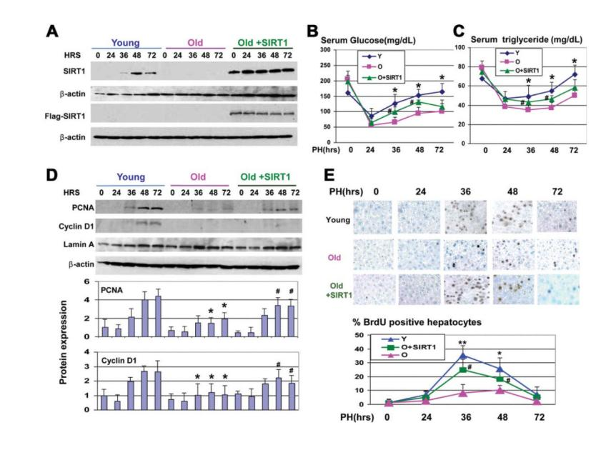
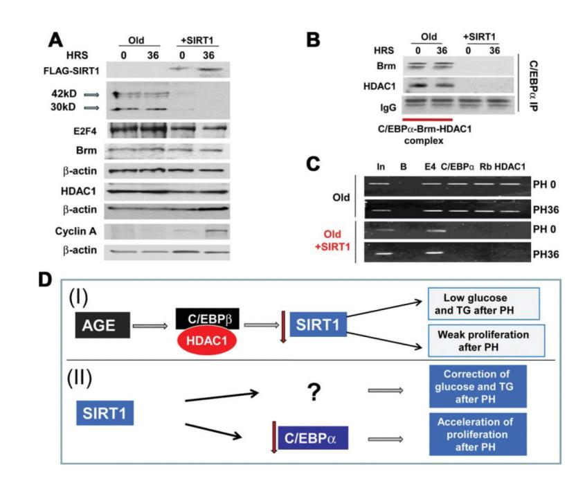

# NIH Public Access

**Author Manuscript**

Hepatology. Author manuscript; available in PMC 2012 September 02.

Published in final edited form as:

Hepatology. 2011 September 2; 54(3): 989–998. doi:10.1002/hep.24471.

## **The Reduction of SIRT1 in Livers of Old Mice Leads to Impaired Body Homeostasis and to Inhibition of Liver Proliferation**

**Jingling Jin**, **Polina Iakova**, **Yanjun Jiang**, **Estela E. Medrano**, and **Nikolai A. Timchenko** Huffington Center on Aging and Departments of Pathology and Immunology and Molecular and Cellular Biology, Baylor College of Medicine, Houston, TX.

### **Abstract**

Age declines liver functions, leading to the development of age-associated diseases. A member of the sirtuins family, SIRT1, is involved in the control of glucose homeostasis and fat metabolism. Because aging livers have alterations in glucose and fat metabolism, we examined a possible role of SIRT1 in these alterations. We found that aged livers have a reduced expression of SIRT1 and have lost proper control of the regulation of SIRT1 after partial hepatectomy (PH). Downregulation of SIRT1 in the liver of old mice is mediated by CCAAT/Enhancer Binding Protein/ histone deacetylase 1 (C/EBPβ-HDAC1) complexes, which bind to and repress the SIRT1 promoter. In the livers of young mice, SIRT1 is activated after PH and supports high levels of glucose and triglycerides during liver regeneration. In old mice, however, C/EBPβ-HDAC1– mediated repression of the SIRT1 promoter blocks activation of SIRT1, leading to low levels of glucose and triglycerides during liver regeneration. Down-regulation of SIRT1 in the livers of young mice resulted in alterations similar to those observed in the livers of old mice, whereas the normalization of SIRT1 in the livers of old mice corrects the levels of glucose and triglycerides after PH. The normalization of SIRT1 in old mice also improves liver regeneration via the elimination of the C/EBPα-Brm complex. These studies showed a critical role of the reduction of SIRT1 in age-associated liver dysfunctions and provide a potential tool for the correction of liver functions in old patients after surgical resections.

> Amember of histone deacetylases, SIRT1 (sirtuin 1), is expressed in many tissues, including the liver, and controls activities of proteins by regulation of their promoters and by direct deacetylation of proteins such as p53.1 SIRT1 regulates physiological processes, including apoptosis, fat metabolism, glucose homeostasis, and neurodegeneration.2 SIRT1 also provides a functional link between metabolism, chromatin structure, and aging.1,3 Knockdown of SIRT1 in the liver causes mild hypoglycemia, increased systemic glucose and insulin sensitivity, and decreased glucose production.4 It has been shown that the activity of SIRT1 is reduced in aged tissues.5

> The liver is one of the critical tissues that regulate glucose and fat metabolism. Two members of the CCAAT/Enhancer Binding Protein (C/EBP) family, C/EBPα and C/EBPβ, are expressed in the liver at high levels and play critical roles in the regulation of liver biology.6,7 C/EBPα and C/EBPβ proteins are transcription factors that interact with promoters of many genes and activate the expression of corresponding proteins.8 The generation of knockout models for these proteins showed that they regulate a variety of

Copyright © 2011 by the American Association for the Study of Liver Diseases.

Address reprint requests to: Nikolai A. Timchenko, Department of Pathology and Immunology and Huffington Center on Aging, Baylor College of Medicine, One Baylor Plaza, Houston, TX 77030. nikolait@bcm.tmc.edu; fax: 713-798-4161.. Potential conflict of interest: Nothing to report.

Additional Supporting Information may be found online in the online version of this article.

biological processes in the liver and body homeostasis.7,9 During the process of aging, many liver functions are altered, leading to the development of age-associated diseases.10 Activities of C/EBPα and C/EBPβ are changed in aged livers. Aging increases the amounts of C/EBPα-HDAC1-Brm complex, which also contains E2F411 and amounts of C/EBPβ-HDAC1 (histone deacetylase 1) complexes.12,13 Our recent papers with C/EBPα-S193D knock-in mice have demonstrated the critical role of C/EBPα-HDAC1 complexes in agelike dysfunctions of the liver.14

#### **Materials and Methods**

#### **Antibodies and Reagents**

Antibodies to C/EBPβ (C19), C/EBPα (14AA), and HDAC1 (H-51) were from Santa Cruz Biotechnology (Santa Cruz, CA), and Anti-Sir2 polyclonal antibody was from Millipore (Billerica, MA). Antibodies to acetyl-histone H3 (Lys9) and histone H3 trimethyl Lys9 were from Abcam (Cambridge, UK). Monoclonal anti-β-actin antibody was from Sigma-Aldrich (St. Louis, MO). The bromodeoxyuridine (BrdU) uptake assay kit was from Invitrogen (Carlsbad, CA). Coimmunoprecipitation (Co-IP) studies were performed as previously described.13,14

#### **Animals, Treatments of Old Mice with Growth Hormone, and partial hepatectomy**

Experiments with animals were approved by the Institutional Animal Care and Use Committee at Baylor College of Medicine (protocol AN-1439). In this article, we used young (4-6 months) and old (22-24 months) mice. Livers were harvested and kept at −80°C. Procedures for the growth hormone (GH) treatment of old mice and for partial hepatectomy (PH) are described in the Supporting Information.

#### **Cotransfection Studies**

Hep3B2 cells were transfected using the Fugene 6 transfection reagent (Roche Molecular Biochemicals, Mannheim, Germany), according to the manufacturer's protocol. Twentyfour hours after transfection, the luciferase assay was performed using the Dual-Luciferase Reporter Assay System (Promega, Madison, WI). Luciferase activity was normalized by the Renilla internal control.

#### **Protein Isolation and Western Blotting**

Cytoplasmic and nuclear extracts were isolated from the livers of young and old mice, as described in a previous article.15 Previous studies showed that both the expression and activity of SIRT1 are regulated in a circadian manner.16 Therefore, all studies described in this article were performed with animals sacrificed at 8:00 a.m. to 10:00 a.m.

#### **Chromatin Immunoprecipitation Assay**

The chromatin immunoprecipitation assay (ChIP) assay was performed, as described in our previous articles, using the Chip-It kit.17 The sequences of primers used in the work were as follows: SIRT1: 5′-TCCTGGCCCTGTCATTTTAG-3′ (forward) and 5′- GACCCACCAGGTCCTCTGTA-3′ (reverse). The final volume of polymerase chain reaction (PCR) reactions was 50 uL. We usually load 5 uL of the PCR reaction on the agarose or PAAG.

#### **Real-Time Quantitative Reverse-Transcriptase PCR**

The RNeasy Plus minikit (Qiagen, Germantown, MD) was applied to extract total RNA, according to the manufacturer's instructions. The sequences of PCR primers were as follows: SIRT1: 5′-ACTGCAGAAACTTTTAGCCTTTCAA-3′ and 5′-

GGCAATGTTCCAAAGAAGTCTGT-3′; mouse β-actin: 5;- AAGTGCTTCTAGGCGGACTGTT-3′ and 5′-TTTTCTGCGCAAGTTAGGTTTTG -3′. Additional procedures are described in the Supporting Information.

#### **Results**

#### **Old Mice Fail to Activate SIRT1 After PH**

Because SIRT1 is an important regulator of liver biology, we began investigations of mechanisms that regulate the expression of SIRT1 in the liver. We found that protein levels of SIRT1 and SIRT1 messenger RNA (mRNA) are reduced in aged livers by approximately 3-4-fold (Fig. 1A,B). The liver is a unique tissue that is able to completely regenerate itself after partial hepatectomy (PH).18 However, liver proliferation is impaired in old mice, and liver functions are also reduced in the course of regeneration. Therefore, we asked whether the reduction of SIRT1 in old mice might be involved in liver dysfunctions. We found that protein levels of SIRT1 are significantly increased in the livers of young mice at 36 and 48 hours after partial hepatectomy, but SIRT1 is not elevated in livers of old mice after PH. One of the important liver functions after PH is the support of blood glucose levels,19 as glucose is an essential source for the promotion of liver regeneration.20 We found that glucose and TG levels are reduced in old and young mice at 24 hours after PH; however, the reduction of glucose and TGs in old mice is much deeper (Fig. 1D,E), and young animals recover glucose and TGs at 72 hours after PH; but, old mice have a weak recovery of both.

#### **Elevation of SIRT1 After PH in Young Mice Is Required for Support of Glucose Homeostasis and for Liver Proliferation**

We next asked whether the increase of SIRT1 after PH is required for liver regeneration. We inhibited the expression of SIRT1 by siRNA and performed an examination of liver proliferation and liver functions within 72 hours after PH. Control animals were treated with an unrelated RNA of random composition. SIRT1 was completely inhibited by shortinterfering RNA (siRNA) at all stages of liver regeneration (Fig. 2A). We next examined levels of glucose and TGs in young mice treated with siRNA to SIRT1, and found that the recovery of glucose and TG was much slower in young mice with inhibited SIRT1 (Fig. 2C). We next examined the expression of cell-cycle proteins and BrdU uptake (i.e., DNA synthesis), and found that the expression of PCNA and cyclin D1 and DNA synthesis are reduced in young mice with inhibited SIRT1 (Fig. 2B,D,E). Thus, these studies showed that the inhibition of SIRT1 in young mice leads to the reduction of liver proliferation and to impaired recovery of glucose and TGs after PH.

#### **HDAC1-C/EBP***β* **Complexes Repress the SIRT1 Promoter in Livers of Old Mice**

We next examined the mouse and human SIRT1 promoters for the presence of binding sites for transcription-factor activities, which are altered in the livers of old mice. These studies revealed that both mouse and human SIRT1 promoters contain several C/EBP sites, and that C/EBPααand C/EBPβ positively regulate the promoters in tissue culture systems (see Supporting Figs. 1 and 2). Therefore, we examined the hypothesis that C/EBP proteins might be positive regulators of the SIRT1 promoter in the livers of young mice; whereas the complexes of C/EBPβ with HDAC1 are negative regulators of the SIRT1 promoter in old mice. C/EBPβ alone activates the SIRT1 promoter; however, simultaneous transfections of C/EBPβ and HDAC1 inhibit the SIRT1 promoter (Fig. 3A). We next tested whether inhibition of endogenous HDAC1 would change the activity of the SIRT1 promoter. Expression of HDAC1 was inhibited in cells transfected with an empty vector and with vector expressing C/EBPβ. The siRNA-mediated down-regulation of HDAC1 leads to the higher activation of the SIRT1 promoter (Fig. 3B). We next inhibited C/EBPβ by siRNA, and found that HDAC1 is not able to repress the SIRT1 promoter in Hep3B2 cells with

inhibited C/EBPβ (Fig. 3C). Thus, these studies demonstrated that HDAC1 represses the SIRT1 promoter via interactions with C/EBPβ.

We next examined whether the SIRT1 promoter might be repressed by C/EBPβ-HDAC1 complexes in the livers of old mice. The livers of old mice contain elevated levels of both HDAC1 and C/EBPβ (Fig. 3D) and higher amounts of the C/EBPβ-HDAC1 complexes (Fig. 3E, upper). The ChIP assay (Fig. 3E, bottom) showed that C/EBPα and C/EBPβ could be observed on the SIRT1 promoter in the livers of young mice, and that histone H3 is acetylated at K9. In the livers of old mice, C/EBPα was reduced, whereas C/EBPβ and HDAC1 were increased on the SIRT1 promoter. These alterations were accompanied with the increase of histone 3 trimethylation at K9, demonstrating that the C/EBPβ-HDAC1 complexes inhibited the SIRT1 promoter (Fig. 3F).

#### **Elimination of C/EBP***β***-HDAC1 Complexes Correct Levels of SIRT1**

Because inhibition of HDAC1 in the livers of old mice causes cell death,17 we eliminated the C/EBPβ-HDAC1 complex by the treatment of old mice with GH. GH reduces levels of C/EBPβ and HDAC1, whereas levels of SIRT1 are increased (Fig. 4A,B). Co-IP studies revealed that the GH-mediated reduction of HDAC1 and C/EBPβ eliminates the C/EBPβ-HDAC1 complexes (Fig. 4C). We found that GH partially restores levels of SIRT1 mRNA in the livers of old mice (Fig. 4D). The ChIP assay showed that GH treatment removes C/ EBPβ-HDAC1 complexes from the SIRT1 promoter (Fig. 4E). Because GH might have some additional effects on chromatin structure, we inhibited the expression of C/EBPβ by siRNA and found that this inhibition removes C/EBPβ-HDAC1 from the SIRT1 promoter and de-represses the promoter (Fig. 4E). Thus, these data show that the elimination of the C/ EBPβ-HDAC1 complexes activates the SIRT1 promoter in the livers of old mice.

#### **The C/EBP***β***-HDAC1 Complex Blocks Activation of the SIRT1 Promoter in Livers of Old Mice**

The livers of old mice failed to elevate SIRT1 protein after PH (Fig. 1C). To examine whether this inhibition would take place on the level of transcription, we examined the expression of SIRT1 mRNA in young and old livers after PH. Levels of SIRT1 mRNA are 4-5-fold increased in young livers at 36 and 48 hours after PH (Fig. 5A). However, the livers of old mice contain very low levels of the SIRT1 mRNA at all stages of liver regeneration. We next examined the hypothesis that C/EBPβ-HDAC1 complex blocks the transcription of SIRT1 mRNA in the livers of old mice after PH. Examination of the protein levels of C/ EBPβ and HDAC1 showed that C/EBPβ is significantly increased after PH in the young liver at all time points after PH. HDAC1 is elevated at 24 hours after PH, but returned to normal levels at 36, 48, and 72 hours. However, the livers of old mice had much higher levels of both C/EBPβ and HDAC1 in the quiescent state and after PH (Fig. 5B). Amounts of C/EBPβ-HDAC1 complexes were also 4-5-fold higher in the livers of old mice within 72 hours after PH (Fig. 5C). The ChIP assay showed that C/EBPβ-HDAC1 complexes repress the SIRT1 promoter at the zero time point and at 36 hours after PH (Fig. 5D). In young mice, we detected an increase of C/EBPβ on the SIRT1 promoter at 36 hours. PCR reactions with different numbers of cell cycles demonstrated that the PCR signals with C/EBPβ IPs from 36 hours are detected after 28 cycles, whereas the PCR signals with the zero time point are detectable after 30-32 cycles (Fig. 5E). Therefore, we conclude that C/EBPβ activates the SIRT1 promoter after PH in young mice; however, C/EBPβ-HDAC1complexes prevent activation of the SIRT1 promoter in the livers of old mice.

#### **Ectopic Expression of SIRT1 in Livers of Old Mice Corrects Levels of Glucose and Triglycerides and Accelerates Liver Proliferation**

To determine the causal role of the reduction of SIRT1 in the impaired glucose metabolism, we delivered the FLAG-SIRT1 into old mice. Western blotting showed that FLAG-SIRT1 protein was expressed in the livers of injected mice at all time points used for the investigations (Fig. 6A). Analysis of blood parameters showed that the correction of SIRT1 in the livers of old mice significantly increased plasma-glucose and TGs levels at 36 and 48 hours after PH, compared with levels in control old mice (Fig. 6B,C). Because the inhibition of SIRT1 in young mice reduces liver proliferation and because the aging liver is characterized by a weak proliferation after PH,10 we examined the levels of PCNA and cyclin D1 during liver regeneration and found that both proteins were activated after PH in old mice with ectopic expression of SIRT1 to higher levels than in control old mice (Fig. 6D). To determine whether DNA replication might also be affected in SIRT1-treated mice, we examined BrdU uptake. These studies showed that DNA synthesis was significantly accelerated in old mice injected with SIRT1 (Fig. 6E).

#### **Ectopic Expression of SIRT1 in Livers of Old Mice Down-regulates C/EBP***α* **and Releases Repression of E2F Targets**

We next determined the mechanisms by which SIRT1 accelerates liver proliferation. Inhibition of liver proliferation in old mice is mediated by C/EBPα-Brm-HDAC1-E2F4 complexes, which repress E2F-dependent promoters.11 Therefore, we first examined the expression of components of the complex. Although protein levels of Brm and HDAC1 were not altered in the livers of SIRT1-injected mice, C/EBPα was dramatically inhibited at the zero time point and at 36 hours after PH in SIRT1-injected mice (Fig. 7A). Levels of E2F4 were slightly reduced, but stayed at relatively high levels. In agreement with PCNA elevation, levels of cyclin A were also increased in SIRT1-injected mice. Examination of C/ EBPα mRNA showed that SIRT1 did not affect C/EBPα mRNA (data not shown), suggesting that SIRT1 down-regulated C/EBPα at levels of translation or protein stability. We next examined C/EBPα-HDAC1-Brm complexes by the Co-IP approach, and found that ectopic expression of SIRT1 eliminated the complexes (Fig. 7B). In the livers of old mice, the C/EBPα-HDAC1-Brm complex represses E2F-dependent promoters, such as the c-myc promoter.21 Therefore, we applied the ChIP assay to measure the occupation of the c-myc promoter by the complex and found that, in control mice, the C/EBPα-Brm complex is observed on this promoter before and after PH; however, SIRT1 expression leads to the removal of the complexes from the promoter (Fig. 7C). Taken together, these studies demonstrated that the normalization of levels of SIRT1 in the livers of old mice improves liver regeneration through the down-regulation of C/EBPα and after de-repression of E2Fdependent promoters (Fig. 7D).

#### **Discussion**

The biological processes in the liver are controlled by a complex network of signaling pathways, which are affected by age. Recent reports demonstrated the critical role of epigenetic alterations in age-associated liver dysfunction.10,22 Despite intensive studies of the role of SIRT1 in liver biology, the molecular mechanisms of the regulation of SIRT1 in the liver have not been previously studied. In this article, we found that the expression of SIRT1 in the liver was controlled by C/EBP proteins. Because activities of these proteins are altered with age, we have shown that SIRT1 is reduced in the livers of old mice, and that this reduction of SIRT1 is associated with the repression of the SIRT1 promoter by C/EBPβ-HDAC1 complexes. Experiments in cultured cells clearly demonstrated that HDAC1 alone did not repress the SIRT1 promoter, and that the HDAC1-dependent repression of the SIRT1 promoter required C/EBPβ.

One of the most interesting findings of our studies was that overexpression of SIRT1 in the livers of old mice corrects liver proliferation. This observation was quite unexpected, as previous studies did not suggest that SIRT1-dependent pathways might be associated with the regulation of C/EBPα. However, our new data clearly demonstrate that ectopic expression of SIRT1 resulted in a dramatic reduction of C/EBPα protein, but not C/EBPα mRNA. Interestingly, this reduction was observed 24 hours after SIRT1 injection before PH, showing that SIRT1 might target C/EBPα in the quiescent liver. Thus, our data show that the normalization of SIRT1 in the livers of old mice corrects the expression of E2Fdependent genes, leading to the acceleration of liver proliferation (Fig. 7D). Although we do not yet know the mechanisms by which SIRT1 down-regulates C/EBPα protein in the livers of old mice, this observation shows one of the possible ways to correct liver regeneration in the elderly. Further studies are required to elucidate how SIRT1 reduces protein levels of C/ EBPα.

#### **Supplementary Material**

Refer to Web version on PubMed Central for supplementary material.

#### **Acknowledgments**

The authors thank Emily Sullivan for her excellent help in her work with animals and Il-Hwa Hong and Vladislav Sharin for their discussion of the experimental data.

This work was supported by National Institutes of Health grants GM55188, CA100070, AG20752 (to N.A.T.), and AG32135 (to E.E.M.).

#### **Abbreviations**

| BrdU       | bromodeoxyuridine                                                                          |
|------------|--------------------------------------------------------------------------------------------|
| C/EBPs     | CCAAT/Enhancer Binding Proteins                                                            |
| C/EBPβ-LAP | Liver Activator Protein, the isoform of C/EBPβ                                             |
| C/EBPβ-LIP | Liver Inhibitor Protein                                                                    |
| ChIP       | chromatin immunoprecipitation assay                                                        |
| Co-IP      | coimmunoprecipitation                                                                      |
| EMSA       | electrophoretic mobility shift assay                                                       |
| GH         | growth hormone                                                                             |
| HDAC1      | histone deacetylase 1                                                                      |
| IgG        | immunoglobulin                                                                             |
| mRNA       | messenger RNA                                                                              |
| PCNA       | proliferating cell nuclear antigen                                                         |
| PH         | partial hepatectomy                                                                        |
| qRT-PCR    | quantitative reverse-transcriptase polymerase chain reaction; polymerase chain reaction |
| SD         | standard deviation                                                                         |
| siRNA      | short-interfering RNA                                                                      |
| SIRT1      | sirtuin 1                                                                                  |

#### **TGs** triglycerides

#### **References**

- 1. Yi J, Luo J. SIRT1 and p53, effect on cancer, senescence, and beyond. Biochim Biophys Acta. 2010; 1804:1684–1689. [PubMed: 20471503]
- 2. Li X, Zhang S, Blander G, Tse JG, Krieger M, Guarente L. SIRT1 deacetylates and positively regulates the nuclear receptor LXR. Mol Cell. 2007; 28:91–106. [PubMed: 17936707]
- 3. Herranz D, Serrano M. Impact of Sirt1 on mammalian aging. Aging (Albany NY). 2010; 2:315–316. [PubMed: 20562473]
- 4. Erion DM, Yonemitsu S, Nie Y, Nagai Y, Gillum MP, Hsiao JJ, et al. SirT1 knockdown in liver decreases basal hepatic glucose production and increases hepatic insulin responsiveness in diabetic rats. Proc Natl Acad Sci U S A. 2009; 106:11288–11293. [PubMed: 19549853]
- 5. Ramsey KM, Mills KF, Satoh A, Imai S. Age-associated loss of Sirt1-mediated enhancement of glucose-stimulated insulin secretion in beta cell-specific Sirt1-overexpressing (BESTO) mice. Aging Cell. 2008; 7:78–88. [PubMed: 18005249]
- 6. Wang H, Iakova P, Wilde M, Welm A, Goode T, Roesler WJ, Timchenko NA. C/EBPalpha arrests cell proliferation through direct inhibition of Cdk2 and Cdk4. Mol Cell. 2001; 8:817–828. [PubMed: 11684017]
- 7. Greenbaum LE, Li W, Cressman DE, Peng Y, Ciliberto G, Poli V, Taub R. CCAAT enhancerbinding protein beta is required for normal hepatocyte proliferation in mice after partial hepatectomy. J Clin Invest. 1998; 102:996–1007. [PubMed: 9727068]
- 8. Johnson PF. Molecular stop signs: regulation of cell-cycle arrest by C/ EBP transcription factors. J Cell Sci. 2005; 118:2545–2555. [PubMed: 15944395]
- 9. Wang ND, Finegold MJ, Bradley A, Ou CN, Abdelsayed SV, Wilde MD, et al. Impaired energy homeostasis in C/EBP alpha knockout mice. Science. 1995; 269:1108–1112. [PubMed: 7652557]
- 10. Timchenko NA. Aging and liver regeneration. Trends Endocrinol Metab. 2009; 20:171–176. [PubMed: 19359195]
- 11. Wang GL, Salisbury E, Shi X, Timchenko L, Medrano EE, Timchenko NA. HDAC1 cooperates with C/EBPalpha in the inhibition of liver proliferation in old mice. J Biol Chem. 2008; 283:26169–26178. [PubMed: 18622015]
- 12. Willis-Martinez D, Richards HW, Timchenko NA, Medrano EE. Role of HDAC1 in senescence, aging, and cancer. Exp Gerontol. 2010; 45:279–285. [PubMed: 19818845]
- 13. Jin J, Wang GL, Shi X, Darlington GJ, Timchenko NA. The age-associated decline of glycogen synthase kinase 3beta plays a critical role in the inhibition of liver regeneration. Mol Cell Biol. 2009; 29:3867–3880. [PubMed: 19398579]
- 14. Wang GL, Shi X, Haefliger S, Jin J, Major A, Iakova P, et al. Elimination of C/EBPalpha through the ubiquitin-proteasome system promotes the development of liver cancer in mice. J Clin Invest. 2010; 120:2549–2562. [PubMed: 20516642]
- 15. Wang GL, Iakova P, Wilde M, Awad S, Timchenko NA. Liver tumors escape negative control of proliferation via PI3K/Akt-mediated block of C/EBP alpha growth inhibitory activity. Genes Dev. 2004; 18:912–925. [PubMed: 15107404]
- 16. Nakahata Y, Kaluzova M, Grimaldi B, Sahar S, Hirayama J, Chen D, et al. The NAD+-dependent deacetylase SIRT1 modulates CLOCK-mediated chromatin remodeling and circadian control. Cell. 2008; 134:329–340. [PubMed: 18662547]
- 17. Wang GL, Salisbury E, Shi X, Timchenko L, Medrano EE, Timchenko NA. HDAC1 promotes liver proliferation in young mice via interactions with C/EBPbeta. J Biol Chem. 2008; 283:26179– 26187. [PubMed: 18622014]
- 18. Michalopoulos GK. Liver regeneration. J Cell Physiol. 2007; 213:286–300. [PubMed: 17559071]
- 19. Tajima T, Goda N, Fujiki N, Hishiki T, Nishiyama Y, Senoo-Matsuda N, et al. HIF-1alpha is necessary to support gluconeogenesis during liver regeneration. Biochem Biophys Res Commun. 2009; 387:789–794. [PubMed: 19643083]

- 20. Lai HS, Chen WJ, Chen KM. Energy substrate for liver regeneration after partial hepatectomy in rats: effects of glucose vs fat. J Parenter Enteral Nutr. 1992; 16:152–156.
- 21. Iakova P, Awad SS, Timchenko NA. Aging reduces proliferative capacities of liver by switching pathways of C/EBPalpha growth arrest. Cell. 2003; 113:495–506. [PubMed: 12757710]
- 22. Jin J, Wang GL, Iakova P, Shi X, Haefliger S, Finegold M, Timchenko NA. Epigenetic changes play critical role in age-associated dysfunctions of the liver. Aging Cell. 2010; 9:895–910. [PubMed: 20698834]

#### **Fig. 1.**

Expression of SIRT1 is reduced in the livers of old mice. (A) Protein levels of SIRT1 in the livers of young and in old mice. Western blotting was performed with nuclear extracts of livers from young (2-4 months) and old (22-24 months) mice. The filter was reprobed with antibodies to Lamin A and β-actin. Levels of SIRT1 were calculated as ratios to β-actin (bar graphs). Data represent mean ± standard deviation (SD), n = 6; \*\*P < 0.01. (B) Levels of SIRT1 mRNA in the livers of young and old mice. Quantitative reverse-transcriptase polymerase chain reaction (qRT-PCR) was performed with RNA isolated from the livers of 4-, 12-, and 24-month-old mice. Levels of SIRT1 mRNA were calculated as ratios to β-actin mRNA. n = 5; \*P < 0.05, \*\*P < 0.01. (C) SIRT1 was elevated after PH in the livers of young mice, but not in the livers of old mice. Western blotting of SIRT1, with nuclear extracts from regenerating livers of young and old mice, was performed. The filter was reprobed with β-actin and Lamin A. (D and E) Glucose and TG levels were determined in the blood of young and old mice. Data represent mean ± SD; n = 3-5; \*P < 0.05.

#### **Fig. 2.**

Inhibition of SIRT1 in the livers of young mice leads to impaired recovery of glucose and TG and inhibition of liver proliferation. (A) Inhibition of SIRT1 by siRNA. Expression of SIRT1, PCNA, and cyclin D1 was examined in nuclear extracts from mice treated with siRNA and mice treated with control RNA. Filters were reprobed with antibodies to Lamin A and β-actin. (B) Protein levels of SIRT1, PCNA, and cyclin D1 were calculated as ratios to β-actin. Data represent mean ± SD; n=3-4; \*P < 0.05. (C) Levels of glucose and TG were determined in the blood of mice. (D) BrdU staining of livers at different time points after PH. Data represent mean ± SD; n = 3-5; \*P < 0.05. (E) Calculations of the amounts of BrdU-positive hepatocytes in the livers of control mice and in livers of mice treated with siRNA to SIRT1. n = 3-5; \*P < 0.05.

#### **Fig. 3.**

C/EBPβ-HDAC1 complexes repress the SIRT1 promoter. (A) HDAC1 inhibits the SIRT1 promoter via interactions with C/EBPβ. The wild-type SIRT1-luc promoter was cotransfected with C/EBPβ and HDAC1. Upper image shows Western blotting of C/EBPβ and HDAC1, with protein extracts used for the examination of luciferase activity. Bar graphs show the activity of the promoter as a ratio to internal Rennila control. \*P < 0.05, \*\*P < 0.01. (B) Inhibition of endogenous HDAC1 increases the ability of C/EBPβ to activate the SIRT1 promoter. Expression of HDAC1 in Hep3B2 cells was inhibited by siRNA, as shown on the upper image, and the SIRT1 promoter was cotransfected with an empty vector and with C/EBPβ.\*P < 0.05. (C) Inhibition of endogenous C/EBPβ releases HDAC1-mediated repression of the SIRT1 promoter. Expression of C/EBPβ was inhibited with siRNA, as shown on the upper image. Cells were cotransfected with the SIRT1 promoter and with HDAC1. Bar graphs show activity of the SIRT1 promoter in transfected cells. \*P < 0.05. (D) Levels of C/EBPβ and HDAC1 proteins are increased in the livers of old mice. Western blotting was performed with nuclear extracts isolated from the livers of young and old mice. Each filter was reprobed with β-actin. (E) Upper image. C/EBPβ was immunoprecipitated from the livers of young and old mice, and HDAC1 was determined in these IPs. Immunoglobulin G (IgG); heavy chains of IgGs. Bottom image. ChIP with the SIRT1 promoter was performed using chromatin solutions from the livers of young and old mice. In: input. B: beads. α, β and HD: IPs with antibodies to C/EBPα, C/EBPβ, and HDAC1 correspondingly. AcK9 and MeK9: IP with antibodies to histone H3 acetylated or trimethylated at K9. (F) Diagram showing a hypothetical regulation of the SIRT1 promoter in the livers of young and old mice.

#### **Fig. 4.**

Elimination of the C/EBPβ-HDAC1 complexes partially corrects expression of SIRT1 in the livers of old mice. (A) Treatment of old mice with GH normalizes expression of C/EBPβ, HDAC1, and SIRT1. Old mice were treated with GH, and Western blotting was performed with antibodies to HDAC1, C/EBPβ, and SIRT1. Light and dark exposures are shown for SIRT1. (B) Levels of C/EBPβ-LAP, SIRT1, and HDAC1 were calculated as ratios to βactin. Bar graphs show a summary of three independent experiments, with 3 animals of each age group. n = 3-4; \*P < 0.05, old versus young; #P < 0.05, old GH versus old. (C) GH eliminates the C/EBPβ-HDAC1 complex. C/EBPβ was immunoprecipitated from the livers of young, old, and old mice treated with GH. HDAC1 and C/EBPβ-LAP were determined in these IPs. Bar graphs show rations of HDAC1 to C/EBPβ in the C/EBPβ IPs. n = 3-4; \*P < 0.05, old versus young; #P < 0.05, old GH versus old. (D) GH-mediated elimination of C/ EBPβ-HDAC1 complexes partially restores levels of SIRT1 mRNA in the livers of old mice. n = 3-4; \*P < 0.05, old versus young; #P < 0.05, old GH versus old. Levels of SIRT1 mRNA were examined by qRT-PCR. (E) Treatment of old mice with GH or with siRNA to C/EBPβ removes C/EBPβ-HDAC1 complexes from the SIRT1 promoter. Chromatin-IP was performed with the livers of young, old, and old mice treated with GH or with siRNA to C/ EBPβ, as described in the legend to Fig. 3.

#### **Fig. 5.**

Livers of old mice fail to increase SIRT1 after PH because of repression of the SIRT1 promoter by the C/EBPβ-HDAC1 complex. (A) Levels of SIRT1 mRNA in the livers of young and old mice after PH. Real-time PCR was performed with total RNA isolated at different time points after PH, and levels of SIRT1 mRNA were determined as ratios to βactin. n = 5. \*P < 0.05, old versus young; #P <0.05, after PH versus before PH. (B) Expression of C/EBPβ and HDAC1 in young and old mice after PH. Bottom images show levels of C/EBPβ-LAP and HDAC1 as ratios to β-actin. (C) Livers of old mice contain high amounts of C/EBPβ-HDAC1 complexes after PH. Amounts of HDAC1 and C/EBPβ-LAP were determined in C/EBPβ IPs. IgG: heavy chains of IgG. Bottom image shows ratios of HDAC1 to C/EBPβ-LAP in C/EBPβ IPs. (D) C/EBPβ activates the SIRT1 promoter in the livers of young mice, whereas the C/EBPβ-HDAC1 complex represses the promoter in the livers of old mice. The ChIP assay was performed with the SIRT1 promoter, as described in the legend to Fig. 3. (E) Levels of C/EBPβ on the SIRT1 promoter at 0 and 36 hours after PH, showing PCR signals after different numbers of cycles of PCR reaction using C/EBPβ IPs from young livers at 0 and 36 hours after PH.

#### **Fig. 6.**

Ectopic expression of SIRT1 in the livers of old mice corrects glucose and TG levels. (A) Protein levels of SIRT1 and FLAG-SIRT1 in experimental animals. Western blotting was performed as described above. (B and C) Glucose and TG levels were determined in the blood of young and old mice and in the blood of old mice injected with FLAG-SIRT1. n = 3-4; \*P < 0.05, young versus old; #P < 0.05, old+SIRT1 versus old. (D) Ectopic expression of SIRT1 leads to the activation of PCNA and cyclin D1 in livers of old mice. Western blotting was performed with nuclear extracts from old and old SIRT1-injected mice. Bottom image shows levels of PCNA and cyclin D1 as ratios to β-actin. n = 3-4; \*P < 0.05, young versus old; #P < 0.05, old+SIRT1 versus old. (E) Ectopic expression of SIRT1 accelerates liver proliferation after PH. Upper panel shows BrdU staining of livers at different time points after PH. Bottom image shows percentage of BrdU-positive hepatocytes. n = 3-4; \*P < 0.05, young versus old; #P < 0.05, old+SIRT1 versus old.

#### **Fig. 7.**

Ectopic expression of SIRT1 down-regulates C/EBPα, eliminates C/EBPα-Brm complex, and releases E2F-deperndent repression of the c-myc promoter. (A) Protein levels of C/ EBPα are reduced in the livers of SIRT1 injected mice. Western blotting was performed with antibodies shown on the left. (B) SIRT1 eliminates the C/EBPα-HDAC1-Brm complex. Co-IP studies were performed with nuclear extracts from the livers of control old mice and from SIRT1-injected mice at 0 and 36 hours after PH. C/EBPα IPs were probed with antibodies to HDAC1 and Brm. IgG: heavy chains of immunoglobulins detected on the Brm filter. (C) SIRT1 removes the C/EBPα-HDAC1 complex from the c-myc promoter. Chromatin IP was performed, with the primers covering the E2F site within the c-myc promoter, to which the C/EBPα-Rb-HDAC1-E2F4 complex binds. (D) Hypothetical role of SIRT1 reduction in dysfunctions of the liver in old mice (I) and pathways by which ectopic expression of SIRT1 might correct liver function (II).