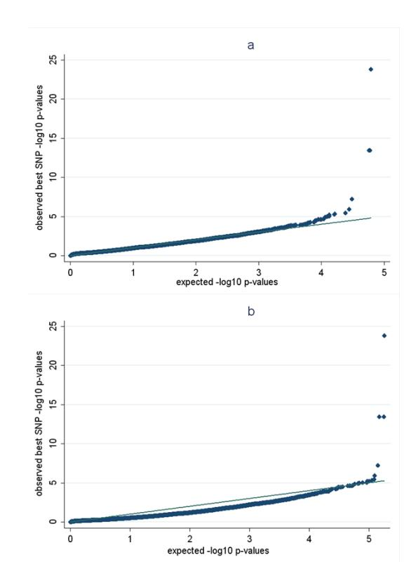

# NIH Public Access

**Author Manuscript**

*Hum Mutat*. Author manuscript; available in PMC 2013 March 1.

#### Published in final edited form as:

Hum Mutat. 2012 March ; 33(3): 521–529. doi:10.1002/humu.22009.

## **Genome-wide and gene-based association implicates** *FRMD6* **in Alzheimer disease**

**Mun-Gwan Hong**1, **Chandra A. Reynolds**2, **Adina L. Feldman**1, **Mikael Kallin**1, **Jean-Charles Lambert**3,4,5, **Philippe Amouyel**3,4,5, **Erik Ingelsson**1, **Nancy L. Pedersen**1, and **Jonathan A. Prince**1,\*

1Department of Medical Epidemiology and Biostatistics, Karolinska Institute, 171 77 Stockholm, Sweden

2Department of Psychology, University of California at Riverside, 92521 Riverside, USA

3 Inserm U744, F-59019 Lille, France

4 Institut Pasteur de Lille, F-59019 Lille, France

5Université de Lille Nord de France, F-59000 Lille, France

## **Abstract**

Genome-wide association studies (GWAS) that allow for allelic heterogeneity may facilitate the discovery of novel genes not detectable by models that require replication of a single variant site. One strategy to accomplish this is to focus on genes rather than markers as units of association, and so potentially capture a spectrum of causal alleles that differ across populations. Here, we conducted a GWAS of Alzheimer disease (AD) in 2586 Swedes and performed gene-based metaanalysis with three additional studies from France, Canada, and the United States, in total encompassing 4259 cases and 8284 controls. Implementing a newly designed gene-based algorithm, we identified two loci apart from the region around *APOE* that achieved study-wide significance in combined samples, the strongest finding being for *FRMD6* on chromosome 14q (p = 2.6 × 10−14) and a weaker signal for *NARS2* that is immediately adjacent to *GAB2* on chromosome 11q (p = 7.8 × 10−9 ). Ontology-based pathway analyses revealed significant enrichment of genes involved in glycosylation. Results suggest that gene-based approaches that accommodate allelic heterogeneity in GWAS can provide a complementary avenue for gene discovery and may help to explain a portion of the missing heritability not detectable with SNPs derived from marker-specific meta-analysis.

## **Keywords**

Alzheimer; GWAS; association; gene-based; FRMD6; GAB2

## **Introduction**

The prevailing strategy for identifying genetic sequence variants that contribute to complextrait variability in human populations is by genome-wide association with subsequent metaanalysis to identify replicating single nucleotide polymorphisms (SNPs). Genome-wide association studies (GWAS) have greatly enhanced knowledge about the underlying genetic

\*Correspondence: Dr. Jonathan A. Prince, Department of Medical Epidemiology and Biostatistics, Karolinska Institutet, Nobels väg 12A, 171 77 Stockholm, Sweden, Phone: +46 (0)8 524 86008, Fax: +46 (0)8 31 49 75, Jonathan.Prince@ki.se .

Supporting Information for this preprint is available from the *Human Mutation* editorial office upon request (humu@wiley.com)

architecture of traits and diseases (Hindorff et al., 2009) but despite their successes, the cumulative effects of most replicated loci only account for a small fraction of heritability (Manolio et al., 2009; Maher 2008). Much of the remaining heritability however has been suggested to be present indirectly in the information contained in tested SNP panels (Yang et al., 2010), with the supposition that this is in the form of causal variants with small effects or in low linkage disequilibrium (LD) with assayed markers. The primary implicit goal of genetic association is to discover and catalogue these causal/functional variants in the genome, with the anticipation that this will lead to accurate risk prediction models and potentially serve as a guide for preventative or curative interventions. This strategy is problematic however within the context of the unknown distribution of causal sites, potentially leading to dismissal of candidate genes if the same SNP cannot be verified across populations. The fidelity of position and structure of genes (i.e. exon/intron boundaries and transcription start and termination motifs) across human populations is nearly absolute, whereas the same does not hold for genetic polymorphism. On this basis, pursuing genes as units of association may provide a valuable complement to ongoing studies, and be especially relevant for regions that display allelic heterogeneity between populations (Neale and Sham, 2004). Studies exhibiting gene-based methods are now emerging, but have yet only been applied to a few phenotypes (Moskvina et al., 2009; Liu et al., 2010; Cui et al., 2008; Wray et al., 2010).

Alzheimer disease (AD; MIM# 104300) is the most common dementing illness of the elderly, entailing the progressive loss of cognitive function that typically extends over the course of several years. AD has a relatively high heritability, with estimates ranging from 58-79% in the largest study to data (Gatz et al., 2006). Genetic association studies in AD are abundant (Bertram et al., 2007), but only recently has the number of strongly replicated genetic loci expanded beyond the well-documented *APOE* locus (Strittmatter et al., 2003). This now includes results from the first large-scale consortium-based GWAS that implicated *PICALM, CLU, CR1*, and *BIN1* (Harold et al., 2009; Lambert et al., 2009; Seshadri et al., 2010). Two additional large GWAS were very recently published that have implicated *ABCA7, MS4A6A, EPHA1, CD33*, and *CD2AP* (Hollingworth et al., 2011; Naj et al., 2011). Additional loci from earlier, smaller scale GWAS have been highlighted in AD (Reiman et al., 2007; Li et al., 2008; Bertram et al., 2008; Beecham et al., 2009; Carrasquillo et al., 2009), but those results have not been widely replicated. As for most GWAS of other human traits, each of the newly implicated loci for AD beyond *APOE* exhibit small effect sizes and together do not improve AD risk prediction (Seshadri et al., 2010). We recently developed an algorithm for use in pathway-based approaches to GWAS data that facilitates the conversion of genetic marker lists to representative gene lists, accounting for LD structure and marker density to assign gene-based significance (Hong et al., 2009). In the present study, we performed a GWAS in a Swedish population-based AD sample, and used our software to implement gene-based meta-analyses.

## **Materials and Methods**

### **Human Samples**

The primary Swedish study sample is derived from participants of four aging twin studies stemming from the population-based Swedish Twin Registry (Lichtenstein et al., 2002). This study was approved by the regional ethical review board of Stockholm. In brief, samples are from the Swedish Adoption/Twin Study of Aging (SATSA) (Pedersen et al., 1991), the Origins of Variance in the Oldest-Old (OCTO-Twin) (McClearn et al., 1997), Sex Differences in Health and Aging Study (GENDER) (Gold et al., 2002), and the Study of Dementia in Swedish Twins (HARMONY) (Gatz et al., 2005). We note that all of these samples are derived from the Twin Registry and participants are from all over Sweden, with no specific location for any of the sub-studies. The total sample for which genotypes were

Hong et al. Page 3

obtained consisted of 2586 individuals, but primary analyses were restricted to 615 AD cases and 1668 controls. There were 303 additional individuals that had other non-AD dementia diagnoses. There were 767 men and 901 women in the control group, and 198 men and 417 women in the AD group. Average last-age in which controls were considered cognitively intact was 78.9 ± 8.8 (SD) years and age-at-onset for AD cases was 78.6 ± 7.3 (SD) years (age-at-onset was available for 465 AD cases). A full description of the samples is provided in the Supporting Information Note. For meta-analysis, three additional GWAS were included, each described in detail previously (Lambert et al., 2009; Reiman et al., 2007; Li et al., 2008). For the latter two studies, all described samples were included, whereas for the former French study, only the primary (stage 1) sample was used. The total number of individuals used in meta-analysis included 4259 AD cases and 8284 controls.

### **Genotyping**

Genotyping was conducted through the Uppsala University SNP technology platform [\(http://www.medsci.uu.se/molmed/snpgenotyping/methods.htm\)](http://www.medsci.uu.se/molmed/snpgenotyping/methods.htm) using a custom designed Illumina iSelect array (Metabochip). In addition to providing genome-wide coverage, this array was designed to capture a large number of rare variants in gene regions implicated in metabolic and cardiovascular disease traits. Genotyping was originally attempted in 2646 individuals. A total of 184,189 SNPs that had p for deviation from HWE > 10−6 and permarker missingness not exceeding 0.1 were retained for analysis. Twenty-six individuals that had genotype call rates < 0.9 were excluded. An additional 34 individuals were removed due to unclear zygosity (e.g. MZ twins not having identical genotypes) or other errors. To be comparable for meta-analyses with the additional GWAS data sets, we performed imputation in the Swedish set after applying the above thresholds using IMPUTE (Marchini et al., 2007) retaining only SNPs with >0.9 posterior probability estimates with a maximum missingness of 0.1 and based on the CEPH (Utah residents with ancestry from northern and western Europe) panel of reference haplotypes from the HapMap project, phase 2. This resulted in a total of 528,184 SNPs that were tested for association and used for the assignment of gene-based statistics (see below). Markers rs7412 and rs429358 in *APOE*, not available on the Metabochip array or from imputation, were specifically genotyped using Illumina GoldenGate assays. Prior to genotyping, all samples were subjected to Whole Genome Amplification (WGA) using standard kits involving Phi29 DNA polymerase (Amersham).

### **Statistics**

Genome-wide association testing of markers in the Swedish sample was performed in two stages due to the family (twin) structure across individuals. In the first pass, we used PLINK [\(http://pngu.mgh.harvard.edu/~purcell/plink/\)](http://pngu.mgh.harvard.edu/~purcell/plink/) to generate an initial single marker significance output file based upon an allelic chi-square model prior to gene assignment. All markers that contributed to gene-based significances (see below) for AD association were rerun using the xtmelogit function implemented in STATA v11.0 to account for twinrelatedeness with two levels in the mixed effects models for type of twin (MZ or DZ) and twin-pair, respectively, and included age and sex covariates. There were thus 13,267 markers that were assigned a covariate and twin adjusted p-value. These corrected p-values were then re-entered into meta-analysis models and those results presented.

To assign gene-based significance, we used proxygeneLD (Hong et al., 2009), a software recently designed by us and implemented in the Perl programming environment that facilitates the conversion of genetic marker lists, predominantly those generated with PLINK (Purcell et al., 2007), to representative gene lists. This is accomplished by an iterative clustering algorithm that considers the local LD relationships derived from userspecified analogous populations with denser genotyping data (for the present study, we used

CEU samples of HapMap phase II, release 22). Adjusted gene significance is assessed as the p-value of the best single marker assigned to each gene multiplied by the number of estimated proxy clusters. For each gene in the Swedish material, the two step process detailed above was used, where the best single marker was adjusted for twin status as well as age and sex. Additional user-specified parameters include gene-boundary windows and the LD threshold for proxy assignment. An LD threshold of r2 > 0.8 was used throughout this study, and gene windows were limited to 10kb upstream of transcription initiation sites to the end of the 3′UTR of the longest known splice-form. Cluster estimation uses LD information to allow for associated markers beyond gene windows, if those significant markers are in strong LD with markers within the LD window threshold (thus, theoretically the number of clusters can exceed the number of typed markers and impose a significance penalty). Thus, the most significant marker assigned to a specific gene can in turn reside outside of the specified gene-boundaries.

Prior to using proxygeneLD, we validated that the marker positions from all four GWAS data sets aligned correctly to the NCBI36/hg18 genome assembly. The lists of significant markers for the additional three GWAS of AD were used as originally presented with minor modification (predominantly formatting data structure, but in the case of the Reiman et al. (2007) sample, conversion from Affymetrix marker ID to rsID was necessary) and two-sided p-values were used from the Swedish sample. We conducted meta-analyses using both the single marker and gene-based association results from the four represented GWAS data sets. Significance for homogeneity of the effect sizes was evaluated according to Fleiss, 1993. To generate overall significances, Stouffer's Z-score method was used (Stouffer et al., 1949). In brief, this entails the conversion of p-values to Z-scores using an inverse normalization. The Z-scores of the independent tests are then summed and scaled by the square-root of the total number of independent tests. Our implementation was based upon the sum of the Ztransforms of the gene-based p-values. The resulting Z was then converted into a p-value and then multiplied by the total number of tested genes to generate a study-wide significance level for each gene.

## **Results**

### **Gene-based GWAS**

The results of using our algorithm to establish gene-based significance for each of the four GWAS are described in Table 1. There, key aspects of the genetic assay structure for those samples are highlighted. As expected, due to the lower marker coverage of the Metabochip array, the Swedish AD sample was represented by the smallest number of genes. As a reference point, maximum coverage of the genome that we have obtained using our algorithm on any platform (imputed or otherwise) is approximately 17,800 genes. For the present study, there were 12,855 genes that were represented across all four samples, and this was thus used as the correction factor to establish study-wide significance (we made no attempt to align the three remaining GWAS excluding our Swedish AD sample). Genelength and number of SNPs across each gene were strongly correlated for all data sets as expected (r2 ranging from 0.78 – 0.84). From meta-analysis, there were two genes that apart from *APOE* achieved strong study-wide significance. The foremost of these was *FRMD6*, located on chromosome 14q (puncorrected = 2.6 × 10−14, pcorrected = 3.4 × 10−4 ). We note that the effect of *APOE* was best captured by the adjacent gene, *PVRL2*, which gave a studywide gene-based p ≈ 10−55 and is not shown – this derives from the probable pathogenic marker rs429358 in *APOE* not being available on commercial multiplex genotyping platforms or being adequately imputable. In fact, *APOE* was not a candidate gene in two of the tested samples (Reimen et al. and Li et al), specifically due again to the lack of rs429358 or markers in high LD. The markers in *FRMD6* that exhibited the strongest associations in each of the four AD GWAS are highlighted in Table 2 as well as their relative positions. We

note that the marker generating significance for the Swedish sample had a genotyping success rate of 98.4%. Using HapMap release 22 in the CEU population as a reference, LD between these various markers was low (Supp. Table S1). Two of the markers were not imputable in the Swedish sample, also in support of LD being low. While the fully imputed data set was used for the Swedish AD sample, only the best directly genotyped marker was used to generate study-wide significance for the meta-analysis (Table 2). Odds ratios for the most associated markers for *FRMD6* were on average moderately high across all samples, consistent with the presence of heterogeneous causal alleles with effect sizes that are somewhat larger than most reported associations across other GWAS of AD and other traits (Table 2). We noted that the p for homogeneity of the effect sizes was significant 4.6 × 10−5 , also consistent with heterogeneous functional alleles. Minor allele frequencies were also low for all four variants, suggesting that the risk/protective functional alleles are also rare. Focusing on *FRMD6* for the Swedish sample, we also modeled the best marker (rs11626565) using our full set of dementia cases (there were 303 non-AD dementias in addition to the previously used 615 AD cases) and tested the result in the gene-based metaanalysis. Twin-adjusted significance for rs11626565 using all dementia cases was 2.1 × 10−5 and using this result in the meta-analysis for *FRMD6* gave a significance of puncorrected = 2.3 × 10−14 and study-wide pcorrected = 1.9 × 10−4 . The second gene that emerged as study-wide significant was *NARS2*, located on chromosome 11q (pcorrected = 4.7 × 10−2 ). The best individual single marker and gene-based statistics for *NARS2* as well as the gene-based results for the top 100 findings from for all four AD GWAS are listed in Supp. Table S2. Quantile-quantile plots of the results for the Swedish sample are shown in Figure 1.

### **Alternative gene based correction factors**

The primary study-wide gene-based results from meta-analysis were derived by starting with the LD-adjusted per-gene p-values for each of the four independent GWAS data sets. We also compared those results using Stouffer's Z-score method (Stouffer et al., 1949), but by beginning with the individual best single marker p-values from each sample, where the combined p-value is multiplied by the product of all of the individual LD-clusters and then in turn multiplied by the total number of tested genes. For *FRMD6*, the corrected p-value from this analysis was 4.6 × 10−4 (based upon a total correction factor of 1.7 × 1010, i.e. 46\*73\*31\*13\*12855). Taking this one step further, since the level of LD and thus clustering can be a key factor in declaring significance, we also applied the strictest possible correction to these four samples (i.e. adjustment for all tested markers in the gene intervals for all four samples, thus accepting the potential that not accounting for LD would induce overly conservative significance estimates). The number of total markers as well as estimated clusters tested in each of the four samples is listed in Table 2. *FRMD6* remained significant with this correction (p = 4.9 × 10−3 ; based upon a 1.8 × 1011 correction factor). *NARS2* did not survive this correction (not shown). See Figure 1 for quantile-quantile plots of the comparison of correcting for proxy clusters versus correcting for all testable genetic markers in a gene region.

### **Correlation of gene ranks across GWAS data sets**

Guided by earlier work indicating an enrichment of causal alleles across independent GWAS of similar diseases based upon SNPs (Purcell et al., 2009), we also sought evidence that gene-based statistics might follow a similar trend. We performed linear regression of the ranked gene-based results for our Swedish AD sample versus the other three AD sets. This was significant for all three, and the results are shown in Table 3. We then compared this result with additional GWAS data sets not specifically ascertained for dementia, three from a study of Crohn disease (Barret et al., 2008), and three additional studies of serum lipid traits (Kathiresan et al., 2009). None of the Crohn sets were significantly correlated with our Swedish AD sample (Table 3). However, the GWAS of the Swedish AD sample did

correlate with the GWAS of triglycerides, but not the HDL or LDL sets. This full analysis of all sets was also performed a second time after removing an approximately 1Mb region around the *APOE* locus, but this did not alter the results. The explained variance, which provides an indication of the proportion of shared causal genes for AD, was highest for the Li et al. (2008) study, but relatively low in general for the other two AD sets (Table 3).

### **Pathway analyses**

Our algorithm was originally designed to facilitate pathway-based analyses of GWAS. This was also done for the present study using both the Swedish AD results and the gene-based meta-analysis results. The ranked list was used in a threshold-dependent analysis for enrichment of gene ontology (GO; Ashburner et al., 2000) terms using GO-elite [\(http://www.genmapp.org/go\\_elite/\)](http://www.genmapp.org/go_elite/), taking the top 5% of genes as the input set with the full list serving as the denominator. Our approach for enrichment analysis was iterative where significant emergent terms were assessed for artificial enrichment in which contributing genes are clustered locally that have similar annotations (see Hong et al., 2009 for details about the effects of clustering). This "de-clustering" step was done manually. In Table 4, we highlight the top ten terms that were significant after permutation in the Swedish sample. We note that the top eight terms were also sufficiently significant to withstand a strict multiple testing correction (an appropriate correction factor for pathway analyses in general is approximately 1000). In Table 5, the same analysis was conducted but using the full genebased meta-analysis results of all four AD GWAS samples. While multiple significant terms again appeared, there was no obvious overlap with the Swedish AD results.

### **Gene expression and pathway analysis of FRMD6**

Relatively little is known about the function of *FRMD6*. Since function can be inferred by examining the genes and pathways it presumably interacts with, we consulted a recently conducted gene expression study in human brain (Myers et al., 2007). We modeled the simple linear correlation of *FRMD6* with 14,077 transcripts and performed pathway analysis on the resulting ranked list, as before using GO-elite and taking the top 5% of the most correlated genes. Because we were interested in potential biological overlap with the genes that are now regarded to influence AD (APOE, PICALM, CR1, CLU, BIN1, PSEN1, PSEN2, APP, ABCA7, MS4A6A, EPHA1, CD33, and *CD2AP*), we performed the same analysis again for each of these (*CR1, CD33, CD2AP*, and *EPHA1* were not detected at sufficient levels in the expression sample). The results of the analysis are shown in Table 6, where the three most associated terms for each gene are exhibited. The results for the top ten correlations of *FRMD6* are shown in Supp. Table S3. This data set was also used to examine if genetic markers near *FRMD6* contribute to its mRNA transcript levels, but none exhibited association with p < 0.05 (not shown).

### **Discussion**

In summary, in addition to the genomic interval around *APOE* that was confirmed to be associated with AD, our approach highlighted a novel candidate locus near *FRMD6* on chromosome 14q and provided support for *NARS2* which is immediately adjacent to a previously implicated gene, *GAB2* (Reiman et al., 2007). These results represent one of the first successful illustrations of identifying susceptibility genes in the absence of replicated individual genetic markers and thus move beyond what is typically being presented across GWAS conducted to date. We believe this strengthens the importance of considering several levels of genetic association, where the initial steps via GWAS of single markers explaining a proportion of phenotypic variance, but where alternative genetic models may be necessary to explain additional variance. In the present study, the evidence of a susceptibility gene that

is not detected by marker-dependent meta-analysis may be an indication of study-specific allelic heterogeneity.

The primary implicated gene, *FRMD6*, has biological and genetic properties that make it an intriguing candidate for AD. In particular, *FRMD6* has been highlighted in two previous GWAS, and in each case they were related to brain function. The first was a study of hippocampal atrophy (Potkin et al., 2009) and the second of brain structure based upon voxel phenotypes (Stein et al., 2010). Little is known about the biological function of FRMD6, but we surveyed the brain transcriptome to identify putative interacting genes. Among the five most strongly correlated genes were *SNCAIP*, coding for a protein that interacts with alpha-synuclein and may be involved in neurodegeneration, and *CTBP2* that plays a role in the function of synaptic ribbons. We also undertook a pathway based approach using the brain gene expression data to attempt to illuminate the broad biological function of *FRMD6*, and found it most likely functions in transcription and protein modification.

The second gene that exhibited study-wide significance, *NARS2*, is immediately adjacent to *GAB2*, which was previously shown to be strongly associated with AD (Reiman et al., 2007), but did not achieve widespread replication in follow-on studies in other populations. These two genes occur in a very strong LD block that spans the full extent of both transcripts. *NARS2* encodes a tRNA synthetase and so in our view has questionable relevance for AD. The original publication on *GAB2* also involved important additional functional studies that we think provide a much better case for *GAB2* being the susceptibility gene. From Table S2, the explanation for our algorithm assigning strong significance to *NARS2* rather than *GAB2* can be seen in the contribution of the Lambert et al. (2009) sample, for which a strong single marker was linked to *NARS2*.

Across the GWAS of AD conducted to date, the effect sizes of genes beyond *APOE* now consistently replicated have been small, in agreement with other complex traits and diseases (e.g. Crohn disease, BMI, type 2 diabetes). The number of validated loci however is lower, possibly deriving from the relatively small sample sizes yet obtained for studying AD genetics, but perhaps also reflecting the existence of fewer genes of detectable effect sizes than other diseases. We obtained strong evidence that our Swedish AD sample shared more in common with other AD GWAS than with GWAS of distinct/non-CNS disorders. Purcell et al. (2009) were the first to approach this question of the polygenic character of traits by assessing the full extent of genetic variation applied to the study of schizophrenia. Our results are compatible with those findings, but we do note that the correlations observed for our data set were much smaller than those previously reported. In comparison however, Purcell et al. (2009) reported on three schizophrenia samples, two of which had high correlation with the test sample, whereas one did not. In the present study, one of the independent AD samples had a high degree of correlation whereas the others did not. We think that variability between samples in terms of genetic architecture should be expected, and both the present study and the previous would seem to reflect this. Nonetheless, the present result does provide evidence of additional genes beyond the few that are now considered to contribute to AD risk.

One solution to facilitate the discovery of additional susceptibility genes is to conduct pathway analyses. This can provide evidence of associated genes that are not detectable by virtue of nominal gene-based or single marker significance, but can be implicated if they tend to group with other risk genes that have similar annotations. In the present study, we obtained strong evidence of enrichment of genes involved in glycosylation, although several other significant terms did emerge. We remain cautious however, since the relative ranks of the genes annotated to glycosylation were low in general and since this finding was not

evident in the Swedish AD sample in isolation. Across the various annotations, there was essentially no overlap in the Swedish AD result compared with the meta-analysis, but this could simply derive from there being much less power in the former. It remains unlikely however that any of the identified genes in any of the pathways when considered alone play anything but a small role in AD risk. The value of this result may instead be in the guidance it provides of potential common biological themes. In this particular instance, the evidence might suggest that genes involved in protein and lipid modification are enriched among genes associated with AD. There have only been a handful of pathway-based analyses performed on AD and across those there is little consistency. One possible overlap however is the implication that lipid metabolism is involved in AD, and the present results support that indirectly (Jones et al., 2010). Of note, only one previously implicated AD gene appears in Table 5, and this is *GAB2*. Pathway strategies in general will be strongly affected by the genes that are represented by the genotyping platform used. This was very evident in the present study where *APOE* was not represented adequately in two of the tested samples.

Our strategy differs significantly from existing set-based approaches such as that implemented in PLINK (Purcell et al., 2007) and another recently described algorithm (Liu et al., 2010). These require multiple significant signals for an emergent per-gene statistic to survive multiple-test correction. These thus achieve power if there is allelic heterogeneity within each gene but in the same sample, whereas our strategy can implicate a gene if different signals exist in different studies/populations. There are a variety of other parameters that differ among the existing incarnations of marker-to-gene conversion algorithms, one of the most important in our view being the window beyond canonical gene boundaries. Our choice of a very small window (10kb upstream to the end of the 3′UTR of the longest known transcript) was dictated by estimates from eQTL studies that regulatory variation occurs predominantly very close to the promoter and 3′UTR (Veyrieras et al., 2008). Regulatory elements can certainly exist farther away (Enattah et al., 2002), but a balance needs to be made between a loss of power in terms of over-correction for many markers and missing real variants that influence the function of a nearby gene. The relative proportion of trait modifying variants that are regulatory across GWAS conducted to date (e.g. influencing splice-forms/expression) or structural (e.g. amino-acid changing) is unclear. Some diseases may have a large component of regulatory variants (Nicolae et al., 2010), whereas others may be dominated by structural polymorphism. However, initial investigation suggests that non-synonymous coding sequence variants may not be overrepresented (Chen et al., 2010). This is admittedly a young approach and rests upon the fidelity of gene-conversion (i.e. does marker significance really reflect that particular gene) and appropriate gene-based significance correction (i.e is the "gene" really significant in the context of multiple testing). Since we are interested in the possibility of a single region harboring risk alleles at different sites, the correction factor can be quite large (here is was on the order of 1011), so this approach still requires considerable sample sizes to achieve power for detection. In retrospect, the discovery of *FRMD6* highlighted here did not require any software beyond a simple assignment of genetic markers to genes, since the result withstood correction for multiple testing even when all tested markers spanning the region were included, thus without a need for a permutation-based or clustering-based algorithm to account for LD. We think this latter point can be important to mollify concerns if an emergent gene-based significance is found using one algorithm but not another.

The various samples used in the present meta-analysis are derived from different genotyping platforms. While most of the genes in the genome overlap across the different arrays, there is a sizeable number that were not present in our sample (see Table 1). There are thus many genes that were not tested for gene-based significance. This will only be rectified as higher density genotyping is applied to these samples since imputation will primarily only increase density in already typed regions, rather than to encompass more genes. Another key issue

with the different genotyping platforms is whether or not we merely observed a signal for a hidden, un-typed genetic variant that was equivalent across the samples. We specifically checked for LD of the primary variants in each of the samples and conclude they are distinct, having very low levels of LD between them.

In summary, the evidence of disease causation established for Mendelian traits strongly indicates that allelic heterogeneity is the norm, consistent with the multitude of ways mutation can influence gene function (Stenson et al., 2009), although the existence of allelic heterogeneity across samples for common polygenic traits has not been readily testable. The implicit assumption of common causative variation in GWAS is problematic against this background. On this basis, we think the present results and general strategy may be extendable to other traits and diseases. Our algorithm can easily be incorporated to augment the arsenal of tools used in ongoing and previously conducted GWAS towards this goal. This has allowed us to highlight *FRMD6* as a new potential AD candidate beyond those now reproducibly associated with the disease, in addition to providing a validation of *GAB2*. Both of these may be considered for follow-up in other populations and fine mapping to discover what may be heterogeneous functional sequence variants. While the sample size for the combined studies examined here is relatively large, further replication is clearly needed, and should be done so with both independent algorithms for gene assignment and independent strategies for gene-based meta-analysis.

### **Supplementary Material**

Refer to Web version on PubMed Central for supplementary material.

### **Acknowledgments**

This work was supported by the US National Institutes of Health [AG028555, AG08724, AG04563, AG10175, AG08861]; and the Swedish Research Council [2007-2722].

### **References**

- Ashburner M, Ball CA, Blake JA, Botstein D, Butler H, Cherry JM, Davis AP, Dolinski K, Dwight SS, Eppig JT, Harris MA, et al. Gene ontology: tool for the unification of biology. The Gene Ontology Consortium. Nat Genet. 2000; 25:25–9. [PubMed: 10802651]
- Barrett JC, Hansoul S, Nicolae DL, Cho JH, Duerr RH, Rioux JD, Brant SR, Silverberg MS, Taylor KD, Barmada MM, et al. Genome-wide association defines more than 30 distinct susceptibility loci for Crohn's disease. Nat Genet. 2008; 40:955–62. [PubMed: 18587394]
- Beecham GW, Martin ER, Li YJ, Slifer MA, Gilbert JR, Haines JL, Pericak-Vance MA. Genome-wide association study implicates a chromosome 12 risk locus for late-onset Alzheimer disease. Am J Hum Genet. 2009; 84:35–43. [PubMed: 19118814]
- Bertram L, Lange C, Mullin K, Parkinson M, Hsiao M, Hogan MF, Schjeide BM, Hooli B, Divito J, Ionita I, Jiang H, et al. Genome-wide association analysis reveals putative Alzheimer's disease susceptibility loci in addition to APOE. Am J Hum Genet. 2008; 83:623–32. [PubMed: 18976728]
- Bertram L, McQueen MB, Mullin K, Blacker D, Tanzi RE. Systematic meta-analyses of Alzheimer disease genetic association studies: the AlzGene database. Nat Genet. 2007; 39:17–23. [PubMed: 17192785]
- Carrasquillo MM, Zou F, Pankratz VS, Wilcox SL, Ma L, Walker LP, Younkin SG, Younkin CS, Younkin LH, Bisceglio GD, et al. Genetic variation in PCDH11X is associated with susceptibility to late-onset Alzheimer's disease. Nat Genet. 2009; 41:192–8. [PubMed: 19136949]
- Chen R, Davydov EV, Sirota M, Butte AJ. Non-synonymous and synonymous coding SNPs show similar likelihood and effect size of human disease association. PLoS One. 2010; 5(10):e13574. [PubMed: 21042586]

- Cui Y, Kang G, Sun K, Qian M, Romero R, Fu W. Gene-centric genomewide association study via entropy. Genetics. 2008; 179:637–50. [PubMed: 18458106]
- Enattah NS, Sahi T, Savilahti E, Terwilliger JD, Peltonen L, Järvelä I. Identification of a variant associated with adult-type hypolactasia. Nat Genet. 2002; 30:233–7. [PubMed: 11788828]
- Fleiss JL. The statistical basis of meta-analysis. Stat Methods Med Res. 1993; 2:121–45. [PubMed: 8261254]
- Gatz M, Fratiglioni L, Johansson B, Berg S, Mortimer JA, Reynolds CA, Fiske A, Pedersen NL. Complete ascertainment of dementia in the Swedish Twin Registry: the HARMONY study. Neurobiol Aging. 2005; 26:439–447. [PubMed: 15653172]
- Gatz M, Reynolds CA, Fratiglioni L, Johansson B, Mortimer JA, Berg S, Fiske A, Pedersen NL. Role of genes and environments for explaining Alzheimer disease. Arch Gen Psych. 2006; 63:168–174.
- Gold CH, Malmberg B, McClearn GE, Pedersen NL, Berg S. Gender and health: a study of older unlike-sex twins. J Gerontol B Psychol Sci Soc Sci. 2002; 57:S168–176. [PubMed: 11983743]
- Harold D, Abraham R, Hollingworth P, Sims R, Gerrish A, Hamshere ML, Pahwa JS, Moskvina V, Dowzell K, Williams A, et al. Genome-wide association study identifies variants at CLU and PICALM associated with Alzheimer's disease. Nat Genet. 2009; 41:1088–93. [PubMed: 19734902]
- Hindorff LA, Sethupathy P, Junkins HA, Ramos EM, Mehta JP, Collins FS, Manolio TA. Potential etiologic and functional implications of genome-wide association loci for human diseases and traits. Proc Natl Acad Sci USA. 2009; 106:9362–7. [PubMed: 19474294]
- Hollingworth P, Harold D, Sims R, Gerrish A, Lambert JC, Carrasquillo MM, Abraham R, Hamshere ML, Pahwa JS, Moskvina V, et al. Common variants at ABCA7, MS4A6A/MS4A4E, EPHA1, CD33 and CD2AP are associated with Alzheimer's disease. Nat Genet. Apr 3.2011 Epub ahead of print.
- Hong MG, Pawitan Y, Magnusson PK, Prince JA. Strategies and issues in the detection of pathway enrichment in genome-wide association studies. Hum Genet. 2009; 126:289–301. [PubMed: 19408013]
- Jones L, Holmans PA, Hamshere ML, Harold D, Moskvina V, Ivanov D, Pocklington A, Abraham R, Hollingworth P, Sims R, et al. Genetic evidence implicates the immune system and cholesterol metabolism in the aetiology of Alzheimer's disease. PLoS One. 2010; 5(11):e13950. [PubMed: 21085570]
- Kathiresan S, Willer CJ, Peloso GM, Demissie S, Musunuru K, Schadt EE, Kaplan L, Bennett D, Li Y, Tanaka T, et al. Common variants at 30 loci contribute to polygenic dyslipidemia. Nat Genet. 2009; 41:56–65. [PubMed: 19060906]
- Lambert JC, Heath S, Even G, Campion D, Sleegers K, Hiltunen M, Combarros O, Zelenika D, Bullido MJ, Tavernier B, et al. Genome-wide association study identifies variants at CLU and CR1 associated with Alzheimer's disease. Nat Genet. 2009; 41:1094–9. [PubMed: 19734903]
- Li H, Wetten S, Li L, St Jean PL, Upmanyu R, Surh L, Hosford D, Barnes MR, Briley JD, Borrie M, Coletta N, et al. Candidate single-nucleotide polymorphisms from a genomewide association study of Alzheimer disease. Arch Neurol. 2008; 65:45–53. [PubMed: 17998437]
- Lichtenstein P, De Faire U, Floderus B, Svartengren M, Svedberg P, Pedersen NL. The Swedish Twin Registry: a unique resource for clinical, epidemiological and genetic studies. J Intern Med. 2002; 252:184–205. [PubMed: 12270000]
- Liu JZ, McRae AF, Nyholt DR, Medland SE, Wray NR, Brown KM, AMFS Investigators. Hayward NK, Montgomery GW, Visscher PM, et al. A versatile gene-based test for genome-wide association studies. Am J Hum Genet. 2010; 87:139–45. [PubMed: 20598278]
- Maher B. Personal genomes: The case of the missing heritability. Nature. 2008; 456:18–21. [PubMed: 18987709]
- Manolio TA, Collins FS, Cox NJ, Goldstein DB, Hindorff LA, Hunter DJ, McCarthy MI, Ramos EM, Cardon LR, Chakravarti A, et al. Finding the missing heritability of complex diseases. Nature. 2009; 461:747–53. [PubMed: 19812666]
- Marchini J, Howie B, Myers S, McVean G, Donnelly P. A new multipoint method for genome-wide association studies by imputation of genotypes. Nat Genet. 2007; 39:906–913. [PubMed: 17572673]

- McClearn GE, Johansson B, Berg S, Pedersen NL, Ahern F, Petrill SA, Plomin R. Substantial genetic influence on cognitive abilities in twins 80 or more years old. Science. 1997; 276:1560–1563. [PubMed: 9171059]
- Moskvina V, Craddock N, Holmans P, Nikolov I, Pahwa JS, Green E, Wellcome Trust Case Control Consortium. Owen MJ, O'Donovan MC. Gene-wide analyses of genome-wide association data sets: evidence for multiple common risk alleles for schizophrenia and bipolar disorder and for overlap in genetic risk. Mol Psychiatry. 2009; 14:252–60. [PubMed: 19065143]
- Myers AJ, Gibbs JR, Webster JA, Rohrer K, Zhao A, Marlowe L, Kaleem M, Leung D, Bryden L, Nath P, Zismann VL, et al. A survey of genetic human cortical gene expression. Nat Genet. 2007; 39:1494–9. [PubMed: 17982457]
- Naj AC, Jun G, Beecham GW, Wang LS, Vardarajan BN, Buros J, Gallins PJ, Buxbaum JD, Jarvik GP, Crane PK, et al. Common variants at MS4A4/MS4A6E, CD2AP, CD33 and EPHA1 are associated with late-onset Alzheimer's disease. Nat Genet. Apr 3.2011 Epub ahead of print.
- Neale BM, Sham PC. The future of association studies: gene-based analysis and replication. Am J Hum Genet. 2004; 75:353–62. [PubMed: 15272419]
- Nicolae DL, Gamazon E, Zhang W, Duan S, Dolan ME, Cox NJ. Trait-associated SNPs are more likely to be eQTLs: annotation to enhance discovery from GWAS. PLoS Genet. 2010; 6(4):e1000888. [PubMed: 20369019]
- Pedersen NL, McClearn GE, Plomin R, Nesselroade JR, Berg S, DeFaire U. The Swedish Adoption/ Twin Study of Aging: An update. Acta Geneticae Medicae et Gemellologiae: Twin Res. 1991; 40:7–20.
- Potkin SG, Guffanti G, Lakatos A, Turner JA, Kruggel F, Fallon JH, Saykin AJ, Orro A, Lupoli S, Salvi E, Weiner M, et al. Hippocampal atrophy as a quantitative trait in a genome-wide association study identifying novel susceptibility genes for Alzheimer's disease. PLoS One. 2009; 4(8):e6501. [PubMed: 19668339]
- Purcell SM, Wray NR, Stone JL, Visscher PM, O'Donovan MC, Sullivan PF, Sklar P. Common polygenic variation contributes to risk of schizophrenia and bipolar disorder. Nature. 2009; 460:748–52. [PubMed: 19571811]
- Purcell S, Neale B, Todd-Brown K, Thomas L, Ferreira MA, Bender D, Maller J, Sklar P, de Bakker PI, Daly MJ, et al. PLINK: a tool set for whole-genome association and population-based linkage analyses. Am J Hum Genet. 2007; 81:559–75. [PubMed: 17701901]
- Reiman EM, Webster JA, Myers AJ, Hardy J, Dunckley T, Zismann VL, Joshipura KD, Pearson JV, Hu-Lince D, Huentelman MJ, et al. GAB2 alleles modify Alzheimer's risk in APOE epsilon4 carriers. Neuron. 2007; 54:713–20. [PubMed: 17553421]
- Reynolds CA, Hong MG, Eriksson UK, Blennow K, Bennet AM, Johansson B, Malmberg B, Berg S, Wiklund F, Gatz M, et al. A survey of ABCA1 sequence variation confirms association with dementia. Human Mutation. 2009; 30:1348–54. [PubMed: 19606474]
- Seshadri S, Fitzpatrick AL, Ikram MA, DeStefano AL, Gudnason V, Boada M, Bis JC, Smith AV, Carassquillo MM, Lambert JC, et al. Genome-wide analysis of genetic loci associated with Alzheimer disease. JAMA. 2010; 303:1832–40. [PubMed: 20460622]
- Stein JL, Hua X, Lee S, Ho AJ, Leow AD, Toga AW, Saykin AJ, Shen L, Foroud T, Pankratz N, et al. Voxelwise genome-wide association study (vGWAS). Neuroimage. 2010; 53:1160–74. [PubMed: 20171287]
- Stenson PD, Ball EV, Howells K, Phillips AD, Mort M, Cooper DN. The Human Gene Mutation Database: providing a comprehensive central mutation database for molecular diagnostics and personalized genomics. Hum Genomics. 2009; 4:69–72. [PubMed: 20038494]
- Stouffer, SA.; Suchman, EA.; DeVinney, LC.; Star, SA.; Williams, RM, Jr.. The American Soldier, Vol. 1:Adjustment during Army Life. Princeton University Press; Princeton: 1949.
- Strittmatter WJ, Saunders AM, Schmechel D, Pericak-Vance M, Enghild J, Salvesen GS, Roses AD. Apolipoprotein E: high-avidity binding to beta-amyloid and increased frequency of type 4 allele in late-onset familial Alzheimer disease. Proc Natl Acad Sci USA. 1993; 90:1977–1981. [PubMed: 8446617]

- Veyrieras JB, Kudaravalli S, Kim SY, Dermitzakis ET, Gilad Y, Stephens M, Pritchard JK. Highresolution mapping of expression-QTLs yields insight into human gene regulation. PLoS Genet. 2008; 4:e1000214. [PubMed: 18846210]
- Wray NR, Pergadia ML, Blackwood DH, Penninx BW, Gordon SD, Nyholt DR, Ripke S, Macintyre DJ, McGhee KA, Maclean AW, et al. Genome-wide association study of major depressive disorder: new results, meta-analysis, and lessons learned. Mol Psychiatry. Nov 2.2010 Epub ahead of print.
- Yang J, Benyamin B, McEvoy BP, Gordon S, Henders AK, Nyholt DR, Madden PA, Heath AC, Martin NG, Montgomery GW, et al. Common SNPs explain a large proportion of the heritability for human height. Nat Genet. 2010; 42:565–9. [PubMed: 20562875]

Hong et al. Page 13

### **Figure 1.**

Quantile-quantile plots of observed versus expected −log10 p-values of the best unadjusted SNP p-values in the Swedish sample in relation to AD. (a) observed p-values versus a null distribution based upon an equivalent number of tested genes that has been adjusted for the number of proxy clusters as estimated using ProxyGeneLD. (b) observed p-values versus a null distribution created from an equivalent number of tested genes that has been adjusted for the full number of SNPs in each gene region. Association of rs429358 in *APOE* is included in these plots, since it was available in the Swedish sample. Note that there is no evidence of inflation in (a) whereas (b) shows a deflation of significance, indicating that full adjustment for all tested SNPs in a region is conservative.

| mples      |
|------------|
|            |
|            |
| mary of Sa |
|            |
|            |
|            |
|            |
| m          |
| Su         |
|            |

| Sample              | Cases | Controls | Total Markers | Genic Markers | Genes | Markers/Gene | Marker Spacing |
|---------------------|-------|----------|---------------|---------------|-------|--------------|----------------|
| Swedish             | 615   | 1668     | 528184        | 242679        | 13267 | 6            | 5158 bp        |
| Lambert et al. 2009 | 2032  | 5328     | 511977        | 235780        | 17229 | 5            | 5436 bp        |
| Reiman et al. 2007  | 859   | 552      | 311013        | 132906        | 16443 | 3            | 9443 bp        |
| Li et al. 2008      | 753   | 736      | 463868        | 199291        | 17411 | 4            | 6264 bp        |

Genic markers were established within 10kb upstream of transcription start sites to the 3′UTR of the longest known splice-form. Markers/gene is presented as a median. Marker spacing is presented as an average.

| Table 2                                                                                         |
|-------------------------------------------------------------------------------------------------|
| Markers in FRMD6 exhibiting significant association with AD across the four independent samples |

| Sample              | gene  | best marker | Position | location | P-value  | total markers | clusters | Effect size (OR; 95%CI) |
|---------------------|-------|-------------|----------|----------|----------|---------------|----------|-------------------------|
| Li et al. 2008      | FRMD6 | rs17123958  | 51011874 | promoter | 7.59E-05 | 67            | 46       | 2.12; 1.38-3.24         |
| Lambert et al. 2009 | FRMD6 | rs12885443  | 51145403 | intron   | 5.34E-04 | 94            | 73       | 1.16; 1.07-1.25         |
| Reiman et al. 2007  | FRMD6 | rs17586545  | 51104768 | intron   | 4.18E-05 | 43            | 31       | 1.86; 1.36-2.54         |
| Swedish             | FRMD6 | rs11626565  | 51143880 | intron   | 2.45E-05 | 53            | 13       | 1.69; 1.34-2.13         |

Effect sizes are represented as allelic odds ratios (ORs) with 95% confidence intervals. *FRMD6* is located on chromosome 14q "total markers" reflects the number of tested SNPs across *FRMD6*, with clusters derived from LD-correction.

| Sample                        | Disease/Trait | genes in model | t (p-value)                   | variance explained (r2) |
|-------------------------------|---------------|----------------|-------------------------------|-------------------------|
| Li et al. 2008                | AD            | 13067          | 5.33 ( $9.9 \times 10^{-8}$ ) | 0.0022                  |
| Reiman et al. 2007            | AD            | 12872          | 2.63 ( $8.5 \times 10^{-3}$ ) | 0.0005                  |
| Lambert et al. 2009           | AD            | 13043          | 2.38 ( $1.7 \times 10^{-2}$ ) | 0.0004                  |
| Kathiresan et al. 2009        | Triglycerides | 12734          | 4.16 ( $3.2 \times 10^{-5}$ ) | 0.0014                  |
| Kathiresan et al. 2009        | HDL           | 12712          | −0.26 (0.80)                  | NA                      |
| Kathiresan et al. 2009        | LDL           | 12734          | −1.0 (0.32)                   | NA                      |
| UK Crohn (Barret et al. 2008) | Crohn disease | 12593          | 0.86 (0.39)                   | NA                      |
| NJ Crohn (Barret et al. 2008) | Crohn disease | 12592          | 0.49 (0.62)                   | NA                      |
| BE Crohn (Barret et al. 2008) | Crohn disease | 12592          | 1.55 (0.12)                   | NA                      |

**Table 3 Gene-based rank correlation of Swedish AD with other GWAS**

Correlation was established using simple linear regression and the maximum number of ranked genes that were shared across each pair of GWAS. NA, not applicable.

| Table 4                                                                            |
|------------------------------------------------------------------------------------|
| Enriched pathways among the top 5% of genes associated with AD from GWAS in Swedes |

| GO Term                                                                                                                                                                                                   | Top 5% | Total | P-value | Permuted-P | Contributing genes                  |
|-----------------------------------------------------------------------------------------------------------------------------------------------------------------------------------------------------------|--------|-------|---------|------------|-------------------------------------|
| 5\^-nucleotidase activity                                                                                                                                                                    | 3      | 8     | 1.9E-07 | 1.5E-03    | NT5C,NT5C2,NT5E                     |
| positive regulation of glucose import                                                                                                                                                                     | 6      | 26    | 6.6E-07 | 5.0E-04    | AKT2,CLTCL1,ERBB4,IGF1,IRS1,PRKCZ   |
| positive regulation of glucose transport                                                                                                                                                                  | 6      | 28    | 1.5E-06 | 5.0E-04    | AKT2,CLTCL1,ERBB4,IGF1,IRS1,PRKCZ   |
| negative chemotaxis                                                                                                                                                                                       | 4      | 20    | 1.0E-05 | 3.0E-03    | ANGPT2,CXCR4,ROBO2,SLIT3            |
| multicellular organismal lipid catabolic process                                                                                                                                                          | 6      | 35    | 1.1E-05 | 5.0E-04    | AKT2,APOC1,FABP1,IRS1,NIACR1,NIACR2 |
| regulation of translation in response to stress                                                                                                                                                           | 3      | 9     | 1.3E-05 | 5.5E-03    | EIF2B3,EIF2S1,PML                   |
| pullulan biosynthetic process                                                                                                                                                                             | 4      | 18    | 2.7E-05 | 3.5E-03    | AKT2,IGF1,IRS1,PPP1R3C              |
| aminoglycan catabolic process                                                                                                                                                                             | 4      | 21    | 2.7E-05 | 3.5E-03    | CHI3L2,CHIA,FUCA1,HYAL2             |
| I\-SMAD binding                                                                                                                                                                                           | 3      | 10    | 5.5E-05 | 4.5E-03    | SMAD1,SMAD6,TGFBR1                  |
| negative regulation of lipid catabolic process                                                                                                                                                            | 3      | 15    | 5.5E-05 | 7.0E-03    | APOC1,NIACR1,NIACR2                 |
| Enrichment was assessed using GO-elite with a default 2000 permutations. Top 5% specifies the number of genes with associated GO-term in the input gene-based results list. Total refers to the number of |        |       |         |            |                                     |

Enrichment was assessed using GO-elite with a default 2000 permutations. Top 5% specifies the number of genes with associated the GO-term in the input gene-based results list. Total refers to the number of genes with the annotation in the full result consisting of 13272 genes.

Presented P-values are unadjusted for multiple testing. Contributing genes are those listed in Top 5% with the specified annotation.

| GO Term     | Enriched pathways among the top 5% of genes associated with AD from GWAS meta-analysis |       |         |            |                    |
|-------------|----------------------------------------------------------------------------------------|-------|---------|------------|--------------------|
|             | Top 5%                                                                                 | Total | P-value | Permuted-P | Contributing genes |
| [GO Term 1] | 5%                                                                                     | 100   | 0.01    | 0.05       | GeneA, GeneB       |
| [GO Term 2] | 8%                                                                                     | 150   | 0.02    | 0.03       | GeneC, GeneD       |

| GO Term                                      | Top 5% | Total | P-value | Permuted-P | Contributing genes                                                                                                                                                                                         |
|----------------------------------------------|--------|-------|---------|------------|------------------------------------------------------------------------------------------------------------------------------------------------------------------------------------------------------------|
| protein amino acid O\-linked glycosylation   | 6      | 26    | 1.2E-07 | < 0.0005   | DPM3,GALNT1,GALNT3,GCNT1,POFUT1,POMT2                                                                                                                                                                      |
| molybdopterin cofactor metabolic process     | 3      | 7     | 4.6E-07 | 5.0E-04    | GPHN,MOCS2,NFS1                                                                                                                                                                                            |
| positive regulation of mitotic cell cycle    | 4      | 18    | 2.0E-06 | 1.0E-03    | CDC2,EIF4E,RPS6KB1,TERF1                                                                                                                                                                                   |
| acetylgalactosaminyltransferase activity     | 6      | 32    | 4.3E-05 | 2.0E-03    | ABO,B3GALNT1,GALNT1,GALNT3,GALNT5,WBSCR17                                                                                                                                                                  |
| regulation of mast cell activation           | 3      | 14    | 1.0E-04 | 9.5E-03    | GAB2,PVRL2,STXBP2                                                                                                                                                                                          |
| L\-ascorbic acid binding                     | 4      | 21    | 1.3E-04 | 6.5E-03    | EGLN2,P4HA1,P4HTM,PLOD1                                                                                                                                                                                    |
| zymogen activation                           | 3      | 14    | 7.4E-04 | 1.5E-02    | ATG7,CUZD1,MMP14                                                                                                                                                                                           |
| negative regulation of synaptic transmission | 4      | 26    | 8.4E-04 | 1.5E-02    | ADRA1A,DRD2,GRIK3,PMCH                                                                                                                                                                                     |
| inhibition of adenylate cyclase activity     | 5      | 39    | 1.3E-03 | 9.5E-03    | ADCY5,DRD2,HTR1A,OPRD1,OPRK1                                                                                                                                                                               |
| meiotic chromosome segregation               | 3      | 14    | 1.5E-03 | 1.9E-02    | BUB1,ERCC4,ESPL1                                                                                                                                                                                           |
|                                              |        |       |         |            | Enrichment was assessed using GO-elite with a default 2000 permutations. Top 5% specifies the number of genes with associated the GO-term in the input gene-based results list. Total refers to the number |

Enrichment was assessed using GO-elite with a default 2000 permutations. Top 5% specifies the number of genes with associated the GO-term in the input gene-based results list. Total refers to the number of genes with the annotation in the full result consisting of 12855 genes.

Presented P-values are unadjusted for multiple testing. Contributing genes are those listed in Top 5% with the specified annotation.

| Table 6                                                         |  |
|-----------------------------------------------------------------|--|
| Biological pathways associated with genes known to influence AD |  |

| Gene   | Pathway                                             | Top 5% | Total | P-value  |
|--------|-----------------------------------------------------|--------|-------|----------|
| FRMD6  | regulation of transcription                         | 159    | 1762  | 2.55E-14 |
|        | prosthetic group biosynthetic process               | 177    | 2037  | 3.86E-14 |
|        | regulation of primary metabolic process             | 193    | 2340  | 7.36E-13 |
| PSEN1  | myelin sheath                                       | 7      | 14    | 3.91E-13 |
|        | negative regulation of axon regeneration            | 7      | 15    | 3.65E-12 |
|        | negative regulation of cell projection organization | 9      | 36    | 3.46E-07 |
| APOE   | glutamine family amino acid catabolic process       | 7      | 15    | 5.05E-12 |
|        | fibroblast growth factor binding                    | 5      | 11    | 9.64E-09 |
|        | glutamine family amino acid biosynthetic process    | 5      | 12    | 5.88E-08 |
| APP    | macromolecule localization                          | 92     | 928   | 3.12E-11 |
|        | intracellular                                       | 495    | 8293  | 3.28E-08 |
|        | GTPase activity                                     | 24     | 175   | 4.24E-07 |
| CLU    | cytosolic ribosome                                  | 16     | 72    | 8.90E-11 |
|        | translational elongation                            | 23     | 168   | 7.46E-07 |
|        | oxidative phosphorylation                           | 15     | 95    | 3.63E-06 |
| PICALM | macromolecular complex                              | 184    | 2255  | 7.93E-10 |
|        | autophagic vacuole formation                        | 6      | 15    | 4.70E-09 |
|        | acid\-amino acid ligase activity                    | 27     | 199   | 5.04E-07 |
| BIN1   | neuronal ion channel clustering                     | 8      | 25    | 7.78E-09 |
|        | regulation of action potential                      | 11     | 54    | 1.95E-06 |
|        | Rho GTPase binding                                  | 7      | 28    | 7.03E-06 |
| PSEN2  | response to unfolded protein                        | 11     | 59    | 1.42E-05 |
|        | proton\-transporting two\-sector ATPase complex     | 8      | 39    | 5.52E-05 |
|        | ATPase activity                                     | 29     | 264   | 1.40E-04 |
| ABCA7  | acetyl\-CoA biosynthetic process from pyruvate      | 3      | 3     | 6.60E-13 |
|        | pyruvate dehydrogenase complex                      | 3      | 4     | 8.72E-10 |
|        | mRNA export from nucleus                            | 9      | 30    | 3.35E-09 |
| MS4A6A | immune response                                     | 94     | 455   | < 10E-16 |
|        | MHC protein complex                                 | 16     | 24    | < 10E-16 |
|        | inflammatory response                               | 52     | 217   | < 10E-16 |
| Median | histone methylation                                 | 8      | 30    | 3.91E-07 |
|        | Homologous recombination:WP186                      | 4      | 10    | 3.04E-06 |
|        | microtubule cytoskeleton                            | 44     | 464   | 1.42E-04 |

Enrichment was assessed from the top 5% of 14,078 transcripts that are most strongly co-expressed with each listed gene. For each gene, only the top three pathways are shown. A separate analysis that was conducted using the median rank across all eight genes is also shown.

Hong et al. Page 20

*CR1/CR2, EPHA1, CD33*, and *CD2AP* were either not available on the expression array, or expressed below detection levels.