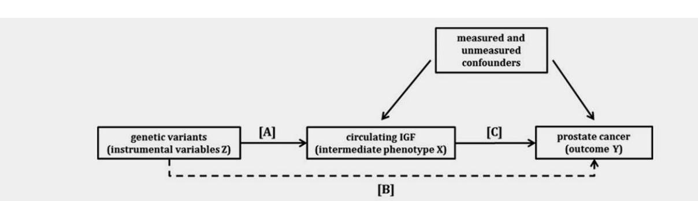

# **Assessing the role of insulin-like growth factors and binding proteins in prostate cancer using Mendelian randomization: Genetic variants as instruments for circulating levels**

Carolina Bonilla, Sarah J Lewis, Mari-anne Rowlands, Tom R Gaunt, George Davey Smith, David Gunnell, Tom Palmer, Jenny L Donovan, Freddie C Hamdy, David E Neal, et al.

### **To cite this version:**

Carolina Bonilla, Sarah J Lewis, Mari-anne Rowlands, Tom R Gaunt, George Davey Smith, et al.. Assessing the role of insulin-like growth factors and binding proteins in prostate cancer using Mendelian randomization: Genetic variants as instruments for circulating levels. International Journal of Cancer, 2016, 139 (7), pp.1520 - 1533. ff10.1002/ijc.30206ff. ffcea-04551327ff

### **HAL Id: cea-04551327 <https://cea.hal.science/cea-04551327v1>**

Submitted on 18 Apr 2024

**HAL** is a multi-disciplinary open access archive for the deposit and dissemination of scientific research documents, whether they are published or not. The documents may come from teaching and research institutions in France or abroad, or from public or private research centers.

L'archive ouverte pluridisciplinaire **HAL**, est destinée au dépôt et à la diffusion de documents scientifiques de niveau recherche, publiés ou non, émanant des établissements d'enseignement et de recherche français ou étrangers, des laboratoires publics ou privés.

[Distributed under a Creative Commons Attribution 4.0 International License](http://creativecommons.org/licenses/by/4.0/)

# Assessing the role of insulin-like growth factors and binding proteins in prostate cancer using Mendelian randomization: Genetic variants as instruments for circulating levels

Carolina Bonilla1,2, Sarah J. Lewis1,2, Mari-Anne Rowlands1 , Tom R. Gaunt1,2, George Davey Smith1,2, David Gunnell1 , Tom Palmer3 , Jenny L. Donovan1 , Freddie C. Hamdy4 , David E. Neal4,5, Rosalind Eeles6,7, Doug Easton8 , Zsofia Kote-Jarai6 , Ali Amin Al Olama8 , Sara Benlloch8 , Kenneth Muir9,10, Graham G. Giles11,12, Fredrik Wiklund13, Henrik Gronberg € 13, Christopher A. Haiman14, Johanna Schleutker15,16, Børge G. Nordestgaard17, Ruth C. Travis18, Nora Pashayan19,20, Kay-Tee Khaw21, Janet L. Stanford22,23, William J. Blot24, Stephen Thibodeau25, Christiane Maier26,27, Adam S. Kibel28,29, Cezary Cybulski30, Lisa Cannon-Albright31, Hermann Brenner32,33,34, Jong Park35, Radka Kaneva36, Jyotsna Batra37, Manuel R. Teixeira38,39, Hardev Pandha40, the PRACTICAL consortium, Mark Lathrop41,42, Richard M. Martin1,2,43\* and Jeff M. P. Holly43,44\*

1 School of Social and Community Medicine, University of Bristol, Bristol, United Kingdom

2 MRC/University of Bristol Integrative Epidemiology Unit, University of Bristol, Bristol, United Kingdom

3 Department of Mathematics and Statistics, Lancaster University, Lancaster, United Kingdom

4 Nuffield Department of Surgery, University of Oxford, Oxford, United Kingdom

5 Surgical Oncology (Uro-Oncology: S4), University of Cambridge, Box 279, Addenbrooke's Hospital, Hills Road, Cambridge, United Kingdom

Key words: insulin-like growth factors, insulin-like growth factor-binding proteins, prostate cancer, Mendelian randomization, single nucleotide polymorphisms, IGFBP3, ProtecT, PRACTICAL, ALSPAC, UKHLS

Abbreviations: BPH: benign prostatic hyperplasia; CV: coefficient of variation; GWAS: genome-wide association study; IBD: identity by descent; ICC: intra-class correlation; IGF: insulin-like growth factor; IGFBP: insulin-like growth factor-binding proteins; IV: instrumental variable; LD: Linkage disequilibrium; MR: Mendelian randomization; PSA: prostate specific antigen; QC: quality control; RIA: radioimmunoassay; SD: standard deviation; SNP: single nucleotide polymorphism; UKHLS: UK Household Longitudinal Study.

Additional Supporting Information may be found in the online version of this article. For information on how to submit an application for gaining access to EPIC data and/or biospecimens, please follow the instructions at

[http://epic.iarc.fr/access/index.php,](http://epic.iarc.fr/access/index.php)<http://www.metadac.ac.uk/data-access-through-metadac/>.

R.M.M., S.J.L., G.D.S., D.G. and J.M.P.H. developed the hypotheses and secured funding. C.B., M-AR, T.P. and T.R.G. undertook statistical analyses. C.B., M.-A.R., S.J.L. and R.M.M. wrote the first draft of the paper. M.L. organized the genome-wide genotyping of controls from the ProtecT study. J.L.D., F.C.H. and D.E.N. are PIs of the ProtecT (Prostate testing for cancer and Treatment) study. D.G., J.L.D., F.C.H. and D.E.N. are NIHR Senior Investigators. All authors critically commented on and approved the final submitted version of the paper. Disclosure: TRG: In addition to funding from the UK Medical Research Council the MRC Integrative Epidemiology Unit receives funding from a number of commercial organizations, including Pfizer, Sanofi-Aventis, Astra Zeneca and Merck Sharp & Dohme. \*R.M.M. and J.M.P.H contributed equally to this work

This is an open access article under the terms of the [Creative Commons Attribution](http://creativecommons.org/licenses/by/3.0/) License, which permits use, distribution and reproduction in any medium, provided the original work is properly cited.

Grant sponsor: World Cancer Research Fund; Grant number: 2011/419; Grant sponsor: Cancer Research UK; Grant number: C18281/ A19169; Grant sponsor: MRC and the University of Bristol; Grant number: G0600705, MC\_UU\_12013/19 (to Integrative Epidemiology Unit (IEU)); Grant sponsor: Cancer Research UK; Grant number: C18281/A19169 (to Integrative Cancer Epidemiology Programme); Grant sponsor: National Institute for Health Research (NIHR) (to Bristol Biomedical Research Unit in Nutrition, which is a partnership between University Hospitals Bristol NHS Foundation Trust and the University of Bristol); Grant sponsor: National Institute for Health Research (NIHR) Health Technology Assessment (HTA) Programme (to ProtecT study); Grant number: HTA 96/20/99; ISRCTN20141297; Grant sponsor: European Community's Seventh Framework Programme (grant agreement n8 223175); Grant number: HEALTH-F2-2009–223175) (COGS) (to PRACTICAL and the iCOGS infrastructure); Grant sponsor: Cancer Research UK; Grant numbers: C1287/A10118, C1287/A 10710, C12292/A11174, C1281/A12014, C5047/A8384, C5047/A15007, C5047/A10692, C8197/A16565; Grant sponsor: National Institutes of Health; Grant number: CA128978; Grant sponsor: Post-Cancer GWAS initiative; Grant numbers: 1U19 CA148537, 1U19 CA148065 and 1U19 CA148112 - the GAME-ON initiative; Grant sponsor: Department of Defense; Grant number: W81XWH-10–1-0341; Grant sponsors: Canadian Institutes of Health Research (CIHR) for the CIHR Team in Familial Risks of Breast Cancer, Komen Foundation for the Cure, the Breast Cancer Research Foundation and the Ovarian Cancer Research Fund DOI: 10.1002/ijc.30206

History: Received 24 Nov 2015; Accepted 7 Apr 2016; Online 26 May 2016

Correspondence to: Richard Martin, University of Bristol, School of Social and Community Medicine, Canynge Hall, 39 Whatley Road, Bristol BS8 2PS, United Kingdom, Tel: 144 117 928 7321, Fax: 144 117 928 7236, E-mail: richard.martin@bristol.ac.uk

Int. J. Cancer: 139, 1520–1533 (2016) VC 2016 The Authors International Journal of Cancer published by John Wiley & Sons Ltd on behalf of UICC

## Bonilla et al. 1521

- The Institute of Cancer Research, 15 Cotswold Road, Sutton, Surrey, SM2 5NG, United Kingdom
- Royal Marsden NHS Foundation Trust, Fulham and Sutton, London and Surrey, United Kingdom

 Centre for Cancer Genetic Epidemiology, Department of Public Health and Primary Care, University of Cambridge, Strangeways Research Laboratory, Worts Causeway, Cambridge, United Kingdom

- University of Warwick, Coventry, United Kingdom
- Institute of Population Health, University of Manchester, Manchester, M13 9PL, United Kingdom
- The Cancer Council Victoria, 615 St. Kilda Road, Melbourne, Victoria, 3004, Australia
- Centre for Epidemiology and Biostatistics, Melbourne School of Population and Global Health, the University of Melbourne, Victoria, 3010, Australia
- Department of Medical Epidemiology and Biostatistics, Karolinska Institute, Stockholm, Sweden
- Department of Preventive Medicine, Keck School of Medicine, University of Southern California/Norris Comprehensive Cancer Center, Los Angeles, California
- Department of Medical Biochemistry and Genetics, University of Turku, Turku, Finland
- Institute of Biomedical Technology/BioMediTech, University of Tampere and FimLab Laboratories, Tampere, Finland
- Department of Clinical Biochemistry, Herlev Hospital, Copenhagen University Hospital, Herlev Ringvej 75, Herlev, DK, 2730, Denmark
- Cancer Epidemiology Unit, Nuffield Department of Population Health, University of Oxford, Oxford, United Kingdom
- Centre for Cancer Genetic Epidemiology, Department of Oncology, University of Cambridge, Strangeways Research Laboratory, Worts Causeway, Cambridge, United Kingdom
- Department of Applied Health Research, University College London, 1-19 Torrington Place, London, WC1E 7HB, United Kingdom
- Forvie Site, Cambridge Institute of Public Health, University of Cambridge, Robinson Way, Cambridge, CB2 0SR, United Kingdom
- Division of Public Health Sciences, Fred Hutchinson Cancer Research Center, Seattle, Washington
- Department of Epidemiology, School of Public Health, University of Washington, Seattle, Washington
- International Epidemiology Institute, 1455 Research Blvd, Suite 550, Rockville, Maryland

Mayo Clinic, Rochester, Minnesota

- Department of Urology, University Hospital Ulm, Germany
- Institute of Human Genetics, University Hospital Ulm, Germany
- Brigham and Women's Hospital/Dana-Farber Cancer Institute, 45 Francis Street-ASB II-3, Boston, Massachussets

29Washington University, St Louis, Missouri

International Hereditary Cancer Center, Department of Genetics and Pathology, Pomeranian Medical University, Szczecin, Poland

Division of Genetic Epidemiology, Department of Medicine, University of Utah School of Medicine, Salt Lake City, Utah

- Division of Clinical Epidemiology and Aging Research, German Cancer Research Center (DKFZ), Heidelberg, Germany
- Division of Preventive Oncology, German Cancer Research Center (DKFZ), Heidelberg, Germany
- German Cancer Consortium (DKTK), German Cancer Research Center (DKFZ), Heidelberg, Germany
- Division of Cancer Prevention and Control, H. Lee Moffitt Cancer Center, 12902 Magnolia Dr, Tampa, Florida
- Molecular Medicine Center and Department of Medical Chemistry and Biochemistry, Medical University Sofia, 2 Zdrave St, Sofia, 1431, Bulgaria
- Australian Prostate Cancer Research Centre-Qld, Institute of Health and Biomedical Innovation and School of Biomedical Sciences, Queensland
- University of Technology, Brisbane, Australia
- Department of Genetics, Portuguese Oncology Institute, Porto, Portugal
- Biomedical Sciences Institute (ICBAS), Porto University, Porto, Portugal
- The University of Surrey, Guildford, Surrey, GU2 7XH, United Kingdom
- Commissariat a L'Energie Atomique, Center National De Genotypage, Evry, France McGill University-Genome Quebec Innovation Centre, Montreal, Canada
- NIHR Bristol Biomedical Research Unit in Nutrition, Bristol, United Kingdom
- IGFs and Metabolic Endocrinology Group, School of Clinical Sciences North Bristol, University of Bristol, Bristol, United Kingdom

Circulating insulin-like growth factors (IGFs) and their binding proteins (IGFBPs) are associated with prostate cancer. Using genetic variants as instruments for IGF peptides, we investigated whether these associations are likely to be causal. We identified from the literature 56 single nucleotide polymorphisms (SNPs) in the IGF axis previously associated with biomarker levels (8 from a genome-wide association study [GWAS] and 48 in reported candidate genes). In ~700 men without prostate cancer and two replication cohorts (N ~ 900 and ~9,000), we examined the properties of these SNPS as instrumental variables (IVs) for IGF-I, IGF-II, IGFBP-2 and IGFBP-3. Those confirmed as strong IVs were tested for association with prostate cancer risk, low (< 7) vs. high (- 7) Gleason grade, localised vs. advanced stage, and mortality, in 22,936 controls and 22,992 cases. IV analysis was used in an attempt to estimate the causal effect of circulating IGF peptides on prostate cancer. Published SNPs in the IGFBP1/IGFBP3 gene region, particularly rs11977526, were strong instruments for IGF-II and IGFBP-3, less so for IGF-I. Rs11977526 was associated with high (vs. low) Gleason grade (OR per IGF-II/IGFBP-3 levelraising allele 1.05; 95% CI: 1.00, 1.10). Using rs11977526 as an IV we estimated the causal effect of a one SD increase in IGF-II (~265 ng/mL) on risk of high vs. low grade disease as 1.14 (95% CI: 1.00, 1.31). Because of the potential for pleiotropy of the genetic instruments, these findings can only causally implicate the IGF pathway in general, not any one specific biomarker.

#### What's new?

Circulating insulin-like growth factors (IGF) and their binding proteins have been associated with prostate cancer risk in observational epidemiological studies but it is not clear whether there is a causal relationship with disease. To address this question, the authors used Mendelian randomization, a method that uses genetic variants as proxies for measured exposures. Their results implicate the IGF pathway in general in prostate cancer development but specific biomarkers remain to be determined.

Prostate cancer is the most common male cancer in industrialised countries, yet there are no established, potentially modifiable risk factors for prevention.1 The nutritionally regulated IGFs, and their modulating binding proteins (IGFBPs) play a key role in somatic growth, and activate carcinogenic intracellular signalling networks.1 Meta-analyses of epidemiological studies generally observe positive associations of circulating IGF-I with prostate cancer,2–4 but substantial differences exist between studies.5,6

Such diverse evidence indicates that causation remains to be established. Alternative explanations for the observed association of IGF-axis peptides with prostate cancer include: reverse causality, because tumours may promote an endocrine response7 ; confounding by dietary,8 nutritional9 and lifestyle10 factors; measurement error,11 as single serum measurements may inadequately reflect long-term exposure; or detection bias,11 occurring, for example, if IGF-I causes symptomatic benign prostatic hyperplasia (BPH) that results in the serendipitous finding of latent cancer on diagnostic biopsy.

Mendelian randomization (MR)12 seeks to establish causality by using genetic variants as proxies for the exposure of interest. Since alleles randomly assort at gamete formation and segregate randomly at conception to generate genotypes, associations between genotypes and outcome are not generally confounded by behavioural or environmental factors and cannot be explained by reverse causation. Genetic variation may also be a better measure of exposure over a lifetime than a single serum measurement, as those with genotypes causing high (or low) IGF levels will have been, in effect, randomly allocated to high (or low) IGF levels from birth. To determine causality, MR relies on an association between genetic variant (also known as instrument) and exposure so that the greater the correlation between the two, and thus the more variation in the exposure phenotype explained by the genotype, the more reliable the causal inference. Additionally, the instrument is expected to influence the outcome only via the exposure (i.e., absence of horizontal pleiotropy13) and to be independent from confounders of the relationship between exposure and outcome.

We used an MR approach in an attempt to assess the causal role of the IGF axis in prostate cancer. First, we validated genetic variants previously associated with IGF levels in the literature to confirm reported associations of the SNPs (especially SNPs selected from candidate gene studies), and to assess the potential for pleiotropic effects of the genetic variants on more than one IGF protein. Second, we performed a large case–control study based on an international prostate cancer consortium of >22,000 case/control pairs using the validated polymorphisms.

# Material and Methods Study populations

ProtecT (Prostate testing for cancer and Treatment) study. The association of genetic variants with IGF levels was evaluated in the control arm of a case–control study nested within ProtecT, a UK multicentre study to identify localised prostate cancer and evaluate its management in a randomly allocated controlled trial.5 All men without evidence of prostate cancer were eligible for selection as controls; that is, men with a prostate specific antigen (PSA) test < 3 ng/mL, or men with a raised PSA (- 3 ng/mL) combined with at least one negative diagnostic biopsy. Of the 2,766 controls who underwent measures of IGFs in ProtecT5 , 700 men also had genome-wide genotype data available (mean age 6 SD: 62.1 6 5.0 years).

Blood samples for IGF measurement in ProtecT were drawn at the time of the PSA test, frozen at 2808C within 36 hr, then transferred on dry ice for assay.4 Total IGF-I, IGF-II and IGFBP-3 levels were measured by in-house radioimmunoassay (RIA) and circulating IGFBP-2 was measured using a one-step sandwich ELISA (DSL-10–7100; Diagnostic Systems Laboratories). The intra-class correlations (ICC) for within-assay variability for IGF-I, IGF-II, IGFBP-2 and IGFBP-3 were 0.86, 0.91, 0.95 and 0.88; the ICCs for between-assay variability were 0.66, 0.84, 0.81 and 0.71, respectively.

Genome-wide genotyping of participants was carried out at the Centre National de Genotypage (CNG, Evry, France), using the Illumina Human660W-Quad\_v1\_A array (Illumina Inc., San Diego, CA). The quality control (QC) process performed before imputation excluded individuals on the basis of the following: sex mismatches, minimal (< 0.325) or excessive (> 0.345) heterozygosity, disproportionate levels of individual missingness (> 3%), cryptic relatedness measured as a proportion of identity by descent (IBD > 0.1), and insufficient sample replication (IBD < 0.8). All individuals with non-European ancestry, and SNPs with a minor allele frequency (MAF) below 1%, a call rate of < 95% or out of Hardy-Weinberg equilibrium (p < 5 3 1027 ) were removed. Autosomal genotypic data were imputed using Markov Chain Haplotyping software (MACH v.1.0.16)14 and phased

Cancer Epidemiology

haplotype data from European (CEU) individuals (HapMap release 22, Phase II NCBI B36, dbSNP 126) based on 514,432 autosomal SNPs. After imputation, all SNPs with indication of poor imputation quality (r 2 hat < 0.3) were eliminated. The working dataset consisted of 2,927 individuals (1,136 cases, 1,791 controls) of European ancestry.

Trent Multicenter Research Ethics Committee (MREC) approved both the ProtecT study (MREC/01/4/025), and the associated ProMPT study which collected biological material (MREC/01/4/061). Written informed consent was obtained from all men.

ALSPAC (Avon Longitudinal Study of Parents and Children). We used ALSPAC to replicate ProtecT findings. ALSPAC is a population-based prospective cohort study of children and their parents. The study is described in detail elsewhere15–17 (<http://www.bristol.ac.uk/alspac>/). Measurement of circulating IGF-I, IGF-II and IGFBP-3 in plasma or serum was carried out as in ProtecT. IGFBP-2 was not measured. The intra- and inter-assay coefficients of variation (CV) were 7.0 and 14.3% for IGF- I, 7.9 and 18.6% for IGF-II, and 6.1 and 8.7% for IGFBP-3.18

Genome-wide association study (GWAS) data for the children were generated by Sample Logistics and Genotyping Facilities at the Wellcome Trust Sanger Institute (Cambridge, UK) and the Laboratory Corporation of America (Burlington, NC, USA) with support from 23andMe (Mountain View, CA, USA) using the Illumina HumanHap550 quad chip. The mothers were genotyped at CNG using the Illumina Human660W quad array. All individuals of non-European ancestry, ambiguous sex, extreme heterozygosity, cryptic relatedness (IBD > 0.1 in children, > 0.125 in mothers), high missingness (> 3% in children, > 5% in mothers) and insufficient sample replication (IBD < 0.8) were removed. SNPs with genotyping rate < 95%, MAF < 1%, or out of Hardy-Weinberg equilibrium (p < 5 3 1027 in children, p < 1 3 1026 in mothers) were excluded. Genotypic data was subsequently phased with ShapeIT v2.r644,19 and imputed using IMPUTE v2.2.220 and phased haplotype data from the 1000 Genomes reference panel (phase 1, version 3), based on 465,740 SNPs. The cleaned dataset consisted of 8,237 children and 8,196 mothers. Up to 400 pregnant women (mean 6 SD age at delivery: 28.7 6 5.4 years) and 450 children at different ages (mean 6 SD age: 61.8 6 0.8 months, 54% male; 7.5 6 0.2 years, 54% male; 8.2 6 0.1 years, 56% male), as well as 500 umbilical cord samples had genotypes and IGF measures for analysis.

Ethical approval for the study was obtained from the ALSPAC Ethics and Law Committee and the Local Research Ethics Committees [\(http://www.bristol.ac.uk/alspac/research](http://www.bristol.ac.uk/alspac/researchers/data-access/ethics/lrec-approvals/#d.en)[ers/data-access/ethics/lrec-approvals/#d.en](http://www.bristol.ac.uk/alspac/researchers/data-access/ethics/lrec-approvals/#d.en).164[120](http://20)). Written informed consent was obtained from all participants in the study.

Understanding Society: the UK Household Longitudinal Study (UKHLS). SNPs validated in ProtecT were also examined in the UKHLS study, which is a stratified clustered random sample of households, representative of the UK population [\(https://www.understandingsociety.ac.uk/](http://https://www.understandingsociety.ac.uk)). Serum IGF-I levels were measured using an electrochemiluminescent immunoassay on an IDS ISYS analyser. The inter- and intra-assay C vs. were < 14%. No measurements of IGF-II, IGFBP-2 or IGFBP-3 were available.

In total, 10,480 samples were genotyped on the Illumina HumanCoreExome chip (v1.0) at the Wellcome Trust Sanger Institute. Data QC was performed at the sample-level using the following filters: call rate < 98%, autosomal heterozygosity outliers (> 3 SD), gender mismatches, duplicates as established by IBD analysis (PI\_HAT > 0.9), ethnic outliers. Variants with a Hardy-Weinberg equilibrium p values < 1024 , a call rate below 98% and poor genotype clustering values (< 0.4) were removed, as well as mitochondrial polymorphisms, leaving 518,542 variants. Imputation was performed at the UCL Genetics Institute using Minimac version 5–29-12,21 MaCH14 for phasing, and the 1000 Genomes Project, March 2012, version 3, NCBI build GRCh37/hg19 as a reference sample. The final sample consisted of 9,944 individuals. As UKHLS is a household study we additionally eliminated individuals who were related (> 5%), thus the working sample included 9,237 participants (mean 6 SD age: 54.1 6 16.1 years, 44% male).

UKHLS is designed and conducted in accordance with the ESRC Research Ethics Framework and the ISER Code of Ethics. The University of Essex Ethics Committee approved waves 1–5 of UKHLS. Approval from the National Research Ethics Service was obtained for the collection of biosocial data by trained nurses in waves 2 and 3 of the main survey (Oxfordshire A REC, Reference: 10/H0604/2).

PRACTICAL Consortium (PRostate cancer AssoCiation group to Investigate Cancer-Associated aLterations in the genome). We investigated associations of published IGF-related genetic variants, evaluated as instruments in ProtecT and replicated in ALSPAC and/or UKHLS, with prostate cancer risk, progression and mortality in men from 25 studies contributing to the international PRACTICAL consortium22 ([http://practi](http://practical.ccge.medschl.cam.ac.uk)[cal.ccge.medschl.cam.ac.uk](http://practical.ccge.medschl.cam.ac.uk)). Seventeen studies were from Europe, six from North America and two from Australia, and comprised population samples of predominantly European ancestry22 (Table 1). Data on cancer stage, grade and method of diagnosis were collected by each study using a variety of methods. We categorised cancers as localised (T1 or T2 on TNM staging, or if not available, "localised" on SEER staging) or advanced (T3 or T4, or "regional" or "distant" on SEER staging).

Genotyping of PRACTICAL samples was carried out using an Illumina Custom Infinium genotyping array (iCOGS), designed for the Collaborative Oncological Gene-Environment Study (COGS) ([http://www.cogseu.org/](http://www.cogseu.org)) and

Cancer Epidemiology

| Study        | Country   | N controls | N cases | Mean age at diagnosis (years) | Mean PSA at diagnosis (ng/mL) | European ethnicity (%)1 | Family history of prostate cancer (%)1,2 | High Gleason score (≥7, %)1 | Advanced stage (%)1,3 | Screen detected cancer (%)1 |
|--------------|-----------|---------------|------------|-------------------------------------|-------------------------------------|-------------------------------|---------------------------------------------------|-----------------------------------|--------------------------|-----------------------------------|
| CAPS         | Sweden    | 664           | 1153       | 66.1                                | 79.6                                | 100                           | 17.4                                              | 49.92                             | 30.3                     | 0.0                               |
| CPCS1        | Denmark   | 2756          | 848        | 69.5                                | 48.0                                | 99.6                          | 8.22                                              | 71.22                             | n/a                      | 0.0                               |
| CPCS2        | Denmark   | 1001          | 265        | 64.9                                | 36.0                                | 99.4                          | 14.72                                             | 52.22                             | n/a                      | 0.0                               |
| EPIC         | Europe    | 1079          | 722        | 64.9                                | 0.2                                 | 100                           | n/a                                               | 27.92                             | 4.02                     | 0.0                               |
| EPIC-Norfolk | UK        | 911           | 481        | 72.1                                | n/a                                 | 99.9                          | 2.5                                               | 39.42                             | n/a                      | n/a                               |
| ESTHER       | Germany   | 318           | 313        | 65.5                                | 58.7                                | 100                           | 8.92                                              | 48.0                              | 27.6                     | 61.92                             |
| FHCRC        | USA       | 729           | 761        | 59.7                                | 16.1                                | 99.9                          | 21.7                                              | 41.7                              | 20.2                     | n/a                               |
| IPO-Porto    | Portugal  | 66            | 183        | 59.3                                | 8.3                                 | 100                           | 20.02                                             | 84.2                              | 64.5                     | 82.82                             |
| MAYO         | USA       | 488           | 767        | 65.2                                | 15.5                                | 100                           | 29.1                                              | 55.32                             | 45.5                     | 73.72                             |
| MCCS3        | Australia | 1169          | 1650       | 58.5                                | 18.8                                | 98.8                          | 23.52                                             | 53.4                              | 14.5                     | n/a                               |
| MEC          | USA       | 829           | 819        | 69.5                                | n/a                                 | 100                           | 13.0                                              | n/a                               | 12.5                     | n/a                               |
| MOFFITT      | USA       | 96            | 404        | 65.0                                | 7.3                                 | 97.5                          | 22.3                                              | 43.4                              | 3.6                      | 0.02                              |
| PCMUS        | Bulgaria  | 140           | 151        | 69.3                                | 32.5                                | 100                           | 5.3                                               | 59.6                              | 46.7                     | 21.2                              |
| Poland       | Poland    | 359           | 438        | 67.7                                | 40.2                                | 100                           | 10.6                                              | 32.82                             | 37.12                    | 0.02                              |
| PPF-UNIS     | UK        | 187           | 244        | 68.9                                | 32.1                                | 99.8                          | 25.3                                              | 45.22                             | 28.82                    | n/a                               |
| ProMPT       | UK        | 2             | 166        | 66.3                                | 33.0                                | 100                           | 34.6                                              | 74.32                             | 34.7                     | 0.02                              |
| ProtecT      | UK        | 1458          | 1545       | 62.7                                | 9.6                                 | 99.7                          | 8.02                                              | 29.9                              | 11.4                     | 100.0                             |
| QLD          | Australia | 85            | 139        | 61.4                                | 7.4                                 | 99.14                         | 37.8                                              | 83.6                              | 0.02                     | n/a                               |
| SEARCH       | UK        | 1231          | 1354       | 63.1                                | 53.2                                | 100                           | 16.3                                              | 56.92                             | 18.02                    | 36.72                             |
| STHM1        | Sweden    | 2224          | 2006       | 66.2                                | n/a                                 | 100                           | 20.2                                              | 45.52                             | 14.42                    | n/a                               |
| TAMPERE      | Finland   | 2413          | 2754       | 68.2                                | 69.2                                | 100                           | n/a                                               | 43.82                             | 21.4                     | 46.8                              |
| UKGPCS       | UK        | 4132          | 3838       | 63.6                                | 88.0                                | 99.8                          | 22.42                                             | 50.52                             | 36.42                    | 28.02                             |
| ULM          | Germany   | 354           | 603        | 63.8                                | 19.1                                | 100                           | 44.9                                              | 51.32                             | 40.5                     | n/a                               |
| UTAH         | USA       | 245           | 440        | 62.6                                | n/a                                 | 100                           | 51.4                                              | n/a                               | 17.22                    | n/a                               |
| WUGS         | USA       | 0             | 948        | 60.8                                | 6.1                                 | 95.8                          | 42.62                                             | 59.3                              | 24.2                     | n/a                               |

Table 1. Clinical characteristics of prostate cancer cases in 25 PRACTICAL studies

N 5 45,928 men.

Information in the table is given for the subset of individuals whose ethnicity was "European" (except for the study's European ethnicity percentage).

1 Percent of cases with data available.

Family history of prostate cancer in a first degree relative.

T3 or T4 on TNM staging, or if not available, "regional" or "distant" on SEER staging.

2 Information missing for &gt;10% of patients. 3

MCCS includes Risk Factors for Prostate Cancer Study (RFPCS) and The Early Onset Prostate Cancer Study (EOPCS).

4 Information missing for >10% of individuals.

n/a not available.

consisting of 211,155 SNPs.22 This array was devised to evaluate associations of genetic variants with breast, ovarian and prostate cancer (85,278 were specifically chosen for their potential relevance to prostate cancer). A total of 201,598 SNPs passed QC for the European ancestry samples.22 Imputation of 17 million SNPs/indels using the 1000 Genomes Project (version 3, March 2012 release) as a reference panel was performed with the program IMPUTE v.2.20 Polymorphisms with quality information scores of (r 2 ) > 0.3 and MAF > 0.5 were taken forward for analysis.23 Overall there were 22,992 prostate cancer cases and 22,936 controls with genotype data available.

All studies have the relevant Institutional Review Board approval in each country in accordance with the Declaration of Helsinki.

## Identification of genetic variants associated with IGF levels in the literature

We selected single nucleotide polymorphisms (SNPs) associated with circulating IGF levels from the National Human Genome Research Institute-European Bioinformatics Institute (NHGRI-EBI) catalog of genome-wide association studies (GWAS) [\(https://www.ebi.ac.uk/gwas/](http://https://www.ebi.ac.uk/gwas)) and by conducting a PubMed literature search. All SNPs chosen were associated 10970215, 2016, 7, Downloaded from https://onlinelibrary.wiley.com/doi/10.1002/ijc.30206 by CEA National, Wiley Online Library on [18/04/2024]. See the Terms and Conditions (https://onlinelibrary.wiley.com/terms-and-conditions) on Wiley Online Library for rules of use; OA articles are governed by the applicable Creative Commons License

Figure 1. Directed acyclic graph (DAG) showing the instrumental variable (IV) assumptions underpinning a Mendelian randomization analysis of circulating IGF levels with prostate cancer. IV models use associations A and B to estimate the causal effect of IGF on prostate cancer C (C 5 B/A). The instrument is assumed not to have a direct effect on the outcome, hence the dashed line is to illustrate that association B is required for IV estimation. The effect of genotype on the outcome should be mediated only through the intermediate phenotype (no pleiotropy). The numerator of the two sample IV estimator is the log odds ratio from a logistic regression of the outcome (Y) on the instrument (Z) in the PRACTICAL population and the denominator is the beta coefficient from a linear regression of the exposure (X) on the instrument (Z) in the ProtecT or UKHLS population or obtained from the literature.

with IGF concentration at the significance thresholds established by each study (p < 5 3 1027 in the discovery GWAS; usually p < 0.05 in candidate gene studies).

### Validation of genetic variants as instruments of IGF levels

The properties of the SNPs as instrumental variables (IV) were assessed in ProtecT controls by examination of: (i) F statistics (with values lower than 10 taken as evidence of a weak instrument24) and R2 values (the proportion of variation in IGF levels explained by the genetic variant) from the linear regression of each biomarker on the SNP; (ii) associations of the genetic variants with potential confounding factors and other variables (age, PSA at recruitment, body mass index (BMI), height, leg-length, BPH and diabetes); and (iii) possible pleiotropic effects of the variants on more than one IGF peptide.25 The validated genetic instruments were tested for replication in ALSPAC mothers and children, and UKHLS participants.

### Statistical analysis

All SNPs were examined for deviation from Hardy-Weinberg equilibrium using the hwsnp function in the statistical package Stata. Linear and logistic regression were used as appropriate to investigate the effect of SNPs on IGF-I, IGF-II, IGFBP-2, IGFBP-3, PSA and potential confounders. For the validated SNPs we ran meta-analyses across all PRACTICAL studies to evaluate between-study heterogeneity in the association with prostate cancer risk, Gleason grade (low: <7 vs. high: - 7) and stage (localised vs. advanced). We computed pooled ORs assuming a fixed-effects model when there was no evidence of heterogeneity (p > 0.05), otherwise we used a random-effects model. Logistic regression with robust standard errors, to account for within-study clustering, was performed to test for associations of all polymorphisms across the IGFBP1/IGFBP3 region and SNPs in other chromosomal regions with the above prostate cancer outcomes.

Linkage disequilibrium (LD) between pairs of variants in the IGFBP-1/IGFBP-3 gene region was calculated with the program LDlink using data for the GBR population (English and Scottish) in Phase 3 of the 1,000 Genomes Project.26 r 2 values obtained with LDlink were then used to create an LD plot of the region with the R package LDheatmap [\(http://](http://www.R-project.org) [www.R-project.org\)](http://www.R-project.org). Functional consequences of genetic polymorphisms were predicted using SNPnexus ([http://www.snp](http://www.snp-nexus.org)[nexus.org/](http://www.snp-nexus.org)).

Survival analysis. Amongst men with prostate cancer, we estimated associations of the validated SNPs with long-term (15-year) survival, examining all-cause and prostate cancerspecific mortality using Cox proportional hazards regression with date at diagnosis as the start date and date at death or final follow-up time-point as the exit date, with robust standard errors to account for within-study clustering.

Instrumental variable (IV) analysis. To estimate the causal effect of IGF levels on prostate cancer, we used validated SNPs as the instruments in a two-sample ratio estimator IV analysis27,28 (Fig. 1). The ratio represents the causal log odds ratio of a one unit increase in circulating IGF on the risk of prostate cancer. IV analysis was conducted for the SNPs showing the strongest association with prostate cancer, which were also associated with circulating IGFs in ProtecT, ALSPAC or UKHLS, and the estimates are given per standard deviation (SD) increase in IGF levels.

Adjustments. Principal components reflecting each population's genetic structure were included as covariates in the regression models to account for confounding by population stratification. Additional adjustments for age at diagnosis, age at blood sample collection, gestational age and sex were made when appropriate.

Unless otherwise specified, all analyses were carried out in Stata version 13 (StataCorp LP, 2013, College Station, TX).

| miology      |
|--------------|
|              |
|              |
|              |
|              |
|              |
|              |
|              |
|              |
|              |
|              |
|              |
| Cancer Epide |
|              |
|              |
|              |
|              |

Table 2. Association of published SNPs with IGF biomarkers in ProtecT controls

| SNP        | Effect allele/ non-effect allele | associations Published | Mean difference in IGF levels (ng/mL) per effect allele | 95% CI             | p value             | associations Other | Mean difference in IGF levels (ng/mL) per effect allele | 95% CI            | p value              | F    | R2 (%) |
|------------|----------------------------------------|---------------------------|------------------------------------------------------------------|--------------------|---------------------|-----------------------|------------------------------------------------------------------|-------------------|----------------------|------|--------|
| rs3770473  | G/T                                    | IGF-I                     | 1.06                                                             | (-3.77, 5.89)      | 0.83                | IGFBP-3               | -43.89                                                           | (-225.24, 137.47) | 0.64                 |      |        |
|            |                                        | IGFBP-3                   | 243.89                                                           | (22.52, 314.7)     | 0.40                |                       |                                                                  |                   |                      |      |        |
| rs300982   | G/A                                    | IGFBP-3                   | 2139.80                                                          | (2.62, 139.49)     | 0.33                |                       |                                                                  |                   |                      |      |        |
| rs4234798  | T/G                                    | IGFBP-3                   | 49.51                                                            | (-165.16, 45.49)   | 0.40                |                       |                                                                  |                   |                      |      |        |
| rs7703713  | A/G                                    | IGF-I                     | 21.32                                                            | (-14.1, 7.49)      | 0.70                | IGFBP-2               | -0.07                                                            | (-0.14, -0.00)    | 0.04                 | 2.5  | 0.34   |
| rs2153960  | A/G                                    | IGF-I                     | 3.67                                                             | (-23.16, 10.49)    | 0.29                | IGFBP-2               | 0.07                                                             | (0.00, 0.14)      | 0.04                 | 3.6  | 0.50   |
| rs998075   | G/A                                    | IGF-I                     | 1.78                                                             | (-4.14, 7.77)      | 0.56                |                       |                                                                  |                   |                      |      |        |
| rs998074   | C/T                                    | IGF-I                     | 1.78                                                             | (-4.14, 7.77)      | 0.56                |                       |                                                                  |                   |                      |      |        |
| rs7780564  | C/A                                    | IGF-I                     | 4.35                                                             | (-1.46, 10.15)     | 0.14                |                       |                                                                  |                   |                      |      |        |
| rs10228265 | A/G                                    | IGFBP-3                   | 211.25                                                           | (-14.26, 110.19)   | 0.85                | IGF-II                | 27.31                                                            | (-1.71, 56.33)    | 0.07                 | 3.8  | 0.52   |
| rs1908751  | T/C                                    | IGF-I                     | -0.40                                                            | (-12.98, 11.83)    | 0.91                |                       |                                                                  |                   |                      |      |        |
| rs2270628  | C/T                                    | IGFBP-3                   | 3.35                                                             | (-29.87, 13.56)    | 0.96                | IGF-II                | 34.97                                                            | (1.40, 68.54)     | 0.04                 | 4.9  | 0.68   |
| rs6670     | T/A                                    | IGF-I                     | -5.62                                                            | (-14.58, 3.35)     | 0.22                |                       |                                                                  |                   |                      |      |        |
| rs3110697  | G/A                                    | IGFBP-3                   | -34.10                                                           | (-144.90, 76.69)   | 0.55                | IGF-II                | 55.26                                                            | (27.60, 82.92)    | $9.64\times10^{-5}$  | 14.3 | 1.94   |
| rs9282734  | G/T                                    | IGFBP-3                   | 360.75                                                           | (-574.69, 1296.20) | 0.45                |                       |                                                                  |                   |                      |      |        |
| rs2471551  | G/C                                    | IGFBP-3                   | 7.96                                                             | (-128.43, 144.34)  | 0.91                | IGF-I                 | 9.03                                                             | (-1.65, 16.42)    | 0.02                 | 5.6  | 0.76   |
|            |                                        | IGF-II                    | -44.24                                                           | (-78.55, -9.93)    | 0.01                |                       | 6.0                                                              | 0.82              |                      |      |        |
| rs2132572  | C/T                                    | IGFBP-3                   | -52.69                                                           | (-180.87, 75.48)   | 0.42                | IGF-II                | 3.09                                                             | (2.79, 67.38)     | 0.03                 | 4.3  | 0.59   |
|            |                                        | IGF-I                     | 2.32                                                             | (-11.30, 2.65)     | 0.22                |                       |                                                                  |                   |                      |      |        |
| rs2132571  | C/T                                    | IGFBP-3                   | -62.68                                                           | (-53.82, 179.19)   | 0.29                | IGF-II                | 55.35                                                            | (26.15, 84.55)    | $2.14\times10^{-4}$  | 11.6 | 1.58   |
|            |                                        |                           |                                                                  |                    |                     | IGF-I                 | 6.79                                                             | (0.45, 13.13)     | 0.04                 | 4.0  | 0.54   |
| rs924140   | T/C                                    | IGFBP-3                   | -13.33                                                           | (-97.43, 124.10)   | 0.81                | IGF-II                | 76.49                                                            | (49.08, 103.89)   | $5.92\times10^{-8}$  | 26.0 | 3.47   |
| rs1496499  | G/T                                    | IGF-I                     | 3.12                                                             | (-2.48, 8.72)      | 0.27                | IGF-II                | 77.18                                                            | (49.81, 104.55)   | $4.35\times10^{-8}$  | 26.3 | 3.52   |
| rs11977526 | A/G                                    | IGFBP-3                   | -83.98                                                           | (-231.18, 99.14)   | 0.15                | IGF-II                | 94.78                                                            | (66.48, 123.09)   | $9.53\times10^{-11}$ | 37.7 | 4.98   |
|            |                                        | IGF-I                     | 3.07                                                             | (-3.18, 8.91)      | 0.30                |                       |                                                                  |                   |                      |      |        |
| rs700752   | G/C                                    | IGF-I                     | 9.22                                                             | (3.19, 15.24)      | 0.003               |                       |                                                                  |                   | 7.7                  | 1.05 |        |
|            |                                        | IGFBP-3                   | 219.21                                                           | (108.61, 329.81)   | $1.09\times10^{-4}$ |                       |                                                                  |                   | 13.6                 | 1.86 |        |
| rs1245541  | G/A                                    | IGF-I                     | -0.79                                                            | (-6.93, 5.34)      | 0.80                |                       |                                                                  |                   |                      |      |        |
| rs217727   | A/G                                    | IGF2                      | -14.65                                                           | (-20.09, 9.39)     | 0.41                | IGFBP-3               | 135.16                                                           | (-2.00, 272.33)   | 0.053                | 2.0  | 0.28   |
| rs6214     | T/C                                    | IGF-I                     | 2.64                                                             | (-3.51, 8.79)      | 0.40                |                       |                                                                  |                   |                      |      |        |

10970215, 2016, 7, Downloaded from https://onlinelibrary.wiley.com/doi/10.1002/ijc.30206 by CEA National, Wiley Online Library on [18/04/2024]. See the Terms and Conditions (https://onlinelibrary.wiley.com/terms-and-conditions) on Wiley Online Library for rules of use; OA articles are governed by the applicable Creative Commons License

| F p value 0.05 0.09 0.06 20.12,0.00) 20.11,0.01) 20.12,0.00) 95% CI ( ( ( Mean difference in IGF levels (ng/mL) per effect allele 20.06 20.06 20.05 associations IGFBP-2 IGFBP-2 IGFBP-2 Other p value 0.13 0.13 0.14 0.14 0.14 0.12 0.08 0.06 0.64 0.63 0.78 0.64 0.19 0.54 0.54 0.97 0.78 0.64 0.59 0.20 0.16 0.29 0.03 0.21 0.11 0.81 0.35 0.41 0.55 0.75 2201.52,123.96) 2409.99,246.53) 2123.96,201.52) 2285.09,59.66) 228.62,36.60) 220.59,10.86) 220.73,10.80) 21.88,14.61) 212.74,1.56) 21.79,12.23) 21.79,12.23) 212.23,1.79) 21.55,12.74) 20.71,12.96) 21.35,13.13) 20.18,14.05) 225.99,9.26) 27.47,10.01) 24.85,12.02) 23.14,16.04) 25.75,10.75) 27.95,12.99) 27.83,13.71) 21.66,10.30) 22.19,9.81) 20.15,0.16) 29.80,7.36) 26.44,8.94) 22.80,9.26) (0.61,12.78) 95% CI ( ( ( ( ( ( ( ( ( ( ( ( ( ( ( ( ( ( ( ( ( ( ( ( ( ( ( ( ( Mean difference in IGF levels (ng/mL) per effect allele 2112.72 238.78 281.73 25.59 28.36 24.86 24.96 25.22 21.22 38.78 0.003 6.37 5.60 5.89 3.99 1.27 3.58 2.50 2.94 6.70 5.22 5.22 6.13 6.93 6.45 2.52 1.25 4.32 3.23 3.81 associations Published IGFBP-3 IGFBP-3 IGFBP-3 IGFBP-2 IGFBP-3 IGF-I IGF-I IGF-I IGF-I IGF-I IGF-I IGF-I IGF-I IGF-I IGF-I IGF-I IGF-I IGF-I IGF-I IGF-I IGF-I IGF-I IGF-I IGF-I IGF-I IGF-I IGF-I IGF-I IGF-I IGF-I Effect allele/ non-effect allele1 G/A G/A G/A G/A G/A G/C C/G G/C A/G A/G C/A A/G A/G A/G A/C T/C C/T T/C C/T T/G T/C C/T T/G C/T C/T T/G C/T rs10735380 rs12821878 rs11111285 rs10778177 rs1520220 rs5742694 rs5742678 rs2288378 rs7136446 rs2195239 rs2162679 rs7965399 rs1457596 rs7964748 rs3751830 rs5742615 rs5742612 rs978458 rs972936 rs855203 rs907806 rs213656 rs197056 rs855211 rs35767 rs35766 rs35765 SNP |  |  | ProtecT: effect on published biomarkers |  | ProtecT: effect on other biomarkers |     |        |
|-----------------------------------------------------------------------------------------------------------------------------------------------------------------------------------------------------------------------------------------------------------------------------------------------------------------------------------------------------------------------------------------------------------------------------------------------------------------------------------------------------------------------------------------------------------------------------------------------------------------------------------------------------------------------------------------------------------------------------------------------------------------------------------------------------------------------------------------------------------------------------------------------------------------------------------------------------------------------------------------------------------------------------------------------------------------------------------------------------------------------------------------------------------------------------------------------------------------------------------------------------------------------------------------------------------------------------------------------------------------------------------------------------------------------------------------------------------------------------------------------------------------------------------------------------------------------------------------------------------------------------------------------------------------------------------------------------------------------------------------------------------------------------------------------------------------------------------------------------------------------------------------------------------------------------------------------------------------------------------------------------------------------------------------------------------------------------------------------------------------------------------------------------------------------------------------------------------------------------------------------------------------------------------------------------------------------------------------------------------------------------------------------------------------------------------------------------------------|--|--|-----------------------------------------|--|-------------------------------------|-----|--------|
|                                                                                                                                                                                                                                                                                                                                                                                                                                                                                                                                                                                                                                                                                                                                                                                                                                                                                                                                                                                                                                                                                                                                                                                                                                                                                                                                                                                                                                                                                                                                                                                                                                                                                                                                                                                                                                                                                                                                                                                                                                                                                                                                                                                                                                                                                                                                                                                                                                                                 |  |  |                                         |  |                                     |     | R2 (%) |
|                                                                                                                                                                                                                                                                                                                                                                                                                                                                                                                                                                                                                                                                                                                                                                                                                                                                                                                                                                                                                                                                                                                                                                                                                                                                                                                                                                                                                                                                                                                                                                                                                                                                                                                                                                                                                                                                                                                                                                                                                                                                                                                                                                                                                                                                                                                                                                                                                                                                 |  |  |                                         |  |                                     |     |        |
|                                                                                                                                                                                                                                                                                                                                                                                                                                                                                                                                                                                                                                                                                                                                                                                                                                                                                                                                                                                                                                                                                                                                                                                                                                                                                                                                                                                                                                                                                                                                                                                                                                                                                                                                                                                                                                                                                                                                                                                                                                                                                                                                                                                                                                                                                                                                                                                                                                                                 |  |  |                                         |  |                                     |     |        |
|                                                                                                                                                                                                                                                                                                                                                                                                                                                                                                                                                                                                                                                                                                                                                                                                                                                                                                                                                                                                                                                                                                                                                                                                                                                                                                                                                                                                                                                                                                                                                                                                                                                                                                                                                                                                                                                                                                                                                                                                                                                                                                                                                                                                                                                                                                                                                                                                                                                                 |  |  |                                         |  |                                     |     |        |
|                                                                                                                                                                                                                                                                                                                                                                                                                                                                                                                                                                                                                                                                                                                                                                                                                                                                                                                                                                                                                                                                                                                                                                                                                                                                                                                                                                                                                                                                                                                                                                                                                                                                                                                                                                                                                                                                                                                                                                                                                                                                                                                                                                                                                                                                                                                                                                                                                                                                 |  |  |                                         |  |                                     |     |        |
|                                                                                                                                                                                                                                                                                                                                                                                                                                                                                                                                                                                                                                                                                                                                                                                                                                                                                                                                                                                                                                                                                                                                                                                                                                                                                                                                                                                                                                                                                                                                                                                                                                                                                                                                                                                                                                                                                                                                                                                                                                                                                                                                                                                                                                                                                                                                                                                                                                                                 |  |  |                                         |  |                                     |     |        |
|                                                                                                                                                                                                                                                                                                                                                                                                                                                                                                                                                                                                                                                                                                                                                                                                                                                                                                                                                                                                                                                                                                                                                                                                                                                                                                                                                                                                                                                                                                                                                                                                                                                                                                                                                                                                                                                                                                                                                                                                                                                                                                                                                                                                                                                                                                                                                                                                                                                                 |  |  |                                         |  |                                     |     |        |
|                                                                                                                                                                                                                                                                                                                                                                                                                                                                                                                                                                                                                                                                                                                                                                                                                                                                                                                                                                                                                                                                                                                                                                                                                                                                                                                                                                                                                                                                                                                                                                                                                                                                                                                                                                                                                                                                                                                                                                                                                                                                                                                                                                                                                                                                                                                                                                                                                                                                 |  |  |                                         |  |                                     |     |        |
|                                                                                                                                                                                                                                                                                                                                                                                                                                                                                                                                                                                                                                                                                                                                                                                                                                                                                                                                                                                                                                                                                                                                                                                                                                                                                                                                                                                                                                                                                                                                                                                                                                                                                                                                                                                                                                                                                                                                                                                                                                                                                                                                                                                                                                                                                                                                                                                                                                                                 |  |  |                                         |  |                                     | 3.4 | 0.47   |
|                                                                                                                                                                                                                                                                                                                                                                                                                                                                                                                                                                                                                                                                                                                                                                                                                                                                                                                                                                                                                                                                                                                                                                                                                                                                                                                                                                                                                                                                                                                                                                                                                                                                                                                                                                                                                                                                                                                                                                                                                                                                                                                                                                                                                                                                                                                                                                                                                                                                 |  |  |                                         |  |                                     |     |        |
|                                                                                                                                                                                                                                                                                                                                                                                                                                                                                                                                                                                                                                                                                                                                                                                                                                                                                                                                                                                                                                                                                                                                                                                                                                                                                                                                                                                                                                                                                                                                                                                                                                                                                                                                                                                                                                                                                                                                                                                                                                                                                                                                                                                                                                                                                                                                                                                                                                                                 |  |  |                                         |  |                                     | 3.2 | 0.43   |
|                                                                                                                                                                                                                                                                                                                                                                                                                                                                                                                                                                                                                                                                                                                                                                                                                                                                                                                                                                                                                                                                                                                                                                                                                                                                                                                                                                                                                                                                                                                                                                                                                                                                                                                                                                                                                                                                                                                                                                                                                                                                                                                                                                                                                                                                                                                                                                                                                                                                 |  |  |                                         |  |                                     |     |        |
|                                                                                                                                                                                                                                                                                                                                                                                                                                                                                                                                                                                                                                                                                                                                                                                                                                                                                                                                                                                                                                                                                                                                                                                                                                                                                                                                                                                                                                                                                                                                                                                                                                                                                                                                                                                                                                                                                                                                                                                                                                                                                                                                                                                                                                                                                                                                                                                                                                                                 |  |  |                                         |  |                                     |     |        |
|                                                                                                                                                                                                                                                                                                                                                                                                                                                                                                                                                                                                                                                                                                                                                                                                                                                                                                                                                                                                                                                                                                                                                                                                                                                                                                                                                                                                                                                                                                                                                                                                                                                                                                                                                                                                                                                                                                                                                                                                                                                                                                                                                                                                                                                                                                                                                                                                                                                                 |  |  |                                         |  |                                     |     |        |
|                                                                                                                                                                                                                                                                                                                                                                                                                                                                                                                                                                                                                                                                                                                                                                                                                                                                                                                                                                                                                                                                                                                                                                                                                                                                                                                                                                                                                                                                                                                                                                                                                                                                                                                                                                                                                                                                                                                                                                                                                                                                                                                                                                                                                                                                                                                                                                                                                                                                 |  |  |                                         |  |                                     |     |        |
|                                                                                                                                                                                                                                                                                                                                                                                                                                                                                                                                                                                                                                                                                                                                                                                                                                                                                                                                                                                                                                                                                                                                                                                                                                                                                                                                                                                                                                                                                                                                                                                                                                                                                                                                                                                                                                                                                                                                                                                                                                                                                                                                                                                                                                                                                                                                                                                                                                                                 |  |  |                                         |  |                                     |     |        |
|                                                                                                                                                                                                                                                                                                                                                                                                                                                                                                                                                                                                                                                                                                                                                                                                                                                                                                                                                                                                                                                                                                                                                                                                                                                                                                                                                                                                                                                                                                                                                                                                                                                                                                                                                                                                                                                                                                                                                                                                                                                                                                                                                                                                                                                                                                                                                                                                                                                                 |  |  |                                         |  |                                     |     |        |
|                                                                                                                                                                                                                                                                                                                                                                                                                                                                                                                                                                                                                                                                                                                                                                                                                                                                                                                                                                                                                                                                                                                                                                                                                                                                                                                                                                                                                                                                                                                                                                                                                                                                                                                                                                                                                                                                                                                                                                                                                                                                                                                                                                                                                                                                                                                                                                                                                                                                 |  |  |                                         |  |                                     |     |        |
|                                                                                                                                                                                                                                                                                                                                                                                                                                                                                                                                                                                                                                                                                                                                                                                                                                                                                                                                                                                                                                                                                                                                                                                                                                                                                                                                                                                                                                                                                                                                                                                                                                                                                                                                                                                                                                                                                                                                                                                                                                                                                                                                                                                                                                                                                                                                                                                                                                                                 |  |  |                                         |  |                                     |     |        |
|                                                                                                                                                                                                                                                                                                                                                                                                                                                                                                                                                                                                                                                                                                                                                                                                                                                                                                                                                                                                                                                                                                                                                                                                                                                                                                                                                                                                                                                                                                                                                                                                                                                                                                                                                                                                                                                                                                                                                                                                                                                                                                                                                                                                                                                                                                                                                                                                                                                                 |  |  |                                         |  |                                     |     |        |
|                                                                                                                                                                                                                                                                                                                                                                                                                                                                                                                                                                                                                                                                                                                                                                                                                                                                                                                                                                                                                                                                                                                                                                                                                                                                                                                                                                                                                                                                                                                                                                                                                                                                                                                                                                                                                                                                                                                                                                                                                                                                                                                                                                                                                                                                                                                                                                                                                                                                 |  |  |                                         |  |                                     |     |        |
|                                                                                                                                                                                                                                                                                                                                                                                                                                                                                                                                                                                                                                                                                                                                                                                                                                                                                                                                                                                                                                                                                                                                                                                                                                                                                                                                                                                                                                                                                                                                                                                                                                                                                                                                                                                                                                                                                                                                                                                                                                                                                                                                                                                                                                                                                                                                                                                                                                                                 |  |  |                                         |  |                                     |     |        |
|                                                                                                                                                                                                                                                                                                                                                                                                                                                                                                                                                                                                                                                                                                                                                                                                                                                                                                                                                                                                                                                                                                                                                                                                                                                                                                                                                                                                                                                                                                                                                                                                                                                                                                                                                                                                                                                                                                                                                                                                                                                                                                                                                                                                                                                                                                                                                                                                                                                                 |  |  |                                         |  |                                     |     |        |
|                                                                                                                                                                                                                                                                                                                                                                                                                                                                                                                                                                                                                                                                                                                                                                                                                                                                                                                                                                                                                                                                                                                                                                                                                                                                                                                                                                                                                                                                                                                                                                                                                                                                                                                                                                                                                                                                                                                                                                                                                                                                                                                                                                                                                                                                                                                                                                                                                                                                 |  |  |                                         |  |                                     |     |        |
|                                                                                                                                                                                                                                                                                                                                                                                                                                                                                                                                                                                                                                                                                                                                                                                                                                                                                                                                                                                                                                                                                                                                                                                                                                                                                                                                                                                                                                                                                                                                                                                                                                                                                                                                                                                                                                                                                                                                                                                                                                                                                                                                                                                                                                                                                                                                                                                                                                                                 |  |  |                                         |  |                                     |     |        |
|                                                                                                                                                                                                                                                                                                                                                                                                                                                                                                                                                                                                                                                                                                                                                                                                                                                                                                                                                                                                                                                                                                                                                                                                                                                                                                                                                                                                                                                                                                                                                                                                                                                                                                                                                                                                                                                                                                                                                                                                                                                                                                                                                                                                                                                                                                                                                                                                                                                                 |  |  |                                         |  |                                     |     |        |
|                                                                                                                                                                                                                                                                                                                                                                                                                                                                                                                                                                                                                                                                                                                                                                                                                                                                                                                                                                                                                                                                                                                                                                                                                                                                                                                                                                                                                                                                                                                                                                                                                                                                                                                                                                                                                                                                                                                                                                                                                                                                                                                                                                                                                                                                                                                                                                                                                                                                 |  |  |                                         |  |                                     |     |        |
|                                                                                                                                                                                                                                                                                                                                                                                                                                                                                                                                                                                                                                                                                                                                                                                                                                                                                                                                                                                                                                                                                                                                                                                                                                                                                                                                                                                                                                                                                                                                                                                                                                                                                                                                                                                                                                                                                                                                                                                                                                                                                                                                                                                                                                                                                                                                                                                                                                                                 |  |  |                                         |  |                                     |     |        |
|                                                                                                                                                                                                                                                                                                                                                                                                                                                                                                                                                                                                                                                                                                                                                                                                                                                                                                                                                                                                                                                                                                                                                                                                                                                                                                                                                                                                                                                                                                                                                                                                                                                                                                                                                                                                                                                                                                                                                                                                                                                                                                                                                                                                                                                                                                                                                                                                                                                                 |  |  |                                         |  |                                     | 4.1 | 0.56   |
|                                                                                                                                                                                                                                                                                                                                                                                                                                                                                                                                                                                                                                                                                                                                                                                                                                                                                                                                                                                                                                                                                                                                                                                                                                                                                                                                                                                                                                                                                                                                                                                                                                                                                                                                                                                                                                                                                                                                                                                                                                                                                                                                                                                                                                                                                                                                                                                                                                                                 |  |  |                                         |  |                                     | 3.3 | 0.44   |
|                                                                                                                                                                                                                                                                                                                                                                                                                                                                                                                                                                                                                                                                                                                                                                                                                                                                                                                                                                                                                                                                                                                                                                                                                                                                                                                                                                                                                                                                                                                                                                                                                                                                                                                                                                                                                                                                                                                                                                                                                                                                                                                                                                                                                                                                                                                                                                                                                                                                 |  |  |                                         |  |                                     | 3.6 | 0.50   |

Int. J. Cancer: 139, 1520–1533 (2016) VC 2016 The Authors International Journal of Cancer published by John Wiley & Sons Ltd on behalf of UICC

|                                                                                                                                                                                                                                                        |                                         |                           |                                                                  | ProtecT: effect on published biomarkers |         |                       |                                                                  | ProtecT: effect on other biomarkers |         |     |        |
|--------------------------------------------------------------------------------------------------------------------------------------------------------------------------------------------------------------------------------------------------------|-----------------------------------------|---------------------------|------------------------------------------------------------------|-----------------------------------------|---------|-----------------------|------------------------------------------------------------------|-------------------------------------|---------|-----|--------|
| SNP                                                                                                                                                                                                                                                    | Effect allele/ non-effect allele1 | Published associations | Mean difference in IGF levels (ng/mL) per effect allele | 95% CI                                  | p value | Other associations | Mean difference in IGF levels (ng/mL) per effect allele | 95% CI                              | p value | F   | R2 (%) |
| rs174643                                                                                                                                                                                                                                               | G/A                                     | IGF-I                     | 4.24                                                             | (−1.64, 10.11)                          | 0.16    | IGFBP-2               | −0.05                                                            | (−0.11, 0.01)                       | 0.09    | 3.3 | 0.45   |
| rs1178436                                                                                                                                                                                                                                              | C/T                                     | IGFBP-3                   | 188.47                                                           | (45.27, 331.67)                         | 0.01    |                       |                                                                  |                                     |         | 7.1 | 0.98   |
| rs1065656                                                                                                                                                                                                                                              | G/C                                     | IGFBP-3                   | 146.47                                                           | (27.31, 265.63)                         | 0.02    |                       |                                                                  |                                     |         | 5.3 | 0.73   |
| rs17559                                                                                                                                                                                                                                                | A/G                                     | IGFBP-3                   | 100.90                                                           | (−74.95, 276.75)                        | 0.26    |                       |                                                                  |                                     |         |     |        |
| rs11865665                                                                                                                                                                                                                                             | G/A                                     | IGFBP-3                   | 164.35                                                           | (−40.99, 369.68)                        | 0.12    |                       |                                                                  |                                     |         |     |        |
| 2IGF-I adjusted for IGFBP-3. Circulating IGFBP-2 was natural log transformed. The regression models were adjusted for age and 10 principal components. 1The effect allele is expected to increase the levels of biomarkers reported in the literature. |                                         |                           |                                                                  |                                         |         |                       |                                                                  |                                     |         |     |        |

1528 Mendelian randomization study of the IGF axis and prostate cancer

# Results

We identified 56 SNPs that were associated with circulating IGF peptides in GWAS (n 5 8) or candidate gene studies (n 5 48) (Supporting Information Table 1). Most of these SNPs were located in the IGF1 and IGFBP1/IGFBP3 gene regions on chromosomes 12q23.2 and 7p12.3, respectively, and showed associations with IGF-I and IGFBP-3 levels. We could only find one candidate gene study that had examined the relationship of blood IGF-II with genetic polymorphisms,29 and one that had similarly considered IGFBP-2 concentrations.30

## Validation of the association of published SNPs with IGF levels in ProtecT controls

IGF-I, IGF-II and IGFBP-3 blood concentrations were approximately normally distributed, as opposed to IGFBP-2, which was natural log-transformed for analysis. Mean (6 SD) levels are given in Supporting Information Table 2. All SNPs, with the exception of rs3770473 (p < 0.0001), conformed with Hardy-Weinberg equilibrium. Six SNPs in the IGFBP1/IGFBP3 gene region were strongly associated with circulating IGFs (F-statistic > 10),31 individually explaining 2 – 5% of variation in biomarker concentration (Table 2). The genetic variant showing the strongest association, and thus ranking as the best instrument, was rs11977526 (F 5 38, R2 5 5%), the lead SNP in a GWAS of IGF-I and IGFBP-3 levels.32 Five out of the six SNPs (including rs11977526) were not associated with the IGF biomarker reported in the literature but with IGF-II instead. Only one SNP (rs700752) was consistent with published reports, showing associations with both IGF-I and IGFBP-3 (although it qualified as a strong instrument only for IGFBP-3) (Table 2). Three of the most robustly associated variants (rs11977526, rs1496499, rs700752) had been identified in a GWAS including over 10,000 participants,32 and the remaining three (rs3110697, rs2132571, rs924140) were in strong LD with the first two (Supporting Information Fig. 1).

Other SNPs identified in the same GWAS, but located in different chromosomal regions, were either not associated with the serum concentration of any biomarker (rs4234798, rs7780564 and rs1245541), marginally associated with a biomarker other than the one reported in the GWAS (rs2153960 with IGFBP-2 instead of IGF-I), or showed an association with the GWAS-reported biomarker (IGFBP-3) but did not satisfy the requirements of a strong instrument (rs1065656) (Table 2).

The validated SNPs were not correlated with potential confounders or PSA, after applying a Bonferroni correction for multiple testing (p values > 0.001) (Supporting Information Table 3).

# Replication in ALSPAC

Mean (6 SD) levels of IGF-I, IGF-II and IGFBP-3 for mothers and children are shown in Supporting Information Table

IGF-I N

5 727, IGF-II

N

5 718, IGFBP-2

In bold, SNPs uncovered in a GWAS of IGF-I and IGFBP-3 levels.

N

5 724, IGFBP-3

N5 712. 2. All SNPs that were strong instruments for IGF-II in ProtecT (rs11977526, rs1496499, rs2132571, rs3110697, rs924140) plus two extensively studied functional variants rs2854744 (2202 A/C) and rs2854746 (Gly32Ala) that were not genotyped or imputed in ProtecT and are in strong LD with rs11977526 (r2 5 0.66 for rs2854744 and 0.98 for rs2854746 in the UK population), were replicated with respect to IGF-II levels in ALSPAC. The strongest instruments were: rs2854746, explaining between 2.5% (in cord blood samples) and 11.4% (in 61 month-old children) of variation in IGF-II; and rs11977526, explaining 4.3% of variation in maternal IGF-II. Unlike in ProtecT, and in agreement with the literature, these SNPs were generally also associated with IGFBP-3 levels, although not as strongly as with IGF-II. The strongest instruments for IGFBP-3 were rs2854746 (R2 5 4.9% in mothers), rs1496499 (R2 5 6.1% in children) and rs700752 (R2 5 4.1% in children) (Supporting Information Table 4). No strong associations with IGF-I were uncovered. SNPs identified in the discovery GWAS, not on 7p12.3, were weakly or not at all (rs7780564) associated with IGF levels (Supporting Information Table 5).

### Replication in UKHLS

Mean (6 SD) IGF-I concentrations for men and women who participated in UKHLS are shown in Supporting Information Table 2, whilst association results are displayed in Supporting Information Table 4. All SNPs, with the exception of rs2132571, were associated with serum IGF-I. SNPs that were in strong LD (i.e., all excluding rs700752) showed associations consistent with those reported in the literature, although in the literature their effects were adjusted for IGFBP-3 levels, which we could not do in UKHLS as circulating IGFBP-3 was not available. Variants rs700752, rs11977526 and rs2854746 qualified as strong instruments for IGF-I levels (F > 10) but did not appear to explain much of the variance in the trait. Results for other GWAS-identified variants can be found in Supporting Information Table 5.

### Association of validated SNPs with prostate cancer risk and progression in PRACTICAL

Fixed-effects and random-effects meta-analyses of the eight validated polymorphisms identified stronger associations with prostate cancer grade than with risk or disease stage (Table 3). ). Rs11977526 (the strongest instrument) was associated with high Gleason grade (OR per A allele 1.05; 95% CI: 1.00, 1.10) (Supporting Information Fig. 2). This variant's A (minor) allele was associated with increased IGF-II levels in ProtecT and ALSPAC, IGFBP-3 levels in the literature and ALSPAC, and with reduced IGF-I levels in UKHLS. Other SNPs in the region in LD with rs11977526 had a similar effect on disease grade (Table 3). The major allele in rs700752, which is associated with higher IGF-I levels, showed a weakly protective effect with respect to high grade prostate cancer (OR per G allele 0.97; 95% CI: 0.92, 1.01) (Supporting Information Fig.

| SNP                                                                                          | Chromosome position1 | Effect/non-effect allele2 | OR case-control3 | 95% CI       | <i>p</i> value | <i>I</i> 2 (%) | OR Gleason grade4 | 95% CI       | <i>p</i> value | <i>I</i> 2 (%) | OR stage5 | 95% CI       | <i>p</i> value | <i>I</i> 2 (%) |
|----------------------------------------------------------------------------------------------|----------------------|---------------------------|------------------|--------------|----------------|----------------|-------------------|--------------|----------------|----------------|-----------|--------------|----------------|----------------|
| rs3110697                                                                                    | 7:45915430           | G/A                       | 1.00             | (0.97, 1.04) | 0.79           | 0.0            | 1.06              | (0.98, 1.14) | 0.15           | 55.3           | 1.03      | (0.98, 1.08) | 0.26           | 32.4           |
| rs2854746                                                                                    | 7:45921046           | C/G                       | 1.02             | (0.99, 1.05) | 0.28           | 0.0            | 1.04              | (0.99, 1.08) | 0.13           | 6.0            | 1.00      | (0.93, 1.08) | 0.93           | 39.7           |
| rs2854744                                                                                    | 7:45921476           | A/C                       | 1.01             | (0.98, 1.05) | 0.39           | 17.4           | 1.04              | (1.00, 1.09) | 0.08           | 20.6           | 1.02      | (0.96, 1.07) | 0.56           | 30.6           |
| rs2132571                                                                                    | 7:45922075           | C/T                       | 1.00             | (0.97, 1.04) | 0.88           | 28.7           | 1.03              | (0.98, 1.08) | 0.26           | 0.0            | 1.00      | (0.94, 1.05) | 0.85           | 0.0            |
| rs924140                                                                                     | 7:45923515           | T/C                       | 1.01             | (0.98, 1.05) | 0.37           | 30.6           | 1.04              | (1.00, 1.09) | 0.08           | 19.0           | 1.02      | (0.95, 1.10) | 0.63           | 37.0           |
| rs1496499                                                                                    | 7:45939424           | G/T                       | 1.01             | (0.96, 1.06) | 0.69           | 41.7           | 1.05              | (1.01, 1.10) | 0.03           | 17.5           | 1.03      | (0.98, 1.08) | 0.32           | 33.4           |
| rs11977526                                                                                   | 7:45968511           | A/G                       | 1.01             | (0.98, 1.05) | 0.41           | 16.3           | 1.05              | (1.00, 1.10) | 0.06           | 11.8           | 1.04      | (0.98, 1.10) | 0.17           | 33.3           |
| rs700752                                                                                     | 7:46713955           | G/C                       | 1.00             | (0.97, 1.04) | 0.85           | 0.0            | 0.97              | (0.92, 1.01) | 0.17           | 0.0            | 0.97      | (0.92, 1.03) | 0.30           | 0.0            |
| Fixed-effects and random-effects meta-analyses adjusted for age and 15 principal components. |                      |                           |                  |              |                |                |                   |              |                |                |           |              |                |                |

eta-analyses adjusted for age and 15 principal components.

1GRCh38.p2.

...effect allele is expected to increase...

2The effect allele is expected to increase the levels of biomarkers reported in the literature.

322 studies included.

- 32 studies included.

22 studies included.

4Gleason grade: <7 vs. -7. 23 studies included.

5Stage: localised vs. advanced. 21 studies included. 6Random effects meta-analysis.

6 Random effects meta-analysis.

19,071 cases/19,994 controls.

9,429 low grade ( <7)/8,913 high grade ( -7) disease. 14,201 localised/4,455 advanced disease. Cancer Epidemiology

3). Evidence of association is limited when a Bonferroni correction for multiple testing is applied.

### Survival analysis in PRACTICAL

Rs700752 was associated with prostate cancer-specific mortality, with the allele that increases IGF-I and IGFBP-3 levels (major) being associated with a lower risk of death. No other associations with all-cause or prostate cancer-specific mortality were observed, except when considering the non-additive relationship of the genetic variant with survival (Supporting Information Table 6). In the case of SNPs linked to rs11977526 (i.e., rs1496499, rs2854744, rs2854746 and rs924140) heterozygotes exhibited the highest mortality rates, compared to homozygotes. The proportional hazards assumption was not fulfilled for many of the variants (p < 0.05).

### Instrumental variable analysis

An IV analysis using individual-level data was run for rs11977526 and IGF-II, as it had been genotyped/imputed in both ProtecT and PRACTICAL, and showed associations with circulating IGF-II in ProtecT and prostate cancer grade in PRACTICAL. The estimated causal OR per one SD (265 ng/mL) increase in serum IGF-II was 1.14 (95% CI: 1.00, 1.31) for high (vs. low) grade disease. Similarly, using information from UKHLS on the association between rs11977526 and IGF-I, we estimated a causal OR of 0.39 (95% CI: 0.14, 1.10) per one SD (50 ng/mL) increase in circulating IGF-I for high Gleason grade cancer.

We used summary data for the association of rs11977526 with IGFBP-3 from the discovery GWAS32 (results from the Framingham Heart Study cohort as the largest study) and its association with Gleason grade in PRACTICAL, to estimate the causal OR per one SD (1000 ng/mL) increase in IGFBP-3 as 1.15 (95% CI: 1.00, 1.32) for high (vs. low) grade disease.

Finally, if rs700752 is employed as an IV for serum IGF-I and IGFBP-3, based on ProtecT findings, the causal estimates regarding prostate cancer-specific mortality were HR 0.72 (95% CI: 0.53, 0.98) per SD increase in IGF-I, and HR 0.76 (95% CI: 0.60, 0.95) per SD increase in IGFBP-3. Considering UKHLS as the source of the SNP-exposure effect, the causal estimate per SD increase in IGF-I levels was lower but comparable, HR 0.47 (95% CI: 0.29, 0.82).

#### Further analysis (see Supporting Information Results)

In order to obtain a more complete picture of the IGFBP1/ IGFBP3 genetic region and its relationship to prostate cancer, we carried out an analysis of all additional SNPs within these genes that were available in PRACTICAL (n 5 39).

We also examined the association of non-validated SNPs from the discovery GWAS with prostate cancer risk, progression and mortality.

### Discussion

We found that variants that had been identified in a GWAS32 and others linked to them, were the strongest instruments for the exposures examined, as expected. Surprisingly, in ProtecT most of these variants were strong instruments for a related exposure (i.e., IGF-II) and not for the exposure for which they were originally described (i.e., IGF-I and IGFBP-3). The discovery GWAS did not analyse IGF-II or other IGBP proteins besides IGFBP-3, which the authors considered a limitation of their study. Additionally, all the variants that proved to be strong instruments for serum IGFs were located on chromosome 7p12.3 in the IGFBP1/IGFBP3 gene region. This is consistent with the dominant effect of IGFBP-3 on circulating IGF levels. The IGFs are not stored in any tissue but are constitutively secreted from most tissues and stored in a circulating reservoir by forming a ternary complex with IGFBP-3 and an acid labile subunit that extends the circulating half-life of IGFs from 8–12 minutes to 15–18 hr.33

To investigate the discrepancy between our findings in ProtecT and the literature reports, we ran an analysis of SNPs confirmed as strong instruments in ProtecT, in ALSPAC mothers (N 400) and children (N 160–450) who had IGF-I, IGF-II and IGFBP-3 measured, and in 9,000 men and women from the UKHLS with measures of circulating IGF-I. Robust associations of IGFBP1/IGFBP-3 SNPs with IGF-II as well as with IGFBP-3 levels were identified in pregnant women and in children across several ages. None of the SNPs were associated with IGF-I in ALSPAC. However, in UKHLS the majority of these variants showed an association with IGF-I concentration, the most convincing being rs700752.

The remaining GWAS-identified IGF-associated variants on chromosomes 4p16.1, 6q21, 7p21.3, 10q22.1 and 16p13.3 were not strong instruments in ProtecT, ALSPAC or UKHLS.

When examined in relation to prostate cancer, the validated IGF instruments showed weak associations with Gleason grade. The strongest instrument in the literature and in ProtecT, rs11977526 and other SNPs in LD with it were associated with high (vs. low) grade disease. In addition, a few of the strong instruments validated in this study were associated with all-cause mortality under a non-additive genetic model (on the basis on an earlier report of non-additivity in the relationship of rs11977526 and longevity34). On the other hand, rs700752 exhibited the strongest association with prostate cancer-specific mortality under an additive model.

The non-validated instruments from the discovery GWAS32 did not show an association with any prostate cancer outcome, except for rs2153960, which was associated with aggressiveness and mortality. This SNP lies in the FOXO3 gene, well-known for its relationship with longevity,35 and it is possible that this is driving the association with cancer.

A deeper look into the IGFBP1/IGFBP3 region revealed at least two independent signals of association with prostate cancer following the regional LD structure (excluding rs700752): one toward the IGFBP1 gene, and one encompassing the IGFBP3 gene. The lack of –or marginal- association with IGF-I, IGF-II and IGFBP-3 levels of SNPs in or near IGFBP1 may mean that these variants are predominantly influencing IGFBP-1 levels. Recently higher circulating IGFBP-1 was found to be associated with lower prostate cancer risk.4,36 It is also conceivable that these signals may all be linked to another, causal signal in the region.

An MR analysis using rs11977526 as the IV, revealed that a large increase in the concentration of IGF-II or IGFBP-3 (1 SD) would increase the likelihood of progression to high grade cancer by approximately 15%, whilst a similar increase in IGF-I levels would be protective against disease progression. Conversely, if rs700752 (a SNP not in LD with, and quite distant from rs11977526) is used as an instrument for IGF levels, a one SD increase in IGF-I or IGFBP-3 would reduce the risk of prostate cancer-specific mortality between 25% and 50%, depending on the genotype-exposure estimates considered. Given the association of each SNP with multiple IGF biomarkers the estimates obtained using different sets of instruments and exposures could provide fairly different answers.

In summary, we have confirmed the association of genetic variants that lie toward the IGFBP3 end of the IGFBP1/ IGFBP3 region with IGFBP-3 and IGF-I levels, and we have discovered a novel association of some of the same variants with circulating IGF-II, which was observed in both ProtecT and ALSPAC. The differences found in the associations of the polymorphisms with the biomarkers could relate to the cohort composition (for instance, differing age structure or sex proportion), the method of assaying blood concentrations (e.g., physical vs. chemical dissociation of IGF-I from IGFBPs used in ProtecT/ALSPAC and UKHLS, respectively) or to having reduced statistical power to detect them, as ProtecT and ALSPAC had low numbers of participants with IGF measures.

Our findings have important implications for MR as the SNPs examined have pleiotropic effects on IGF peptides and it will not be possible to isolate the effect of any one biomarker on an outcome of interest using these instruments. Nevertheless, these variants could be used as strong instruments for the more general causal involvement of the IGF axis on a particular trait or disease, which undoubtedly provides valuable information regarding the mechanisms leading to the onset and progression of the condition. Because of the regional pattern of LD and the lack of data on low frequency variants in IGFBP1/IGFBP3 it has not been possible to fully identify the functional polymorphisms responsible for variation in IGF levels, which could have helped better define the instruments for MR. In the future a GWAS on circulating IGFBP-1 might provide useful instruments for this exposure as well.

We have also detected associations of SNPs in IGFBP-1/ IGBP-3 with prostate cancer aggressiveness which suggest a

positive relationship with higher circulating IGF-II and possibly IGFBP-3 (this varies depending on the instrument used). On the other hand, results obtained with instruments rs11977526 and rs700752 independently indicate an inverse association of IGF-I levels with Gleason grade and mortality. Although these associations were not very strong it is likely that local IGF levels in the prostate may be more prominent and there may be other determinants of such local levels. It is important to replicate of our findings in a non-overlapping prostate cancer set or using stronger instruments when they become available. Additionally, the association with mortality deserves further scrutiny including a more thorough assessment of the underlying genetic model.

Comparison with existing literature on IGF and prostate cancer. Prior studies that have examined the relationship between genetic variants in IGF pathway genes (primarily IGF1 and IGFBP3) and prostate cancer, some of which also analysed circulating IGF proteins, reported for the most part an association of IGF1 genetic polymorphisms with disease in Europeans, African Americans, Japanese and Chinese.37–42 Two studies, carried out in African American and Korean men, respectively, showed an association of the IGFBP3 SNP rs2854744 with IGFBP-3 levels and prostate cancer risk.43,44 Among the studies conducted in European populations that measured circulating IGF-I and IGFBP-3, some found an association of the SNPs with serum levels but not with prostate cancer, and of serum levels with prostate cancer.37,45,46 Some did not find an association of the SNPs with serum levels, although both the SNPs and the serum levels were associated with prostate cancer,37,39 and one identified an association of the genetic variants with serum levels but no association of variants or levels with prostate cancer.39

Compared to these studies (with samples sizes ranging from 130 to 6,000 patients and an equivalent number of controls), our study had good power, from a large sample size in PRACTICAL, to accurately estimate the genotypeoutcome associations, and obtain precise causal odds ratios.47

A number of observational studies have consistently reported positive associations of circulating IGF-I with prostate cancer, but inferences of causality are limited with observational studies.3,4,36 MR is designed to overcome these problems if the exposure is adequately instrumented. Our MR estimates with independent instruments rs11977526 and rs700752 seem to contradict observational studies on the effect of IGF-I on prostate cancer; however replication with, ideally, non-pleiotropic instruments is necessary. Observational findings for IGFBP-3 have been inconsistent,3,5,6 whereas IGF-II and IGFBP-2 have been investigated less frequently.3,4 Regarding IGFBP-3, results based on the strongest instrument (rs11977526) are concordant with the positive association described in the observational literature4,5; however, using another instrument, such as rs700752, suggests a protective effect. Alternatively, assuming our results represent the effect of IGF-II on disease, they are in agreement with

previous findings with respect to PSA-detected prostate cancer, although they found no evidence for an association of this biomarker with cancer grade.4,5

### Conclusions

Using MR to establish the causal effects of a modifiable exposure, such as IGF levels, on an outcome of interest requires genetic variants that qualify as instruments for the exposure given a set of assumptions. Thus, it is important that strong instruments are valid across populations, particularly as twosample MR becomes more common. When phenotypes are known to vary significantly with population characteristics it would be desirable to make sure that they are being properly instrumented before engaging in an MR analysis. We have found evidence that the IGF axis contributes to some extent to prostate cancer progression to high grade cancer and mortality but the instruments currently available for circulating IGFs do not allow us to pinpoint which biomarker or biomarkers underlie the causal relationship.

### Acknowledgements

Cancer Epidemiology

The authors thank the tremendous contribution of all members of the ProtecT study research group, and especially the following who were involved in this research (Prasad Bollina, Sue Bonnington, Lynn Bradshaw, James Catto, Debbie Cooper, Michael Davis, Liz Down, Andrew Doble, Alan Doherty, Garrett Durkan, Emma Elliott, David Gillatt, Pippa Herbert, Peter Holding, Joanne Howson, Mandy Jones, Roger Kockelbergh, Howard Kynaston, Teresa Lennon, Norma Lyons, Hing Leung, Malcolm Mason, Hilary Moody, Philip Powell, Alan Paul, Stephen Prescott, Derek Rosario, Patricia O'Sullivan, Pauline Thompson, Sarah Tidball). They thank Gemma Marsden and Luke Marsden, who processed the blood samples at the biorepository, and Rajeev Kumar, data manager. They also thank the Center National de Genotypage, Evry, France for genotyping the ProtecT samples.

The authors are grateful for the provision of the additional epidemiological data by the NHS R&D Directorate supported Prodigal study and the ProMPT (Prostate Mechanisms of Progression and Treatment) collaboration which is supported by the National Cancer Research Institute (NCRI) formed by the Department of Health, the Medical Research Council and Cancer Research UK (G0500966/75466).

The authors are extremely grateful to all the families who took part in the ALSPAC study, the midwives for their help in recruiting them, and the whole ALSPAC team, which includes interviewers, computer and laboratory technicians, clerical workers, research scientists, volunteers, managers, receptionists and nurses. The UK Medical Research Council and the Wellcome Trust (Grant ref: 102215/2/13/2) and the University of Bristol provide core support for ALSPAC. GWAS data was generated by Sample Logistics and Genotyping Facilities at the Wellcome Trust Sanger Institute and Lab-Corp (Laboratory Corportation of America) using support from 23andMe.

The Collaborative Oncological Gene-environment Study (COGS), within which the PRACTICAL consortium was assembled, would not have been possible without the contributions of the following: Per Hall (COGS), Douglas F. Easton, Paul Pharoah, Kyriaki Michailidou, Manjeet K. Bolla, Qin Wang (BCAC), Andrew Berchuck (OCAC), Rosalind A. Eeles, Douglas F. Easton, Ali Amin Al Olama, Zsofia Kote-Jarai, Sara Benlloch (PRACTI-CAL), Georgia Chenevix-Trench, Antonis Antoniou, Lesley McGuffog, Fergus Couch, Ken Offit (CIMBA), Joe Dennis, Alison M. Dunning, Andrew Lee, Ed Dicks, Craig Luccarini and the staff of the Centre for Genetic Epidemiology Laboratory, Javier Benitez, Anna Gonzalez-Neira and the staff of the CNIO genotyping unit, Jacques Simard and Daniel C. Tessier, Francois Bacot, Daniel Vincent, Sylvie LaBoissie`re, Frederic Robidoux and the staff of the McGill University and Genome Quebec Innovation Centre, Stig E. Bojesen, Sune F. Nielsen, Maren Weischer, Børge G. Nordestgaard and the staff of the Copenhagen DNA laboratory, and Julie M. Cunningham, Sharon A. Windebank, Christopher A. Hilker, Jeffrey Meyer and the staff of the Mayo Clinic Genotyping Core Facility.

The UK Household Longitudinal Study is led by the Institute for Social and Economic Research at the University of Essex and funded by the Economic and Social Research Council. The data were collected by NatCen.

The authors acknowledge support from the NIHR to the Biomedical Research Centre at The Institute of Cancer Research and The Royal Marsden NHS Foundation Trust.

### References

- 1. Pollak M. Insulin and insulin-like growth factor signalling in neoplasia. Nat Rev Cancer 2008; 8: 915–28.
- 2. Roddam AW, Allen NE, Appleby P, et al. Insulin-like growth factors, their binding proteins, and prostate cancer risk: analysis of individual patient data from 12 prospective studies. Ann Intern Med 2008; 149:461–71.
- 3. Rowlands M-A, Gunnell D, Harris R, et al. Circulating insulin-like growth factor peptides and prostate cancer risk: a systematic review and meta-analysis. Int J Cancer 2009; 124:2416–29.
- 4. Travis RC, Appleby PN, Martin RM, Holly JM, Albanes D, Black A, Bueno-de-Mesquita HB, Chan JM, Chen C, Chirlaque M-D, Cook MB, Deschasaux M, et al. A meta-analysis of individual participant data reveals an association between circulating levels of IGF-I and prostate cancer risk. Cancer Res, in press.
- 5. Rowlands M-A, Holly JMP, Gunnell D, et al. Circulating insulin-like growth factors and IGFbinding proteins in PSA-detected prostate cancer: the large case-control study ProtecT. Cancer Res 2012; 72:503–15.
- 6. Neuhouser ML, Platz EA, Till C, et al. Insulinlike growth factors and insulin-like growth factor-binding proteins and prostate cancer risk:

results from the Prostate Cancer Prevention Trial. Cancer Prev Res 2013; 6:91–9.

- 7. Woodson K, Tangrea JA, Pollak M, et al. Serum insulin-like growth factor I: tumor marker or etiologic factor? A prospective study of prostate cancer among Finnish men. Cancer Res 2003; 63: 3991–4.
- 8. Young NJ, Metcalfe C, Gunnell D, et al. A crosssectional analysis of the association between diet and insulin-like growth factor (IGF)-I, IGF-II, IGF-binding protein (IGFBP)22, and IGFBP-3 in men in the United Kingdom. Cancer Causes Control 2012; 23:907–17.
- 9. Kristal AR, Stanford JL. Cruciferous vegetables and prostate cancer risk. Cancer Epidemiol Biomarkers Prev 2004; 13:1265
- 10. Rowlands M-A, Holly JMP, Gunnell D, Gilbert R, Donovan J, Lane JA, Marsden G, Collin SM, Hamdy F, Neal DE, Martin RM. The relation between adiposity throughout the life course and variation in IGFs and IGFBPs: evidence from the ProtecT (Prostate testing for cancer and Treatment) study. Cancer Causes Control 2010; 21: 1842.
- 11. Cohen P. Serum insulin-like growth factor-I levels and prostate cancer risk-interpreting the evidence. J Natl Cancer Inst 1998; 90:876–9.

- 12. Davey Smith G, Ebrahim S. "Mendelian randomization": can genetic epidemiology contribute to understanding environmental determinants of disease? Int J Epidemiol 2003; 32:1–22.
- 13. Davey Smith G, Hemani G. Mendelian randomization: genetic anchors for causal inference in epidemiological studies. Hum Mol Genet 2014; 23:R89–98.
- 14. Li Y, Willer CJ, Ding J, et al. MaCH: using sequence and genotype data to estimate haplotypes and unobserved genotypes. Genet Epidemiol 2010; 34:816–34.
- 15. Boyd A, Golding J, Macleod J, et al. Cohort Profile: the "children of the 90s"–the index offspring of the Avon Longitudinal Study of Parents and Children. Int J Epidemiol 2013; 42:111–27.
- 16. Fraser A, Macdonald-Wallis C, Tilling K, et al. Cohort Profile: the Avon Longitudinal Study of Parents and Children: ALSPAC mothers cohort. Int J Epidemiol 2013; 42:97–110.
- 17. Bonilla C, Ness AR, Wills AK, et al. Skin pigmentation, sun exposure and vitamin D levels in children of the Avon Longitudinal Study of Parents and Children. BMC Public Health 2014; 14:597
- 18. Jeffreys M, Northstone K, Holly J, et al. Levels of insulin-like growth factor during pregnancy and

maternal cancer risk: a nested case– control study. Cancer Causes Control 2011; 22: 945–53.

- 19. Delaneau O, Marchini J. Integrating sequence and array data to create an improved 1000 Genomes Project haplotype reference panel. Nat Commun 2014; 5:3934
- 20. Howie BN, Donnelly P, Marchini J. A flexible and accurate genotype imputation method for the next generation of genome-wide association studies. PLoS Genet 2009; 5:e1000529
- 21. Howie B, Fuchsberger C, Stephens M, et al. Fast and accurate genotype imputation in genomewide association studies through pre-phasing. Nat Genet 2012; 44:955–9.
- 22. Kote-Jarai Z, Easton DF, Stanford JL, et al. Multiple novel prostate cancer predisposition loci confirmed by an international study: the PRACTICAL consortium. Cancer Epidemiol Biomarkers Prev 2008; 17:2052–61.
- 23. Amin Al Olama A, Kote-Jarai Z, Berndt SI, et al. A meta-analysis of 87,040 individuals identifies 23 new susceptibility loci for prostate cancer. Nat Genet 2014; 46:1103–9.
- 24. Lawlor DA, Harbord RM, Sterne JAC, et al. Mendelian randomization: using genes as instruments for making causal inferences in epidemiology. Stat Med 2008; 27:1133–63.
- 25. von Hinke Kessler Scholder S, Davey Smith G, Lawlor DA, et al. Mendelian randomization: the use of genes in instrumental variable analyses. Health Econ 2011; 20:893–6.
- 26. Machiela MJ, Chanock SJ. LDlink: a web-based application for exploring population-specific haplotype structure and linking correlated alleles of possible functional variants. Bioinformatics 2015 ; btv402.
- 27. Angrist JD, Krueger AB. The effect of age at school entry on educational attainment: an application of instrumental variables with moments from two samples. J Am Stat Assoc 1992; 87:328–36.

- 28. Inoue A, Solon G. Two-sample instrumental variable estimators. Rev Econ Stat 2010; 92:557–61.
- 29. Petry CJ, Ong KK, Barratt BJ, et al. Common polymorphism in H19 associated with birthweight and cord blood IGF-II levels in humans. BMC Genet 2005; 6:22
- 30. Terry KL, Tworoger SS, Gates MA, et al. Common genetic variation in IGF1, IGFBP1 and IGFBP3 and ovarian cancer risk. Carcinogenesis 2009; 30:2042–6.
- 31. Palmer TM, Lawlor DA, Harbord RM, et al. Using multiple genetic variants as instrumental variables for modifiable risk factors. Stat Methods Med Res 2012; 21:223–42.
- 32. Kaplan RC, Petersen A-K, Chen M-H, et al. A genome-wide association study identifies novel loci associated with circulating IGF-I and IGFBP-3. Hum Mol Genet 2011; 20:1241–51.
- 33. Holly JMP, Perks CM. Insulin-like growth factor physiology: what we have learned from human studies. Endocrinol Metab Clin North Am 2012; 41:249–63.
- 34. He Y-H, Lu X, Yang L-Q, et al. Association of the insulin-like growth factor binding protein 3 (IGFBP-3) polymorphism with longevity in Chinese nonagenarians and centenarians. Aging (Albany NY) 2014; 6:944–51.
- 35. Martins R, Lithgow GJ, Link W. Long live FOXO: unraveling the role of FOXO proteins in aging and longevity. Aging Cell 2015; n/a–n/a.
- 36. Cao Y, Nimptsch K, Shui IM, et al. Prediagnostic plasma IGFBP-1, IGF-1 and risk of prostate cancer. Int J Cancer 2015; 136:2418–26.
- 37. Nam RK, Zhang WW, Trachtenberg J, et al. Comprehensive assessment of candidate genes and serological markers for the detection of prostate cancer. Cancer Epidemiol Biomarkers Prev 2003; 12:1429–37.
- 38. Cheng I, Stram DO, Penney KL, et al. Common genetic variation in IGF1 and prostate cancer risk in the Multiethnic Cohort. J Natl Cancer Inst 2006; 98:123–34.

- 39. Schumacher FR, Cheng I, Freedman ML, et al. A comprehensive analysis of common IGF1, IGFBP1 and IGFBP3 genetic variation with prospective IGF-I and IGFBP-3 blood levels and prostate cancer risk among Caucasians. Hum Mol Genet 2010; 19:3089–101.
- 40. Sarma AV, Dunn RL, Lange LA, et al. Genetic polymorphisms in CYP17 SRD5A2, IGF-1, and IGFBP-3 and prostate cancer risk in African-American men: the Flint Men's Health Study. Prostate 2008; 305:296–305.
- 41. Tsuchiya N, Wang L, Horikawa Y, et al. CA repeat polymorphism in the insulin-like growth factor-I gene is associated with increased risk of prostate cancer and benign prostatic hyperplasia. Int J Oncol 2005; 26:225–31.
- 42. Qian J, Zhou H, Chen J, et al. Genetic polymorphisms in IGF-I and IGFBP-3 are associated with prostate cancer in the Chinese population. PLoS One 2014; 9:e85609
- 43. Hernandez W, Grenade C, Santos ER, et al. IGF-1 and IGFBP-3 gene variants influence on serum levels and prostate cancer risk in African-Americans. Carcinogenesis 2007; 28:2154–9.
- 44. Park K, Kim JH, Jeon HG, et al. Influence of IGFBP3 gene polymorphisms on IGFBP3 serum levels and the risk of prostate cancer in low-risk Korean men. Urology 2010; 75:1516.e1–7.
- 45. Johansson M, McKay JD, Rinaldi S, et al. Genetic and plasma variation of insulin-like growth factor binding proteins in relation to prostate cancer incidence and survival. Prostate 2009; 69: 1281–91.
- 46. Gu F, Schumacher FR, Canzian F, et al. Eighteen insulin-like growth factor pathway genes, circulating levels of IGF-I and its binding protein, and risk of prostate and breast cancer. Cancer Epidemiol Biomarkers Prev 2010; 19:2877–87.
- 47. Pierce BL, Burgess S. Efficient design for Mendelian randomization studies: subsample and 2 sample instrumental variable estimators. Am J Epidemiol 2013; 178:1177–84.