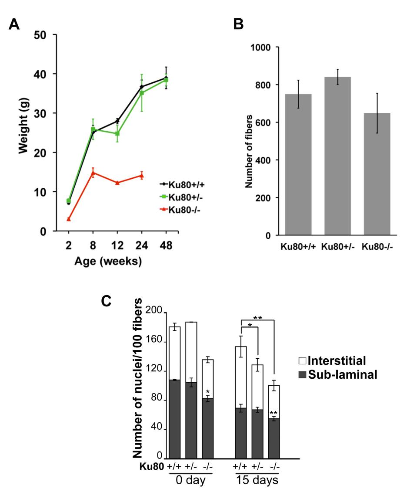
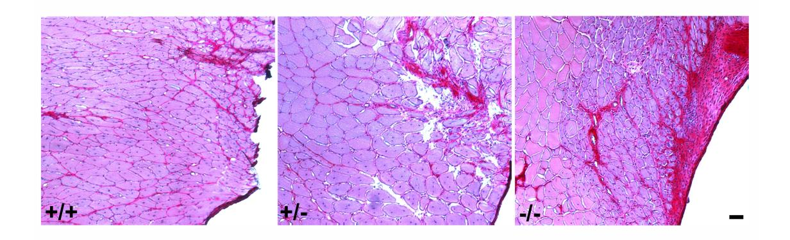
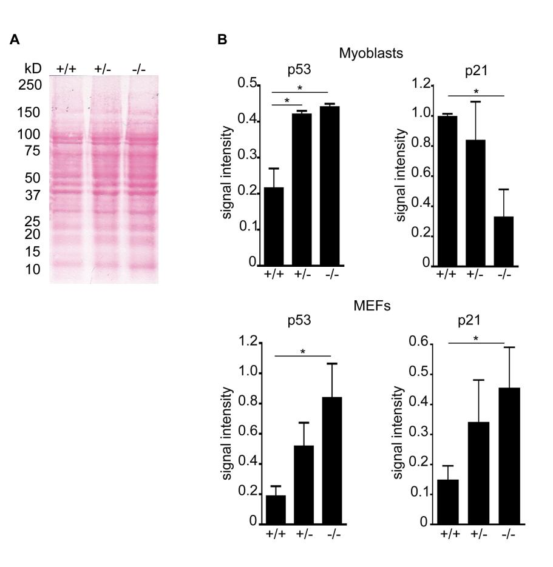
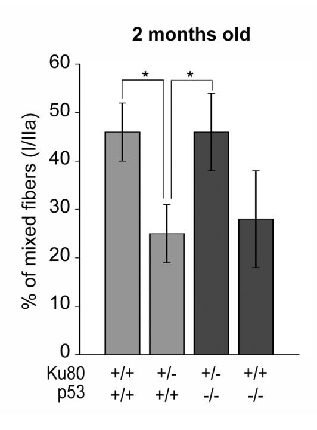
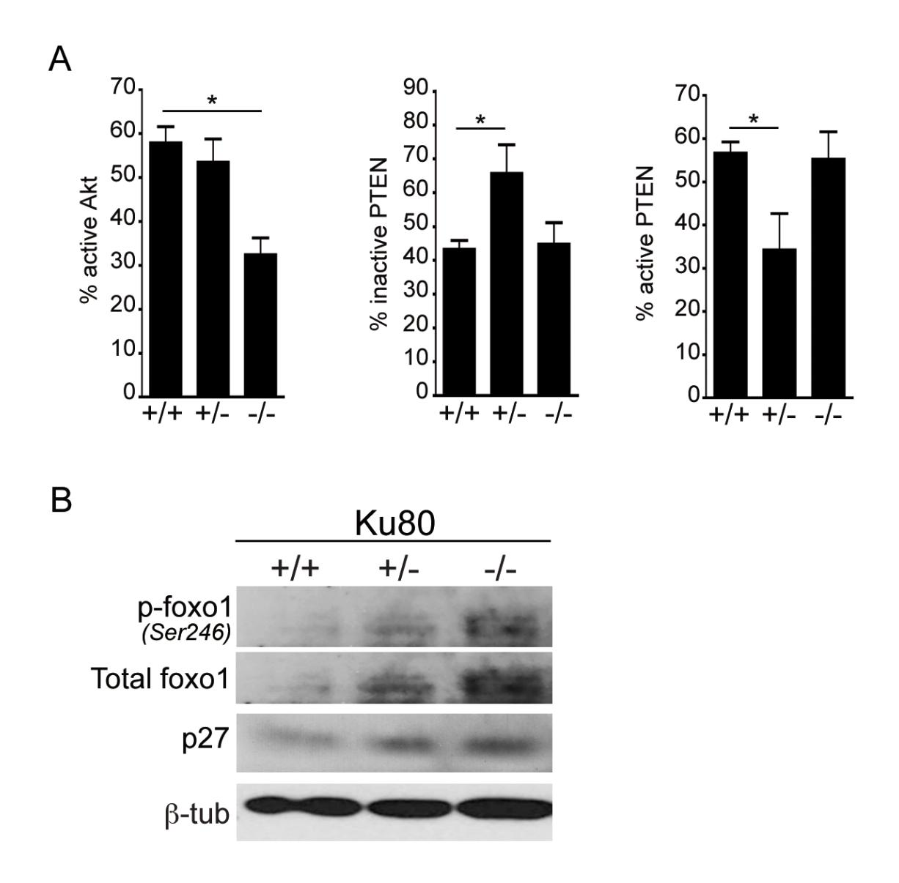

**Supplementary Information :**

**Didier et al., Loss of a single allele for Ku80 leads to progenitor dysfunction and accelerated aging in skeletal muscle.**

# **Contents :**

**- Figure S1.** Changes in body weight, fiber number and cellularity in Ku80 heterozygous, mutant and old WT mice as compared to wildtype muscle.

**- Figure S2.** Increased fibrosis in serially injured Ku80 heterozygous and null muscle.

**- Figure S3**. Quantification and verification of p53 and p21 levels in Ku80 mutant, heterozygous and wildtype myoblasts and MEFs.

**- Figure S4**. Loss of p53 restores fiber type profiles in Ku80 heterozygous mice.

**- Figure S5**. Analyses of cell stress pathways in myoblasts and MEFs from Ku80 mutant, heterozygous and wildtype muscle progenitors.

Supplementary,Information,1 Didier,et,al.

# **Figure S1**

**A) Body weight is significantly reduced in the Ku80 -/-.** Changes in body weight with age in Ku80+/- (green), Ku80-/- (red) and Ku80+/+ (black) between 2 to 24 weeks. While the Ku80-/- displays a reduced postnatal growth as compared to Ku80+/+, we do not observe significant changes in Ku80+/- muscle weight.

**B) Histogram showing the mean fiber number** in Ku80+/+, Ku80+/-, and Ku80-/- 6 month old *Soleus*. No significant differences are observed.

**C) Cellularity decreases post-natally and is further reduced in the Ku80 mutant and heterozygous muscle.** Histogram showing the number of nuclei per 100 fibers from sections stained for laminin to delineate the muscle fibers, and DAPI to visualize nuclei. Ku80-/- muscles show a decrease number of sub-laminal nuclei as compared to Ku80+/+ both at 0 and 15 days (\*p=0.02, \*\*p=0.003). 15 days old Ku80+/- and Ku80-/ muscles exhibit a decreased number of interstitial nuclei as compared to Ku80+/+ muscles (\*p=0.05 and \*\*p=0.001).

# **Figure S2. Increased fibrosis in serially injured Ku80 heterozygous and null muscle.**

Representative photomicrographs of cross sections from adult *TA* stained with Sirius Red and hematoxylin following serial injury. We observed increased fibrosis in Ku80-/ and +/- muscle as compared to Ku80+/+ muscle. Scale bar=100µm.

### Supplementary,Information,3 Didier,et,al.

### **Figure S3. Quantification and verification of p53 and p21 in Ku80 +/+, +/-, and -/ myoblasts and MEFs.**

**A)** Poinceau staining of transfer for Western blot shown in Figure 5G prior to immunodetection verifying equal presence of proteins in all samples.

**B) (top left)** Histogram showing quantification of multiple and independent Western analyses (n=3) for activated p53. Increased levels of p53 are seen in both Ku80 +/- (p=0.033) and Ku80-/- (p=0.028) as compared to wildtype.

**(top right)** Histogram showing quantification of multiple and independent Western analyses (n=3) for p21. Decreased levels of p21 are seen in Ku80-/- (p=0.0035) as compared to wildtype. No significant difference is seen between Ku80+/- and wildtype.

**(lower left)** Histogram showing quantification of multiple and independent Western analyses (n=3) for activated p53 in MEFs. Increased levels of p53 are seen in Ku80-/- (p=0.026) as compared to wildtype. The increase in p53 levels in Ku80+/- MEFs is not statistically significant although we note is trends upward.

**(lower right)** Histogram showing quantification of multiple and independent Western analyses (n=3) for p21 in MEFs. Ku80 -/- MEFs show a significant increase in p21 level (p=0.051) as compared to wildtype whereas the Ku80+/- show only a similar but not significant increase in p21 levels.

Histogram showing the proportion of mixed fiber population (I/IIa) in 2 months old *Soleus.* Ku80+/- *Soleus* display a reduced proportion of mixed fibers (I/IIa) as compared to Ku80+/+ (\*p=0.014). Deletion of p53 restored the mixed fiber proportion to wildtype levels in Ku80+/- *Soleus* as compared to Ku80+/+ (\*p=0.016). Results are shown as mean proportions ±SEM.

#### Supplementary,Information 5 Didier,et,al.

# **Figure S5. Analyses of cell stress pathways in myoblasts and MEFs from Ku80 mutant, heterozygous and wildtype muscle progenitors.**

**A)** Histograms showing quantification of multiple and independent Western analyses (n=3) for active AKT (p=0.02), inactive (p=0.04) and active PTEN (p=04) in myoblasts. **B)** Western analyses showing nuclear levels of phospho-foxo1(Ser246), total foxo1, and p27 in Ku80+/+, Ku80+/- and Ku80-/- MEFs.