## **Supplemental Information:**

# **Telomerase gene therapy in adult and old mice delays aging and increases longevity without increasing cancer.**

Bruno Bernardes de Jesus, Elsa Vera, Kerstin Schneeberger, Agueda M. Tejera, Eduard Ayuso, Fatima Bosch, and Maria A. Blasco

## **Table of contents:**

- **Figure S1:** Viral transduction efficiency.
- **Figure S2:** mTERT antibody controls.
- **Figure S3:** mTERT expression with time.
- **Figure S4:** Metabolic function and cognitive test.
- **Figure S5:** Increased cyclinD1 expression in the cerebellum from AAV9-mTERT treated mice.
- **Figure S6:** Negligible contribution of AAV9-eGFP treatment to mouse survival.
- **Figure S7:** Representative tissue areas used and telomere length analysis.
- **Figure S8:** Increased cyclinD1 expression in tissues from AAV9-mTERT treated mice.
- **Figure S9:** Effect of AAV9-mTERT treatment on Wnt targets.
- **Figure S10:** AAV9-mTERT treatment protects from metabolic dysfunction.
- **Figure S11:** Catalytic activity of mTERT is needed for increased healthspan and life-span extension.

## **Supplemental methods:**

- **Mice**
- **Highthroughput Q-FISH (HT-QFISH) telomere length analysis on blood samples**
- **Object recognition assay**
- **Fat content**
- **Quantitative real-time RT–PCR**
- **Western blots**
- **Histological analysis and immunohistochemistry**

## **Supplemental references.**

## **Supplemental figures:**

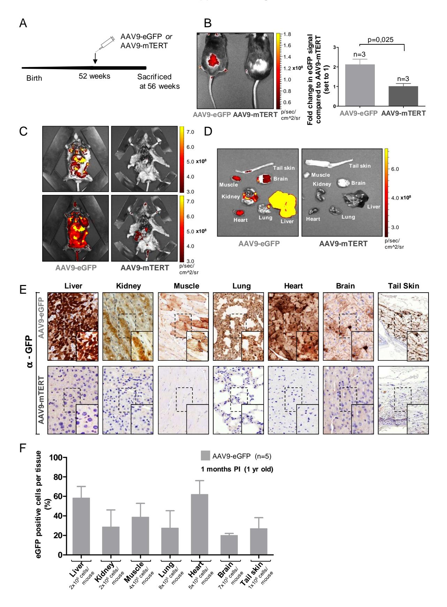

**Figure S1. Viral transduction efficiency**. **A**. Scheme showing the design of the viral transduction efficiency experiment. **B**. Direct GFP measurements in the shaved back skin of female mice (n=3) treated with either AAV9-eGFP or AAV9-mTERT vectors. **C,D**. Direct GFP measurements in the indicated organs from female mice (n=3) treated with either AAV9 eGFP and AAV9-mTERT vectors. **E**. Immunohistochemistry with an antibody recognizing GFP of tissues from either AAV9-eGFP or AAV9-mTERT treated female mice. **F**. Percentage of eGFP-positive cells per tissue measured 1 month post treatment with AAV9-eGFP. Total numbers of cells scored per tissue are indicated.

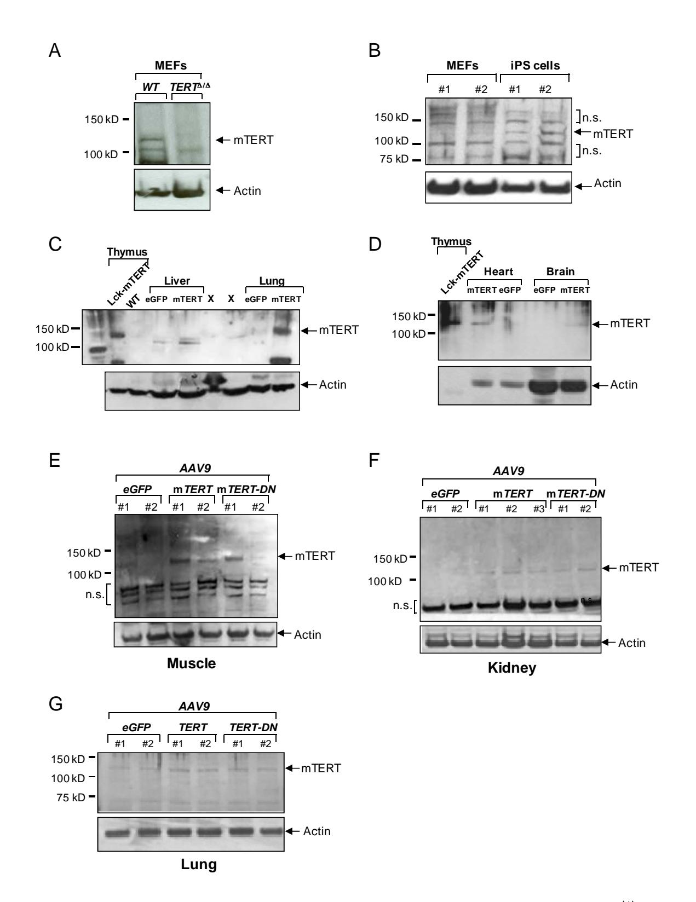

**Figure S2. mTERT antibody controls. A**. mTERT expression in wild-type or TERT∆/∆ MEFs (Liu et al, 2000) (negative control for antibody specificity). **B**. mTERT protein levels are increased in induced pluripotent stem (iPS) cells previously generated by us (Marion et al, 2009) compared to parental MEFs. n.s., non-specific bands. **C**. Expression of mTERT in

thymus from Lck-mTERT transgenic mice (Canela et al, 2004) compared to the corresponding wild-type controls is used as a positive control. Tissue specific mTERT expression in the liver and lung of AAV9-eGFP or AAV9-mTERT treated mice. The samples identified with **X** did not migrate well and are not included. Whole cell tissue extracts were used. **D**. Tissue specific expression of mTERT in thymus from Lck-mTERT mice, as well as heart and brain of AAV9-eGFP or AAV9-mTERT treated mice. Whole cell tissue extracts used. **E,F,G.** mTERT expression in muscle, kidney and lung, respectively, from mice infected with the indicated virus (TERT-DN is described in Fig 5 and Fig. S10). Whole cell tissue extracts were used. n.s., non-specific bands.

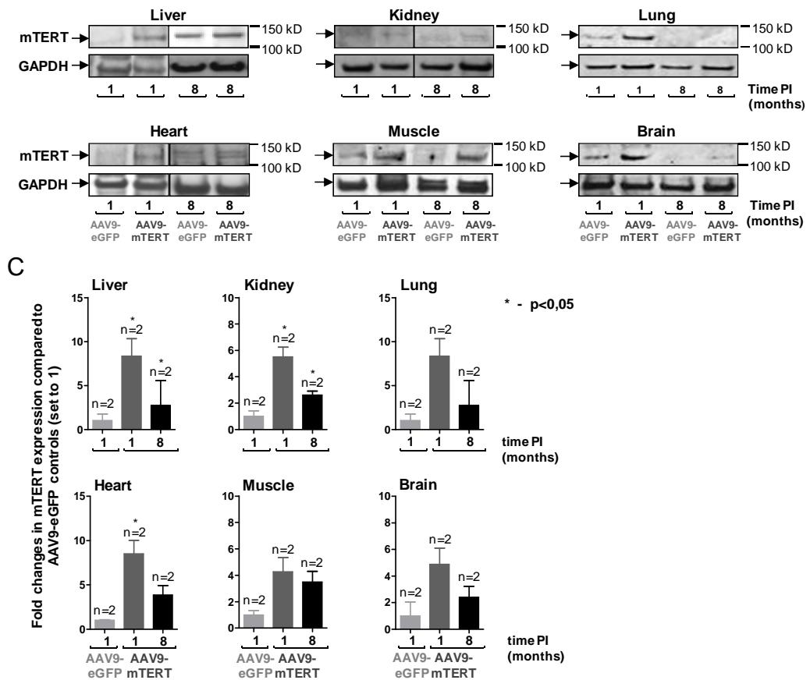

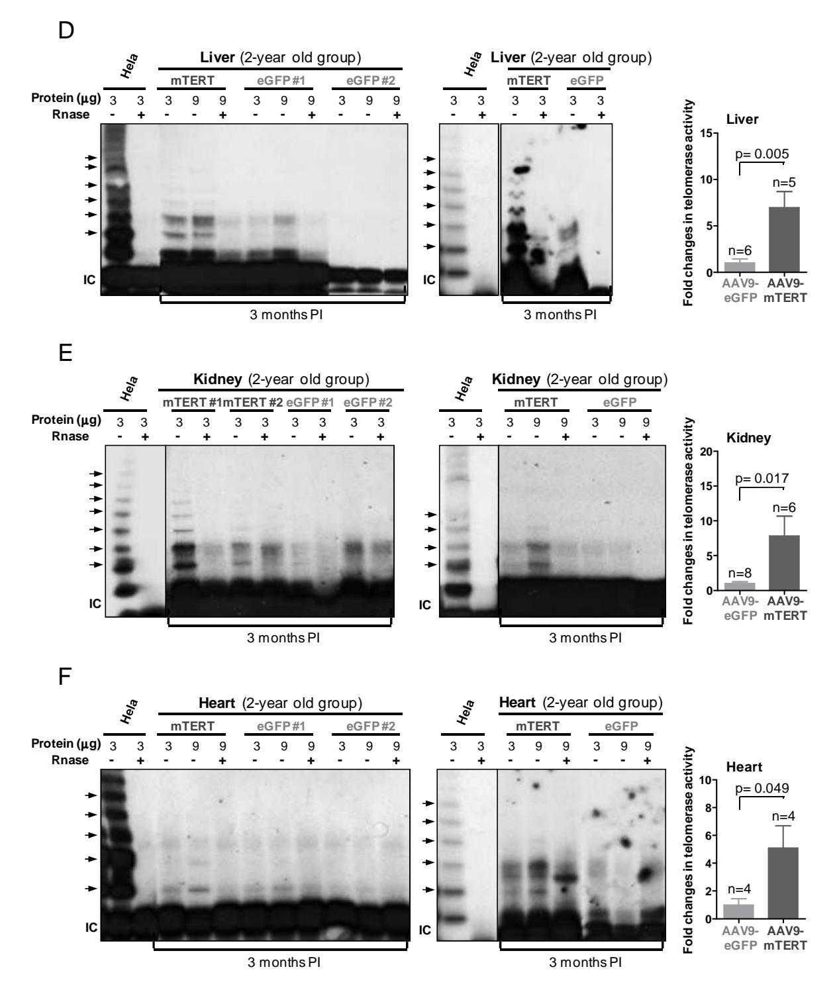

**Figure S3. mTERT expression with time. A.** Dark grey bars: fold change in mean ± SEM mTERT mRNA levels 1 and 8 months post treatment with AAV9-mTERT compared to agematched AAV9-eGFP controls; light grey bars represent mean ± SEM after setting to 1 the control mice. mTERT mRNA values are normalized to actin and are represented as the mean

of 2∆∆Ct values. Number of male mice used is indicated. Student's t-test was used for statistical analysis. **B.** Whole cell tissue extracts from the 2 years-old group were blotted for mTERT and GAPDH, 1 and 8 months PI. **C.** Quantification of mTERT protein from at least 2 male mice. Values are normalized to GAPDH and appear as fold change comparing to the values obtained for the AAV9-eGFP injected group (set to 1). Student's t-test was used for statistical analysis. Data are given as mean± SD. **D, E, F.** Telomerase activity (measured with the TRAP assay) in liver, kidney and heart from either AAV9-eGFP or AAV9-mTERT injected mice (2-year old group, at least 2 male mice were used per group). Right panels represent the quantification of telomerase activity expressed as fold change compared to the AAV9 eGFP injected group (set to 1). Student's t-test was used for statistical analysis. Data are given as mean± SD. IC represents the internal control.

C

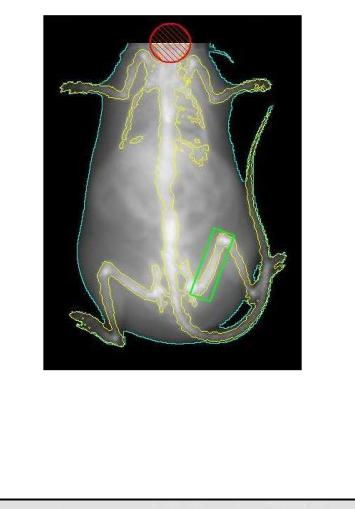

B

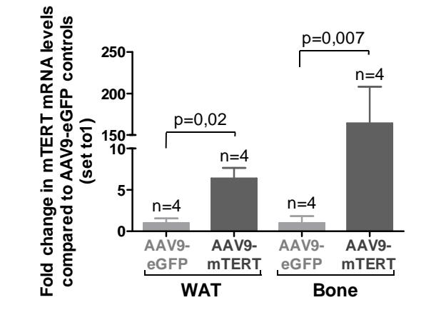

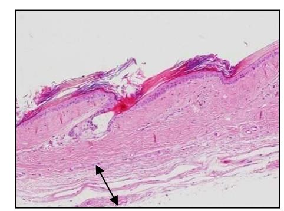

**AAV9-mTERT** 

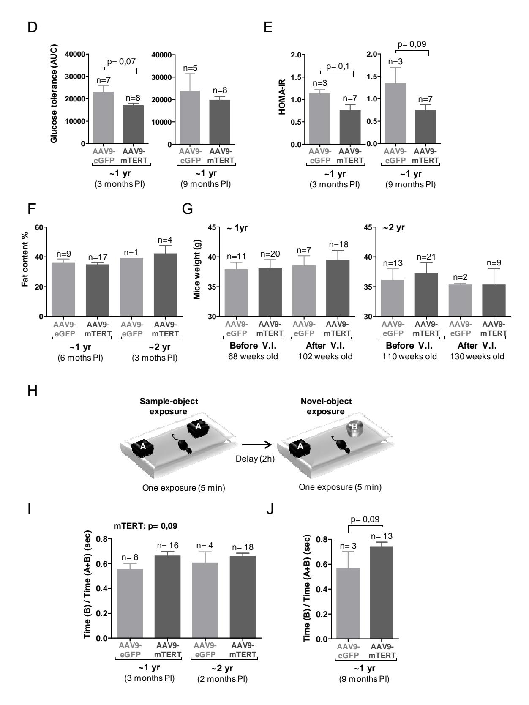

**Figure S4. Metabolic function and cognitive test. A**. Representative image of a DEXA scan for bone mineral density measurements. **B**. Dark grey bars: fold change in mean ± SEM mTERT mRNA levels in AAV9-mTERT treated mice compared to age-matched AAV9-eGFP

controls; light grey bars represent mean ± SEM after setting to 1 the control mice. mTERT mRNA values are normalized to actin and are represented as the mean of 2∆∆Ct values. Student's t-test was used for statistical analysis. WAT, subcutaneous white adipose tissue from the flank adipose tissue depots. **C**. Representative image of a tail skin section. Black arrow, subcutaneous sebaceous layer. **D**. Glucose tolerance measured as the area under the curve (AUC) at the indicated times post-treatment with the vectors. Data are given as mean±SEM. Student´s t-test was used for statistical analysis. **E**. Homeostatic model assessment score. AAV9-mTERT treated mice show a better score at different time points post-treatment. Data are given as mean±SEM. Student´s t-test was used for statistical analysis. **F**. Fat content of mice treated with either AAV9-eGFP or AAV9-mTERT vectors at the indicated times post-treatment. All mice in the study were used. **G**. Body weight of the indicated mice is given as mean± SEM. **H**. Design of the object recognition test. **I**. Object recognition test. Results show the ratios of time spend in the new object versus the total time spent with both objects. Data are given as mean±SEM. Two-way ANOVA was used for statistical analysis. **J**. Object recognition test 9 month post-treatment with the indicated vectors. Data are given as mean±SEM. Student´s t-test was used for statistical analysis.

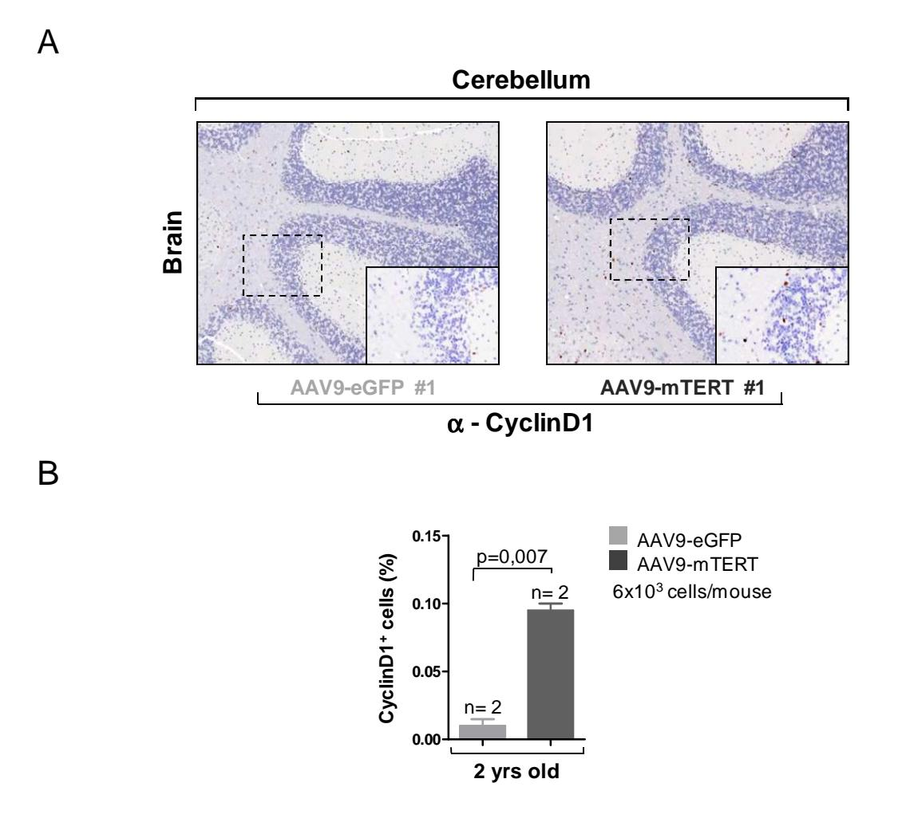

**Figure S5. Increased cyclinD1 expression in the cerebellum from AAV9-mTERT treated mice. A**. Representative images of cyclinD1 staining of the cerebellum of 2 year old male mice treated with either AAV9-eGFP or AAV9-mTERT vectors. **B**. Quantification of cyclinD1 positive cells in cerebellum from two independent experiments (around 6x103 cells/mouse scored). Data are given as mean±SD**.** Student´s t-test was used for statistical assessments.

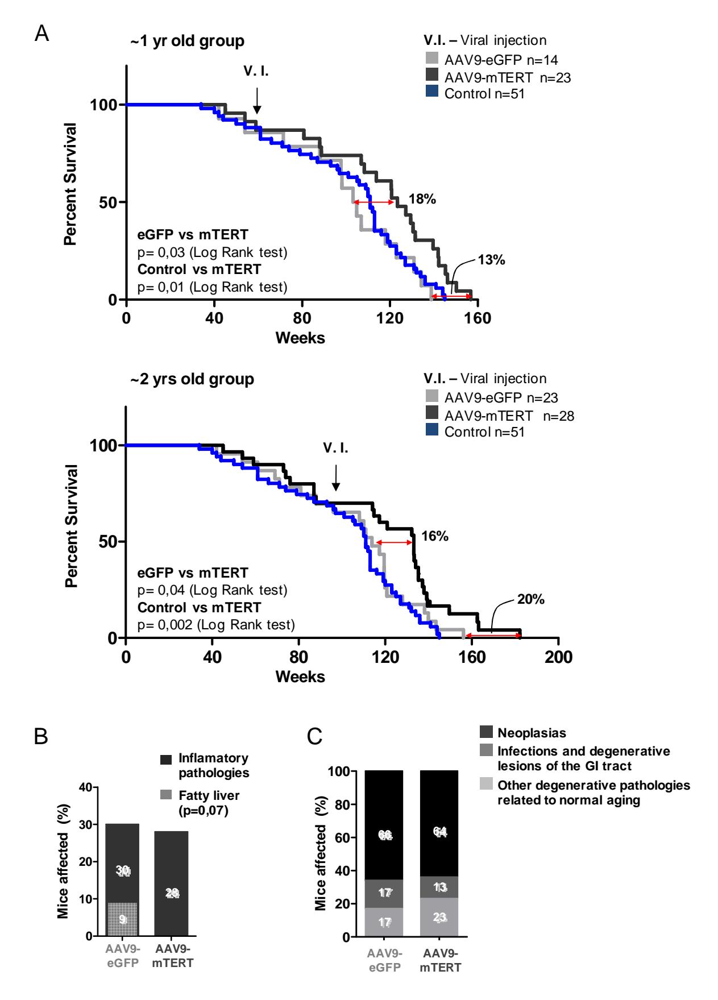

**Figure S6. Negligible contribution of AAV9-eGFP treatment to mouse survival. A.**  Survival curves of the indicated mouse cohorts. Deaths that occurred prior to viral injection

are included. Alive mice are plotted as a vertical line. Statistical significance was assessed with the Log rank test (**1 yr old group**: control vs eGFP p=0,3 [Log-rank]; **2 yrs old group**: control vs eGFP p=0,6 [Log-rank]). **B**. Percentage of cancer-free mice showing the indicated degenerative lesions at their time of death. 9% of the AAV9-eGFP-treated mice presented a fatty liver phenotype, which was not present in the AAV9-mTERT treated mice (p-value of 0,07 comparing the mice affected in both cohorts). **C**. Percentage of mice in the different cohorts showing the indicated pathologies at the time of death (see Materials and Methods).

### **AAV9-mTERT treated mice**

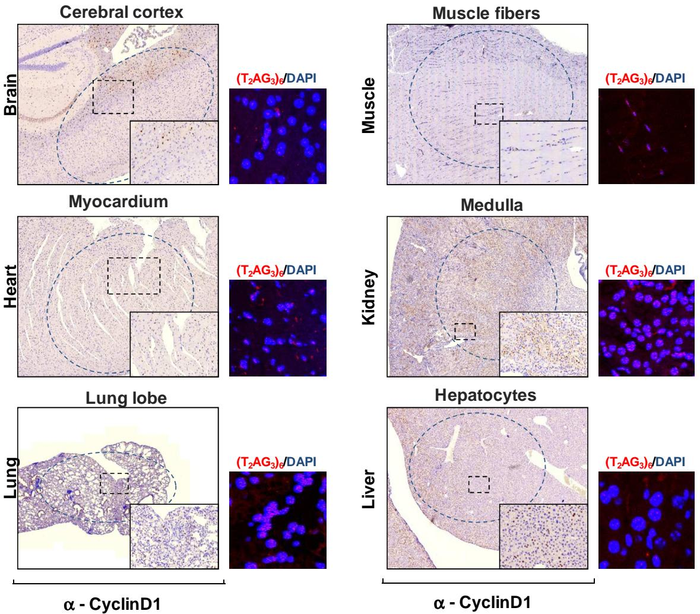

Area where telomere leng

analized

Area where telomere lenght was

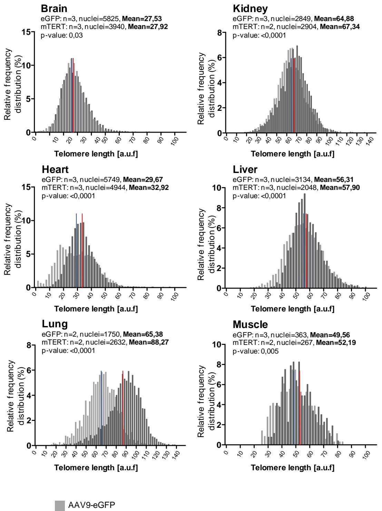

AAV9-mTERT

B

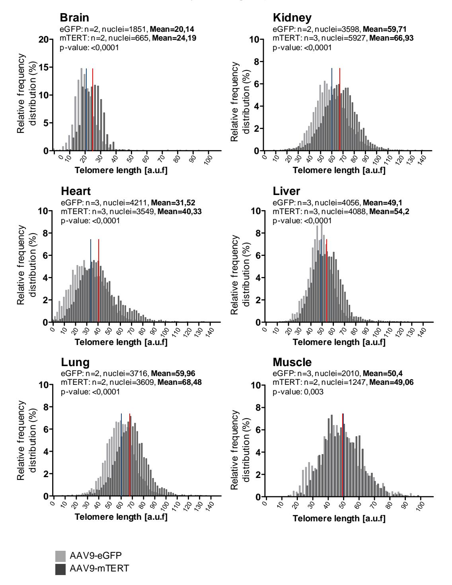

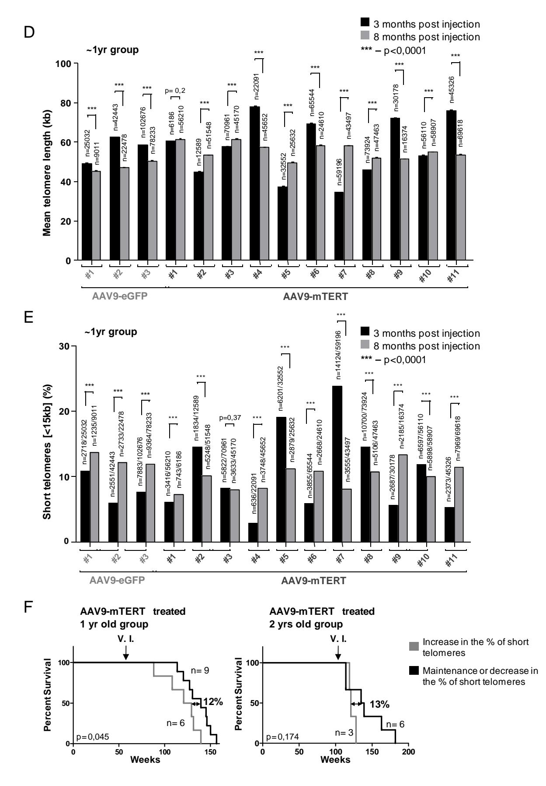

**Figure S7. Representative tissue areas used and telomere length analysis. A.**  Representative images of the different areas of the brain (cerebral cortex), heart

(myocardium), lung (lung lobe), muscle (muscle fibers), kidney (medulla) and liver (hepatocytes) stained for cyclinD1 together with a representative telomere FISH (red) from the same region (nucleus stained with DAPI). **B,C**. Telomere fluorescence determined by Q-FISH of the indicated tissues from the 1 year (A) and 2 year old (B) groups 1 month posttreatment with AAV9-mTERT or AAV9-eGFP vectors. Histograms represent the frequency (in percentage) of telomere fluorescence per nucleus (in arbitrary units of fluorescence [auf]). The red line indicates mean telomere length of AAV9-mTERT and the blue line indicates mean telomere length of AAV9-eGFP. Age-matched male mice were used. **D**. Mean telomere length as determined by HT-QFISH in white blood cells extracted from the same mouse at different times post-treatment with the indicated AAV9 vectors. Results are presented per individual mouse (#1-11). Data are given as mean±SEM**. E**. Percentage of telomeres shorter than 15Kb is shown for the same mice. Student´s t-test was used to assess statistical significance between groups. Data are given as mean±SEM**. F**. Survival curves of 1 yr and 2 yrs old AAV9-mTERT mice which presented an increase in the percentage of short telomeres or a maintenance or decrease of the percentage of short telomeres over time. Statistical significance was assessed with the Log rank test.

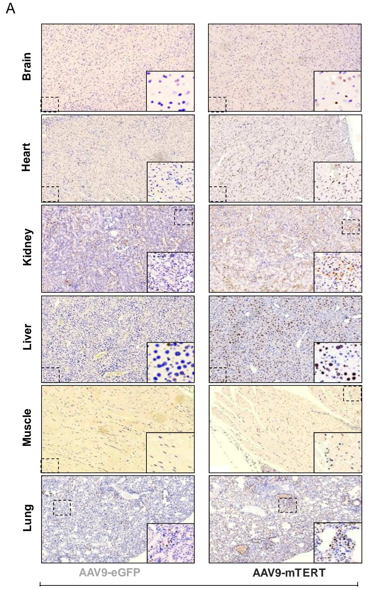

α **- CyclinD1** 

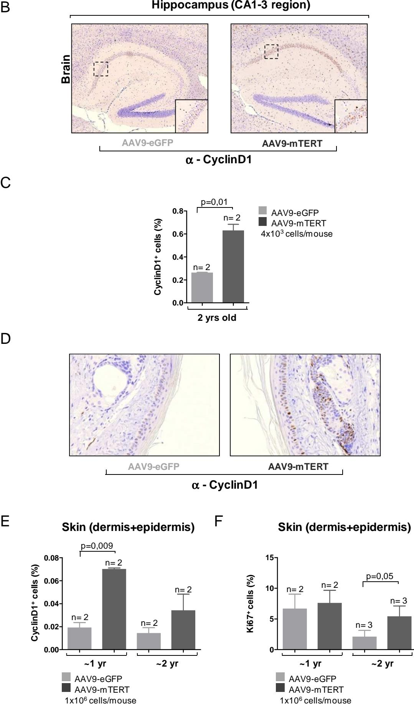

21

### **Figure S8. Increased cyclinD1 expression in tissues from AAV9-mTERT treated mice**.

**A**. Representative images of cyclinD1 staining of different tissues of 2 year old male mice treated with either AAV9-eGFP or AAV9-mTERT vectors. **B**. Representative images of cyclinD1 staining of the hippocampus of 2 year old male mice treated with either AAV9-eGFP or AAV9-mTERT vectors. **C**. Quantification of cyclinD1-positive cells in the CA1-3 region of hippocampus from two independent experiments (around 4x103 cells/mouse scored). Data are given as mean±SD**.** Student´s t-test was used for statistical assessments. **D.** Representative images of cyclinD1 staining of the skin of 2 year old male mice treated with either AAV9-eGFP or AAV9-mTERT vectors. **E**. Quantification of cyclinD1-positive cells out of total number of cells scored (around 1x106 cells/mouse scored) in the skin (including epidermis and dermis) of age-matched AAV9-mTERT or AAV9-eGFP treated male mice. Student´s t-test was used for statistical assessments. Data are given as mean±SD. **F**. Quantification of Ki67 positive cells out of the total number of cells scored (around 1x106 cells/mouse scored) in skin sections (including epidermis and dermis) from AAV9-eGFP or AAV9-mTERT treated mice. Student´s t-test was used for statistical calculations. Data are given as mean±SD**.** 

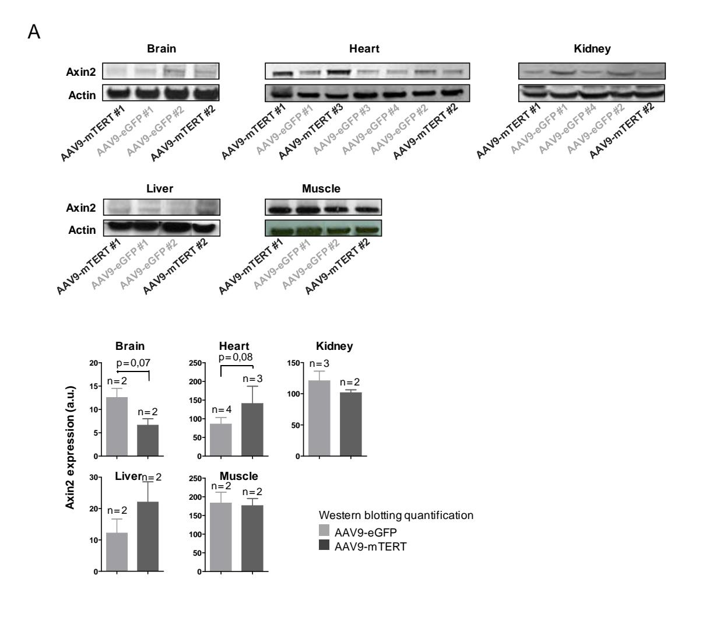

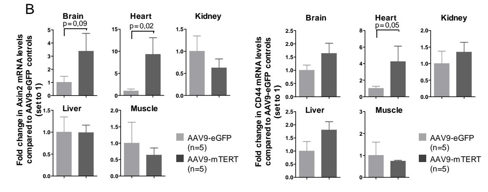

C

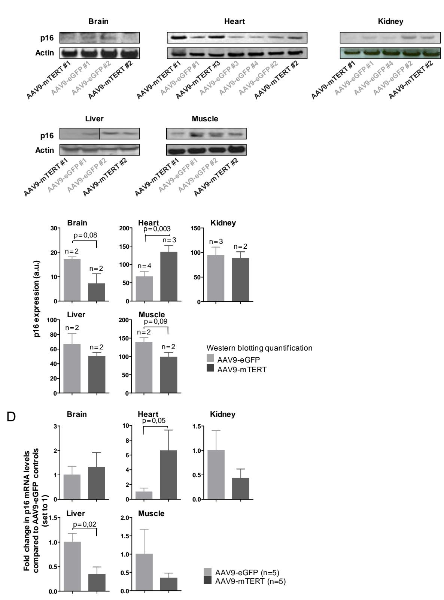

**Figure S9. Effect of AAV9-mTERT treatment on Wnt targets. A**. Representative Western blot (Axin2, Actin) of the indicated tissues from 2 year old male mice treated with either AAV9-

mTERT or AAV9-eGFP vectors. Quantification of Axin2 expression is shown in the bottom panel. Values were corrected by actin and correspond to mean intensity±SD. **B**. Fold changes in mRNA levels of Wnt target genes Axin2 (left panel) and CD44 (right panel) in mice treated with either AAV9-mTERT or AAV9-eGFP vectors. Values are normalized for actin and are represented as the mean of 2∆∆Ct values relative to samples of age-matched AAV9-eGFP mice (set to 1, n=5 for each group). **C**. Representative Western blot (p16, Actin) of the indicated tissues from 2 year old male mice treated with either AAV9-mTERT or AAV9 eGFP vectors. Quantification of p16 expression is shown in the bottom panel. Values were corrected by actin and correspond to mean intensity±SD. **D**. Fold changes in the mRNA expression of p16 in the indicated tissues from mice treated with either AAV9-mTERT or AAV9-eGFP vectors. Data was normalized for actin and are represented as the mean of 2∆∆Ct values relative to samples of age-matched AAV9-eGFP mice (set to 1, n=5 for each group). Student´s t-test was used to assess significance between tested groups.

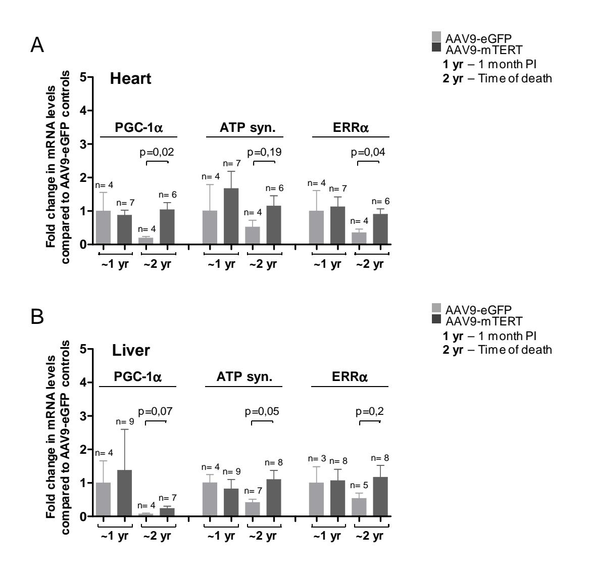

**Figure S10. AAV9-mTERT treatment protects from metabolic dysfunction**. **A**. Tissues from 2 yr old mice present a decrease of expression of genes involved in metabolism and mitochondrial function such as PGC-1α, ATP syn. and ERRα, a situation previously observed in aging induced by telomere shortening (Sahin et al, 2011). Treatment with mTERT late in life partially rescues this condition. Student´s t-test was used for statistical assessments.

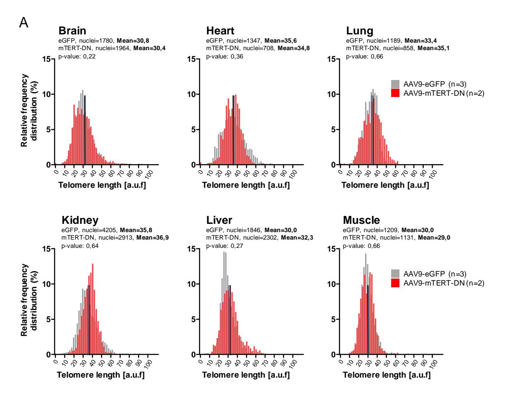

**Figure S11. Catalytic activity of mTERT is needed for increased healthspan and lifespan extension. A**. Telomere fluorescence determined by Q-FISH of the indicated tissues 1 month post-treatment with AAV9-mTERT-DN or AAV9-eGFP vectors. Histograms represent the frequency (in percentage) of telomere fluorescence per nucleus (in arbitrary units of fluorescence [auf]). The black line indicates mean telomere length of AAV9-mTERT-DN and the blue line indicates mean telomere length of AAV9-eGFP. Age-matched (1 yr old) male mice were used.

## **Supplemental methods:**

#### **Mice**

Mice were produced at a specific pathogen-free barrier area of the CNIO, in accordance with the recommendations of the Federation of European Laboratory Animal Science Associations. Mice were daily inspected by an authorized animal facility technician and sacrificed when they presented signs of morbidity or tumors in accordance to the Guidelines for Humane Endpoints for Animals Used in Biomedical Research (Harrison et al, 2009). The date of euthanasia was used as an estimation of the mouse lifespan. All mice were subjected to necropsy and histopathological analysis.

#### **Highthroughput Q-FISH (HT-QFISH) telomere length analysis on blood samples**

HT-QFISH was performed as described (Canela et al, 2007). Briefly, blood was extracted from the facial vein at the indicated time points after treatment and peripheral blood leukocytes plated in clear bottom black-walled 96-well plates. The 4`,6-diamidino-2 phenylindole channel was used for nucleus staining and the CY3 for telomere detection. Telomere length values were analyzed using individual telomere spots (> 5000 telomere spots per sample). Fluorescence intensities were converted into Kb using L5178-R and L5178-S cells as calibration standards, which have stable telomere lengths of 79.7 kb and 10.2 kb, respectively (McIlrath et al, 2001). Samples were analyzed in duplicate, or triplicate in the case of calibration standards.

## **Object recognition assay**

The object recognition memory test was carried out as explained before (Bevins & Besheer, 2006) and briefly explained in **Fig. S4h**. The plotted values correspond to the time spend in the "new object (object B)" divided by the total time spent with both objects (objects A and B).

## **Fat content**

Fat content was measured with the same procedure described for bone mineral density acquirements, using the DEXA scan.

#### **Quantitative real-time RT–PCR**

Total RNA from tissues was extracted with Trizol (Life Technologies). RNA samples were DNase I treated, and used as template for a reverse transcription reaction using random primers and Superscript Reverse Transcriptase (Life Technologies), according to the manufacturer's guidelines. Quantitative real-time PCR was performed using an ABI PRISM 7700 (Applied Biosystems), using DNA Master SYBR Green I mix (Applied Biosystems). The primers used were: Actin-For: GGCACCACACCTTCTACAATG; Actin-Rev: GTGGTGGTGAAGCTGTAG; TERT-For: GGATTGCCACTGGCTCCG; TERT-Rev: TGCCTGACCTCCTCTTGTGAC; Axin2-For: GGCAAAGTGGAGAGGATCGAC; Axin2-Rev: TCGTGGCTGTTGCGTAGG; CyclinD1 – For: TGCGCCCTCCGTATCTTAC; CyclinD1 – Rev: ATCTTAGAGGCCACGAACATGC; CD44 – For: CAGCCTACTGGAGATCAGGATGA; CD44 – Rev: GGAGTCCTTGGATGAGTCTCGA; p16-For: CGTACCCCGATTCAGGTGAT; p16- Rev: TTGAGCAGAAGAGCTGCTACGT. Target genes used in **Fig. S10** were done according to Sahin et al. (Sahin et al, 2011). Statistical analyses (student's t-test) were performed on the Ct values as described before (Munoz et al, 2005).

### **Western blots**

Western blots were made on whole cell extracts from the indicated tissues. Tissues from moribund animals were collected and immediately snap frozen post-mortem. The antibodies used were: Anti-h/mTERT [Calbiochem, 582005; the specificity of this antibody was previously tested by us using negative and positive controls in (Martinez et al); and further confirmed in this manuscript (**Fig. S2**), anti-β-Catenin (BD Laboratories, 610154), anti-Activeβ-Catenin (Millipore, 05-665), anti-Axin2 (Abcam, 32197), anti-p16 (Santa Cruz, 1207), anti-βActin (Sigma, A5441) and anti-GAPDH (Sigma, G8795). The quantification was made with Scion Image Software.

### **Histological analysis and immunohistochemistry**

Histopathology was performed as previously described (Gonzalez-Suarez et al, 2001). Briefly, mouse tissues and organs were fixed overnight in a 10% neutral-buffered formalin solution at 4°C, dehydrated through graded alcohols and xylene, and embedded in paraffin. Histological analysis was performed on 4-5 µm sections according to standard procedures. Cancer related pathologies were grouped in four types as described (Tomas-Loba et al, 2008). Degenerative and inflammatory pathologies have been scored using the same criteria previously described (Tomas-Loba et al, 2008). In summary, degenerative and inflammatory pathologies include: severe infections (GI tract: enteritis, gastritis, peritonitis; Skin: dermatitis), degenerative lesions of the GI tract (muscular atrophy and associated lesions (peritonitis, enteritis)), other degenerative pathologies related to normal aging (benign neoplasias (adenoma, hemangioma, lipoma) or degenerative lesions in the intestine (atrophy of the small and large intestine), kidney (glomerulonephritis, tubular degeneration), spleen (atrophy, hemosiderosis, myeloid and lymphoid hyperplasia), liver (congestion, vacuolar degeneration, microgranuloma), testis (atrophy, ectasis of seminal vesicles), ovary (atrophy), uterus (cystic endometrial hyperplasia), skin (hyperplasias, inflammatory processes), lung (trombosis, congestion, fibrosis), heart (congestion, cardiomyopathy) or brain (calcification)).

Immunohistochemistry was performed on deparaffinated tissues and processed with hematoxylin and eosin (H&E) or the indicated antibodies: Anti-GFP (Invitrogen, A11122), Anti-cyclinD1 (Thermo Scientific, RM-9104, Clone SP4), Anti-Phospho-Smad2 (SER465/467, Chemicon AB3849) and Anti Ki-67 (DakoCytomation, M7249, clone TEC-3). Quantitative image analysis was performed using the AxioVision 4.8 software (Carl Zeiss AG); quantitation of immunostainings was determined by counting the number of peroxidase stained cells over the total number of hematoxylin-stained cells.

30

# **Supplemental references**

Bevins RA, Besheer J (2006) Object recognition in rats and mice: a one-trial non-matching-tosample learning task to study 'recognition memory'. Nat Protoc 1**:** 1306-1311

Canela A, Martin-Caballero J, Flores JM, Blasco MA (2004) Constitutive expression of tert in thymocytes leads to increased incidence and dissemination of T-cell lymphoma in Lck-Tert mice. Mol Cell Biol 24**:** 4275-4293

Canela A, Vera E, Klatt P, Blasco MA (2007) High-throughput telomere length quantification by FISH and its application to human population studies. Proc Natl Acad Sci U S A 104**:** 5300-5305

Gonzalez-Suarez E, Samper E, Ramirez A, Flores JM, Martin-Caballero J, Jorcano JL, Blasco MA (2001) Increased epidermal tumors and increased skin wound healing in transgenic mice overexpressing the catalytic subunit of telomerase, mTERT, in basal keratinocytes. EMBO J 20**:** 2619-2630

Harrison DE, Strong R, Sharp ZD, Nelson JF, Astle CM, Flurkey K, Nadon NL, Wilkinson JE, Frenkel K, Carter CS et al (2009) Rapamycin fed late in life extends lifespan in genetically heterogeneous mice. Nature 460**:** 392-395

Liu Y, Snow BE, Hande MP, Yeung D, Erdmann NJ, Wakeham A, Itie A, Siderovski DP, Lansdorp PM, Robinson MO et al (2000) The telomerase reverse transcriptase is limiting and necessary for telomerase function in vivo. Curr Biol 10**:** 1459-1462

Marion RM, Strati K, Li H, Tejera A, Schoeftner S, Ortega S, Serrano M, Blasco MA (2009) Telomeres acquire embryonic stem cell characteristics in induced pluripotent stem cells. Cell Stem Cell 4**:** 141-154

Martinez P, Thanasoula M, Carlos AR, Gomez-Lopez G, Tejera AM, Schoeftner S, Dominguez O, Pisano DG, Tarsounas M, Blasco MA (2010) Mammalian Rap1 controls telomere function and gene expression through binding to telomeric and extratelomeric sites. Nat Cell Biol 12**:** 768-780

McIlrath J, Bouffler SD, Samper E, Cuthbert A, Wojcik A, Szumiel I, Bryant PE, Riches AC, Thompson A, Blasco MA et al (2001) Telomere length abnormalities in mammalian radiosensitive cells. Cancer Res 61**:** 912-915

Munoz P, Blanco R, Flores JM, Blasco MA (2005) XPF nuclease-dependent telomere loss and increased DNA damage in mice overexpressing TRF2 result in premature aging and cancer. Nat Genet 37**:** 1063-1071

Sahin E, Colla S, Liesa M, Moslehi J, Muller FL, Guo M, Cooper M, Kotton D, Fabian AJ, Walkey C et al (2011) Telomere dysfunction induces metabolic and mitochondrial compromise. Nature 470**:** 359-365

Tomas-Loba A, Flores I, Fernandez-Marcos PJ, Cayuela ML, Maraver A, Tejera A, Borras C, Matheu A, Klatt P, Flores JM et al (2008) Telomerase reverse transcriptase delays aging in cancer-resistant mice. Cell 135**:** 609-622