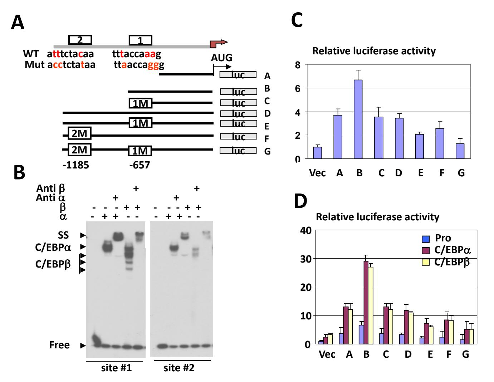
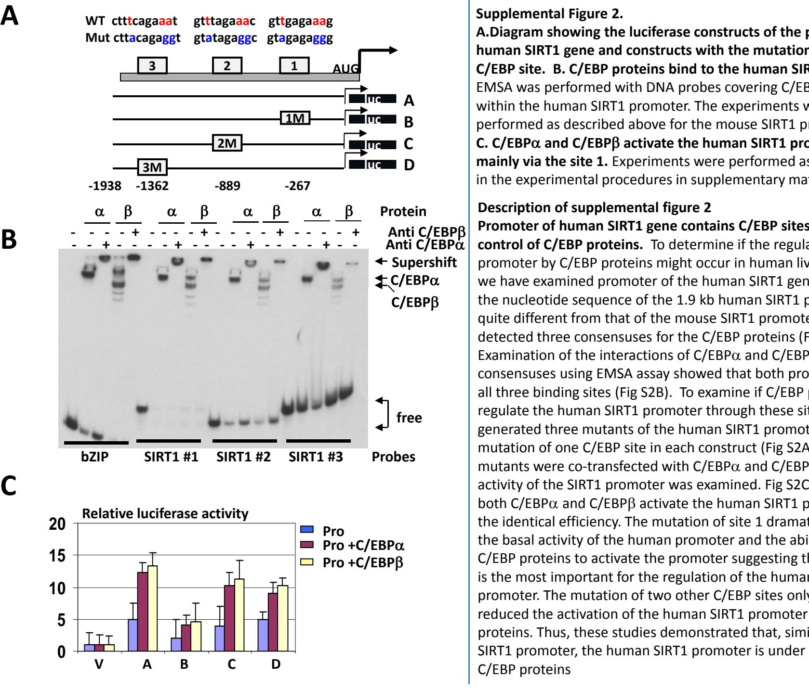

# **Supplemental file for the paper by Jin et al**

**Supplemental figure 1. C/EBP and C/EBP regulate the mouse SIRT1 promoter. A. Luciferase constructs of the mouse WT SIRT1 promoter and mutant constructs used for these studies.** Positions and sequences of WT C/EBP sites and mutants are shown**. B. C/EBP and C/EBP bind to the mouse SIRT1 promoter**. EMSA experiments were performed with DNA probes covering C/EBP sites 1 and 2 in the SIRT1 promoter. C/EBP and C/EBP were overexpressed in cultured cells and used for these studies. Positions of C/EBP and C/EBP shifts and supershift (SS) are shown by arrows. **C. C/EBP site 1 is critical for the basal activity of the SIRT1 promoter and for the activation by C/EBP proteins.** Luciferase constructs of the SIRT1 promoter were transfected into Hep3B2 cells and luciferase activity was examined. **D. C/EBP and C/EBP up‐regulate the SIRT1 promoter mainly through the site 1.** Luciferase constructs of the SIRT1promoter were co‐transfected with an empty vector, with C/EBP and with C/EBP into Hep3B2 cells.

## **Description of data on Supplemental figure 1**

## **C/EBP and C/EBPβ bind to and activate the mouse SIRT1 promoters.**

We have next elucidated mechanisms by which ag g in liver reduces expression of SIRT1. Our previous studies have shown that senescent livers are characterized by epigenetic silencing of E2F dependent promoter by C/EBPE2F4‐Brm‐HDAC1 complex and by repression of C/EBP targets by C/EBPHDAC1 complex. Therefore, we have cloned the mouse 1.3 kb SIRT1 promoter and searched it for E2F sites (binding sites for C/EBPE2F4‐Brm complex) and for C/EBP sites (targets of the C/EBP‐HDAC1 complex). We have not found E2F consensuses within the SIRT1 promoter, but we have found two high affinity sites for C/EBP proteins (Fig S1A). Therefore, we focused our studies on the possible regulation of the mouse SIRT1 promoter by C/EBP proteins. EMSA approach showed that C/EBP proteins interact with these sites Fig S1B. We have next generated several promoter constructs with mutations or deletions of these sites (Fig S1A). The activity of the mutant SIRT1 constructs was examined by transfection of the plasmids into Hep3B2 cells. These studies showed that the 0.7 kb fragment of the SIRT1 promoter, which contains one C/EBP site, possesses the higher activity and that the mutation of this site significantly reduces the activity of SIRT1 promoter (Fig S1C). We found that both C/EBP and C/EBP activate the mouse SIRT1 promoter mainly through the interactions with site 1 (Fig S1D). Note that we have reproducibly observed a slightly weaker activation of the construct D (WT full length promoter) by C/EBP proteins proteins. We suggest that the regions up‐stream of C/EBP site 1 contain some elements which partially repress the promoter.

**A.Diagram showing the luciferase constructs of the promoter of human SIRT1 gene and constructs with the mutation of each C/EBP site. B. C/EBP proteins bind to the human SIRT1 promoter.** EMSA was performed with DNA probes covering C/EBP sites within the human SIRT1 promoter. The experiments were performed as described above for the mouse SIRT1 promoter. **C. C/EBP and C/EBP activate the human SIRT1 promoter mainly via the site 1.** Experiments were performed as described inthe experimental procedures in supplementary materials.

### **Description of supplemental figure 2**

**Promoter of human SIRT1 gene contains C/EBP sites and is under control of C/EBP proteins.** To determine if the regulation of SIRT1 promoter by C/EBP proteins might occur in human livers, we have examinedpromoter of the human SIRT1 gene. Althou g hp g the nucleotide sequence of the 1.9 kb human SIRT1 promoter is quite different from that of the mouse SIRT1 promoter, we have detected three consensuses for the C/EBP proteins (Fig S2A). Examination of the interactions of C/EBP and C/EBP with these consensuses using EMSA assay showed that both proteins bind to ll h bi di i ( i S2 ) i if / i allthreending sites (Fig B). To examine C /EBP proteins regulate the human SIRT1 promoter through these sites, we have generated three mutants of the human SIRT1 promoter with the mutation of one C/EBP site in each construct (Fig S2A). These mutants were co‐transfected with C/EBP and C/EBP and the activity of the SIRT1 promoter was examined Fig S2C shows that C/EBP and C/EBP activate the human SIRT1 promoter with the identical efficiency. The mutation of site 1 dramatically reduced the basal activity of the human promoter and the ability of C/EBP proteins to activate the promoter suggesting that this site is the most important for the regulation of the human SIRT1 promoter. The mutation of two other C/EBP sites only slightly reduced the activation of the human SIRT1 promoter by C/EBP proteins. Thus, these studies demonstrated that, similar to mouse SIRT1 promoter, the human SIRT1 promoter is under control of C/EBP proteins

**B**

**C**

**A**

# **Experimental procedures**

**Electrophoretic mobility shift assay (EMSA).** EMSA experiments with the human and mouse SIRT1 promoters were performed as described in our previous publication (1). The sequences of the DNA probes are shown in Figs S1 and S2. in

**Promoter‐reporter plasmid construction.** A 1299‐bp mouse SIRT1 and 1909‐bp human SIRT1 promoters were cloned into the promoter‐less luciferase reporter vector pGL3‐Basic vector (pGL3B; Promega) at *Kpn* I and *Nhe*I sites (mouse SIRT1) and *Mlu* I and *Nhe*I sites (human SIRT1), respectively.

**BrdU uptake.** BrdU (100 mg/kg; Sigma Chemical Chemical, St. Louis, MO) was injected in animals 2 hours before animals were sacrificed sacrificed. Livers were harvested and paraffin‐embedded liver sections were stained with antibodies to BrdU as described in our papers (2). The BrdU labeling index was determinedby counting more than 2000 nuclei of hepatocytes in 3 different sections for each mouse.

**Co‐Immunoprecipitation.** C/EBPα or C/EBPβ was immunoprecipitated from nuclear extracts with polyclonal antibodies, and the presence of HDAC1, Brm in C/EBPα IPs or HDAC1 in C/EBPβ IPs were examined by Western blotting with monoclonal antibodies to mentioned proteins.

**Cell culture, transient‐transfection and Luciferase Assay analysis.** The human Hep3B2 hepatoma cell lines (ATCC) were cultured in minimal e ssential medium supplemented with 10% fetal bovine serum (HyClone) and 100 U/ml penicillin‐streptomycin (Gibco) at 37°C in a humidified incubator with 5% CO2. Hep3B2 cells were transfected with indicated fire‐fly luciferase reporters and control pRL‐TK (Renilla Luciferase, Promega) using the Fugene 6 transfection reagent (Roche Molecular Biochemicals) according to the manufacturer's protocol. After 24 hr, luciferase activity was measured using the Dual‐Luciferase Reporter Assay System (Promega). The final firefly luciferase activity was normalized tothe coexpressed renilla luciferase.

*Experiments with Flag‐SIRT1, SIRT1 siRNA, C/EBPβ siRNA and Partial hepatectomy.* A vector expressing Flag‐SIRT1 (or si RNA to C/EBPβ, the sequence of C/EBPβ si RNA is: 5'‐GAGACAGGCUUCUACUACGAGGCGGACUU‐3') was delivered into old (22‐24 mo) mice or si RNA to SIRT1 (the SIRT1 si RNA is a pool of 3 different siRNA duplexes duplexes, the sequence of them are : 5'‐CAUCUUGCCUGAUUUGUAA ‐3', 5'‐GUACCACCAAAUCGUUACA‐3', and 5'‐ GCAUAGAUCUUCACCACAA‐3' ) into young (2‐4 mo) mice by tail vein injections using the "*in vivo*‐jetPEI transfection reagent" (PolyPlus Transfection). Partial hepatectomy was performed with these mice 24 h after delivery of Flag‐SIRT1 or si RNA to SIRT1 as described in our previous publications (1‐4). Seventy percent of the liver was surgically removed, and regeneration was allowed to proceed for 24, 36, 48, and 72 h. Livers were collected and frozen in liquid nitrogen. Liver proliferation was examinedby BrdU uptake and by measuring expression of cell cycle proteins. 3‐4 mice were used per each time point.

**Statistical analysis.** Data are expressed as the mean ± SD, Significant differences between means was analyzed by two‐tailed, unpaired Student'st test, and differences were considered significant at p &lt; 0.05.

## Reference for supplemental materials:

- 1. Jin J Wang GL Shi X Darlington GJ Timchenko NA The age J, GL, X, Darlington GJ, NA. The age-associated decline of glycogen synthase kinase 3beta associated of plays a critical role in the inhibition of liver regeneration. Mol Cell Biol 2009;29:3867-3880.
- 2. Wang GL, Iakova P, Wilde M, Awad S, Timchenko NA. Liver tumors escape negative control of proliferation via PI3K/Akt-mediated block of C/EBP alpha growth inhibitory activity. Genes Dev 2004;18:912-925.
- 3. Wang GL, Shi X, Salisbury E, Sun Y, Albrecht JH, Smith RG, Timchenko NA. Cyclin D3 maintains growth-inhibitory activity of C/EBPalpha by stabilizing C/EBPalpha-cdk2 and C/EBPalpha-Brm complexes. Mol Cell Biol 2006;26:2570- 2582.
- 4. Wang GL, Shi X, Haefliger S, Jin J, Major A, Iakova P, Finegold M, et al. Elimination of C/EBPalpha through the ubiquitin-proteasome system promotes the development of liver cancer in mice. J Clin Invest;120:2549-2562.