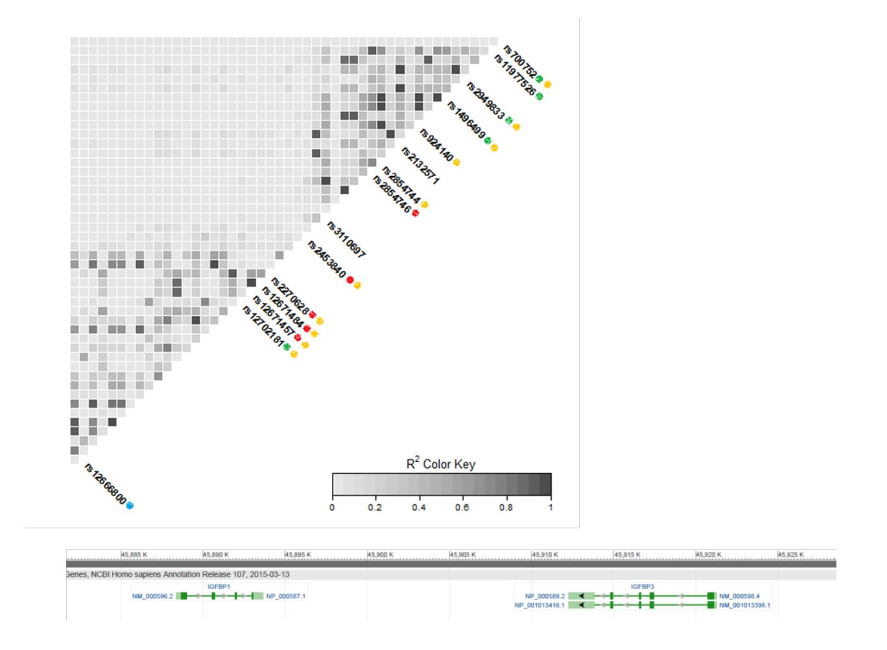

# **Supplementary Results**

# **Association of SNPs in IGFBP1/IGFBP3 with prostate cancer risk and progression**

There were a few extra genetic variants showing weak associations with prostate cancer spanning a region of approximately 110 kbs in IGFBP1/IGFBP3 (from ~45,860 to ~45,970 kbs), besides those reported in the main text (**Supplementary Table 7**, **Supplementary Figure 1**).

Rs2453840 was associated with prostate cancer risk (OR per T allele 0.97; 95% CI 0.95, 0.99) but was either not or weakly associated with IGF levels in ProtecT and ALSPAC, respectively, and was out of HWE in UKHLS (not shown). This SNP was not in LD with rs11977526 (r2 = 0.03). A group of three variants in strong LD (rs12671457, rs12671484 and rs2270628), yet not linked to rs2453840 (r2 = 0.05 – 0.08) or rs11977526 (r2 = 0.005 – 0.01) (**Supplementary Figure 1**), was also associated with prostate cancer risk (**Supplementary Table 7**), however exhibited weak, inconsistent associations with IGF levels in ProtecT, ALSPAC and UKHLS (not shown).

The analysis of Gleason grade (< 7 (reference) vs ≥ 7) yielded the most robust association with rs2949833 (OR per T allele 1.08; 95% CI 1.02, 1.12) (**Supplementary Table 7**). In a sensitivity analysis where Gleason grade was categorised as <8 (reference)/≥ 81 this association was no longer evident, whereas SNP rs12702181 showed a consistent association with both cut-offs (ORs per G allele 0.95; 95% CI 0.92, 0.99, and 0.93; 95% CI 0.89, 0.98, respectively). Additionally, the analysis of disease stage (localised (reference) vs advanced) identified an association with rs12666800 only (OR per A allele 0.90; 95% CI 0.85, 0.96) (**Supplementary Table 7**). Rs2949833 was strongly associated with IGF-II in ProtecT controls, with IGF-II and IGFBP-3 in ALSPAC, and with IGF-I in UKHLS (not shown), and is in LD with rs11977526 (r2 = 0.69). Its T allele increases serum IGF-II and IGFBP-3 and decreases IGF-I. Rs12666800 and rs12702181 were not associated with IGF levels (not shown) and are not in strong LD with any of the above markers (**Supplementary Figure 1**).

## **Association of SNPs in IGFBP1/IGFBP3 with all-cause and prostate cancer-specific mortality**

Genetic variants that were associated with prostate cancer risk showed evidence of association with 15-year all-cause and prostate cancer-specific mortality (rs12671457, rs12671484, rs2270628), or just with mortality due to prostate cancer (rs2453840), based on an additive model (**Supplementary Table 5**). Of those associated with prostate cancer grade and stage, rs2949833 and rs12702181 were associated with both all-cause and prostate cancer-specific mortality following a non-additive and an additive pattern, respectively, whilst rs12666800 was not associated with mortality at all.

## **Association of non-validated SNPs from the discovery GWAS with prostate cancer risk, progression and mortality**

SNPs found in the discovery GWAS of IGF-I and IGFBP-3 levels2 , which were marginally associated with IGF biomarkers in ProtecT and the replication cohorts (**Supplementary Table 4**), were not associated with prostate cancer, with the exception of rs2153960. This variant showed a strong association with stage of disease (localised vs advanced OR per A allele 0.93; 95% CI 0.89, 0.98) and a weaker (and on the opposite direction) association with cancer grade (low vs high OR per A allele 1.05; 95% CI 1.01, 1.11) (**Supplementary Table 8**). Rs2153960 was also associated with all-cause mortality (HR per A allele 0.93; 95% CI 0.89, 0.97) more strongly than with prostate cancer-specific mortality (HR per A allele 0.95; 95% CI 0.88, 1.02) (non-proportional hazards, p < 0.05). The A allele was found to increase IGF-I levels in the GWAS.

# **Supplementary References**

1. Tefilli M V., Gheiler EL, Tiguert R, Sakr W, Grignon DJ, Banerjee M, Pontes JE, Wood DP. Should Gleason score 7 prostate cancer be considered a unique grade category? Urology 1999;53:372–7.

2. Kaplan RC, Petersen A-K, Chen M-H, Teumer A, Glazer NL, Döring A, Lam CSP, Friedrich N, Newman A, Müller M, Yang Q, Homuth G, et al. A genome-wide association study identifies novel loci associated with circulating IGF-I and IGFBP-3. Hum Mol Genet 2011;20:1241–51.

3. Gu F, Schumacher FR, Canzian F, Allen NE, Albanes D, Berg CD, Berndt SI, Boeing H, Bueno-de-Mesquita HB, Buring JE, Chabbert-Buffet N, Chanock SJ, et al. Eighteen insulin-like growth factor pathway genes, circulating levels of IGF-I and its binding protein, and risk of prostate and breast cancer. Cancer Epidemiol Biomarkers Prev 2010;19:2877–87.

4. Canzian F, McKay JD, Cleveland RJ, Dossus L, Biessy C, Boillot C, Rinaldi S, Llewellyn M, Chajes V, Clavel-Chapelon F, Tehard B, Chang-Claude J, et al. Genetic variation in the growth hormone synthesis pathway in relation to circulating Insulin-Like Growth Factor-I, Insulin-Like Growth Factor Binding Protein-3, and breast cancer risk: Results from the European Prospective Investigation into Cancer and Nu. Cancer Epidemiol Biomarkers Prev 2005;14:2316–25.

5. Mong JLY, Ng MCY, Guldan GS, Tam CHT, Lee HM, Ma RCW, So WY, Wong GWK, Kong APS, Chan JCN, Waye MMY. Associations of the growth hormone receptor (GHR) gene polymorphisms with adiposity and IGF-I activity in adolescents. Clin Endocrinol (Oxf) 2010;73:313–22.

6. Biong M, Gram IT, Brill I, Johansen F, Solvang HK, Alnaes GIG, Fagerheim T, Bremnes Y, Chanock SJ, Burdett L, Yeager M, Ursin G, et al. Genotypes and haplotypes in the insulin-like growth factors, their receptors and binding proteins in relation to plasma metabolic levels and mammographic density. BMC Med Genomics 2010;3:9.

7. Taverne CW, Verheus M, McKay JD, Kaaks R, Canzian F, Grobbee DE, Peeters PHM, van Gils CH. Common genetic variation of insulin-like growth factor-binding protein 1 (IGFBP-1), IGFBP-3, and acid labile subunit in relation to serum IGF-I levels and mammographic density. Breast Cancer Res Treat 2010;1.

8. Schumacher FR, Cheng I, Freedman ML, Mucci L, Allen NE, Pollak MN, Hayes RB, Stram DO, Canzian F, Henderson BE, Hunter DJ, Virtamo J, et al. A comprehensive analysis of common IGF1, IGFBP1 and IGFBP3 genetic variation with prospective IGF-I and IGFBP-3 blood levels and prostate cancer risk among Caucasians. Hum Mol Genet 2010;19:3089–101.

9. Patel A V, Cheng I, Canzian F, Le Marchand L, Thun MJ, Berg CD, Buring J, Calle EE, Chanock S, Clavel-Chapelon F, Cox DG, Dorronsoro M, et al. IGF-1, IGFBP-1, and IGFBP-3 polymorphisms predict circulating IGF levels but not breast cancer risk: findings from the Breast and Prostate Cancer Cohort Consortium (BPC3). PLoS One 2008;3:e2578.

10. D'Aloisio AA, Schroeder JC, North KE, Poole C, West SL, Travlos GS, Baird DD. IGF-I and IGFBP-3 polymorphisms in relation to circulating levels among African American and Caucasian women. Cancer Epidemiol Biomarkers Prev 2009;18:954–66.

11. Canzian F, McKay JD, Cleveland RJ, Dossus L, Biessy C, Rinaldi S, Landi S, Boillot C, Monnier S, Chajès V, Clavel-Chapelon F, Téhard B, et al. Polymorphisms of genes coding for insulin-like growth factor 1 and its major binding proteins, circulating levels of IGF-I and IGFBP-3 and breast cancer risk: results from the EPIC study. Br J Cancer 2006;94:299–307.

12. Petry CJ, Ong KK, Barratt BJ, Wingate D, Cordell HJ, Ring SM, Pembrey ME, Reik W, Todd JA, Dunger DB. Common polymorphism in H19 associated with birthweight and cord blood IGF-II levels in humans. BMC Genet 2005;6:22.

13. Al-Zahrani A, Sandhu MS, Luben RN, Thompson D, Baynes C, Pooley KA, Luccarini C, Munday H, Perkins B, Smith P, Pharoah PDP, Wareham NJ, et al. IGF1 and IGFBP3 tagging polymorphisms are associated with circulating levels of IGF1, IGFBP3 and risk of breast cancer. Hum Mol Genet 2006;15:1–10.

14. Verheus M, Maskarinec G, Woolcott CG, Haiman CA, Le Marchand L, Henderson BE, Cheng I, Kolonel LN. IGF1, IGFBP1, and IGFBP3 genes and mammographic density: The Multiethnic Cohort. Int J Cancer 2009;127:1115–23.

15. Vargas T, Martinez-Garcia A, Antequera D, Vilella E, Clarimon J, Mateo I, Sanchez-Juan P, Rodriguez-Rodriguez E, Frank A, Rosich-Estrago M, Lleo A, Molina-Porcel L, et al. IGF-I gene variability is associated with an increased risk for AD. Neurobiol Aging 2011;32:556.e3– 556.e11.

16. Franco L, Williams FMK, Trofimov S, Malkin I, Surdulescu G, Spector T, Livshits G. Assessment of age-related changes in heritability and IGF-1 gene effect on circulating IGF-1 levels. Age (Omaha) 2014;36:1443–52.

17. Rzehak P, Grote V, Lattka E, Weber M, Gruszfeld D, Socha P, Closa-Monasterolo R, Escribano J, Giovannini M, Verduci E, Goyens P, Martin F, et al. Associations of IGF-1 gene variants and milk protein intake with IGF-I concentrations in infants at age 6 months - results from a randomized clinical trial. Growth Horm IGF Res 2013;23:149–58.

18. Terry KL, Tworoger SS, Gates MA, Cramer DW, Hankinson SE. Common genetic variation in IGF1, IGFBP1 and IGFBP3 and ovarian cancer risk. Carcinogenesis 2009;30:2042–6.

19. Palles C, Johnson N, Coupland B, Taylor C, Carvajal J, Holly J, Fentiman IS, Silva IDS, Ashworth A, Peto J, Fletcher O. Identification of genetic variants that influence circulating IGF1 levels: a targeted search strategy. Hum Mol Genet 2008;17:1457–64.

# **Supplementary Table 1. Published SNPs associated with IGF levels tested in ProtecT controls.**

| SNP        | nearest gene     | chromosome | position  | function          | effect allele/ non-effect allelea | effect allele frequency | published association |
|------------|------------------|------------|-----------|-------------------|-----------------------------------|-------------------------|-----------------------|
| rs3770473  | IGFBP2/5         | 2q33-q34   | 216634116 | intronic          | G/T                               | 0.291                   | IGF-I/IGFBP3          |
| rs300982   | POU1F1           | 3p11       | 87276603  | 5'upstream        | A/G                               | 0.042                   | IGFBP3                |
| rs4234798  | SORCS2           | 4p16.1     | 7218206   | intronic          | G/T                               | 0.616                   | IGFBP3                |
| rs7703713  | GHR              | 5p13-p12   | 42555829  | intronic          | A/G                               | 0.254                   | IGF-I                 |
| rs2153960  | FOXO3            | 6q21       | 108666981 | intronic          | A/G                               | 0.714                   | IGF-I                 |
| rs998075   | IGF2R            | 6q26       | 160047246 | coding (T713T)    | G/A                               | 0.456                   | IGF-I                 |
| rs998074   | IGF2R            | 6q26       | 160047351 | intronic          | C/T                               | 0.456                   | IGF-I                 |
| SNP        | Gene             | Location   | Position  | Feature           | Alleles                           | CAF                     | Proximal Genes        |
| rs7780564  | RPA3-AS1         | 7p21.3     | 7843692   | intronic          | C/A                               | 0.539                   | IGF-I                 |
| rs10228265 | IGFBP1           | 7p12.3     | 45869316  | intronic          | A/G                               | 0.686                   | IGFBP3                |
| rs1908751  | IGFBP1           | 7p12.3     | 45895920  | intronic          | T/C                               | 0.264                   | IGF-I                 |
| rs2270628  | IGFBP3           | 7p12.3     | 45909971  | intronic          | C/T                               | 0.791                   | IGFBP3                |
| rs6670     | IGFBP3           | 7p12.3     | 45912655  | 3'UTR             | A/T                               | 0.795                   | IGF-I                 |
| rs3110697  | IGFBP3           | 7p12.3     | 45915430  | intronic          | G/A                               | 0.580                   | IGFBP3                |
| rs9282734  | IGFBP3           | 7p12.3     | 45917370  | coding (H158P) | G/T                               | 0.004                   | IGFBP3                |
| rs2471551  | IGFBP3           | 7p12.3     | 45917456  | intronic          | G/C                               | 0.809                   | IGFBP3                |
| rs2132572  | IGFBP3           | 7p12.3     | 45921946  | 5'upstream        | C/T                               | 0.771                   | IGFBP3/IGF-I          |
| rs2132571  | IGFBP3           | 7p12.3     | 45922075  | 5'upstream        | C/T                               | 0.688                   | IGFBP3                |
| rs924140   | IGFBP3           | 7p12.3     | 45923515  | intronic          | T/C                               | 0.536                   | IGFBP3                |
| rs1496499  | IGFBP3           | 7p12.3     | 45939424  | intronic          | G/T                               | 0.459                   | IGF-Ib                |
| rs11977526 | IGFBP3           | 7p12.3     | 45968511  | intronic          | A/G                               | 0.401                   | IGFBP3/IGF-Ib         |
| rs700752   | IGFBP3           | 7p12.3     | 46713955  | intronic          | G/C                               | 0.650                   | IGF-I/IGFBP3          |
| RSID       | Gene             | Chromosome | Position  | Region            | Alleles                           | MAF                     | Study                 |
| rs1245541  | SPOCK2           | 10q22.1    | 72089881  | 5'upstream        | G/A                               | 0.600                   | IGF-I                 |
| rs217727   | H19/ MIR675   | 11p15.5    | 1995678   | 3'downstream      | A/G                               | 0.201                   | IGF2                  |
| rs6214     | IGF1             | 12q23.2    | 102399791 | 3'UTR             | T/C                               | 0.426                   | IGF-I                 |
| rs1520220  | IGF1             | 12q23.2    | 102402744 | intronic          | G/C                               | 0.164                   | IGF-I                 |
| rs5742694  | IGF1             | 12q23.2    | 102405458 | intronic          | A/C                               | 0.778                   | IGF-I                 |
| rs978458   | IGF1             | 12q23.2    | 102408461 | intronic          | T/C                               | 0.233                   | IGF-I                 |
| rs5742678  | IGF1             | 12q23.2    | 102420554 | intronic          | C/G                               | 0.232                   | IGF-I                 |
| rs972936   | IGF1             | 12q23.2    | 102431143 | intronic          | C/T                               | 0.767                   | IGF-I                 |
| rs2288378  | IGF1             | 12q23.2    | 102436230 | intronic          | T/C                               | 0.221                   | IGF-I                 |
| rs7136446  | IGF1             | 12q23.2    | 102444737 | intronic          | C/T                               | 0.417                   | IGF-I                 |
| rs10735380 | IGF1             | 12q23.2    | 102450458 | intronic          | G/A                               | 0.269                   | IGF-I                 |
| rs2195239  | IGF1             | 12q23.2    | 102462924 | intronic          | G/C                               | 0.219                   | IGF-I                 |
| rs12821878 | IGF1             | 12q23.2    | 102473889 | intronic          | G/A                               | 0.740                   | IGF-I                 |
| rs5742615  | IGF1             | 12q23.2    | 102477023 | intronic          | T/G                               | 0.009                   | IGF-I                 |
| rs2162679  | IGF1             | 12q23.2    | 102477481 | intronic          | T/C                               | 0.854                   | IGFBP3                |
| rsID       | Gene             | Location   | Position  | Function          | Alleles                           | Frequency               | Linked Protein        |
| rs5742612  | IGF1             | 12q23.2    | 102481086 | 5'upstream        | G/A                               | 0.031                   | IGFBP3                |
| rs35767    | IGF1             | 12q23.2    | 102481791 | 5'upstream        | A/G                               | 0.147                   | IGF-I                 |
| rs35766    | IGF1             | 12q23.2    | 102486695 | promoter          | C/T                               | 0.146                   | IGF-I                 |
| rs35765    | IGF1             | 12q23.2    | 102487918 | promoter          | T/G                               | 0.113                   | IGF-I                 |
| rs7965399  | IGF1             | 12q23.2    | 102497908 | 5'upstream        | C/T                               | 0.039                   | IGF-I                 |
| rs11111285 | IGF1             | 12q23.2    | 102501478 | 5'upstream        | G/A                               | 0.039                   | IGF-I/IGFBP2          |
| rs855211   | IGF1             | 12q23.2    | 102517032 | 5'upstream        | A/G                               | 0.150                   | IGF-I                 |
| rs10778177 | IGF1             | 12q23.2    | 102543168 | 5'upstream        | C/T                               | 0.147                   | IGF-I                 |
| rs855203   | IGF1             | 12q23.2    | 102564295 | 5'upstream        | C/A                               | 0.090                   | IGF-I                 |
| rs1457596  | IGF1             | 12q23.2    | 102568729 | 5'upstream        | A/G                               | 0.088                   | IGF-I                 |
| rs7964748  | IGF1             | 12q23.2    | 102571551 | 5'upstream        | A/G                               | 0.810                   | IGF-I                 |
| rs907806   | IGF1R            | 15q25-q26  | 98801652  | intronic          | G/A                               | 0.114                   | IGFBP3                |
| rs213656   | SSTR5            | 16p13.3    | 1063847   | 3'downstream      | T/G                               | 0.398                   | IGF-I                 |
| rs3751830  | SSTR5            | 16p13.3    | 1078406   | 5'upstream        | C/T                               | 0.570                   | IGF-I                 |
| rs197056   | SSTR5            | 16p13.3    | 1081695   | 3'downstream      | A/G                               | 0.379                   | IGF-I                 |
|            |                  |            |           |                   |                                   |                         |                       |
| rs174643   | SSTR5            | 16p13.3    | 1083049   | 3'downstream      | G/A                               | 0.442                   | IGF-I                 |
| rs1178436  | NUBP2            | 16p13.3    | 1781652   | 5'upstream        | C/T                               | 0.810                   | IGFBP3                |
| rs1065656  | IGFALS/ NUBP2 | 16p13.3    | 1788835   | coding (P164R) | G/C                               | 0.696                   | IGFBP3                |
| rs17559    | IGFALS/ NUBP2 | 16p13.3    | 1791032   | coding (Y500Y) | A/G                               | 0.105                   | IGFBP3                |
| rs11865665 | HAGH             | 16p13.3    | 1815535   | intronic          | G/A                               | 0.074                   | IGFBP3                |

GRCh38.p2. In bold, SNPs uncovered in a GWAS of IGF-I and IGFBP-3 levels2 .

aThe effect allele increases IGF levels.

bAssociated with IGF-I after adjustment for IGFBP-3.

# **Supplementary Table 2. IGF biomarker levels in ProtecT, ALSPAC and UKHLS.**

| biomarker | study   | population              | mean (ng/ml) | SD     | N    |
|-----------|---------|-------------------------|--------------|--------|------|
| IGF-I     | ProtecT | men                     | 163.2        | 57.0   | 727  |
| IGF-I     | ALSPAC  | pregnant women          | 191.1        | 54.4   | 375  |
| IGF-I     | ALSPAC  | cord blood              | 96.5         | 37.7   | 494  |
| IGF-I     | ALSPAC  | children ~61 months old | 161.1        | 68.3   | 438  |
| IGF-I     | ALSPAC  | children ~7 years old   | 143.9        | 50.2   | 380  |
| IGF-I     | ALSPAC  | children ~8 years old   | 160.4        | 57.3   | 355  |
| IGF-I     | UKHLS   | men                     | 137.7        | 47.4   | 3987 |
| IGF-I     | UKHLS   | women                   | 133.9        | 52.0   | 5084 |
| IGF-II    | ProtecT | men                     | 733.7        | 265.3  | 718  |
| IGF-II    | ALSPAC  | pregnant women          | 627.9        | 201.4  | 365  |
| IGF-II    | ALSPAC  | cord blood              | 264.0        | 80.0   | 495  |
| IGF-II    | ALSPAC  | children ~61 months old | 398.8        | 104.7  | 438  |
| IGF-II    | ALSPAC  | children ~7 years old   | 476.3        | 108.1  | 166  |
| IGF-II    | ALSPAC  | children ~8 years old   | n/a          | n/a    | n/a  |
| IGFBP-3   | ProtecT | men                     | 4370.8       | 1055.7 | 712  |
| IGFBP-3   | ALSPAC  | pregnant women          | 5379.9       | 1354.6 | 375  |
| IGFBP-3   | ALSPAC  | cord blood              | 1384.6       | 491.6  | 147  |
| IGFBP-3   | ALSPAC  | children ~61 months old | n/a          | n/a    | n/a  |
| IGFBP-3   | ALSPAC  | children ~7 years old   | 3621.2       | 1049.9 | 380  |
| IGFBP-3   | ALSPAC  | children ~8 years old   | 5621.7       | 1758.7 | 355  |
| IGFBP-2   | ProtecT | men                     | 726.2        | 444.7  | 724  |

**Supplementary Table 3. Association of SNPs validated as strong instruments with covariables in ProtecT controls.**

| SNP                                 | effect allele/other allelea | beta/ ORb | 95% CI        | p value |
|-------------------------------------|--------------------------------|--------------|---------------|------------|
| age (years, N=728)                  |                                |              |               |            |
| rs11977526                          | A/G                            | 0.56         | (0.02,1.11)   | 0.04       |
| rs1496499                           | G/T                            | 0.50         | (-0.02,1.02)  | 0.06       |
| rs2132571                           | C/T                            | 0.21         | (-0.34,0.76)  | 0.45       |
| rs3110697                           | G/A                            | 0.36         | (-0.17,0.88)  | 0.18       |
| rs700752                            | G/C                            | 0.43         | (-0.10,0.95)  | 0.11       |
| rs924140                            | T/C                            | 0.47         | (-0.05,0.99)  | 0.08       |
| BMI ( $kg/m2$ , N=456)              |                                |              |               |            |
| rs11977526                          | A/G                            | -0.22        | (-0.78,0.35)  | 0.45       |
| rs1496499                           | G/T                            | -0.31        | (-0.84,0.23)  | 0.26       |
| rs2132571                           | C/T                            | 0.08         | (-0.48,0.64)  | 0.79       |
| rs3110697                           | G/A                            | 0.00         | (-0.54,0.55)  | 0.99       |
| rs700752                            | G/C                            | 0.47         | (-0.07,1.00)  | 0.09       |
| rs924140                            | T/C                            | -0.31        | (-0.84,0.23)  | 0.26       |
| height (cm, N=456)                  |                                |              |               |            |
| rs11977526                          | A/G                            | -0.53        | (-1.53,0.47)  | 0.30       |
| rs1496499                           | G/T                            | -0.28        | (-1.23,0.66)  | 0.56       |
| rs2132571                           | C/T                            | -0.67        | (-1.65,0.31)  | 0.18       |
| rs3110697                           | G/A                            | 0.02         | (-0.94,0.98)  | 0.96       |
| rs700752                            | G/C                            | -0.63        | (-1.58,0.32)  | 0.19       |
| rs924140                            | T/C                            | -0.28        | (-1.23,0.66)  | 0.56       |
| leg length (cm, N=447)              |                                |              |               |            |
| rs11977526                          | A/G                            | -0.10        | (-0.74,0.53)  | 0.75       |
| rs1496499                           | G/T                            | 0.04         | (-0.56,0.65)  | 0.89       |
| rs2132571                           | C/T                            | -0.20        | (-0.84,0.43)  | 0.53       |
| rs3110697                           | G/A                            | 0.20         | (-0.42,0.81)  | 0.53       |
| rs700752                            | G/C                            | -0.29        | (-0.90,0.32)  | 0.35       |
| rs924140                            | T/C                            | 0.04         | (-0.56,0.65)  | 0.89       |
| PSA (ng/ml, N=728)c                 |                                |              |               |            |
| rs11977526                          | A/G                            | -0.10        | (-0.18,-0.01) | 0.02       |
| rs1496499                           | G/T                            | -0.04        | (-0.13,0.04)  | 0.28       |
| rs2132571                           | C/T                            | 0.004        | (-0.08,0.09)  | 0.93       |
| rs3110697                           | G/A                            | -0.04        | (-0.12,0.04)  | 0.32       |
| rs700752                            | G/C                            | 0.04         | (-0.04,0.12)  | 0.33       |
| rs924140                            | T/C                            | -0.04        | (-0.12,0.04)  | 0.30       |
| BPH (0=no/1=possible&yes, N=711) |                                |              |               |            |
| rs11977526                          | A/G                            | 0.75         | (0.52,1.09)   | 0.13       |
| rs1496499                           | G/T                            | 0.68         | (0.48,0.97)   | 0.03       |
| rs2132571                           | C/T                            | 0.66         | (0.46,0.93)   | 0.02       |
| rs3110697                           | G/A                            | 0.83         | (0.58,1.16)   | 0.28       |
| rs700752                            | G/C                            | 0.87         | (0.61,1.23)   | 0.43       |
| rs924140                            | T/C                            | 0.68         | (0.48,0.97)   | 0.03       |
| diabetes (0=no/1=yes, N=427)     |                                |              |               |            |
| rs11977526                          | A/G                            | 0.99         | (0.59,1.66)   | 0.98       |
| rs1496499                           | G/T                            | 0.99         | (0.60,1.62)   | 0.96       |

| ID        | Genotype | Odds Ratio | Confidence Interval | P-Value |
|-----------|----------|------------|---------------------|---------|
| rs2132571 | C/T      | 0.91       | (0.55,1.51)         | 0.72    |
| rs3110697 | G/A      | 1.01       | (0.61,1.69)         | 0.96    |
| rs700752  | G/C      | 1.35       | (0.80,2.27)         | 0.27    |
| rs924140  | T/C      | 0.99       | (0.61,1.61)         | 0.96    |

aThe effect allele increases IGF levels.

bBeta coefficient for continuous variables, OR for categorical variables.

cPSA was natural log transformed.

All regression models were adjusted for age (when appropriate) and 10 principal components.

# **Supplementary Table 4. SNPs validated in ProtecT and IGF levels in ALSPAC and UKHLS participants.**

| SNP                      | effect allele/ other allelea | change in serum IGF/ alleleb | 95% CI        | p-value               | R2(%)c | Fc   |
|--------------------------|---------------------------------------|---------------------------------------|---------------|-----------------------|--------|------|
| mothers                  |                                       |                                       |               |                       |        |      |
| IGF-I (ng/ml, N=375)  |                                       |                                       |               |                       |        |      |
| rs700752                 | G/C                                   | 1.61                                  | (-6.40, 9.62) | 0.69                  | 0.0    | 0.01 |
| IGF-II (ng/ml, N=365) |                                       |                                       |               |                       |        |      |
| rs11977526               | A/G                                   | 0.08                                  | (0.04, 0.12)  | $3.21 \times 10^{-4}$ | 4.3    | 17.9 |
| rs1496499                | G/T                                   | 0.08                                  | (0.04, 0.13)  | $1.52 \times 10^{-4}$ | 4.1    | 17.1 |

| RS Number                        | Genotype                        | Beta                               | 95% CI           | p-value                | FDR        | % Var      |
|----------------------------------|---------------------------------|------------------------------------|------------------|------------------------|------------|------------|
| rs2132571                        | C/T                             | 0.07                               | (0.03,0.12)      | 0.001                  | 2.8        | 11.4       |
| rs2854744                        | A/C                             | 0.08                               | (0.04,0.13)      | $1.52 \times 10^{-4}$  | 1.6        | 6.7        |
| rs2854746                        | C/G                             | 0.09                               | (0.05,0.14)      | $2.76 \times 10^{-5}$  | 2.8        | 12.4       |
| rs3110697                        | G/A                             | 0.05                               | (0.01,0.09)      | 0.029                  | 1.3        | 5.4        |
| rs924140                         | T/C                             | 0.08                               | (0.04,0.13)      | $1.52 \times 10^{-4}$  | 4.2        | 17.5       |
| IGF-I (ng/ml, N=494)          |                                 |                                    |                  |                        |            |            |
| rs700752                         | G/C                             | 1.75                               | (-3.04,6.54)     | 0.47                   | 0.1        | 0.6        |
| IGF-II (ng/ml, N=495)         |                                 |                                    |                  |                        |            |            |
| rs11977526                       | A/G                             | 15.73                              | (5.32,26.14)     | 0.003                  | 1.6        | 8.4        |
| rs1496499                        | G/T                             | 17.58                              | (7.53,27.63)     | 0.001                  | 2.3        | 12.2       |
| rs2132571                        | C/T                             | 16.28                              | (5.33,27.23)     | 0.004                  | 1.5        | 7.7        |
| rs2854744                        | A/C                             | 17.78                              | (7.77,27.80)     | 0.001                  | 2.3        | 12.5       |
| rs2854746                        | C/G                             | 19.59                              | (9.21,29.97)     | $2.34\times10^{-4}$    | 2.5        | 13.6       |
| rs3110697                        | G/A                             | 9.61                               | (-0.64,19.85)    | 0.07                   | 0.8        | 4.0        |
| rs924140                         | T/C                             | 17.78                              | (7.77,27.80)     | 0.001                  | 2.3        | 12.5       |
| IGFBP-3 (ng/ ml, N=147)       |                                 |                                    |                  |                        |            |            |
| rs11977526                       | A/G                             | 39.05                              | (-77.07,155.18)  | 0.51                   | 0.1        | 0.2        |
| rs1496499                        | G/T                             | 33.68                              | (-80.37,147.72)  | 0.56                   | 0.1        | 0.2        |
| rs2132571                        | C/T                             | 85.90                              | (-39.13,210.94)  | 0.18                   | 0.1        | 0.2        |
| rs2854744                        | A/C                             | 33.68                              | (-80.37,147.72)  | 0.56                   | 0.1        | 0.2        |
| SNP                              | Allele                          | Coef                               | 95% CI           | P                      | % Variants |            |
|                                  |                                 | (ng/mL)                            | (lower, upper)   |                        | Hom        | Het        |
| rs2854746                        | C/G                             | 42.38                              | (-73.86,158.62)  | 0.47                   | 0.2        | 0.3        |
| rs3110697                        | G/A                             | -36.83                             | (-153.32,79.66)  | 0.53                   | 0.0        | 0.0        |
| rs700752                         | G/C                             | 55.04                              | (-64.06,174.14)  | 0.36                   | 0.3        | 0.5        |
| rs924140                         | T/C                             | 33.68                              | (-80.37,147.72)  | 0.56                   | 0.1        | 0.2        |
| children ~61 months old          |                                 |                                    |                  |                        |            |            |
| <b>IGF-I (ng/ml, N=438)</b>  |                                 |                                    |                  |                        |            |            |
| rs700752                         | G/C                             | 2.62                               | (-6.96,12.21)    | 0.59                   | 0.1        | 0.6        |
| <b>IGF-II (ng/ml, N=438)</b> |                                 |                                    |                  |                        |            |            |
| rs11977526                       | A/G                             | 48.09                              | (33.73, 62.46)   | $1.37 \times 10^{-10}$ | 9.0        | 46.4       |
| rs1496499                        | G/T                             | 46.96                              | (33.11,60.81)    | $8.29 \times 10^{-11}$ | 10.0       | 51.8       |
| rs2132571                        | C/T                             | 28.62                              | (13.21,44.03)    | $2.95 \times 10^{-4}$  | 4.2        | 20.4       |
| rs2854744                        | A/C                             | 47.91                              | (34.04,61.78)    | $3.78 \times 10^{-11}$ | 10.4       | 53.9       |
| rs2854746                        | C/G                             | 52.11                              | (38.07,66.15)    | $1.46 \times 10^{-12}$ | 11.4       | 60.2       |
| rs3110697                        | G/A                             | 39.06                              | (24.71,53.42)    | $1.46 \times 10^{-7}$  | 5.0        | 24.7       |
| rs924140                         | T/C                             | 47.91                              | (34.04,61.78)    | $3.78x10-11$           | 10.4       | 53.9       |
|                                  |                                 |                                    |                  |                        |            |            |
| children ~7 years old         |                                 |                                    |                  |                        |            |            |
| IGF-I (ng/ml, N=380)          |                                 |                                    |                  |                        |            |            |
| rs700752                         | G/C                             | 5.94                               | (-1.53,13.41)    | 0.12                   | 0.8        | 3.4        |
| IGF-II (ng/ml, N=166)         |                                 |                                    |                  |                        |            |            |
| rs11977526                       | A/G                             | 31.98                              | (8.48,55.49)     | 0.01                   | 7.6        | 14.8       |
| rs1496499                        | G/T                             | 22.69                              | (0.35,45.73)     | 0.05                   | 3.9        | 7.2        |
| rs2132571                        | C/T                             | 23.17                              | (1.36,47.70)     | 0.06                   | 2.9        | 5.4        |
| rs2854744                        | A/C                             | 22.69                              | (0.35,45.73)     | 0.05                   | 3.9        | 7.2        |
| rs2854746                        | C/G                             | 33.78                              | (10.48,57.08)    | 0.01                   | 8.5        | 16.7       |
| rs3110697                        | G/A                             | 23.33                              | (-1.68,48.35)    | 0.07                   | 2.6        | 4.8        |
| rs924140                         | T/C                             | 22.69                              | (0.35,45.73)     | 0.05                   | 3.9        | 7.2        |
| IGFBP-3 (ng/ ml, N=380)       |                                 |                                    |                  |                        |            |            |
| rs11977526                       | A/G                             | 180.13                             | (30.55,329.71)   | 0.02                   | 1.8        | 7.3        |
| SNP                              | Genotype                        | Effect                             | 95% CI           | P-value                | Beta       | SE         |
| rs1496499                        | G/T                             | 183.17                             | (34.24,332.10)   | 0.02                   | 1.6        | 6.7        |
| rs2132571                        | C/T                             | 195.00                             | (32.44,357.56)   | 0.02                   | 1.3        | 5.5        |
| rs2854744                        | A/C                             | 183.17                             | (34.24,332.10)   | 0.02                   | 1.6        | 6.7        |
| rs2854746                        | C/G                             | 197.93                             | (49.75,346.11)   | 0.01                   | 2.2        | 9.1        |
| rs3110697                        | G/A                             | 116.53                             | (-41.40,274.45)  | 0.15                   | 0.4        | 1.8        |
| rs700752                         | G/C                             | 299.97                             | (144.71,455.24)  | $1.70 \times 10^{-4}$  | 4.1        | 17.3       |
| rs924140                         | T/C                             | 183.17                             | (34.24,332.10)   | 0.02                   | 1.6        | 6.7        |
|                                  |                                 |                                    |                  |                        |            |            |
| children ~8 years old         |                                 |                                    |                  |                        |            |            |
| IGF-I (ng/ml, N=355)          |                                 |                                    |                  |                        |            |            |
| rs700752                         | G/C                             | 6.94                               | (-2.11,15.99)    | 0.13                   | 1.5        | 5.6        |
| IGFBP-3 (ng/ ml, N=355)       |                                 |                                    |                  |                        |            |            |
| rs11977526                       | A/G                             | 518.28                             | (264.19,772.36)  | $7.40 \times 10^{-5}$  | 4.2        | 16.6       |
| rs1496499                        | G/T                             | 592.29                             | (347.95,836.63)  | $2.76 \times 10^{-6}$  | 6.1        | 24.5       |
| rs2132571                        | C/T                             | 510.06                             | (231.11,789.00)  | $3.70 \times 10^{-4}$  | 4.5        | 17.8       |
| rs2854744                        | A/C                             | 583.51                             | (337.25,829.77)  | $4.53 \times 10^{-6}$  | 5.9        | 23.9       |
| rsid                             | Alleles                         | Estimate                           | 95% CI           | P-Value                | Effect     | % Variance |
| rs2854746                        | C/G                             | 620.35                             | (368.99, 871.71) | $1.84 \times 10^{-6}$  | 6.0        | 24.0       |
| rs3110697                        | G/A                             | 458.17                             | (206.94, 709.41) | $3.83 \times 10^{-4}$  | 2.6        | 10.1       |
| rs700752                         | G/C                             | 432.12                             | (160.40, 703.84) | 0.002                  | 2.7        | 10.3       |
| rs924140                         | T/C                             | 581.61                             | (334.75, 828.48) | $5.11 \times 10^{-6}$  | 5.9        | 23.6       |
| UKHLS                            |                                 |                                    |                  |                        |            |            |
| IGF-I (ng/ml, N=8700)d           |                                 |                                    |                  |                        |            |            |
| rs11977526                       | A/G                             | -0.02                              | (-0.03, -0.01)   | $2.83 \times 10^{-5}$  | 0.1        | 12.7       |
| rs1496499                        | G/T                             | -0.02                              | (-0.03, -0.01)   | $4.96 \times 10^{-4}$  | 0.1        | 6.0        |
| rs2132571                        | C/T                             | -0.01                              | (-0.02, 0.002)   | 0.14                   | 0.01       | 0.8        |
| rs2854744                        | A/C                             | -0.02                              | (-0.03, -0.01)   | 0.001                  | 0.1        | 6.0        |
| rs2854746                        | C/G                             | -0.02                              | (-0.03, -0.01)   | $4.40 \times 10^{-5}$  | 0.1        | 11.4       |
| rs3110697                        | G/A                             | -0.01                              | (-0.02, -0.003)  | 0.009                  | 0.04       | 4.0        |
| rs700752                         | G/C                             | 0.03                               | (0.02, 0.04)     | $4.56 \times 10^{-10}$ | 0.3        | 24.4       |
| rs924140                         | T/C                             | -0.02                              | (-0.03, -0.01)   | 0.001                  | 0.1        | 5.8        |
| SNP                              | effect/non effect allelea | change in serum IGF/ alleleb | 95% CI           | p value             | 2(%)c R | c F     |
| cord blood                       |                                 |                                    |                  |                        |            |            |
| IGFBP-3 (ng/ ml, N=147)       |                                 |                                    |                  |                        |            |            |
| rs2153960                        | A/G                             | -129.86                            | (-258.45,-1.27)  | 0.05                   | 1.4        | 2.2        |
|                                  |                                 |                                    |                  |                        |            |            |
| children ~ 61 months old      |                                 |                                    |                  |                        |            |            |
| IGF-II (ng/ml, N=438)         |                                 |                                    |                  |                        |            |            |
| rs1065656                        | G/C                             | 15.34                              | (-0.26,30.94)    | 0.05                   | 0.7        | 3.2        |
| rs4234798                        | T/G                             | 18.90                              | (4.56,33.23)     | 0.01                   | 1.7        | 7.9        |
|                                  |                                 |                                    |                  |                        |            |            |
| children ~ 7 years old        |                                 |                                    |                  |                        |            |            |
| IGFBP-3 (ng/ ml, N=380)       |                                 |                                    |                  |                        |            |            |
| rs1245541                        | G/A                             | 194.26                             | (30.08,358.44)   | 0.02                   | 1.7        | 6.9        |
| rs4234798                        | T/G                             | 159.72                             | (8.34,311.09)    | 0.04                   | 1.3        | 5.3        |
| children ~ 8 years old        |                                 |                                    |                  |                        |            |            |
| IGF-I (ng/ml, N=355)          |                                 |                                    |                  |                        |            |            |
| rs1245541                        | G/A                             | 9.50                               | (0.79,18.21)     | 0.03                   | 0.8        | 3.1        |
| IGFBP-3 (ng/ ml, N=355)       |                                 |                                    |                  |                        |            |            |
| rs4234798                        | T/G                             | 358.21                             | (88.73,627.68)   | 0.01                   | 2.3        | 9.0        |
| UKHLS                            |                                 |                                    |                  |                        |            |            |
| IGF-I (ng/ml, N=8700)d        |                                 |                                    |                  |                        |            |            |
| rs1065656                        | G/C                             | 0.01                               | (0.001,0.02)     | 0.03                   | 0.02       | 1.4        |
| rs2153960                        | A/G                             | 0.01                               | (0.00,0.02)      | 0.05                   | 0.1        | 8.4        |
| rs4234798                        | T/G                             | -0.01                              | (-0.02,-0.004)   | 0.01                   | 0.1        | 5.1        |

aThe effect allele increases IGF levels according to the literature.

bRegression models in mothers were adjusted for gestational age and 10 principal components. Regression models in children were adjusted for age at clinic visit, sex and 10 principal components. Regression models in UKHLS were adjusted for age, sex and 20 principal components.

cR 2 and F-statistic from unadjusted linear regression of SNP on IGF concentration.

d IGF-1 concentration was natural log-transformed for analysis. Effects given correspond to the change in ln(IGF-I) per allele. In an earlier study there was an inverse association of the alleles that increased serum IGFBP-3 with circulating IGF-I, after adjustment for IGFBP-3 levels2 , at SNPs rs11977526 and rs1496499. We observed a similar inverse association without adjustment since UKHLKS did not measure IGFBP-3 concentration.

# **Supplementary Table 5. SNPs identified in the discovery GWAS but not validated in ProtecT, and IGF levels in ALSPAC and UKHLS participants**

SNPs shown are only those that were associated with serum IGFs at the conventional p-value threshold of 0.05.

aThe effect allele increases IGF levels according to the literature.

bRegression models in mothers were adjusted for gestational age and 10 principal components. Regression models in children were adjusted for age at clinic visit, sex and 10 principal components. Regression models in UKHLS were adjusted for age, sex and 20 principal components.

cR 2 and F-statistic from unadjusted linear regression of SNP on IGF concentration.

d IGF-1 concentration was natural log-transformed for analysis. Effects given correspond to the change in ln(IGF-I) per allele.

# **Supplementary Table 6. Association with 15-year all-cause and prostate cancerspecific mortality of SNPs associated with IGF levels and/or with prostate cancer risk, stage or grade, in the PRACTICAL consortium.**

| all-cause mortality       | HR adjusteda        | 95% CI              | p-value            |
|---------------------------|---------------------|---------------------|--------------------|
| 13985/3396/99546b         |                     |                     |                    |
| rs11977526c               |                     |                     |                    |
| per A allele              | 1.02                | (0.99,1.06)         | 0.12               |
| GG                        | reference           |                     |                    |
| AG                        | 1.04                | (0.99,1.09)         | 0.09               |
| AA                        | 1.04                | (0.97,1.12)         | 0.29               |
| p-value                   |                     |                     | 0.16               |
| rs12666800                |                     |                     |                    |
| per A allele              | 0.99                | (0.93,1.06)         | 0.87               |
| GG                        | reference           |                     |                    |
| AG                        | 1.00                | (0.93,1.08)         | 0.96               |
| Genotype                  | OR                  | 95% CI              | p-value            |
| AA                        | 0.97                | (0.73,1.28)         | 0.81               |
| p-value                   | 0.97                |                     |                    |
| <b>rs12671457</b> c,d     |                     |                     |                    |
| per C allele              | 1.08                | (1.00,1.17)         | 0.04               |
| AA                        | reference           |                     |                    |
| AC                        | 1.11                | (1.02,1.21)         | 0.01               |
| CC                        | 1.07                | (0.85,1.34)         | 0.58               |
| p-value                   | 0.03                |                     |                    |
| <b>rs12702181</b>         |                     |                     |                    |
| per G allele              | 0.95                | (0.91,1.00)         | 0.03               |
| AA                        | reference           |                     |                    |
| AG                        | 1.03                | (0.97,1.09)         | 0.41               |
| GG                        | 0.87                | (0.77,0.99)         | 0.03               |
| p-value                   | 0.08                |                     |                    |
| <b>rs1496499</b> c        |                     |                     |                    |
| per G allele              | 1.03                | (0.99,1.07)         | 0.13               |
| TT                        | reference           |                     |                    |
| GT                        | 1.08                | (1.05,1.12)         | $<$ 0.001          |
| GG                        | 1.05                | (0.96,1.14)         | 0.28               |
| p-value                   |                     |                     | $1 \times 10^{-4}$ |
| <b>rs2132571</b> c        |                     |                     |                    |
| per C allele              | 1.04                | (0.99,1.09)         | 0.09               |
| TT                        | reference           |                     |                    |
| CT                        | 1.06                | (0.93,1.22)         | 0.38               |
| CC                        | 1.09                | (0.96,1.25)         | 0.18               |
| p-value                   |                     |                     | 0.21               |
| <b>rs2270628</b> c        |                     |                     |                    |
| per T allele              | 1.07                | (1.01,1.14)         | 0.03               |
| CC                        | reference           |                     |                    |
| TC                        | 1.07                | (1.00,1.14)         | 0.07               |
| TT                        | 1.17                | (0.98,1.39)         | 0.07               |
| p-value                   |                     |                     | 0.08               |
| rs2453840c                |                     |                     |                    |
| per T allele              | 0.97                | (0.93,1.01)         | 0.18               |
| GG                        | reference           |                     |                    |
| TG                        | 0.98                | (0.94,1.03)         | 0.47               |
| TT                        | 0.90                | (0.78,1.04)         | 0.15               |
| p-value                   |                     |                     | 0.35               |
| rs2854744c                |                     |                     |                    |
| per A allele              | 1.02                | (0.98,1.07)         | 0.27               |
| CC                        | reference           |                     |                    |
| AC                        | 1.09                | (1.04,1.14)         | <0.001             |
| AA                        | 1.03                | (0.93,1.13)         | 0.53               |
| p-value                   |                     |                     | $3 \times 10^{-4}$ |
| rs2854746c                |                     |                     |                    |
| per C allele              | 1.02                | (0.97,1.06)         | 0.48               |
| GG                        | reference           |                     |                    |
| CG                        | 1.06                | (1.01,1.10)         | 0.02               |
| CC                        | 1.01                | (0.92,1.11)         | 0.84               |
| p-value                   | 0.02                |                     |                    |
| <b>rs2949833</b>          |                     |                     |                    |
| per T allele              | 1.02                | (1.00,1.05)         | 0.12               |
| CC                        | reference           |                     |                    |
| TC                        | 1.05                | (1.01,1.09)         | 0.01               |
| TT                        | 1.00                | (0.93,1.08)         | 0.92               |
| p-value                   | 0.04                |                     |                    |
| <b>rs3110697c</b>         |                     |                     |                    |
| per G allele              | 1.00                | (0.95,1.06)         | 0.94               |
| AA                        | reference           |                     |                    |
| GA                        | 1.04                | (0.95,1.14)         | 0.35               |
| GG                        | 1.01                | (0.90,1.14)         | 0.83               |
| p-value                   | 0.57                |                     |                    |
| <b>rs700752c</b>          |                     |                     |                    |
| per G allele              | 0.97                | (0.92,1.02)         | 0.19               |
| Genotype                  | Hazard Ratio        | Confidence Interval | p-value            |
| CC                        | reference           |                     |                    |
| GC                        | 0.88                | (0.73, 1.06)        | 0.18               |
| GG                        | 0.89                | (0.75, 1.05)        | 0.18               |
| p-value                   |                     |                     | 0.41               |
| rs924140c                 |                     |                     |                    |
| per T allele              | 1.02                | (0.98, 1.06)        | 0.26               |
| CC                        | reference           |                     |                    |
| TC                        | 1.08                | (1.03, 1.12)        | <0.001             |
| TT                        | 1.03                | (0.95, 1.12)        | 0.50               |
| p-value                   |                     |                     | 0.002              |
| prostate cancer mortality |                     |                     |                    |
| 13985/1489/99546b         |                     |                     |                    |
| rs11977526                |                     |                     |                    |
| per A allele              | 0.98                | (0.94, 1.01)        | 0.22               |
| GG                        | reference           |                     |                    |
| AG                        | 1.00                | (0.95,1.06)         | 0.89               |
| AA                        | 0.94                | (0.86,1.03)         | 0.18               |
| p-value                   |                     |                     | 0.41               |
| rs12666800c               |                     |                     |                    |
| per A allele              | 0.94                | (0.85,1.03)         | 0.17               |
| GG                        | reference           |                     |                    |
| AG                        | 0.94                | (0.86,1.02)         | 0.13               |
| AA                        | 0.87                | (0.60,1.28)         | 0.49               |
| p-value                   |                     |                     | 0.31               |
| rs12671457c,d             |                     |                     |                    |
| per C allele              | 1.15                | (1.02,1.30)         | 0.02               |
| AA                        | reference           |                     |                    |
| AC                        | 1.17                | (1.05,1.30)         | 0.01               |
| CC                        | 1.26                | (0.74,2.13)         | 0.39               |
| p-value                   |                     |                     | 0.02               |
| rs12702181                |                     |                     |                    |
| rs1496499c                |                     |                     |                    |
| per G allele              | 0.92                | (0.88,0.96)         | 0.001              |
| AA                        | reference           |                     |                    |
| AG                        | 1.04                | (0.96,1.13)         | 0.34               |
| GG                        | 0.76                | (0.66,0.89)         | 0.001              |
| p-value                   |                     |                     | 0.002              |
| rs1496499c                |                     |                     |                    |
| per G allele              | 0.97                | (0.92,1.02)         | 0.21               |
| TT                        | reference           |                     |                    |
| GT                        | 1.03                | (0.96,1.10)         | 0.42               |
| GG                        | 0.92                | (0.82,1.03)         | 0.16               |
| p-value                   |                     |                     | 0.14               |
| rs2132571                 |                     |                     |                    |
| per C allele              | 1.01                | (0.94,1.08)         | 0.80               |
| TT                        | reference           |                     |                    |
| CT                        | 1.08                | (0.93,1.26)         | 0.32               |
| CC                        | 1.06                | (0.89,1.25)         | 0.53               |
| p-value                   |                     |                     | 0.39               |
| rs2270628c                |                     |                     |                    |
| per T allele              | 1.09                | (1.00,1.19)         | 0.05               |
| CC                        | reference           |                     |                    |
| TC                        | 1.08                | (0.96,1.22)         | 0.19               |
| TT                        | 1.22                | (0.82,1.80)         | 0.33               |
| p-value                   |                     |                     | 0.10               |
| rs2453840c                |                     |                     |                    |
| per T allele              | 0.95                | (0.91,1.00)         | 0.04               |
| GG                        | reference           |                     |                    |
| TG                        | 0.98                | (0.92,1.03)         | 0.37               |
| TT                        | 0.83                | (0.67,1.03)         | 0.09               |
| p-value                   |                     |                     | 0.12               |
| rs2854744c                |                     |                     |                    |
| per A allele              | 0.95                | (0.90,1.01)         | 0.08               |
| CC                        | reference           |                     |                    |
| Genotype                  | Odds Ratio          | 95% CI              | p-value            |
| AC                        | 1.04                | (0.95, 1.14)        | 0.37               |
| AA                        | 0.88                | (0.77, 0.99)        | 0.04               |
| p-value                   |                     |                     | 0.01               |
| <b>rs2854746</b>          |                     |                     |                    |
| per C allele              | 0.96                | (0.91, 1.01)        | 0.12               |
| GG                        | reference           |                     |                    |
| CG                        | 1.01                | (0.95, 1.09)        | 0.69               |
| CC                        | 0.89                | (0.78, 1.00)        | 0.06               |
| p-value                   |                     |                     | 0.06               |
| <b>rs2949833</b>          |                     |                     |                    |
| per T allele              | 0.96                | (0.92, 1.01)        | 0.11               |
| CC                        | reference           |                     |                    |
| TC                        | 1.03                | (0.99, 1.08)        | 0.15               |
| TT                        | 0.83                | (0.72, 0.96)        | 0.01               |
| p-value                   |                     |                     | 0.01               |
| <b>rs3110697C</b>         |                     |                     |                    |
| Model                     | Odds Ratio (95% CI) | p-value             |                    |
| per G allele              | 0.95                | (0.89,1.01)         | 0.08               |
| AA                        | reference           |                     |                    |
| GA                        | 0.97                | (0.84,1.11)         | 0.66               |
| GG                        | 0.90                | (0.78,1.03)         | 0.12               |
| p-value                   |                     |                     | 0.15               |
| <b>rs700752</b> c,e       |                     |                     |                    |
| per G allele              | 0.94                | (0.91,0.98)         | 0.002              |
| CC                        | reference           |                     |                    |
| GC                        | 0.90                | (0.74,1.11)         | 0.34               |
| GG                        | 0.87                | (0.76,1.00)         | 0.06               |
| p-value                   |                     |                     | 0.004              |
| <b>rs924140</b> c         |                     |                     |                    |
| per T allele              | 0.96                | (0.90,1.01)         | 0.10               |
| CC                        | reference           |                     |                    |
| TC                        | 1.02                | (0.94,1.11)         | 0.60               |
| TT                        | 0.89                | (0.80,1.00)         | 0.06               |

| p-value |  |  |
|---------|--|--|
| 0.05    |  |  |

aAdjusted for age and 15 principal components, and using robust standard errors to account for within-study clustering.

bNumber of subjects/number of failures/years at risk.

cNon-proportional hazards (p < 0.05)

d In complete LD with rs12671484 (r2 = 1).

eA time-varying covariate was included in the models to allow the log hazard ratio for each of the SNPs -for which the proportional hazards assumption was not met- to change in a linear manner with time. There was evidence that the hazards ratio for rs700752 declines with time (tvc HR per G allele 0.92; 95% CI 0.85, 1.00; p = 0.05). This means that the HR for this SNP is multiplied by 0.92 whenever log time increases by 1.

# **Supplementary Table 7. SNPs in the IGFBP1/IGFBP3 region and prostate cancer risk, grade and stage in the PRACTICAL consortium.**

| SNP        | chr7 positiona        | major/ minor allele           | OR case controlb | 95% CI      | p value | OR Gleason gradeb, c | 95% CI       | p value        |
|------------|--------------------------|-------------------------------------|------------------------|-------------|------------|-------------------------------|--------------|-------------------|
| rs12673958 | 45860896                 | T/A                                 | 1.00                   | (0.95,1.04) | 0.94       | 0.99                          | (0.94,1.04)  | 0.80              |
| rs12666800 | 45866995                 | G/A                                 | 1.00                   | (0.97,1.04) | 0.92       | 0.99                          | (0.93,1.05)  | 0.72              |
| rs12667301 | 45867304                 | G/A                                 | 1.00                   | (0.95,1.04) | 0.86       | 1.01                          | (0.95,1.08)  | 0.77              |
| rs10228265 | 45869316                 | A/G                                 | 1.01                   | (0.98,1.03) | 0.57       | 0.98                          | (0.94,1.03)  | 0.46              |
| rs1553009  | 45869395                 | G/A                                 | 0.98                   | (0.95,1.02) | 0.37       | 1.00                          | (0.96,1.04)  | 0.92              |
| rs5002720  | 45872046                 | G/A                                 | 0.98                   | (0.95,1.02) | 0.37       | 1.00                          | (0.96,1.04)  | 0.93              |
| rs2201638  | 45883311                 | G/A                                 | 0.97                   | (0.90,1.04) | 0.35       | 0.96                          | (0.88,1.05)  | 0.40              |
| rs4724445  | 45883601                 | G/A                                 | 0.98                   | (0.95,1.02) | 0.42       | 1.02                          | (0.96,1.08)  | 0.58              |
| SNP        | BP                       | A1/A2                               | Beta                   | 95% CI      | P-value    | Beta                          | 95% CI       | P-value           |
| rs1995051  | 45885442                 | G/A                                 | 1.00                   | (0.97,1.02) | 0.86       | 0.97                          | (0.94,1.00)  | 0.09              |
| rs3763497  | 45885749                 | C/T                                 | 1.00                   | (0.96,1.03) | 0.76       | 1.00                          | (0.95,1.04)  | 0.88              |
| rs1065780  | 45888078                 | G/A                                 | 1.00                   | (0.97,1.02) | 0.78       | 0.99                          | (0.95,1.04)  | 0.81              |
| rs9658205  | 45889990                 | T/C                                 | 1.02                   | (0.99,1.05) | 0.22       | 0.97                          | (0.90,1.04)  | 0.43              |
| rs4988515  | 45893001                 | C/T                                 | 1.00                   | (0.94,1.06) | 0.89       | 0.96                          | (0.89,1.03)  | 0.22              |
| rs4619     | 45893070                 | A/G                                 | 1.00                   | (0.97,1.02) | 0.83       | 1.00                          | (0.95,1.05)  | 0.90              |
| rs1908751  | 45895920                 | C/T                                 | 0.99                   | (0.96,1.01) | 0.41       | 0.96                          | (0.93,1.00)  | 0.03              |
| rs10224141 | 45898425                 | A/C                                 | 0.98                   | (0.93,1.02) | 0.29       | 1.03                          | (0.97,1.09)  | 0.29              |
| rs1496496  | 45901304                 | A/G                                 | 1.00                   | (0.97,1.02) | 0.79       | 1.00                          | (0.95,1.05)  | 0.88              |
| rs1496497  | 45901444                 | T/G                                 | 1.02                   | (0.99,1.04) | 0.21       | 0.98                          | (0.93,1.03)  | 0.41              |
| rs12702181 | 45905870                 | A/G                                 | 0.99                   | (0.96,1.02) | 0.41       | 0.95                          | (0.92,0.99)  | 0.01              |
| rs12671457 | 45907327                 | A/C                                 | 1.03                   | (1.01,1.06) | 0.02       | 0.98                          | (0.92,1.05)  | 0.56              |
| rs12671484 | 45907556                 | A/G                                 | 1.03                   | (1.01,1.06) | 0.02       | 0.98                          | (0.92,1.05)  | 0.55              |
| rs2270628  | 45909971                 | C/T                                 | 1.03                   | (1.00,1.05) | 0.03       | 0.97                          | (0.93,1.02)  | 0.28              |
| rs10282088 | 45910847                 | C/A                                 | 0.98                   | (0.93,1.02) | 0.32       | 1.03                          | (0.97,1.09)  | 0.27              |
| rs13223993 | 45911631                 | G/A                                 | 0.98                   | (0.94,1.02) | 0.40       | 1.01                          | (0.96,1.06)  | 0.67              |
| Marker ID  | Position                 | Ref/Alt                             | Effect                 | CI          | P-value    | Replicate Effect              | Replicate CI | Replicate P-value |
| rs6670     | 45912655                 | T/A                                 | 1.01                   | (0.98,1.05) | 0.51       | 1.00                          | (0.94,1.05)  | 0.87              |
| rs2453840  | 45914213                 | G/T                                 | 0.97                   | (0.95,0.99) | 0.01       | 0.98                          | (0.94,1.02)  | 0.30              |
| rs10255707 | 45915093                 | C/T                                 | 0.98                   | (0.95,1.02) | 0.31       | 0.96                          | (0.89,1.03)  | 0.27              |
| rs6953668  | 45916276                 | G/A                                 | 0.84                   | (0.70,1.01) | 0.07       | 1.14                          | (0.65,1.96)  | 0.66              |
| rs2471551  | 45917456                 | G/C                                 | 1.01                   | (0.96,1.05) | 0.73       | 0.98                          | (0.93,1.02)  | 0.34              |
| rs3793345  | 45918079                 | T/C                                 | 1.01                   | (0.97,1.05) | 0.72       | 0.97                          | (0.93,1.02)  | 0.23              |
| rs2854747  | 45920318                 | G/A                                 | 1.00                   | (0.99,1.02) | 0.65       | 1.04                          | (0.99,1.09)  | 0.15              |
| rs2132572  | 45921946                 | C/T                                 | 0.98                   | (0.95,1.01) | 0.21       | 0.97                          | (0.92,1.03)  | 0.37              |
| rs2132570  | 45922864                 | C/A                                 | 0.98                   | (0.95,1.01) | 0.20       | 0.97                          | (0.91,1.03)  | 0.35              |
| rs2453836  | 45926196                 | A/G                                 | 1.02                   | (0.98,1.06) | 0.36       | 0.97                          | (0.93,1.03)  | 0.34              |
| rs2960436  | 45937683                 | G/A                                 | 1.02                   | (1.00,1.04) | 0.07       | 1.04                          | (1.00,1.10)  | 0.07              |
| rs1534151  | 45945046                 | A/G                                 | 1.00                   | (0.96,1.03) | 0.83       | 0.97                          | (0.93,1.01)  | 0.17              |
| rs2949833  | 45945221                 | C/T                                 | 1.01                   | (0.99,1.04) | 0.22       | 1.08                          | (1.02,1.12)  | 0.002             |
| rs1534150  | 45945691                 | T/C                                 | 1.00                   | (0.96,1.03) | 0.83       | 0.97                          | (0.93,1.01)  | 0.17              |
| rs788718   | 45966945                 | G/A                                 | 1.02                   | (0.98,1.06) | 0.35       | 0.96                          | (0.91,1.02)  | 0.22              |
| SNP        | chromosomal positiona | effect/ non effect alleleb | OR case controlc | 95% CI      | p value | OR Gleason gradec, d | 95% CI       | p value        |
| rs4234798  | 4:7218206                | T/G                                 | 1.00                   | (0.98,1.03) | 0.87       | 0.99                          | (0.95,1.03)  | 0.56              |
| rs2153960  | 6:108666981              | A/G                                 | 1.00                   | (0.98,1.02) | 0.98       | 1.05                          | (1.01,1.11)  | 0.03              |
| rs7780564  | 7:7843692                | C/A                                 | 1.00                   | (0.96,1.03) | 0.82       | 1.01                          | (0.94,1.08)  | 0.80              |
| rs1245541  | 10:72089881              | G/A                                 | 1.00                   | (0.97,1.03) | 0.98       | 1.05                          | (1.00,1.11)  | 0.07              |
| rs1065656  | 16:1788835               | G/C                                 | 1.02                   | (0.99,1.05) | 0.15       | 1.01                          | (0.96,1.06)  | 0.73              |

aGRCh38.p2.

bEffect of minor allele is shown. Regression models adjusted for age and 15 principal components, using robust standard errors to account for within-study clustering.

cGleason grade: <7 (reference) vs ≥7.

dStage: localised (reference) vs advanced.

- 22,939 cases/19,996 controls.
- 9,429 low grade (<7)/8,913 high grade (≥7) disease.

14,235 localised/4,455 advanced disease.

### **Supplementary Table 8. Non-IGFBP-1/IGFBP3 SNPs from the discovery GWAS**2 **and prostate cancer risk, grade and stage in the PRACTICAL consortium.**

aGRCh38.p2.

bThe effect allele increases IGF levels according to the discovery GWAS2 .

cRegression models adjusted for age and 15 principal components, using robust standard errors to account for within-study clustering.

dGleason grade: <7 (reference) vs ≥7.

eStage: localised (reference) vs advanced.

- 22,939 cases/19,996 controls.
- 9,429 low grade (<7)/8,913 high grade (≥7) disease.
- 14,235 localised/4,455 advanced disease.

# **Supplementary Figure 1. Pattern of linkage disequilibrium (LD) in the IGFBP1/ IGFBP3 gene region.**

47 SNPs are depicted, those validated as instrumental variables for IGF levels and those with the strongest associations with prostate cancer are shown.

Red dots: SNPs associated with prostate cancer risk. Green dots: SNPs associated with prostate cancer grade. Blue dot: SNP associated with prostate cancer stage. Orange dots: SNPs associated with all-cause and prostate cancer-specific mortality.

LD r2 values were obtained using LDlink and selecting the GBR population (English and Scottish). The LD plot was created with LDheatmap in R.

SNPs in the diagram are evenly separated for the sake of clarity. The majority of SNPs lie between 45,861 (rs12673958) and 45,969 kbs (rs11977526) whereas rs700752 is located at 46,714 kbs (GRCh38.p2).

**Supplementary Figure 2. Fixed-effects meta-analysis of the association of SNP rs11977526 with Gleason grade in the PRACTICAL consortium.**

| study                                                                                                     | N                 | odds ratio per rs11977526 minor (A) allele (95% CI) | % Weight |
|-----------------------------------------------------------------------------------------------------------|-------------------|-----------------------------------------------------------|-------------|
| <b>CAPS</b>                                                                                               | 1015              | 1.00 (0.82, 1.22)                                         | 5.90        |
| CPCS1                                                                                                     | 645               | 1.10 (0.83, 1.45)                                         | 2.93        |
| CPCS2                                                                                                     | 226               | 1.12 (0.74, 1.71)                                         | 1.27        |
| <b>EPIC</b>                                                                                               | 445               | 0.89 (0.65, 1.23)                                         | 2.19        |
| <b>EPIC-Norfolk</b>                                                                                       | 71                | 1.88 (0.73, 4.88)                                         | 0.25        |
| <b>ESTHER</b>                                                                                             | 296               | 1.31 (0.92, 1.86)                                         | 1.84        |
| <b>FHCRC</b>                                                                                              | 758               | 1.09 (0.87, 1.37)                                         | 4.31        |
| <b>IPO-Porto</b>                                                                                          | 183               | 0.58 (0.29, 1.15)                                         | 0.48        |
| <b>MAYO</b>                                                                                               | 659               | 0.98 (0.77, 1.25)                                         | 3.78        |
| <b>MCCS</b>                                                                                               | 1549              | 1.15 (0.98, 1.35)                                         | 8.57        |
| <b>MOFFITT</b>                                                                                            | 400               | 1.02 (0.72, 1.43)                                         | 1.91        |
| <b>PCMUS</b>                                                                                              | 151               | 0.81 (0.46, 1.40)                                         | 0.74        |
| Poland                                                                                                    | 357               | 1.18 (0.82, 1.70)                                         | 1.69        |
| <b>PPF-UNIS</b>                                                                                           | 210               | 0.96 (0.60, 1.54)                                         | 1.02        |
| ProMPT                                                                                                    | 148               | 0.54 (0.27, 1.11)                                         | 0.45        |
| <b>ProtecT</b>                                                                                            | 1541              | 1.14 (0.96, 1.35)                                         | 7.62        |
| QLD                                                                                                       | 123               | 1.18 (0.46, 3.00)                                         | 0.26        |
| <b>SEARCH</b>                                                                                             | 819               | 0.89 (0.71, 1.11)                                         | 4.62        |
| STHM1                                                                                                     | 1563              | 1.19 (1.01, 1.39)                                         | 9.00        |
| <b>TAMPERE</b>                                                                                            | 2455              | 1.07 (0.94, 1.22)                                         | 13.15       |
| <b>UKGPCS</b>                                                                                             | 3311              | 1.05 (0.94, 1.16)                                         | 20.24       |
| <b>ULM</b>                                                                                                | 472               | 0.99 (0.75, 1.31)                                         | 2.89        |
| <b>WUGS</b>                                                                                               | 945               | 0.81 (0.65, 1.00)                                         | 4.88        |
| Overall (I-squared = <math>11.8\%</math>, <math>p = 0.300</math>) | 1.05 (1.00, 1.10) |                                                           | 100.00      |

Adjusted for age and 15 principal components.

**Supplementary Figure 3. Fixed-effects meta-analysis of the association of SNP rs700752 with Gleason grade in the PRACTICAL consortium.**

| study            | N                                                                                                             | odds ratio per rs700752 G allele (95% CI) | % Weight |
|------------------|---------------------------------------------------------------------------------------------------------------|-------------------------------------------------|-------------|
| <b>CAPS</b>      | 1015                                                                                                          | 0.87 (0.71, 1.06)                               | 5.53        |
| CPCS1            | 645                                                                                                           | 0.92 (0.70, 1.22)                               | 2.76        |
| CPCS2            | 226                                                                                                           | 1.05 (0.69, 1.61)                               | 1.18        |
| <b>EPIC</b>      | 445                                                                                                           | 0.87 (0.63, 1.20)                               | 2.15        |
| EPIC-Norfolk     | 71                                                                                                            | 0.75 (0.33, 1.72)                               | 0.31        |
| <b>ESTHER</b>    | 296                                                                                                           | 0.90 (0.63, 1.28)                               | 1.71        |
| <b>FHCRC</b>     | 758                                                                                                           | 1.09 (0.87, 1.37)                               | 4.19        |
| <b>IPO-Porto</b> | 183                                                                                                           | 0.82 (0.44, 1.53)                               | 0.55        |
| <b>MAYO</b>      | 659                                                                                                           | 0.92 (0.72, 1.17)                               | 3.84        |
| <b>MCCS</b>      | 1549                                                                                                          | 0.88 (0.76, 1.02)                               | 9.84        |
| <b>MOFFITT</b>   | 400                                                                                                           | 1.18 (0.86, 1.63)                               | 2.11        |
| <b>PCMUS</b>     | 151                                                                                                           | 0.92 (0.55, 1.53)                               | 0.83        |
| Poland           | 357                                                                                                           | 0.94 (0.66, 1.35)                               | 1.66        |
| <b>PPF-UNIS</b>  | 210                                                                                                           | 1.24 (0.78, 1.96)                               | 1.01        |
| <b>ProMPT</b>    | 148                                                                                                           | 1.10 (0.56, 2.17)                               | 0.47        |
| ProtecT          | 1541                                                                                                          | 1.18 (0.99, 1.39)                               | 7.72        |
| QLD              | 123                                                                                                           | 0.52 (0.20, 1.32)                               | 0.25        |
| <b>SEARCH</b>    | 819                                                                                                           | 1.00 (0.80, 1.24)                               | 4.46        |
| STHM1            | 1563                                                                                                          | 1.03 (0.88, 1.21)                               | 8.70        |
| <b>TAMPERE</b>   | 2455                                                                                                          | 0.91 (0.79, 1.04)                               | 11.95       |
| <b>UKGPCS</b>    | 3311                                                                                                          | 0.97 (0.88, 1.08)                               | 20.77       |
| <b>ULM</b>       | 472                                                                                                           | 0.94 (0.71, 1.25)                               | 2.71        |
| <b>WUGS</b>      | 945                                                                                                           | 0.95 (0.78, 1.16)                               | 5.32        |
|                  | Overall  (I-squared = <math>0.0\%</math>, <math>p = 0.767</math>) | 0.97 (0.92, 1.01)                               | 100.00      |

Adjusted for age and 15 principal components.

# **\*\*The PRACTICAL CONSORTIUM (in addition to those named in the author list)**

Additional members from the consortium are: Margaret Cook1 , Angela Morga2 , Artitaya Lophatananon3,4, Cyril Fisher2 , Daniel Leongamornlert2 , Edward J. Saunders2 , Emma J. Sawyer2 , Koveela Govindasami2 , Malgorzata Tymrakiewicz2 , Michelle Guy2 , Naomi Livni2 , Rosemary Wilkinson2 , Sara Jugurnauth-Little2 , Steve Hazel2 , Tokhir Dadaev2 , Melissa C. Southey5 , Liesel M. Fitzgerald6 , Robert MacInnis6,7, John Pedersen8 , John Hopper8 , Ami Karlsson9 , Carin Cavalli-Bjoerkman9 , Jan-Erik Johansson9 , Jan Adolfson9 , Markus Aly9,10 , Michael Broms9 , Paer Stattin9 , Brian E. Henderson11, Fredrick Schumacher11, Anssi Auvinen12, Kimmo Taari13, Liisa Maeaettaenen14, Paula Kujala15, Teemu Murtola16,17, Teuvo LJ Tammela17, Csilla Sipeky18, Martin Andreas Roder19, Peter Iversen19, Peter Klarskov20 , Sune F. Nielsen21,22, Maren Weischer21,22, Tim J. Key23, Hans Wallinder24, Sven Gustafsson24, Angela Cox25, Anne George26, Athene Lane27, Gemma Marsden28, Michael Davis27, Paul Brown27, Paul Pharoah29, Lisa B. Signorello31,30, Wei Zheng32, Shannon K. McDonnell33, Daniel J. Schaid33, Liang Wang33, Lori Tillmans33, Shaun Riska33, Thomas Schnoeller34, Kathleen Herkommer35, Manuel Luedeke34, Walther Vogel36, Dominika

Wokozorczyk37, Jan Lubiski37, Wojciech Kluzniak37, Katja Butterbach38, Christa Stegmaier39 , Bernd Holleczek39, Babu Zachariah40, Hui-Yi Lim41, Hyun Park40, James Haley40, Julio Pow-Sang40, Maria Rincon40, Selina Radlein40, Thomas Sellers40, Chavdar Slavov42, Aleksandrina Vlahova43, Atanaska Mitkova44, Darina Kachakova44, Elenko Popov42, Svetlana Christova43 , Tihomir Dikov43, Vanio Mitev44, Allison Eckert45, Angus Collins45, Glenn Wood45, Greg Malone45, Judith A. Clements45,46, Kris Kerr45, Megan Turner45, Pamela Saunders45, Peter Heathcote45, Gail Risbridger45, Wayne Tilley45, Lisa Horvath45, Trina Yeadon45, Srilakshmi Srinivasan46, Leire Moya46, Amanda Spurdle47, Joana Santos48, Carmen Jerónimo48, Paula Paulo48, Pedro Pinto48, Rui Henrique48, Sofia Maia48, Agnieszka Michael49, Andrzej Kierzek49, Huihai Wu49

1Centre for Cancer Genetic Epidemiology, Department of Public Health and Primary Care, University of Cambridge, Strangeways Laboratory, Worts Causeway, Cambridge CB1 8RN, UK, 2The Institute of Cancer Research, Sutton, UK, 3 Institute of Population Health, University of Manchester, Manchester, UK, 4Warwick Medical School, University of Warwick, Coventry, UK, 5Genetic Epidemiology Laboratory, Department of Pathology, The University of Melbourne, Grattan Street, Parkville, Victoria 3010, Australia, 6Cancer Epidemiology Centre, The Cancer Council Victoria, 615 St Kilda Road, Melbourne, Victoria, Australia, Australia, 7Centre for Epidemiology and Biostatistics, Melbourne School of Population and Global Health, The University of Melbourne, Victoria, Australia, 8Tissupath Pty Ltd., Melbourne,Victoria 3122, 9Department of Medical Epidemiology and Biostatistics, Karolinska Institute, Stockholm, Sweden, 10Department of Clinical Sciences at Danderyds Hospital, Stockholm, Sweden, 11Department of Preventive Medicine, Keck School of Medicine, University of Southern California/Norris Comprehensive Cancer Center, Los Angeles, California, USA, 12Department of Epidemiology, School of Health Sciences, University of Tampere, Tampere, Finland, 13Department of Urology, Helsinki University Central Hospital and University of Helsinki, Helsinki, Finland, 14Finnish Cancer Registry, Helsinki, Finland, 15Fimlab Laboratories, Tampere University Hospital, Tampere, Finland, 16School of Medicine, University of Tampere, Tampere, Finland, 17Department of Urology, Tampere University Hospital and Medical School, University of Tampere, Finland, 18Department of Medical Biochemistry and Genetics, Institute of Biomedicine, University of Turku, Turku, Finland, 19Copenhagen Prostate Cancer Center, Department of Urology, Rigshospitalet, Copenhagen University Hospital, Tagensvej 20, 7521, DK-2200 Copenhagen, Denmark, 20Department of Urology, Herlev and Gentofte Hospital, Copenhagen University Hospital, Herlev Ringvej 75, DK-2730 Herlev, Denmark, 21Department of Clinical Biochemistry, Herlev Hospital, Copenhagen University Hospital, Herlev Ringvej 75, DK-230 Herlev, Denmark, 22Faculty of Health and Medical Sciences, University of Copenhagen, 23Cancer Epidemiology Unit, Nuffield Department of Clinical Medicine, University of Oxford, Oxford, UK, 24Department of Epidemiology and Biostatistics, School of Public Health, Imperial College, London, UK, 25CR-UK/YCR Sheffield Cancer Research Centre, University of Sheffield, Sheffield, UK, 26University of Cambridge, Department of Oncology, Box 279, Addenbrooke's Hospital, Hills Road Cambridge CB2 0QQ, UK, 27School of Social and Community Medicine, University of Bristol, Canynge Hall, 39 Whatley Road, Bristol, BS8 2PS, UK, 28Nuffield Department of Surgical Sciences, University of Oxford, Oxford, UK, Faculty of Medical Science, University of Oxford, John Radcliffe Hospital, Oxford, UK, 29Centre for Cancer Genetic Epidemiology, Department of Oncology, University of Cambridge, Strangeways Laboratory, Worts Causeway, Cambridge, UK, 30International Epidemiology Institute, 1555 Research Blvd., Suite 550, Rockville, MD 20850, USA, 31Department of Epidemiology, Harvard School of Public Health, 677 Huntington Avenue, Boston, MA 02115, USA, 32Division of Epidemiology, Department of Medicine, Vanderbilt University Medical Center, 2525 West End Avenue, Suite 800, Nashville, TN 37232 USA, 33Mayo Clinic, Rochester, Minnesota, USA, 34Department of Urology, University Hospital Ulm, Germany, 35Department of Urology, Klinikum rechts der Isar der Technischen Universitaet Muenchen, Munich, Germany, 36Institute of Human Genetics, University Hospital Ulm, Germany, 37International Hereditary Cancer Center, Department of Genetics and Pathology, Pomeranian Medical University, Szczecin, Poland, 38Division of Clinical Epidemiology and Aging Research, German Cancer Research Center (DKFZ), 69120 Heidelberg, Germany, 39Saarland Cancer Registry, 66119 Saarbruecken, Germany, 40Department of Cancer Epidemiology, Moffitt Cancer Center, 12902 Magnolia Drive, Tampa, FL 33612, USA, 41Biostatistics Program, Moffitt Cancer Center, 12902 Magnolia Drive, Tampa, FL 33612, USA, 42Department of Urology and Alexandrovska University Hospital, Medical University, Sofia, Bulgaria, 43Department of General and Clinical Pathology, Medical University, Sofia, Bulgaria, 44Department of Medical Chemistry and Biochemistry, Molecular Medicine Center, Medical University, Sofia, 2 Zdrave Str., 1431 Sofia, Bulgaria, 45Australian Prostate Cancer BioResource, Brisbane, Australia, 46Australian Prostate Cancer Research Centre-Qld, Institute of Health and Biomedical Innovation and School of Biomedical Science, Queensland University of Technology, Brisbane, Australia, 47Molecular Cancer Epidemiology Laboratory, Queensland Institute of Medical Research, Brisbane, Australia, 48Department of Genetics, Portuguese Oncology Institute, Porto, Portugal, 49The University of Surrey, Guildford, Surrey GU2 7XH, UK.